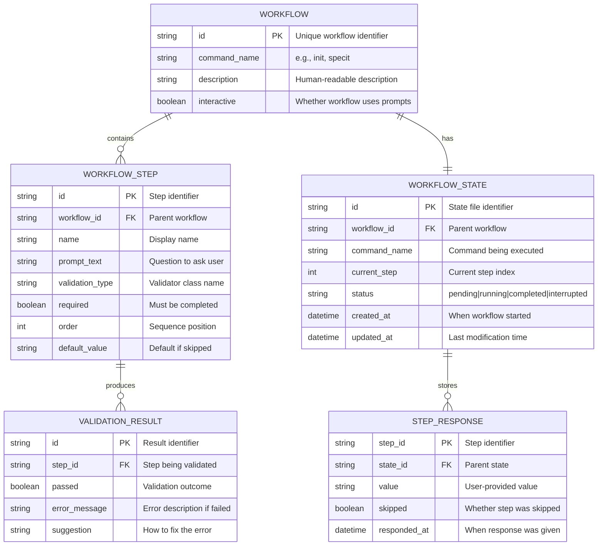
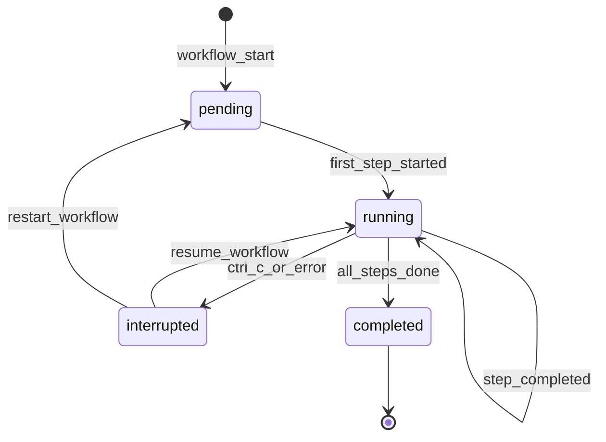

# Data Model: Interactive Guided Workflows

**Feature**: 030-guided-workflows
**Date**: 2026-01-15

## Entity Relationship Diagram

<!-- BEGIN:AUTO-GENERATED section="er-diagram" -->

<!-- END:AUTO-GENERATED -->

---

## Entities

### Workflow

Defines a guided workflow for a specific command.

| Field | Type | Required | Description |
|-------|------|----------|-------------|
| id | string | Yes | Unique identifier (e.g., "init-workflow") |
| command_name | string | Yes | CLI command this workflow belongs to |
| description | string | Yes | Human-readable workflow description |
| interactive | boolean | Yes | Whether this workflow prompts for input |
| steps | list[WorkflowStep] | Yes | Ordered list of steps |

### WorkflowStep

Defines a single step in a guided workflow.

| Field | Type | Required | Description |
|-------|------|----------|-------------|
| id | string | Yes | Step identifier (e.g., "select-ai-tool") |
| workflow_id | string | Yes | Parent workflow reference |
| name | string | Yes | Display name shown in progress |
| prompt_text | string | Yes | Question or instruction for user |
| validation_type | string | No | Validator class name (e.g., "PathExistsValidator") |
| required | boolean | Yes | Whether step must be completed |
| order | int | Yes | Sequence position (0-indexed) |
| default_value | string | No | Value used when skipped or non-interactive |
| options | dict | No | For choice steps: {key: description} |

### WorkflowState

Persists workflow progress for recovery.

| Field | Type | Required | Description |
|-------|------|----------|-------------|
| id | string | Yes | Unique state identifier |
| workflow_id | string | Yes | Which workflow is running |
| command_name | string | Yes | Command being executed |
| current_step | int | Yes | Index of current step |
| status | enum | Yes | pending, running, completed, interrupted |
| created_at | datetime | Yes | When workflow started |
| updated_at | datetime | Yes | Last state update |
| responses | dict | Yes | step_id -> StepResponse |

**State Machine**:

### StepResponse

Records a user's response to a workflow step.

| Field | Type | Required | Description |
|-------|------|----------|-------------|
| step_id | string | Yes | Which step this responds to |
| state_id | string | Yes | Parent state reference |
| value | string | Yes | User-provided or default value |
| skipped | boolean | Yes | Whether step was skipped |
| responded_at | datetime | Yes | When response was captured |

### ValidationResult

Result of validating a step input.

| Field | Type | Required | Description |
|-------|------|----------|-------------|
| id | string | Yes | Result identifier |
| step_id | string | Yes | Step being validated |
| passed | boolean | Yes | Whether validation passed |
| error_message | string | No | Error description if failed |
| suggestion | string | No | Guidance for fixing the error |

---

## Validation Rules

### Required Fields
- All entities must have non-empty `id` fields
- `WorkflowStep.order` must be unique within a workflow
- `WorkflowState.current_step` must be valid index (0 to len(steps)-1)

### Business Rules
- A workflow must have at least one step
- Optional steps (`required=false`) must have `default_value`
- `WorkflowState.status` transitions follow state machine above
- State files are deleted on successful completion

### Constraints
- Step IDs must be unique within a workflow
- State file names follow pattern: `{command}_{timestamp}.json`
- State files stored in `.doit/state/` directory
