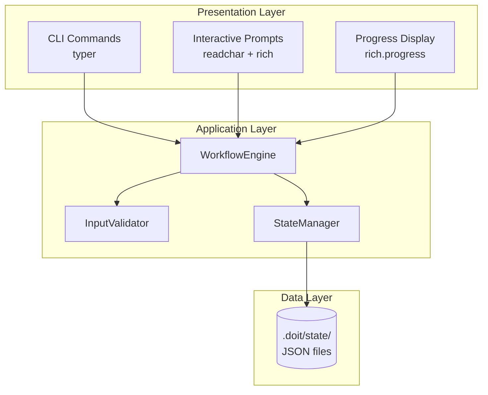

# Implementation Plan: Interactive Guided Workflows

**Branch**: `030-guided-workflows` | **Date**: 2026-01-15 | **Spec**: [spec.md](./spec.md)
**Input**: Feature specification from `/specs/030-guided-workflows/spec.md`

## Summary

Add interactive guided workflow capability to doit commands, enabling step-by-step prompts with real-time validation, progress visualization, and workflow recovery. The system will automatically detect interactive terminals and guide users through each required input, while providing a non-interactive mode for CI/CD automation.

## Technical Context

**Language/Version**: Python 3.11+
**Primary Dependencies**: Typer (CLI), Rich (terminal formatting/progress), readchar (keyboard input)
**Storage**: File-based JSON in `.doit/state/` for workflow state persistence
**Testing**: pytest with unit, integration, and contract tests
**Target Platform**: Cross-platform CLI (Linux, macOS, Windows)
**Project Type**: single
**Performance Goals**: Non-interactive mode at least as fast as current command performance (SC-004)
**Constraints**: Must work in non-TTY environments, graceful terminal resize handling
**Scale/Scope**: Most workflows have 10 or fewer steps; under 5 minute completion time

## Architecture Overview

<!-- BEGIN:AUTO-GENERATED section="architecture" -->

<!-- END:AUTO-GENERATED -->

## Constitution Check

*GATE: Must pass before Phase 0 research. Re-check after Phase 1 design.*

| Principle | Status | Notes |
|-----------|--------|-------|
| I. Specification-First | PASS | Spec created and validated (100/100 score) |
| II. Persistent Memory | PASS | Workflow state stored in `.doit/state/` |
| III. Auto-Generated Diagrams | PASS | No new diagrams required for this feature |
| IV. Opinionated Workflow | PASS | Enhances existing workflow commands |
| V. AI-Native Design | PASS | Works with AI assistants via slash commands |

**Tech Stack Alignment**:
| Item | Constitution | This Feature | Status |
|------|--------------|--------------|--------|
| Language | Python 3.11+ | Python 3.11+ | ALIGNED |
| CLI Framework | Typer | Typer | ALIGNED |
| Terminal Output | Rich | Rich | ALIGNED |
| Keyboard Input | readchar | readchar | ALIGNED |
| Storage | File-based (.doit/memory/) | File-based (.doit/state/) | ALIGNED |

**Gate Result**: PASS - All principles satisfied, tech stack fully aligned

## Project Structure

### Documentation (this feature)

```text
specs/030-guided-workflows/
├── spec.md              # Feature specification
├── plan.md              # This file
├── research.md          # Phase 0 output
├── data-model.md        # Phase 1 output
├── quickstart.md        # Phase 1 output
├── contracts/           # Phase 1 output
│   └── workflow-api.md  # Internal API contracts
├── checklists/
│   └── requirements.md  # Quality checklist
└── tasks.md             # Phase 2 output (via /doit.taskit)
```

### Source Code (repository root)

```text
src/doit_cli/
├── models/
│   └── workflow_models.py     # WorkflowStep, WorkflowState, ValidationResult
├── services/
│   ├── workflow_engine.py     # Core workflow orchestration
│   ├── input_validator.py     # Real-time input validation
│   └── state_manager.py       # Workflow state persistence
├── cli/
│   └── workflow_mixin.py      # Shared workflow behavior for commands
└── prompts/
    └── interactive.py         # Interactive prompt components

tests/
├── unit/
│   ├── test_workflow_engine.py
│   ├── test_input_validator.py
│   └── test_state_manager.py
├── integration/
│   └── test_guided_workflows.py
└── contract/
    └── test_workflow_contracts.py
```

**Structure Decision**: Single project structure (Option 1) - this is a CLI tool enhancement, not a multi-service application.

## Complexity Tracking

No violations to justify - all design choices align with constitution.
