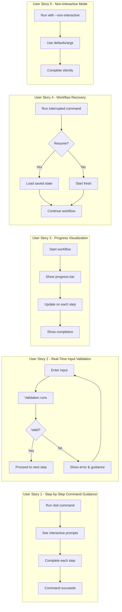
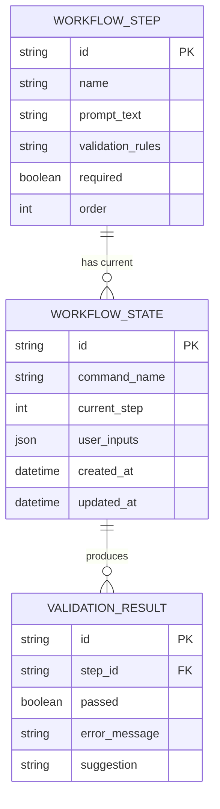

# Feature Specification: Interactive Guided Workflows

**Feature Branch**: `030-guided-workflows`
**Created**: 2026-01-15
**Status**: Complete
**Input**: User description: "Interactive guided workflows with validation - Rationale: Improves user experience by guiding through each command step-by-step"

## User Scenarios & Testing *(mandatory)*

### User Story 1 - Step-by-Step Command Guidance (Priority: P1)

As a developer new to doit, I want commands to guide me through each step interactively so that I can complete workflows correctly without reading extensive documentation.

**Why this priority**: This is the core value proposition - reducing friction for new users and preventing errors. Without guidance, users often abandon tools due to confusion or incorrect usage.

**Independent Test**: Can be fully tested by running any doit command (e.g., `doit init`) and verifying interactive prompts appear for each required input, with the command completing successfully.

**Acceptance Scenarios**:

1. **Given** I run a doit command without required arguments, **When** the command starts, **Then** I see an interactive prompt asking for the first required input with helpful context
2. **Given** I am in an interactive workflow, **When** I complete one step, **Then** I see clear feedback and automatically advance to the next step
3. **Given** I am in an interactive workflow, **When** I want to skip optional steps, **Then** I can press Enter to accept defaults or type 'skip' to move on
4. **Given** I am in an interactive workflow, **When** I want to go back to a previous step, **Then** I can type 'back' to return and modify my input

---

### User Story 2 - Real-Time Input Validation (Priority: P1)

As a developer, I want my inputs validated in real-time during workflows so that I catch errors immediately rather than after completing all steps.

**Why this priority**: Same priority as US1 because validation is integral to the guided experience. Without validation, guided workflows can still lead to failures at the end.

**Independent Test**: Can be tested by entering invalid input during any guided workflow and verifying immediate feedback with correction guidance.

**Acceptance Scenarios**:

1. **Given** I enter an invalid spec path in a workflow, **When** the validation runs, **Then** I see an error message explaining why it's invalid and what valid paths look like
2. **Given** I enter a value that conflicts with previous inputs, **When** the validation runs, **Then** I see a warning explaining the conflict and am asked to resolve it
3. **Given** I am in a workflow that requires a file to exist, **When** the file is missing, **Then** I am offered options: create it, specify a different path, or cancel

---

### User Story 3 - Progress Visualization (Priority: P2)

As a developer working through a multi-step workflow, I want to see my progress visually so that I understand how much of the workflow remains and what I've already completed.

**Why this priority**: Enhances user confidence but not strictly required for functionality. Users can complete workflows without progress indicators.

**Independent Test**: Can be tested by running any multi-step command and verifying a progress indicator shows current step, total steps, and completion status.

**Acceptance Scenarios**:

1. **Given** I start a multi-step workflow, **When** the first step begins, **Then** I see a progress indicator showing "Step 1 of N: [Step Name]"
2. **Given** I complete a step, **When** I move to the next step, **Then** the progress indicator updates and shows a checkmark for completed steps
3. **Given** I am in a workflow with optional steps, **When** viewing progress, **Then** optional steps are clearly marked and don't count toward required completion

---

### User Story 4 - Workflow Recovery (Priority: P2)

As a developer whose workflow was interrupted, I want to resume from where I left off so that I don't lose my progress.

**Why this priority**: Important for long workflows but most doit commands are relatively quick. Provides significant UX improvement for power users.

**Independent Test**: Can be tested by starting a workflow, cancelling midway, then running the same command and verifying it offers to resume.

**Acceptance Scenarios**:

1. **Given** I cancelled a workflow partway through, **When** I run the same command again, **Then** I am asked if I want to resume from the last completed step
2. **Given** I choose to resume a workflow, **When** the workflow continues, **Then** my previous inputs are preserved and I continue from where I stopped
3. **Given** I choose not to resume, **When** starting fresh, **Then** the previous partial state is cleared and I start from step 1

---

### User Story 5 - Non-Interactive Mode (Priority: P3)

As a CI/CD pipeline operator, I want to run doit commands non-interactively so that automated workflows can execute without prompts.

**Why this priority**: Essential for automation but lower priority than interactive experience since the feature focus is on guided workflows.

**Independent Test**: Can be tested by running any command with `--non-interactive` flag and verifying it completes without prompts.

**Acceptance Scenarios**:

1. **Given** I run a command with `--non-interactive` flag, **When** the command executes, **Then** it uses defaults or fails with clear error messages (no prompts)
2. **Given** I pipe input to a command, **When** the command detects non-TTY input, **Then** it automatically switches to non-interactive mode
3. **Given** I set `DOIT_NON_INTERACTIVE=true` environment variable, **When** running any command, **Then** all commands run non-interactively

---

### Edge Cases

- What happens when a user presses Ctrl+C during a guided workflow?
  - The workflow should save state and offer to resume on next run
- How does the system handle terminal resize during progress display?
  - Progress indicators should adapt to terminal width gracefully
- What happens if a required external tool (e.g., git) is not available?
  - Validate prerequisites at workflow start and provide installation guidance
- How does validation handle network-dependent checks when offline?
  - Skip network validations with warning, allow user to proceed with local-only checks

## User Journey Visualization

<!-- BEGIN:AUTO-GENERATED section="user-journey" -->

<!-- END:AUTO-GENERATED -->

## Entity Relationships

<!-- BEGIN:AUTO-GENERATED section="entity-relationships" -->

<!-- END:AUTO-GENERATED -->

## Requirements *(mandatory)*

### Functional Requirements

- **FR-001**: System MUST detect when running in an interactive terminal and enable guided mode automatically
- **FR-002**: System MUST provide step-by-step prompts for all commands that require user input
- **FR-003**: System MUST validate inputs at each step before proceeding to the next step
- **FR-004**: System MUST display clear error messages with actionable correction guidance
- **FR-005**: System MUST show a progress indicator for multi-step workflows (3+ steps)
- **FR-006**: System MUST allow users to navigate back to previous steps using 'back' command
- **FR-007**: System MUST allow users to skip optional steps using 'skip' command or pressing Enter
- **FR-008**: System MUST save workflow state when interrupted (Ctrl+C or error)
- **FR-009**: System MUST offer to resume interrupted workflows on next run
- **FR-010**: System MUST support `--non-interactive` flag to disable all prompts
- **FR-011**: System MUST detect non-TTY environments and auto-switch to non-interactive mode
- **FR-012**: System MUST support `DOIT_NON_INTERACTIVE` environment variable
- **FR-013**: System MUST provide sensible defaults for all optional inputs
- **FR-014**: System MUST validate prerequisites (required tools, files) at workflow start
- **FR-015**: System MUST provide helpful hints and examples in prompts

### Key Entities

- **WorkflowStep**: Represents a single step in a guided workflow with name, prompt text, validation rules, and optional/required status
- **WorkflowState**: Persists user inputs and current step position for resumable workflows
- **ValidationResult**: Contains validation outcome (pass/fail), error messages, and suggestions

## Success Criteria *(mandatory)*

### Measurable Outcomes

- **SC-001**: Users can complete any doit command workflow in under 5 minutes on first attempt
- **SC-002**: 90% of validation errors are caught and corrected before workflow completion
- **SC-003**: Interrupted workflows can be resumed within 10 seconds of restart
- **SC-004**: Non-interactive mode executes at least as fast as current command performance
- **SC-005**: New users can successfully complete `doit init` without consulting documentation
- **SC-006**: User task completion rate increases by at least 30% compared to non-guided mode

### Assumptions

- Users have basic terminal/command-line familiarity
- Terminal supports ANSI escape codes for colors and cursor movement (graceful degradation for unsupported terminals)
- Workflow state is stored locally in `.doit/state/` directory
- Most workflows have 10 or fewer steps
- Network connectivity is not required for core guided workflow functionality
