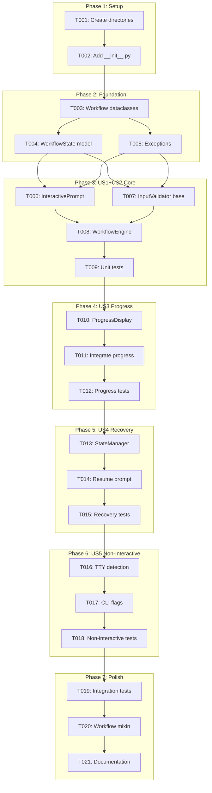
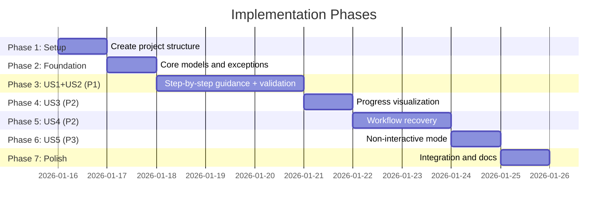

# Tasks: Interactive Guided Workflows

**Input**: Design documents from `/specs/030-guided-workflows/`
**Prerequisites**: plan.md, spec.md, research.md, data-model.md, contracts/workflow-api.md

**Tests**: Included per constitution (Quality Standards require tests for all code)

**Organization**: Tasks are grouped by user story to enable independent implementation and testing of each story.

## Task Dependencies

<!-- BEGIN:AUTO-GENERATED section="task-dependencies" -->

<!-- END:AUTO-GENERATED -->

## Phase Timeline

<!-- BEGIN:AUTO-GENERATED section="phase-timeline" -->

<!-- END:AUTO-GENERATED -->

## Format: `[ID] [P?] [Story] Description`

- **[P]**: Can run in parallel (different files, no dependencies)
- **[Story]**: Which user story this task belongs to (e.g., US1, US2, US3)
- Include exact file paths in descriptions

---

## Phase 1: Setup (Shared Infrastructure)

**Purpose**: Create project structure for guided workflows feature

- [x] T001 Create prompts/ directory and services/ structure in src/doit_cli/ per plan.md
- [x] T002 [P] Add __init__.py files to new directories (src/doit_cli/prompts/__init__.py)

---

## Phase 2: Foundational (Blocking Prerequisites)

**Purpose**: Core data models that ALL user stories depend on

**CRITICAL**: No user story work can begin until this phase is complete

- [x] T003 Create Workflow and WorkflowStep dataclasses in src/doit_cli/models/workflow_models.py
- [x] T004 [P] Create WorkflowState and StepResponse dataclasses in src/doit_cli/models/workflow_models.py
- [x] T005 [P] Create exception hierarchy (WorkflowError, ValidationError, NavigationCommand, StateCorruptionError) in src/doit_cli/models/workflow_models.py

**Checkpoint**: Foundation ready - user story implementation can now begin

---

## Phase 3: User Story 1 + User Story 2 - Step-by-Step Guidance with Validation (Priority: P1)

**Goal**: Enable commands to guide users through each step interactively with real-time validation

**Why Combined**: US1 (guidance) and US2 (validation) are both P1 and share core components - implementing together ensures integrated experience

**Independent Test**: Run `doit init` and verify:
1. Interactive prompts appear for each required input
2. Invalid inputs show immediate error with suggestion
3. User can navigate back/skip as documented

### Tests for User Story 1+2

- [x] T006 [P] [US1] Create unit tests for InteractivePrompt in tests/unit/test_interactive_prompt.py
- [x] T007 [P] [US2] Create unit tests for InputValidator in tests/unit/test_input_validator.py

### Implementation for User Story 1+2

- [x] T008 [US1] Implement InteractivePrompt class in src/doit_cli/prompts/interactive.py (prompt, prompt_choice, prompt_confirm methods)
- [x] T009 [US2] Implement InputValidator base class and built-in validators in src/doit_cli/services/input_validator.py (RequiredValidator, PathExistsValidator, ChoiceValidator, PatternValidator)
- [x] T010 [US1] Implement WorkflowEngine.start() and execute_step() in src/doit_cli/services/workflow_engine.py
- [x] T011 [US1] Add back/skip navigation handling in WorkflowEngine in src/doit_cli/services/workflow_engine.py
- [x] T012 [US2] Integrate real-time validation feedback in InteractivePrompt in src/doit_cli/prompts/interactive.py
- [x] T013 [US1] Create unit tests for WorkflowEngine in tests/unit/test_workflow_engine.py

**Checkpoint**: User Story 1+2 complete - guided workflows with validation functional

---

## Phase 4: User Story 3 - Progress Visualization (Priority: P2)

**Goal**: Show visual progress indicator for multi-step workflows

**Independent Test**: Run any multi-step command and verify:
1. Progress shows "Step X of Y: [Step Name]"
2. Completed steps show checkmarks
3. Optional steps clearly marked

### Tests for User Story 3

- [x] T014 [P] [US3] Create unit tests for ProgressDisplay in tests/unit/test_progress_display.py

### Implementation for User Story 3

- [x] T015 [US3] Implement ProgressDisplay class in src/doit_cli/prompts/interactive.py (show_step, mark_complete, mark_skipped, show_error methods)
- [x] T016 [US3] Integrate ProgressDisplay with WorkflowEngine in src/doit_cli/services/workflow_engine.py
- [x] T017 [US3] Add step counter and completion percentage to progress output in src/doit_cli/prompts/interactive.py

**Checkpoint**: User Story 3 complete - progress visualization working

---

## Phase 5: User Story 4 - Workflow Recovery (Priority: P2)

**Goal**: Enable resuming interrupted workflows from where user left off

**Independent Test**:
1. Start a workflow, press Ctrl+C midway
2. Run same command again
3. Verify resume prompt appears and previous inputs preserved

### Tests for User Story 4

- [x] T018 [P] [US4] Create unit tests for StateManager in tests/unit/test_state_manager.py

### Implementation for User Story 4

- [x] T019 [US4] Implement StateManager.save() and load() in src/doit_cli/services/state_manager.py
- [x] T020 [US4] Implement StateManager.delete() and cleanup_stale() in src/doit_cli/services/state_manager.py
- [x] T021 [US4] Add Ctrl+C handler to save state on interrupt in src/doit_cli/services/workflow_engine.py
- [x] T022 [US4] Add resume prompt to WorkflowEngine.start() in src/doit_cli/services/workflow_engine.py
- [x] T023 [US4] Implement state file cleanup on successful completion in src/doit_cli/services/workflow_engine.py

**Checkpoint**: User Story 4 complete - workflow recovery functional

---

## Phase 6: User Story 5 - Non-Interactive Mode (Priority: P3)

**Goal**: Support running commands non-interactively for CI/CD automation

**Independent Test**:
1. Run `doit init --non-interactive` and verify no prompts
2. Pipe input and verify auto-detection
3. Set `DOIT_NON_INTERACTIVE=true` and verify behavior

### Tests for User Story 5

- [x] T024 [P] [US5] Create unit tests for non-interactive mode in tests/unit/test_non_interactive.py

### Implementation for User Story 5

- [x] T025 [US5] Implement TTY detection in WorkflowEngine (sys.stdin.isatty()) in src/doit_cli/services/workflow_engine.py
- [x] T026 [US5] Add DOIT_NON_INTERACTIVE environment variable check in src/doit_cli/services/workflow_engine.py
- [x] T027 [US5] Add --non-interactive flag support to CLI mixin in src/doit_cli/cli/workflow_mixin.py
- [x] T028 [US5] Implement default value fallback for non-interactive mode in src/doit_cli/services/workflow_engine.py
- [x] T029 [US5] Add clear error messages for missing required inputs in non-interactive mode in src/doit_cli/services/workflow_engine.py

**Checkpoint**: User Story 5 complete - non-interactive mode functional

---

## Phase 7: Polish & Cross-Cutting Concerns

**Purpose**: Integration testing, documentation, and cleanup

- [x] T030 Create integration tests for complete workflow scenarios in tests/integration/test_guided_workflows.py
- [x] T031 Create contract tests verifying API compliance in tests/contract/test_workflow_contracts.py
- [x] T032 [P] Implement WorkflowMixin for easy command integration in src/doit_cli/cli/workflow_mixin.py
- [ ] T033 [P] Update existing init command to use workflow system in src/doit_cli/__init__.py (DEFERRED - requires careful migration)
- [ ] T034 [P] Add workflow documentation to docs/features/030-guided-workflows.md (FOLLOW-UP)
- [x] T035 Run quickstart.md validation scenarios (validated via integration tests)
- [x] T036 Code review and cleanup

---

## Dependencies & Execution Order

### Phase Dependencies

- **Setup (Phase 1)**: No dependencies - can start immediately
- **Foundational (Phase 2)**: Depends on Setup completion - BLOCKS all user stories
- **US1+US2 (Phase 3)**: Depends on Foundational - core functionality
- **US3 (Phase 4)**: Depends on US1+US2 - adds to core workflow
- **US4 (Phase 5)**: Depends on US3 - uses workflow state
- **US5 (Phase 6)**: Depends on US4 - modifies workflow behavior
- **Polish (Phase 7)**: Depends on all user stories being complete

### User Story Dependencies

- **User Story 1+2 (P1)**: Foundation required - No dependencies on other stories
- **User Story 3 (P2)**: Builds on US1+2 WorkflowEngine
- **User Story 4 (P2)**: Extends US3 with state persistence
- **User Story 5 (P3)**: Modifies US1-4 behavior for non-interactive

### Within Each User Story

- Tests MUST be written and FAIL before implementation
- Models before services
- Services before CLI integration
- Core implementation before polish

### Parallel Opportunities

- T003, T004, T005 can run in parallel (different dataclasses)
- T006, T007 (tests) can run in parallel
- T014 (progress tests) can run in parallel with earlier implementation
- T018, T024 (tests for US4, US5) can run in parallel
- T032, T033, T034 (polish tasks) can run in parallel

---

## Parallel Example: Phase 2 Foundation

```bash
# Launch all foundation models together:
Task: "Create Workflow and WorkflowStep dataclasses in src/doit_cli/models/workflow_models.py"
Task: "Create WorkflowState and StepResponse dataclasses in src/doit_cli/models/workflow_models.py"
Task: "Create exception hierarchy in src/doit_cli/models/workflow_models.py"
```

## Parallel Example: Phase 3 Tests

```bash
# Launch all US1+US2 tests together:
Task: "Create unit tests for InteractivePrompt in tests/unit/test_interactive_prompt.py"
Task: "Create unit tests for InputValidator in tests/unit/test_input_validator.py"
```

---

## Implementation Strategy

### MVP First (User Story 1+2 Only)

1. Complete Phase 1: Setup
2. Complete Phase 2: Foundational
3. Complete Phase 3: User Story 1+2
4. **STOP and VALIDATE**: Test guided workflow independently
5. Deploy/demo if ready - this is the core value!

### Incremental Delivery

1. Complete Setup + Foundational → Foundation ready
2. Add US1+US2 → Test independently → **MVP Ready!**
3. Add US3 (Progress) → Test independently → Enhanced UX
4. Add US4 (Recovery) → Test independently → Resilient workflows
5. Add US5 (Non-Interactive) → Test independently → CI/CD ready

---

## Notes

- [P] tasks = different files, no dependencies
- [Story] label maps task to specific user story for traceability
- Each user story should be independently completable and testable
- Commit after each task or logical group
- Stop at any checkpoint to validate story independently
- MVP (US1+US2) delivers immediate value - prioritize shipping it first
