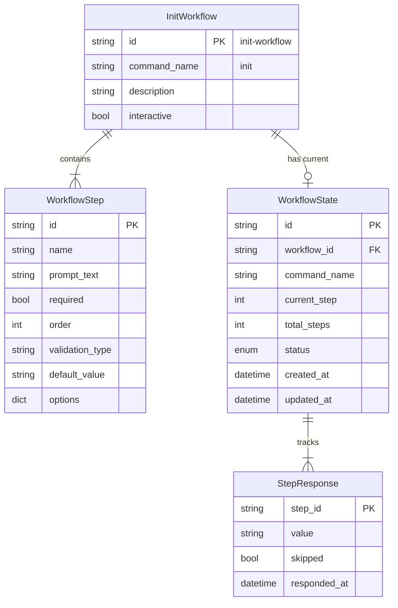
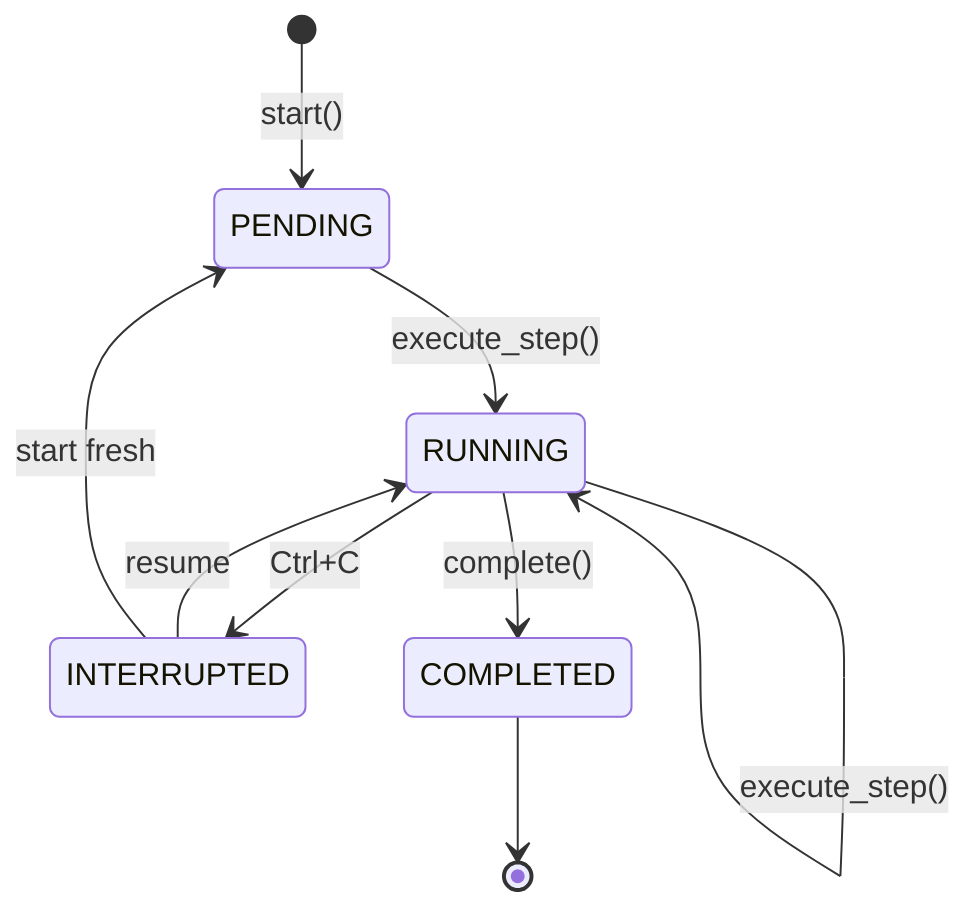
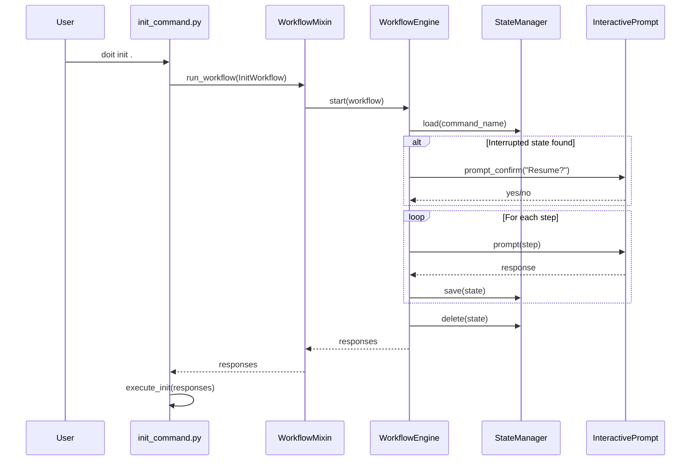

# Data Model: Init Workflow Integration

**Feature**: 031-init-workflow-integration
**Date**: 2026-01-16

## Entity Relationship Diagram

<!-- BEGIN:AUTO-GENERATED section="er-diagram" -->

<!-- END:AUTO-GENERATED -->

## Entities

### InitWorkflow

The workflow definition for the init command. This is a concrete instance of the `Workflow` dataclass from Feature 030.

| Field | Type | Required | Description |
| ----- | ---- | -------- | ----------- |
| id | string | Yes | Unique identifier: "init-workflow" |
| command_name | string | Yes | CLI command: "init" |
| description | string | Yes | Human-readable description |
| interactive | bool | Yes | Whether workflow prompts for input |
| steps | list[WorkflowStep] | Yes | Ordered list of workflow steps |

**Validation Rules**:
- Must have at least one step
- Step orders must be unique
- Step IDs must be unique within workflow

### InitWorkflow Steps

The init workflow defines 3 steps:

#### Step 1: Agent Selection

| Field | Value |
| ----- | ----- |
| id | "select-agent" |
| name | "Select AI Agent" |
| prompt_text | "Which AI agent(s) do you want to initialize for?" |
| required | true |
| order | 0 |
| validation_type | "ChoiceValidator" |
| default_value | "claude" |
| options | {"claude": "Claude Code", "copilot": "GitHub Copilot", "both": "Both agents"} |

#### Step 2: Confirm Path

| Field | Value |
| ----- | ----- |
| id | "confirm-path" |
| name | "Confirm Project Path" |
| prompt_text | "Initialize doit in '{path}'?" |
| required | true |
| order | 1 |
| validation_type | null |
| default_value | "yes" |
| options | {"yes": "Confirm", "no": "Cancel"} |

#### Step 3: Custom Templates (Optional)

| Field | Value |
| ----- | ----- |
| id | "custom-templates" |
| name | "Custom Templates" |
| prompt_text | "Enter custom template directory path (or leave empty for default)" |
| required | false |
| order | 2 |
| validation_type | "PathExistsValidator" |
| default_value | "" |
| options | null |

## State Machine: WorkflowStatus

<!-- BEGIN:AUTO-GENERATED section="state-machine" -->

<!-- END:AUTO-GENERATED -->

| State | Description | Transitions |
| ----- | ----------- | ----------- |
| PENDING | Workflow created but not started | → RUNNING |
| RUNNING | Workflow executing steps | → RUNNING, INTERRUPTED, COMPLETED |
| INTERRUPTED | User cancelled with Ctrl+C | → RUNNING (resume), PENDING (fresh) |
| COMPLETED | All steps completed successfully | Terminal state |

## Data Flow



## Storage

### State Files

Location: `.doit/state/init_{timestamp}.json`

```json
{
  "id": "init_20260116_143022",
  "workflow_id": "init-workflow",
  "command_name": "init",
  "current_step": 1,
  "total_steps": 3,
  "status": "interrupted",
  "created_at": "2026-01-16T14:30:22",
  "updated_at": "2026-01-16T14:30:45",
  "responses": {
    "select-agent": {
      "step_id": "select-agent",
      "value": "claude",
      "skipped": false,
      "responded_at": "2026-01-16T14:30:35"
    }
  }
}
```

### Cleanup Policy

- State files are deleted on successful workflow completion
- State files are preserved on interruption for resume
- No automatic expiration (user must resume or start fresh)
