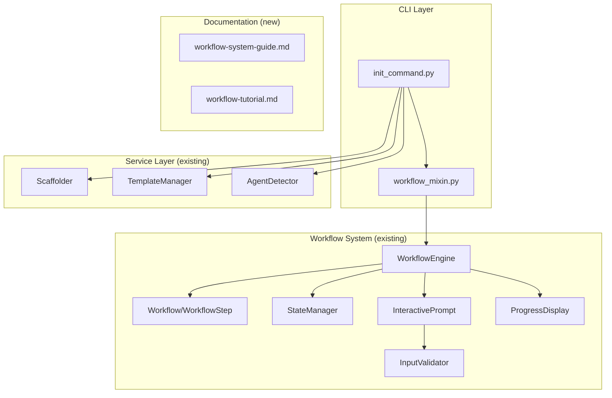

# Implementation Plan: Init Workflow Integration

**Branch**: `031-init-workflow-integration` | **Date**: 2026-01-16 | **Spec**: [spec.md](./spec.md)
**Input**: Feature specification from `/specs/031-init-workflow-integration/spec.md`

## Summary

Integrate the init command with the WorkflowEngine from Feature 030 to provide guided, step-by-step initialization with progress tracking, navigation, and state recovery. Additionally, create comprehensive workflow system documentation for developer adoption.

**Technical Approach**: Refactor `init_command.py` to use the existing `WorkflowMixin` pattern, define an `InitWorkflow` with 3 steps (agent selection, path confirmation, execution), and create extensive documentation in `docs/guides/`.

## Technical Context

**Language/Version**: Python 3.11+ (from constitution)
**Primary Dependencies**: Typer (CLI), Rich (terminal UI), pytest (testing)
**Storage**: File-based (`.doit/state/` for workflow state, `.doit/memory/` for project context)
**Testing**: pytest with contract, integration, and unit test layers
**Target Platform**: Cross-platform CLI (macOS, Linux, Windows)
**Project Type**: single (CLI tool with layered architecture)
**Performance Goals**: Interactive init < 5s, non-interactive < 2s
**Constraints**: No external dependencies beyond existing requirements
**Scale/Scope**: Single CLI command, ~200 LOC new code, ~1000 words documentation

## Architecture Overview

<!-- BEGIN:AUTO-GENERATED section="architecture" -->

<!-- END:AUTO-GENERATED -->

## Constitution Check

*GATE: Must pass before Phase 0 research. Re-check after Phase 1 design.*

| Principle                   | Status | Notes                                                        |
| --------------------------- | ------ | ------------------------------------------------------------ |
| I. Specification-First      | PASS   | Spec created via `/doit.specit`                              |
| II. Persistent Memory       | PASS   | Using existing `.doit/state/` for workflow state             |
| III. Auto-Generated Diagrams| PASS   | Diagrams in spec and plan use Mermaid                        |
| IV. Opinionated Workflow    | PASS   | Following specit → planit → taskit flow                      |
| V. AI-Native Design         | PASS   | Init command works via slash command                         |
| Tech Stack Alignment        | PASS   | Using Python 3.11+, Typer, Rich, pytest (all in constitution)|

**Gate Result**: PASS - No violations. Feature aligns with all constitution principles.

## Project Structure

### Documentation (this feature)

```text
specs/031-init-workflow-integration/
├── spec.md              # Feature specification (complete)
├── plan.md              # This file (Phase 0+1)
├── research.md          # Phase 0 output
├── data-model.md        # Phase 1 output
├── quickstart.md        # Phase 1 output
├── contracts/           # Phase 1 output
│   └── init-workflow.md # InitWorkflow contract
└── tasks.md             # Phase 2 output (/doit.taskit)
```

### Source Code (repository root)

```text
src/doit_cli/
├── cli/
│   ├── init_command.py     # MODIFY: Add workflow integration
│   └── workflow_mixin.py   # EXISTS: Reuse for init
├── models/
│   └── workflow_models.py  # EXISTS: Workflow, WorkflowStep
├── services/
│   ├── workflow_engine.py  # EXISTS: WorkflowEngine
│   ├── state_manager.py    # EXISTS: StateManager
│   └── input_validator.py  # EXISTS: InputValidator
└── prompts/
    └── interactive.py      # EXISTS: InteractivePrompt

docs/
├── guides/
│   └── workflow-system-guide.md  # NEW: Comprehensive workflow docs
└── tutorials/
    └── creating-workflows.md     # NEW: Tutorial for custom workflows

tests/
├── unit/
│   └── test_init_workflow.py     # NEW: Unit tests for InitWorkflow
└── integration/
    └── test_init_workflow_integration.py  # NEW: E2E workflow tests
```

**Structure Decision**: Using existing single project structure. All new code integrates with existing modules - no new packages required.

## Complexity Tracking

> No violations to justify - feature uses existing patterns and infrastructure.

| Aspect        | Complexity | Justification                                            |
| ------------- | ---------- | -------------------------------------------------------- |
| New modules   | LOW        | Only adds workflow definition, reuses existing engine    |
| Test coverage | MEDIUM     | Need workflow-specific tests, leverage existing patterns |
| Documentation | MEDIUM     | ~1000 words of new content required                      |
