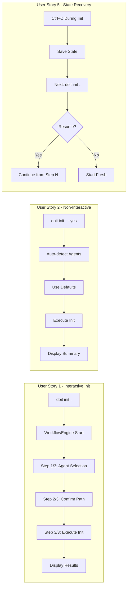
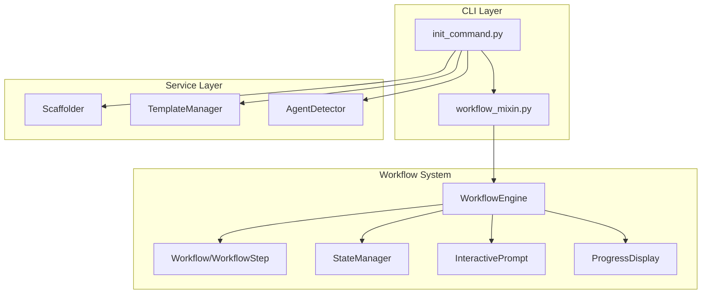

# Feature Specification: Init Workflow Integration

**Feature Branch**: `031-init-workflow-integration`
**Created**: 2026-01-16
**Status**: Complete
**Input**: User description: "#316 (T033): Update init command to use workflow system, #317 (T034): Expand workflow documentation"

## User Scenarios & Testing *(mandatory)*

### User Story 1 - Interactive Init with Workflow Engine (Priority: P1)

As a developer setting up a new project, I want the `doit init` command to guide me through initialization using the workflow system, so I get consistent step-by-step guidance with progress tracking and the ability to navigate back.

**Why this priority**: Core functionality - the init command is the first user touchpoint and should showcase the workflow system's capabilities.

**Independent Test**: Can be fully tested by running `doit init .` and verifying the guided workflow prompts appear with progress indicators.

**Acceptance Scenarios**:

1. **Given** a new project directory, **When** I run `doit init .` without flags, **Then** I see a step-by-step workflow with numbered progress (e.g., "Step 1/3")
2. **Given** an interactive init session, **When** I type "back" during step 2, **Then** I return to step 1 with my previous answer preserved
3. **Given** an interrupted init workflow (Ctrl+C), **When** I run `doit init .` again, **Then** I'm prompted to resume or start fresh

---

### User Story 2 - Non-Interactive Init Mode (Priority: P1)

As a CI/CD pipeline, I want `doit init . --yes` to complete without prompts using sensible defaults, so automated setups work without manual intervention.

**Why this priority**: Essential for automation - many users integrate doit in CI pipelines.

**Independent Test**: Can be tested by running `doit init . --yes` and verifying it completes without prompts.

**Acceptance Scenarios**:

1. **Given** a new project directory, **When** I run `doit init . --yes`, **Then** initialization completes without any prompts
2. **Given** a new project with no agent indicators, **When** I run `doit init . --yes`, **Then** Claude Code is selected as the default agent
3. **Given** a project with `.github/` directory, **When** I run `doit init . --yes`, **Then** GitHub Copilot is auto-detected

---

### User Story 3 - Enhanced Progress Display (Priority: P2)

As a user initializing a project, I want to see clear progress with visual feedback on what's being created, so I understand what the init command is doing.

**Why this priority**: User experience improvement - provides transparency during initialization.

**Independent Test**: Can be tested by running init and verifying progress display shows file/directory creation.

**Acceptance Scenarios**:

1. **Given** an init workflow in progress, **When** each directory is created, **Then** I see a progress indicator showing the operation
2. **Given** template copying in progress, **When** files are copied, **Then** I see a summary of created/skipped/updated files
3. **Given** init completion, **When** all steps finish, **Then** I see a completion summary with next steps

---

### User Story 4 - Comprehensive Workflow Documentation (Priority: P2)

As a developer learning doit, I want comprehensive documentation on the workflow system, so I can understand how to extend or customize workflows for my needs.

**Why this priority**: Critical for adoption - good documentation reduces support burden and increases usability.

**Independent Test**: Can be tested by verifying documentation files exist and contain expected sections.

**Acceptance Scenarios**:

1. **Given** the docs/guides/ directory, **When** I look for workflow documentation, **Then** I find a comprehensive workflow-system-guide.md
2. **Given** the workflow documentation, **When** I read it, **Then** I find architecture explanation, extension guides, and API reference
3. **Given** the tutorials directory, **When** I look for workflow tutorials, **Then** I find step-by-step examples for creating custom workflows

---

### User Story 5 - State Recovery for Init (Priority: P3)

As a user who interrupted init, I want the workflow system to save my progress, so I can resume where I left off without losing my answers.

**Why this priority**: Nice-to-have that leverages existing workflow state persistence.

**Independent Test**: Can be tested by interrupting init and verifying state file exists in .doit/state/.

**Acceptance Scenarios**:

1. **Given** an init workflow interrupted with Ctrl+C, **When** state is saved, **Then** a state file exists in .doit/state/
2. **Given** a saved init state, **When** I run `doit init .` again, **Then** I'm prompted to resume from step where I left off
3. **Given** a resumed init workflow, **When** I complete it, **Then** the state file is cleaned up

---

### Edge Cases

- What happens when user has both Claude and Copilot indicators in their project?
  - System should auto-detect both and offer to initialize for both agents
- How does the workflow handle a project already initialized with different agents?
  - System shows warning and offers `--update` mode to add new agent support
- What happens if state file is corrupted between sessions?
  - System detects corruption, shows warning, and offers to start fresh
- How does the workflow behave when terminal doesn't support TTY (e.g., piped input)?
  - System falls back to non-interactive mode using defaults

## User Journey Visualization

<!-- BEGIN:AUTO-GENERATED section="user-journey" -->

<!-- END:AUTO-GENERATED -->

## System Architecture

## Requirements *(mandatory)*

### Functional Requirements

#### Init Command Integration

- **FR-001**: System MUST define an `InitWorkflow` with steps for agent selection, path confirmation, and optional settings
- **FR-002**: System MUST use `WorkflowEngine` to orchestrate the init command when running interactively
- **FR-003**: System MUST support non-interactive mode (`--yes` flag) that bypasses the workflow engine
- **FR-004**: System MUST preserve all existing init command flags (`--agent`, `--templates`, `--update`, `--force`)
- **FR-005**: System MUST display step progress (e.g., "Step 1/3") during interactive execution
- **FR-006**: System MUST allow navigation back to previous steps using "back" command
- **FR-007**: System MUST save workflow state when interrupted (Ctrl+C) for resume capability
- **FR-008**: System MUST prompt to resume or start fresh when interrupted state is detected
- **FR-009**: System MUST clean up state files upon successful completion

#### Workflow Definition

- **FR-010**: InitWorkflow MUST have a step for selecting target agent(s) with options: Claude, Copilot, Both
- **FR-011**: InitWorkflow MUST have a step for confirming project path with directory validation
- **FR-012**: InitWorkflow MAY have an optional step for custom template directory selection
- **FR-013**: Each step MUST have clear prompt text and help information

#### Documentation Requirements

- **FR-014**: System MUST have a comprehensive workflow system guide at `docs/guides/workflow-system-guide.md`
- **FR-015**: Documentation MUST explain workflow architecture with Mermaid diagrams
- **FR-016**: Documentation MUST provide code examples for creating custom workflows
- **FR-017**: Documentation MUST cover extension points (custom validators, step types)
- **FR-018**: Documentation MUST include API reference for WorkflowEngine, Workflow, WorkflowStep
- **FR-019**: Existing init documentation MUST be updated to describe the guided workflow experience

### Key Entities

- **InitWorkflow**: Workflow definition for the init command containing 3 steps (agent selection, path confirmation, execution confirmation)
- **WorkflowMixin**: Reusable mixin class already exists in `cli/workflow_mixin.py` - init command integrates with this

## Success Criteria *(mandatory)*

### Measurable Outcomes

- **SC-001**: `doit init .` shows step progress indicators with current/total (e.g., "Step 1/3: Select AI Agent")
- **SC-002**: User can type "back" to return to previous step in interactive mode
- **SC-003**: `doit init . --yes` completes in under 2 seconds without any prompts
- **SC-004**: Interrupted init workflows can be resumed within same terminal session
- **SC-005**: `docs/guides/workflow-system-guide.md` exists with >1000 words covering architecture, usage, and extension
- **SC-006**: All existing init command tests continue to pass
- **SC-007**: New tests cover workflow integration with >80% code coverage for new code
- **SC-008**: Init workflow includes input validation for path existence check
