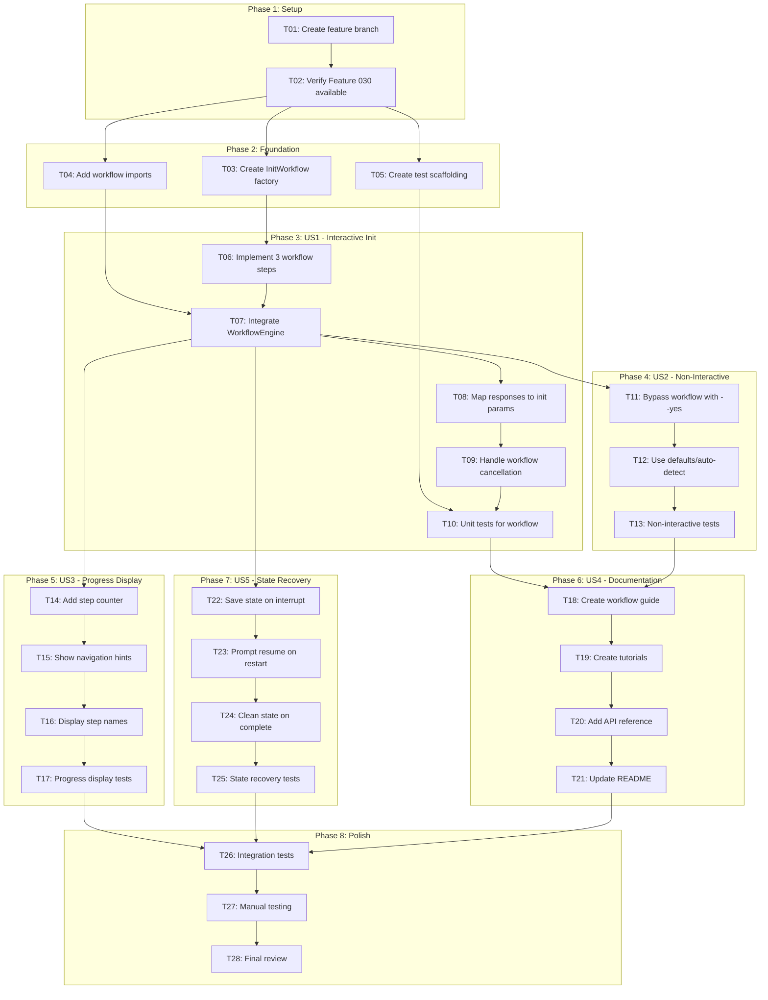
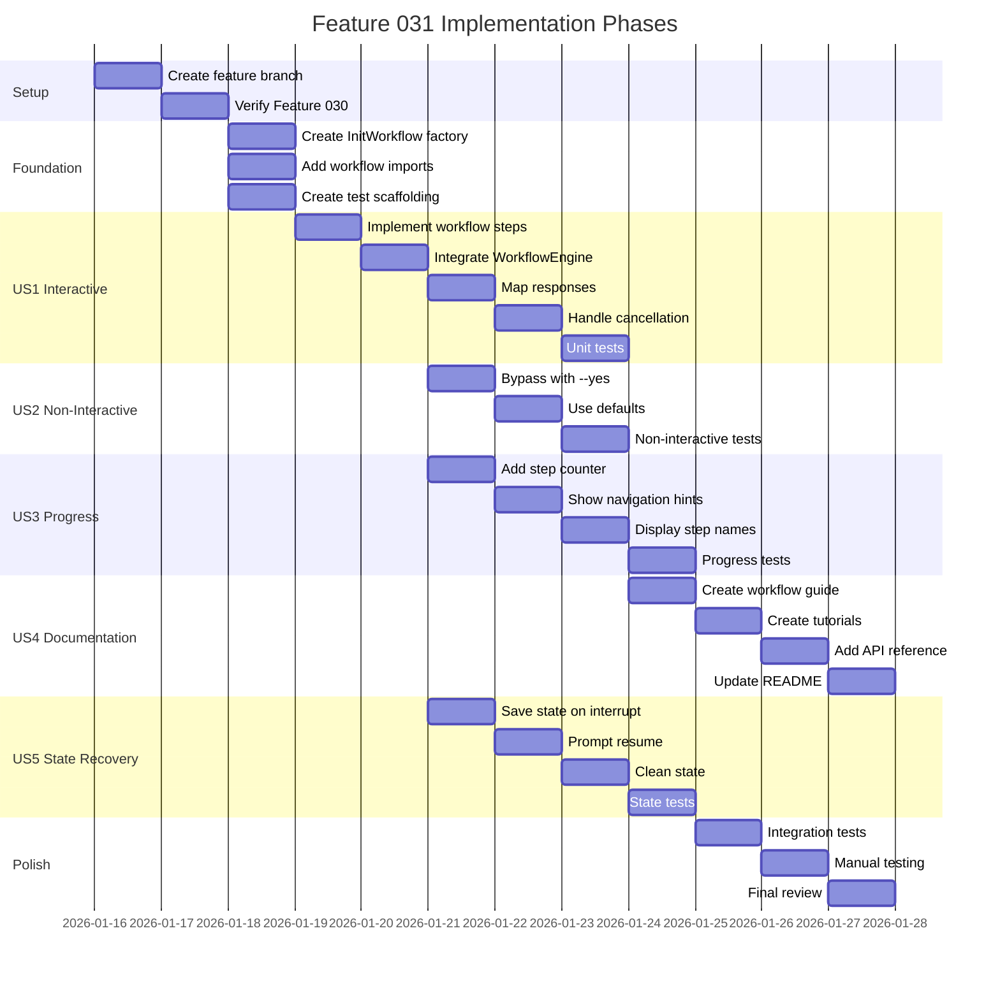

# Tasks: Init Workflow Integration

**Feature**: 031-init-workflow-integration
**Generated**: 2026-01-16
**Source**: [plan.md](./plan.md) | [spec.md](./spec.md)

## Task Summary

| Phase | Tasks | Est. Complexity |
| ----- | ----- | --------------- |
| Setup | 2 | Low |
| Foundation | 3 | Low |
| US1: Interactive Init | 5 | Medium |
| US2: Non-Interactive Mode | 3 | Low |
| US3: Enhanced Progress | 4 | Medium |
| US4: Documentation | 4 | Medium |
| US5: State Recovery | 4 | Medium |
| Polish | 3 | Low |
| **Total** | **28** | |

## Task Dependency Graph

<!-- BEGIN:AUTO-GENERATED section="task-dependencies" -->

<!-- END:AUTO-GENERATED -->

## Phase Timeline

<!-- BEGIN:AUTO-GENERATED section="phase-timeline" -->

<!-- END:AUTO-GENERATED -->

---

## Phase 1: Setup

### T01: Create Feature Branch

- **Status**: [ ] Not Started
- **Parent**: Epic #321
- **Depends On**: None

**Description**: Create the feature branch for init workflow integration.

**Acceptance Criteria**:
- [ ] Branch `031-init-workflow-integration` created from main
- [ ] Branch pushed to remote

**Files**: None (git operations only)

---

### T02: Verify Feature 030 Available

- **Status**: [ ] Not Started
- **Parent**: Epic #321
- **Depends On**: T01

**Description**: Verify that Feature 030 (Guided Workflows) code is available on main branch.

**Acceptance Criteria**:
- [ ] `WorkflowEngine` class exists in `src/doit_cli/services/workflow_engine.py`
- [ ] `StateManager` class exists in `src/doit_cli/services/state_manager.py`
- [ ] `Workflow` and `WorkflowStep` dataclasses exist in `src/doit_cli/models/workflow_models.py`
- [ ] All imports resolve without error

**Files**:
- `src/doit_cli/services/workflow_engine.py` (verify exists)
- `src/doit_cli/services/state_manager.py` (verify exists)
- `src/doit_cli/models/workflow_models.py` (verify exists)

---

## Phase 2: Foundation

### T03: Create InitWorkflow Factory Function

- **Status**: [ ] Not Started
- **Parent**: Feature #322
- **Depends On**: T02
- **Contract**: [init-workflow.md](./contracts/init-workflow.md)

**Description**: Create the `create_init_workflow(path)` factory function that returns the InitWorkflow definition with 3 steps.

**Acceptance Criteria**:
- [ ] Function `create_init_workflow(path: Path) -> Workflow` created
- [ ] Returns workflow with id="init-workflow"
- [ ] Contains 3 steps: select-agent, confirm-path, custom-templates
- [ ] Step order is 0, 1, 2
- [ ] Agent selection has options: claude, copilot, both

**Files**:
- `src/doit_cli/cli/init_command.py` (modify)

**Code Reference**:
```python
def create_init_workflow(path: Path) -> Workflow:
    """Create the init workflow definition."""
    return Workflow(
        id="init-workflow",
        command_name="init",
        description="Initialize a new doit project",
        interactive=True,
        steps=[
            WorkflowStep(
                id="select-agent",
                name="Select AI Agent",
                prompt_text="Which AI agent(s) do you want to initialize for?",
                required=True,
                order=0,
                validation_type="ChoiceValidator",
                default_value="claude",
                options={
                    "claude": "Claude Code",
                    "copilot": "GitHub Copilot",
                    "both": "Both agents",
                },
            ),
            # ... remaining steps
        ],
    )
```

---

### T04: Add Workflow Imports to init_command.py

- **Status**: [ ] Not Started
- **Parent**: Feature #322
- **Depends On**: T02

**Description**: Add necessary imports for workflow integration.

**Acceptance Criteria**:
- [ ] Import `Workflow`, `WorkflowStep` from workflow_models
- [ ] Import `WorkflowEngine` from workflow_engine
- [ ] Import `StateManager` from state_manager
- [ ] No import errors when module loads

**Files**:
- `src/doit_cli/cli/init_command.py` (modify)

---

### T05: Create Test Scaffolding

- **Status**: [ ] Not Started
- **Parent**: Feature #322
- **Depends On**: T02

**Description**: Create test file structure for init workflow tests.

**Acceptance Criteria**:
- [ ] `tests/unit/test_init_workflow.py` created with TestCreateInitWorkflow class
- [ ] `tests/integration/test_init_workflow_integration.py` created with TestInitWorkflowIntegration class
- [ ] Basic test imports working
- [ ] pytest discovers new test files

**Files**:
- `tests/unit/test_init_workflow.py` (create)
- `tests/integration/test_init_workflow_integration.py` (create)

---

## Phase 3: US1 - Interactive Init with WorkflowEngine (P1)

> **User Story**: As a developer, I want the init command to use the guided workflow system so that I have a consistent, step-by-step initialization experience.

### T06: Implement Three Workflow Steps

- **Status**: [ ] Not Started
- **Parent**: Feature #322
- **Depends On**: T03
- **Requirements**: FR-001, FR-002, FR-003, FR-004

**Description**: Implement all three workflow steps with proper configuration.

**Acceptance Criteria**:
- [ ] Step 1 (select-agent): Choice validator with claude/copilot/both options
- [ ] Step 2 (confirm-path): Includes actual path in prompt text
- [ ] Step 3 (custom-templates): Optional step with PathExistsValidator
- [ ] All steps have unique IDs
- [ ] All steps have sequential order (0, 1, 2)

**Files**:
- `src/doit_cli/cli/init_command.py` (modify)

---

### T07: Integrate WorkflowEngine into init_command

- **Status**: [ ] Not Started
- **Parent**: Feature #322
- **Depends On**: T04, T06
- **Requirements**: FR-005

**Description**: Modify init_command to use WorkflowEngine for interactive mode.

**Acceptance Criteria**:
- [ ] WorkflowEngine instantiated with console and StateManager
- [ ] `engine.run(workflow)` called for interactive mode
- [ ] Responses dict returned from engine
- [ ] KeyboardInterrupt caught and exits with code 130

**Files**:
- `src/doit_cli/cli/init_command.py` (modify)

**Code Reference**:
```python
workflow = create_init_workflow(path)
engine = WorkflowEngine(
    console=console,
    state_manager=StateManager(),
)
try:
    responses = engine.run(workflow)
except KeyboardInterrupt:
    raise typer.Exit(130)
```

---

### T08: Map Workflow Responses to Init Parameters

- **Status**: [ ] Not Started
- **Parent**: Feature #322
- **Depends On**: T07
- **Requirements**: FR-006

**Description**: Convert workflow responses dict to init function parameters.

**Acceptance Criteria**:
- [ ] `select-agent` response mapped to agents list via `parse_agent_string()`
- [ ] `confirm-path` = "no" causes graceful abort with exit code 0
- [ ] `custom-templates` response mapped to template_source Path (or None if empty)
- [ ] Init function called with mapped parameters

**Files**:
- `src/doit_cli/cli/init_command.py` (modify)

---

### T09: Handle Workflow Cancellation

- **Status**: [ ] Not Started
- **Parent**: Feature #322
- **Depends On**: T08
- **Requirements**: FR-007

**Description**: Handle user cancellation during workflow (confirm-path = "no").

**Acceptance Criteria**:
- [ ] When confirm-path is "no", display yellow cancellation message
- [ ] Exit with code 0 (not error)
- [ ] No init operations performed
- [ ] State cleaned up

**Files**:
- `src/doit_cli/cli/init_command.py` (modify)

---

### T10: Unit Tests for InitWorkflow

- **Status**: [ ] Not Started
- **Parent**: Feature #322
- **Depends On**: T05, T09
- **Contract**: Testing Contract in [init-workflow.md](./contracts/init-workflow.md)

**Description**: Implement unit tests for the InitWorkflow factory and response mapping.

**Acceptance Criteria**:
- [ ] `test_workflow_has_three_steps` passes
- [ ] `test_step_order_is_sequential` passes
- [ ] `test_agent_selection_has_valid_options` passes
- [ ] `test_optional_step_has_default` passes
- [ ] `test_path_included_in_confirm_prompt` passes
- [ ] All tests in `tests/unit/test_init_workflow.py` pass

**Files**:
- `tests/unit/test_init_workflow.py` (modify)

---

## Phase 4: US2 - Non-Interactive Mode (P1)

> **User Story**: As a CI/CD pipeline, I want to run init with --yes flag to skip prompts so that automated setups complete without human intervention.

### T11: Bypass Workflow When --yes Flag Set

- **Status**: [ ] Not Started
- **Parent**: Feature #322
- **Depends On**: T07
- **Requirements**: FR-008

**Description**: Skip WorkflowEngine entirely when --yes flag is provided.

**Acceptance Criteria**:
- [ ] `if yes:` check at start of init_command
- [ ] WorkflowEngine NOT instantiated when yes=True
- [ ] Direct call to `run_init()` with defaults
- [ ] No prompts displayed

**Files**:
- `src/doit_cli/cli/init_command.py` (modify)

---

### T12: Use Defaults and Auto-Detection for Non-Interactive

- **Status**: [ ] Not Started
- **Parent**: Feature #322
- **Depends On**: T11
- **Requirements**: FR-009, FR-010

**Description**: Implement default value logic for non-interactive mode.

**Acceptance Criteria**:
- [ ] Agent defaults to CLI arg if provided, else auto-detected, else Claude
- [ ] Path confirmation implicit (always yes)
- [ ] Templates from CLI arg if provided, else bundled
- [ ] Performance: completes in <2 seconds

**Files**:
- `src/doit_cli/cli/init_command.py` (modify)

---

### T13: Non-Interactive Mode Tests

- **Status**: [ ] Not Started
- **Parent**: Feature #322
- **Depends On**: T12

**Description**: Add tests for non-interactive mode behavior.

**Acceptance Criteria**:
- [ ] `test_non_interactive_skips_prompts` passes
- [ ] `test_non_interactive_uses_defaults` passes
- [ ] `test_non_interactive_respects_cli_args` passes
- [ ] No workflow step output in non-interactive tests

**Files**:
- `tests/integration/test_init_workflow_integration.py` (modify)

---

## Phase 5: US3 - Enhanced Progress Display (P2)

> **User Story**: As a user, I want to see clear progress during init so that I know which step I'm on and how many remain.

### T14: Add Step Counter to Progress Display

- **Status**: [ ] Not Started
- **Parent**: Feature #323
- **Depends On**: T07
- **Requirements**: FR-011

**Description**: Display "Step X/Y" during workflow execution.

**Acceptance Criteria**:
- [ ] Progress shows "Step 1/3", "Step 2/3", "Step 3/3"
- [ ] Counter updates as steps complete
- [ ] Uses ProgressDisplay from Feature 030

**Files**:
- `src/doit_cli/cli/init_command.py` (modify - verify ProgressDisplay usage)

---

### T15: Show Navigation Hints

- **Status**: [ ] Not Started
- **Parent**: Feature #323
- **Depends On**: T14
- **Requirements**: FR-012

**Description**: Display navigation hints (back, skip, quit) during prompts.

**Acceptance Criteria**:
- [ ] "Type 'back' to return to previous step" shown
- [ ] "Type 'skip' to use default" shown for optional steps
- [ ] "Press Ctrl+C to cancel" shown
- [ ] Hints styled with dim/muted color

**Files**:
- `src/doit_cli/cli/init_command.py` (verify)

---

### T16: Display Step Names in Progress

- **Status**: [ ] Not Started
- **Parent**: Feature #323
- **Depends On**: T15
- **Requirements**: FR-013

**Description**: Show step name alongside counter.

**Acceptance Criteria**:
- [ ] Progress shows "Step 1/3: Select AI Agent"
- [ ] Step name from WorkflowStep.name field
- [ ] Consistent formatting across all steps

**Files**:
- `src/doit_cli/cli/init_command.py` (verify)

---

### T17: Progress Display Tests

- **Status**: [ ] Not Started
- **Parent**: Feature #323
- **Depends On**: T16

**Description**: Test progress display output.

**Acceptance Criteria**:
- [ ] `test_progress_shows_step_counter` passes
- [ ] `test_progress_shows_step_name` passes
- [ ] `test_navigation_hints_displayed` passes

**Files**:
- `tests/integration/test_init_workflow_integration.py` (modify)

---

## Phase 6: US4 - Comprehensive Documentation (P2)

> **User Story**: As a developer, I want comprehensive workflow system documentation so that I can understand and extend the workflow capabilities.

### T18: Create Workflow System Guide

- **Status**: [ ] Not Started
- **Parent**: Feature #324
- **Depends On**: T10, T13
- **Requirements**: FR-014, FR-015

**Description**: Create comprehensive guide for the workflow system.

**Acceptance Criteria**:
- [ ] `docs/guides/workflow-system-guide.md` created
- [ ] Architecture overview with Mermaid diagram
- [ ] Core components documented (WorkflowEngine, StateManager, InteractivePrompt)
- [ ] ~1200 words of content

**Files**:
- `docs/guides/workflow-system-guide.md` (create)

---

### T19: Create Workflow Tutorial

- **Status**: [ ] Not Started
- **Parent**: Feature #324
- **Depends On**: T18
- **Requirements**: FR-016

**Description**: Create step-by-step tutorial for creating custom workflows.

**Acceptance Criteria**:
- [ ] `docs/tutorials/creating-workflows.md` created
- [ ] Step-by-step instructions with code examples
- [ ] Working example workflow included
- [ ] ~600 words of content

**Files**:
- `docs/tutorials/creating-workflows.md` (create)

---

### T20: Add API Reference Documentation

- **Status**: [ ] Not Started
- **Parent**: Feature #324
- **Depends On**: T19
- **Requirements**: FR-017

**Description**: Document public APIs for workflow system.

**Acceptance Criteria**:
- [ ] API reference section in workflow guide
- [ ] All public methods documented with signatures
- [ ] Example usage for each method
- [ ] Type hints documented

**Files**:
- `docs/guides/workflow-system-guide.md` (modify)

---

### T21: Update README with Workflow Info

- **Status**: [ ] Not Started
- **Parent**: Feature #324
- **Depends On**: T20
- **Requirements**: FR-019

**Description**: Add workflow system mention to main README.

**Acceptance Criteria**:
- [ ] README mentions guided workflow system
- [ ] Link to full documentation
- [ ] Brief feature highlights

**Files**:
- `README.md` (modify)

---

## Phase 7: US5 - State Recovery for Init (P3)

> **User Story**: As a user who was interrupted, I want init to offer to resume from where I left off so that I don't have to restart from the beginning.

### T22: Save State on Interrupt

- **Status**: [ ] Not Started
- **Parent**: Feature #323
- **Depends On**: T07
- **Requirements**: FR-011 (state aspect)

**Description**: Ensure state is saved when user interrupts with Ctrl+C.

**Acceptance Criteria**:
- [ ] StateManager.save() called on SIGINT
- [ ] State file created at `.doit/state/init_{timestamp}.json`
- [ ] Current step and responses preserved
- [ ] Message shown: "Progress saved. Run again to resume."

**Files**:
- `src/doit_cli/cli/init_command.py` (verify)

---

### T23: Prompt Resume on Restart

- **Status**: [ ] Not Started
- **Parent**: Feature #323
- **Depends On**: T22

**Description**: Detect saved state and offer to resume.

**Acceptance Criteria**:
- [ ] StateManager.load() called at workflow start
- [ ] If interrupted state found, prompt "Resume from step X?"
- [ ] If yes, continue from saved step
- [ ] If no, start fresh (delete old state)

**Files**:
- `src/doit_cli/cli/init_command.py` (verify WorkflowEngine handles this)

---

### T24: Clean State on Complete

- **Status**: [ ] Not Started
- **Parent**: Feature #323
- **Depends On**: T23

**Description**: Delete state file when workflow completes successfully.

**Acceptance Criteria**:
- [ ] StateManager.delete() called on successful completion
- [ ] No state files remain after successful init
- [ ] State preserved only for interrupted workflows

**Files**:
- `src/doit_cli/cli/init_command.py` (verify)

---

### T25: State Recovery Tests

- **Status**: [ ] Not Started
- **Parent**: Feature #323
- **Depends On**: T24

**Description**: Test state persistence and recovery.

**Acceptance Criteria**:
- [ ] `test_interrupt_saves_state` passes
- [ ] `test_resume_continues_from_saved_step` passes
- [ ] `test_complete_cleans_state` passes

**Files**:
- `tests/integration/test_init_workflow_integration.py` (modify)

---

## Phase 8: Polish

### T26: Integration Tests

- **Status**: [ ] Not Started
- **Parent**: Epic #321
- **Depends On**: T17, T21, T25

**Description**: Run full integration test suite.

**Acceptance Criteria**:
- [ ] All tests in `tests/integration/test_init_workflow_integration.py` pass
- [ ] No regressions in existing init tests
- [ ] Test coverage meets project standards

**Files**:
- `tests/integration/test_init_workflow_integration.py` (verify)

---

### T27: Manual Testing

- **Status**: [ ] Not Started
- **Parent**: Epic #321
- **Depends On**: T26

**Description**: Perform manual testing of all user scenarios.

**Acceptance Criteria**:
- [ ] `doit init .` shows step progress
- [ ] User can type "back" to return to previous step
- [ ] `doit init . --yes` completes without prompts
- [ ] Ctrl+C saves state, next run offers resume
- [ ] All agents (claude, copilot, both) work correctly

**Files**: None (manual testing)

---

### T28: Final Review and PR

- **Status**: [ ] Not Started
- **Parent**: Epic #321
- **Depends On**: T27

**Description**: Final code review and PR creation.

**Acceptance Criteria**:
- [ ] Code passes linting (`ruff check .`)
- [ ] All tests pass (`pytest`)
- [ ] Documentation complete
- [ ] PR created with summary
- [ ] Run `/doit.reviewit` for code review

**Files**: None (review process)

---

## Parallel Execution Opportunities

Tasks that can be executed in parallel:

| Group | Tasks | Rationale |
| ----- | ----- | --------- |
| Foundation | T03, T04, T05 | Independent setup tasks after T02 |
| US Tracks | US2, US3, US5 | Can proceed in parallel after T07 completes |
| Docs | T18-T21 | Documentation can be written while code stabilizes |

## GitHub Issue Mapping

| Task | GitHub Issue | Parent |
| ---- | ------------ | ------ |
| T01-T02 | Setup tasks | Epic #321 |
| T03-T10 | US1: Interactive Init | Feature #322 |
| T11-T13 | US2: Non-Interactive | Feature #322 |
| T14-T17 | US3: Progress Display | Feature #323 |
| T18-T21 | US4: Documentation | Feature #324 |
| T22-T25 | US5: State Recovery | Feature #323 |
| T26-T28 | Polish | Epic #321 |
