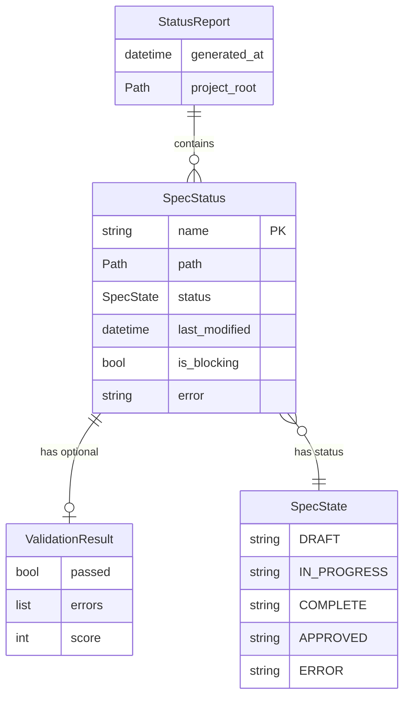
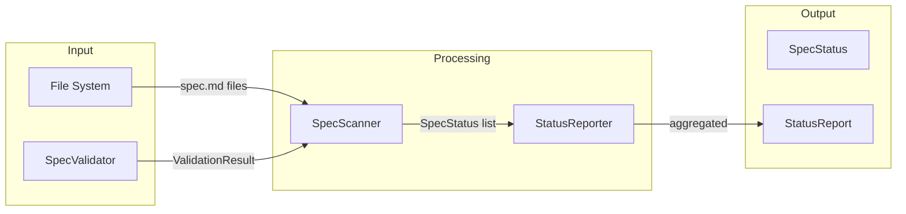

# Data Model: Spec Status Dashboard

**Feature**: 032-status-dashboard
**Date**: 2026-01-16

---

## Entity Definitions

### SpecStatus

Represents the parsed status of a single specification.

| Field | Type | Description |
|-------|------|-------------|
| `name` | `str` | Spec name derived from directory name (e.g., "032-status-dashboard") |
| `path` | `Path` | Full path to the spec.md file |
| `status` | `SpecState` | Current status (Draft, In Progress, Complete, Approved) |
| `last_modified` | `datetime` | File modification timestamp |
| `validation_result` | `ValidationResult | None` | Result from SpecValidator (if validated) |
| `is_blocking` | `bool` | Whether this spec would block commits |
| `error` | `str | None` | Parse error message if spec couldn't be read |

### SpecState (Enum)

Valid specification statuses parsed from spec.md frontmatter.

| Value | Description |
|-------|-------------|
| `DRAFT` | Initial state, not yet validated by git hooks |
| `IN_PROGRESS` | Active development, validated on commit |
| `COMPLETE` | Implementation finished, pending approval |
| `APPROVED` | Fully approved and merged |
| `ERROR` | Could not parse status from file |

### StatusReport

Aggregated report containing all spec statuses and summary statistics.

| Field | Type | Description |
|-------|------|-------------|
| `specs` | `list[SpecStatus]` | All parsed spec statuses |
| `generated_at` | `datetime` | Report generation timestamp |
| `project_root` | `Path` | Root directory of the project |

#### Computed Properties

| Property | Type | Description |
|----------|------|-------------|
| `total_count` | `int` | Total number of specs |
| `by_status` | `dict[SpecState, int]` | Count of specs grouped by status |
| `blocking_count` | `int` | Number of specs blocking commits |
| `validation_pass_count` | `int` | Specs passing validation |
| `validation_fail_count` | `int` | Specs failing validation |
| `completion_percentage` | `float` | Percentage of Complete + Approved specs |
| `is_ready_to_commit` | `bool` | True if no blocking specs |

---

## Entity Relationships



---

## Data Flow



---

## Integration with Existing Models

### ValidationResult (from Feature 029)

The `SpecStatus` entity references the existing `ValidationResult` from the SpecValidator:

```python
# From src/doit_cli/services/spec_validator.py
@dataclass
class ValidationResult:
    passed: bool
    errors: list[ValidationError]
    warnings: list[ValidationWarning]
    score: int  # 0-100 quality score
```

This ensures consistency between `doit status` output and git hook validation.

---

## Notes

- `SpecStatus.is_blocking` is computed based on:
  1. Status is IN_PROGRESS and validation fails, OR
  2. Status is DRAFT and validation fails AND spec is git-staged
- `ValidationResult` is optional because specs in ERROR state cannot be validated
- `SpecState.ERROR` is used when the spec.md file exists but cannot be parsed
