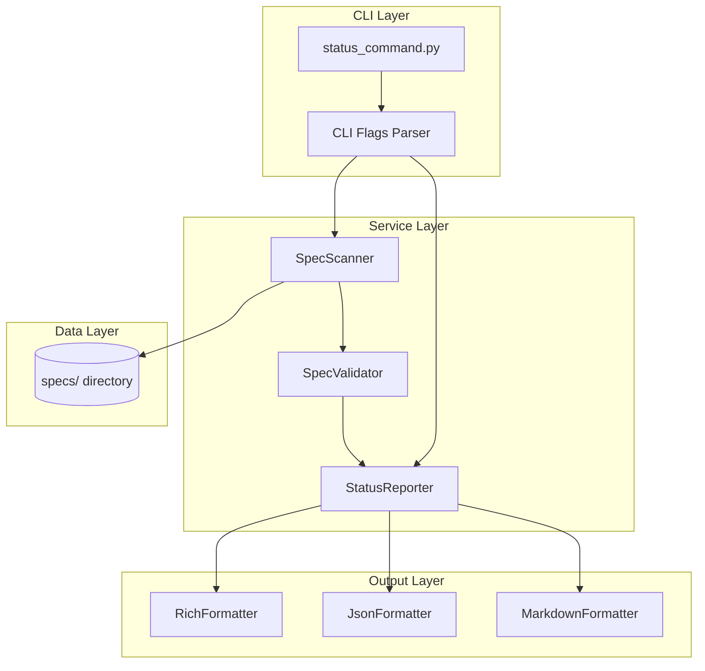

# Implementation Plan: Spec Status Dashboard

**Branch**: `032-status-dashboard` | **Date**: 2026-01-16 | **Spec**: [spec.md](./spec.md)
**Input**: Feature specification from `/specs/032-status-dashboard/spec.md`

## Summary

Implement a `doit status` command that displays the status of all specifications in a project, including validation results and commit blocker indicators. The command provides a dashboard view with filtering, statistics, and multiple output formats (rich terminal, JSON, markdown).

## Technical Context

**Language/Version**: Python 3.11+ (per constitution)
**Primary Dependencies**: Typer (CLI), Rich (terminal formatting)
**Storage**: File-based (reads `specs/` directory and spec.md files)
**Testing**: pytest with unit, integration, and contract tests
**Target Platform**: Cross-platform CLI (Windows, macOS, Linux)
**Project Type**: single (CLI tool extension)
**Performance Goals**: Display all specs in under 2 seconds for projects with up to 50 specs
**Constraints**: Must integrate with existing SpecValidator from Feature 029
**Scale/Scope**: Projects with 1-100 specifications

## Architecture Overview

<!-- BEGIN:AUTO-GENERATED section="architecture" -->

<!-- END:AUTO-GENERATED -->

## Constitution Check

*GATE: Must pass before Phase 0 research. Re-check after Phase 1 design.*

| Principle | Status | Notes |
|-----------|--------|-------|
| I. Specification-First | ✅ PASS | Spec created before implementation |
| II. Persistent Memory | ✅ PASS | Reads existing specs, no new storage |
| III. Auto-Generated Diagrams | ✅ PASS | N/A for this feature (status display) |
| IV. Opinionated Workflow | ✅ PASS | Follows specit → planit → taskit flow |
| V. AI-Native Design | ✅ PASS | Command integrates with slash commands |

**Tech Stack Alignment**:
| Item | Constitution | This Feature | Status |
|------|--------------|--------------|--------|
| Language | Python 3.11+ | Python 3.11+ | ✅ Aligned |
| CLI Framework | Typer | Typer | ✅ Aligned |
| Output | Rich | Rich | ✅ Aligned |
| Testing | pytest | pytest | ✅ Aligned |

**Gate Result**: ✅ PASS - All principles satisfied, tech stack aligned

## Project Structure

### Documentation (this feature)

```text
specs/032-status-dashboard/
├── spec.md              # Feature specification
├── plan.md              # This file
├── research.md          # Phase 0 output
├── data-model.md        # Phase 1 output
├── quickstart.md        # Phase 1 output
├── contracts/           # Phase 1 output
│   └── status-api.md    # Internal API contract
└── tasks.md             # Phase 2 output (created by /doit.taskit)
```

### Source Code (repository root)

```text
src/doit_cli/
├── cli/
│   └── status_command.py    # NEW: Status command implementation
├── services/
│   ├── spec_scanner.py      # NEW: Scan specs directory
│   ├── spec_validator.py    # EXISTING: From Feature 029
│   └── status_reporter.py   # NEW: Generate status reports
├── formatters/
│   ├── rich_formatter.py    # NEW: Rich terminal output
│   ├── json_formatter.py    # NEW: JSON output
│   └── markdown_formatter.py # NEW: Markdown output
└── models/
    └── status_models.py     # NEW: SpecStatus, StatusReport

tests/
├── unit/
│   ├── test_spec_scanner.py
│   ├── test_status_reporter.py
│   └── test_formatters.py
├── integration/
│   └── test_status_command.py
└── contract/
    └── test_status_contracts.py
```

**Structure Decision**: Single project structure (Option 1) - this is a CLI command extension that follows the existing doit_cli package layout.

## Complexity Tracking

> No violations to justify - feature aligns with constitution and uses existing patterns.

## Dependencies

### Existing Components to Reuse

| Component | Location | Purpose |
|-----------|----------|---------|
| SpecValidator | `src/doit_cli/services/spec_validator.py` | Validation rules from Feature 029 |
| ValidationResult | `src/doit_cli/models/validation_models.py` | Validation result structure |
| Console | Rich console instance | Shared terminal output |

### New Components to Create

| Component | Purpose |
|-----------|---------|
| SpecScanner | Scan specs/ directory, parse spec metadata |
| StatusReporter | Aggregate results, generate reports |
| RichFormatter | Rich terminal table output |
| JsonFormatter | JSON serialization |
| MarkdownFormatter | Markdown table output |
| SpecStatus | Data class for single spec status |
| StatusReport | Aggregated report data class |

## Integration Points

1. **Main CLI** (`src/doit_cli/main.py`): Register `status` command
2. **SpecValidator**: Reuse validation logic, don't duplicate
3. **Rich Console**: Use shared console instance for consistent styling
4. **Git Hooks**: Validation results should match hook behavior
