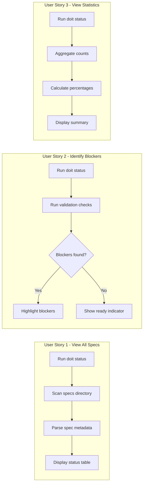
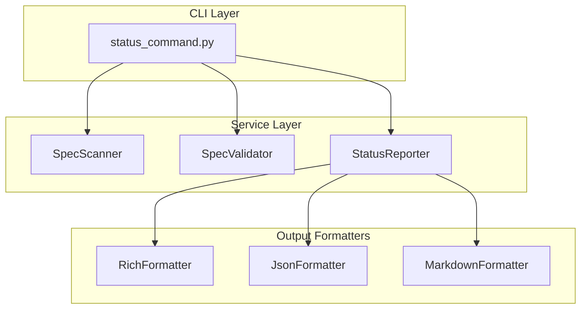

# Feature Specification: Spec Status Dashboard

**Feature Branch**: `032-status-dashboard`
**Created**: 2026-01-16
**Status**: Complete
**Input**: User description: "doit status"

## User Scenarios & Testing *(mandatory)*

### User Story 1 - View All Specs at a Glance (Priority: P1)

As a developer working on a project, I want to see the status of all specifications in my project at once, so I can understand what features are in progress, what's complete, and what needs attention.

**Why this priority**: Core functionality - this is the primary use case for the status command, providing immediate visibility into project state.

**Independent Test**: Can be fully tested by running `doit status` in a project with specs and verifying a summary table appears.

**Acceptance Scenarios**:

1. **Given** a project with multiple specs in different states, **When** I run `doit status`, **Then** I see a table listing all specs with their current status
2. **Given** a project with no specs, **When** I run `doit status`, **Then** I see a message indicating no specs exist with guidance to create one
3. **Given** a project with specs, **When** I run `doit status`, **Then** each spec shows: name, status (Draft/In Progress/Complete/Approved), and last modified date

---

### User Story 2 - Identify Commit Blockers (Priority: P1)

As a developer about to commit code, I want to quickly see which specs are blocking my commit due to validation failures, so I can fix issues before attempting to commit.

**Why this priority**: Essential for workflow - git hooks block commits when spec validation fails, so developers need to see blockers clearly.

**Independent Test**: Can be fully tested by running `doit status` with invalid specs and verifying blockers are highlighted.

**Acceptance Scenarios**:

1. **Given** a project with specs that fail validation, **When** I run `doit status`, **Then** failing specs are clearly marked as "blocking"
2. **Given** a project where all specs pass validation, **When** I run `doit status`, **Then** I see a "ready to commit" indicator
3. **Given** specs with different validation issues, **When** I run `doit status --verbose`, **Then** I see specific validation errors for each blocker

---

### User Story 3 - View Summary Statistics (Priority: P2)

As a project manager or developer, I want to see aggregate statistics about spec completion, so I can understand overall project progress.

**Why this priority**: Valuable for tracking - provides quick insights without detailed examination of each spec.

**Independent Test**: Can be fully tested by running `doit status` and verifying summary statistics are displayed.

**Acceptance Scenarios**:

1. **Given** a project with specs, **When** I run `doit status`, **Then** I see a summary showing counts by status (e.g., "3 Draft, 2 In Progress, 5 Complete")
2. **Given** a project with specs, **When** I run `doit status`, **Then** I see a completion percentage (e.g., "50% complete")
3. **Given** a project with validation-enabled specs, **When** I run `doit status`, **Then** I see validation pass/fail counts

---

### User Story 4 - Filter Status by Criteria (Priority: P2)

As a developer focusing on specific work, I want to filter the status display by criteria, so I can see only the specs relevant to my current task.

**Why this priority**: Improves usability - large projects may have many specs, filtering helps focus.

**Independent Test**: Can be fully tested by running `doit status --filter <criteria>` and verifying filtered results.

**Acceptance Scenarios**:

1. **Given** a project with specs, **When** I run `doit status --status draft`, **Then** I see only specs with "Draft" status
2. **Given** a project with specs, **When** I run `doit status --blocking`, **Then** I see only specs that are blocking commits
3. **Given** a project with specs, **When** I run `doit status --recent 7`, **Then** I see only specs modified in the last 7 days

---

### User Story 5 - Export Status Report (Priority: P3)

As a team lead, I want to export the status report in different formats, so I can share project progress in meetings or documentation.

**Why this priority**: Nice-to-have - extends utility for team collaboration and reporting.

**Independent Test**: Can be fully tested by running `doit status --format json` and verifying valid output.

**Acceptance Scenarios**:

1. **Given** a project with specs, **When** I run `doit status --format json`, **Then** I receive valid JSON output
2. **Given** a project with specs, **When** I run `doit status --format markdown`, **Then** I receive markdown-formatted output suitable for documentation
3. **Given** a project with specs, **When** I run `doit status --output report.md`, **Then** the report is saved to the specified file

---

### Edge Cases

- What happens when specs directory exists but contains no valid spec files?
  - Display "No valid specifications found" with hint to run `doit specit`
- How does system handle corrupted or malformed spec files?
  - Report the file as "Error: Unable to parse" with path, continue processing others
- What happens when run outside a doit-initialized project?
  - Display error "Not a doit project. Run 'doit init' first."
- How does system handle specs with missing required sections?
  - Mark as "Incomplete" status and list missing sections in verbose mode

## User Journey Visualization

<!-- BEGIN:AUTO-GENERATED section="user-journey" -->

<!-- END:AUTO-GENERATED -->

## System Architecture

## Requirements *(mandatory)*

### Functional Requirements

#### Core Display

- **FR-001**: System MUST scan the `specs/` directory for all specification files
- **FR-002**: System MUST display each spec's name (derived from directory name)
- **FR-003**: System MUST display each spec's status (Draft, In Progress, Complete, Approved)
- **FR-004**: System MUST display each spec's last modified timestamp
- **FR-005**: System MUST display a summary row with total counts by status

#### Validation Integration

- **FR-006**: System MUST run validation checks on each spec (using existing validation rules)
- **FR-007**: System MUST indicate validation pass/fail status for each spec
- **FR-008**: System MUST clearly mark specs that would block commits as "Blocking"
- **FR-009**: System MUST display "Ready to commit" when no blocking issues exist
- **FR-010**: System MUST show validation error count per spec

#### Filtering and Options

- **FR-011**: System MUST support `--status <status>` flag to filter by spec status
- **FR-012**: System MUST support `--blocking` flag to show only blocking specs
- **FR-013**: System MUST support `--verbose` flag for detailed validation errors
- **FR-014**: System MUST support `--recent <days>` flag to filter by modification date

#### Output Formats

- **FR-015**: System MUST default to rich terminal output with colors and formatting
- **FR-016**: System MUST support `--format json` for machine-readable JSON output
- **FR-017**: System MUST support `--format markdown` for documentation-ready output
- **FR-018**: System MUST support `--output <file>` to write report to a file

#### Error Handling

- **FR-019**: System MUST display helpful error when run outside a doit project
- **FR-020**: System MUST gracefully handle corrupted or unparseable spec files
- **FR-021**: System MUST continue processing remaining specs when one fails to parse

### Key Entities

- **SpecStatus**: Represents the parsed status of a single specification including name, status, validation result, last modified date, and any errors
- **StatusReport**: Aggregated report containing all SpecStatus entries plus summary statistics

## Success Criteria *(mandatory)*

### Measurable Outcomes

- **SC-001**: `doit status` displays all specs in under 2 seconds for projects with up to 50 specs
- **SC-002**: Developers can identify all commit blockers in a single command without additional steps
- **SC-003**: Status information matches actual spec file contents with 100% accuracy
- **SC-004**: All validation errors shown in status match those caught by git hooks
- **SC-005**: JSON output is valid and parseable by standard JSON tools
- **SC-006**: Command provides clear guidance when no specs exist or project not initialized
