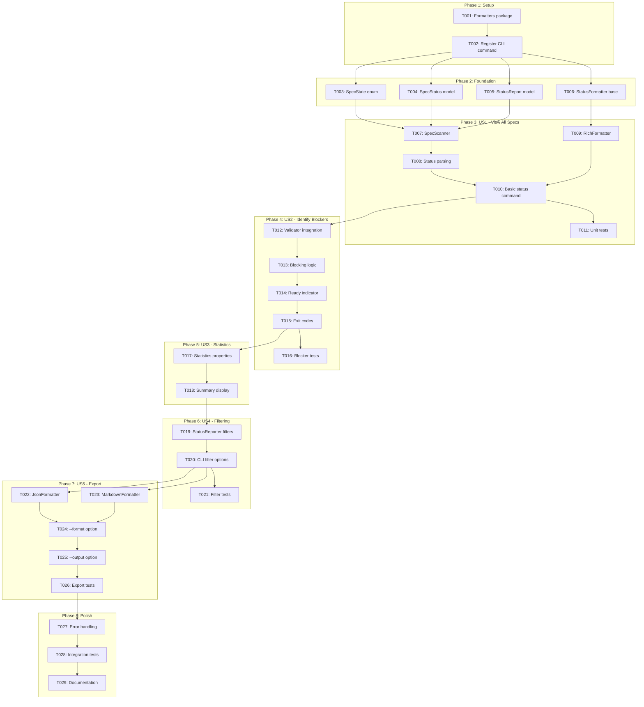
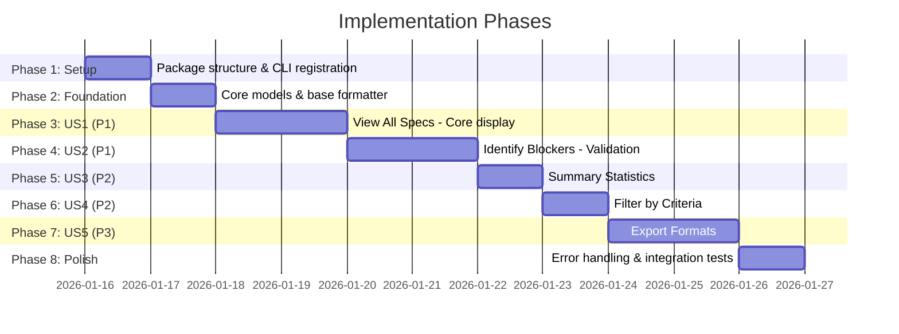

# Tasks: Spec Status Dashboard

**Input**: Design documents from `/specs/032-status-dashboard/`
**Prerequisites**: plan.md, spec.md, research.md, data-model.md, contracts/status-api.md

**Tests**: Unit and integration tests included as per project standards (pytest).

**Organization**: Tasks are grouped by user story to enable independent implementation and testing.

## Task Dependencies

<!-- BEGIN:AUTO-GENERATED section="task-dependencies" -->

<!-- END:AUTO-GENERATED -->

## Phase Timeline

<!-- BEGIN:AUTO-GENERATED section="phase-timeline" -->

<!-- END:AUTO-GENERATED -->

## Format: `[ID] [P?] [Story] Description`

- **[P]**: Can run in parallel (different files, no dependencies)
- **[Story]**: Which user story this task belongs to (US1, US2, etc.)
- Include exact file paths in descriptions

---

## Phase 1: Setup (Shared Infrastructure)

**Purpose**: Create package structure and register CLI command

- [x] T001 Create formatters package directory at src/doit_cli/formatters/__init__.py
- [x] T002 Register status command in src/doit_cli/main.py CLI app

---

## Phase 2: Foundational (Blocking Prerequisites)

**Purpose**: Core models and interfaces needed by ALL user stories

**⚠️ CRITICAL**: No user story work can begin until this phase is complete

- [x] T003 [P] Create SpecState enum in src/doit_cli/models/status_models.py (Draft, In Progress, Complete, Approved, Error)
- [x] T004 [P] Create SpecStatus dataclass in src/doit_cli/models/status_models.py with fields: name, path, status, last_modified, validation_result, is_blocking, error
- [x] T005 [P] Create StatusReport dataclass in src/doit_cli/models/status_models.py with computed properties: total_count, by_status, blocking_count, completion_percentage, is_ready_to_commit
- [x] T006 [P] Create StatusFormatter abstract base class in src/doit_cli/formatters/base.py with format(report, verbose) method

**Checkpoint**: Foundation ready - user story implementation can now begin

---

## Phase 3: User Story 1 - View All Specs at a Glance (Priority: P1) 🎯 MVP

**Goal**: Display a table listing all specs with their name, status, and last modified date

**Independent Test**: Run `doit status` in a project with specs and verify a summary table appears

### Implementation for User Story 1

- [x] T007 [US1] Create SpecScanner class in src/doit_cli/services/spec_scanner.py with __init__(project_root) and scan() methods
- [x] T008 [US1] Implement status parsing with regex in src/doit_cli/services/spec_scanner.py to extract `**Status**:` from spec.md
- [x] T009 [US1] Create RichFormatter in src/doit_cli/formatters/rich_formatter.py with table output using Rich library
- [x] T010 [US1] Implement basic status command in src/doit_cli/cli/status_command.py with Typer, displaying spec table
- [x] T011 [US1] Create unit tests for SpecScanner and RichFormatter in tests/unit/test_spec_scanner.py

**Checkpoint**: User Story 1 complete - `doit status` displays all specs in a table

---

## Phase 4: User Story 2 - Identify Commit Blockers (Priority: P1)

**Goal**: Clearly mark specs that fail validation and would block commits

**Independent Test**: Run `doit status` with invalid specs and verify blockers are highlighted

### Implementation for User Story 2

- [x] T012 [US2] Integrate SpecValidator from Feature 029 into SpecScanner in src/doit_cli/services/spec_scanner.py
- [x] T013 [US2] Implement is_blocking computation logic in src/doit_cli/services/spec_scanner.py (status + validation + git staged)
- [x] T014 [US2] Add "Ready to commit" / "Blocking" indicator to RichFormatter in src/doit_cli/formatters/rich_formatter.py
- [x] T015 [US2] Implement exit codes (0=ready, 1=blocking, 2=error) in src/doit_cli/cli/status_command.py
- [x] T016 [US2] Create unit tests for blocking logic in tests/unit/test_spec_scanner.py

**Checkpoint**: User Story 2 complete - blocking specs clearly marked with appropriate exit codes

---

## Phase 5: User Story 3 - View Summary Statistics (Priority: P2)

**Goal**: Display aggregate statistics showing counts by status and completion percentage

**Independent Test**: Run `doit status` and verify summary statistics (counts, percentage) are displayed

### Implementation for User Story 3

- [x] T017 [US3] Create StatusReporter class in src/doit_cli/services/status_reporter.py with generate_report() method aggregating statistics
- [x] T018 [US3] Add summary panel with status counts and completion percentage to RichFormatter in src/doit_cli/formatters/rich_formatter.py

**Checkpoint**: User Story 3 complete - summary statistics displayed below spec table

---

## Phase 6: User Story 4 - Filter Status by Criteria (Priority: P2)

**Goal**: Filter the status display by status, blocking, or recent modification

**Independent Test**: Run `doit status --status draft` and verify only draft specs are shown

### Implementation for User Story 4

- [x] T019 [US4] Add filter methods to StatusReporter in src/doit_cli/services/status_reporter.py (status_filter, blocking_only, recent_days)
- [x] T020 [US4] Add CLI options --status, --blocking, --recent, --verbose to src/doit_cli/cli/status_command.py
- [x] T021 [US4] Create unit tests for filtering in tests/unit/test_status_reporter.py

**Checkpoint**: User Story 4 complete - all filter options working correctly

---

## Phase 7: User Story 5 - Export Status Report (Priority: P3)

**Goal**: Export status report in JSON or Markdown format, optionally to a file

**Independent Test**: Run `doit status --format json` and verify valid JSON output

### Implementation for User Story 5

- [x] T022 [P] [US5] Create JsonFormatter in src/doit_cli/formatters/json_formatter.py with JSON serialization
- [x] T023 [P] [US5] Create MarkdownFormatter in src/doit_cli/formatters/markdown_formatter.py with GFM table output
- [x] T024 [US5] Add --format option (rich, json, markdown) to src/doit_cli/cli/status_command.py
- [x] T025 [US5] Add --output option for file output to src/doit_cli/cli/status_command.py
- [x] T026 [US5] Create unit tests for formatters in tests/unit/test_formatters.py

**Checkpoint**: User Story 5 complete - export formats working with file output option

---

## Phase 8: Polish & Cross-Cutting Concerns

**Purpose**: Error handling, edge cases, and final integration tests

- [x] T027 Implement error handling for edge cases in src/doit_cli/cli/status_command.py (not a doit project, no specs, corrupted files)
- [x] T028 Create integration tests in tests/integration/test_status_command.py covering end-to-end scenarios
- [x] T029 Run quickstart.md validation and verify all success criteria pass

---

## Dependencies & Execution Order

### Phase Dependencies

- **Setup (Phase 1)**: No dependencies - can start immediately
- **Foundational (Phase 2)**: Depends on Setup - BLOCKS all user stories
- **US1 (Phase 3)**: Depends on Foundation - Core display
- **US2 (Phase 4)**: Depends on US1 - Adds validation/blocking
- **US3 (Phase 5)**: Depends on US2 - Adds statistics
- **US4 (Phase 6)**: Depends on US3 - Adds filtering
- **US5 (Phase 7)**: Depends on US4 - Adds export formats
- **Polish (Phase 8)**: Depends on US5 - Final cleanup

### User Story Dependencies

- **US1 (P1)**: After Foundation - No other story dependencies
- **US2 (P1)**: After US1 - Extends scanner with validation
- **US3 (P2)**: After US2 - Builds on complete data model
- **US4 (P2)**: After US3 - Adds filtering to reporter
- **US5 (P3)**: After US4 - Adds output format options

### Parallel Opportunities

- Foundation models T003, T004, T005, T006 can run in parallel
- Export formatters T022, T023 can run in parallel
- Tests within each phase can run in parallel

---

## Parallel Example: Foundation Phase

```bash
# Launch all foundation models together:
Task T003: "Create SpecState enum in src/doit_cli/models/status_models.py"
Task T004: "Create SpecStatus dataclass in src/doit_cli/models/status_models.py"
Task T005: "Create StatusReport dataclass in src/doit_cli/models/status_models.py"
Task T006: "Create StatusFormatter base class in src/doit_cli/formatters/base.py"
```

## Parallel Example: Export Formatters

```bash
# Launch export formatters together:
Task T022: "Create JsonFormatter in src/doit_cli/formatters/json_formatter.py"
Task T023: "Create MarkdownFormatter in src/doit_cli/formatters/markdown_formatter.py"
```

---

## Implementation Strategy

### MVP First (User Story 1 + 2 Only)

1. Complete Phase 1: Setup
2. Complete Phase 2: Foundation
3. Complete Phase 3: US1 - View All Specs
4. Complete Phase 4: US2 - Identify Blockers
5. **STOP and VALIDATE**: Test MVP independently
6. Deploy/demo if ready

### Incremental Delivery

1. Setup + Foundation → Core infrastructure ready
2. Add US1 → Basic table display → Demo capability
3. Add US2 → Blocking indicators → MVP complete
4. Add US3 → Statistics → Enhanced reporting
5. Add US4 → Filtering → Improved usability
6. Add US5 → Export formats → Full feature set

---

## Notes

- [P] tasks = different files, no dependencies
- [Story] label maps task to specific user story
- Each user story should be independently testable
- Commit after each task or logical group
- Reuse existing SpecValidator from Feature 029 - do NOT duplicate validation logic
- Exit code 1 (blocking) is not an error - it's informational
