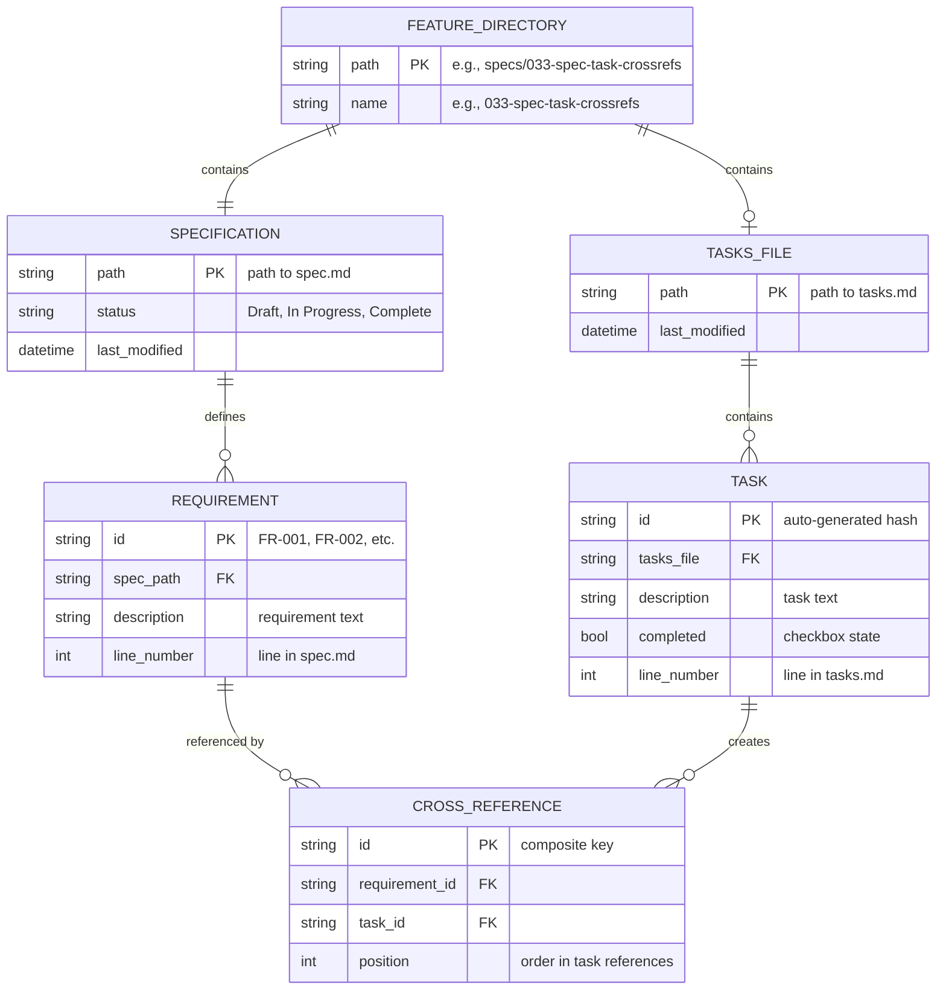
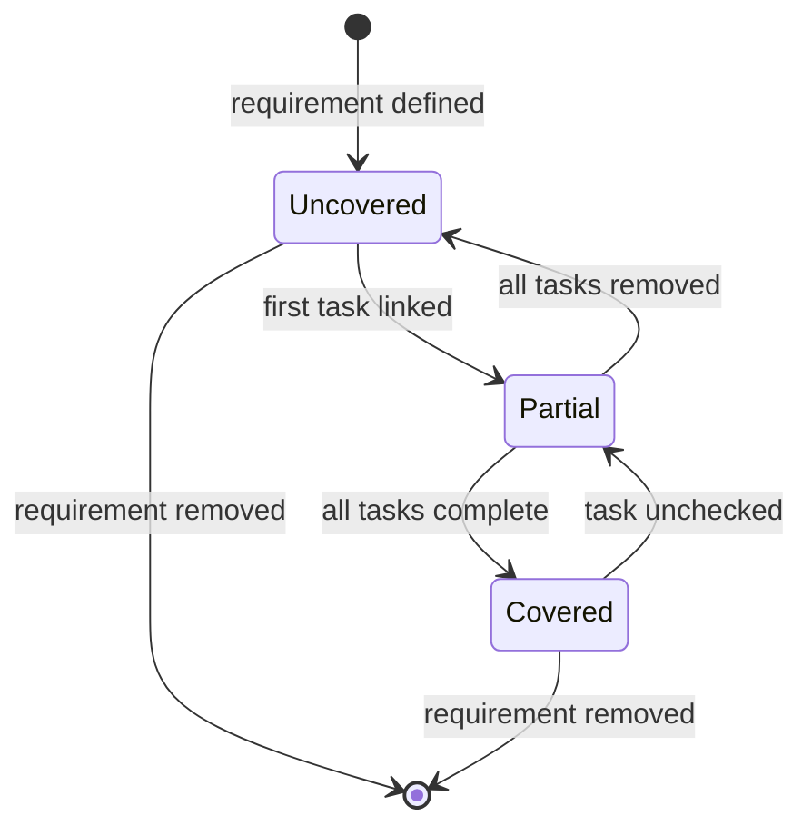
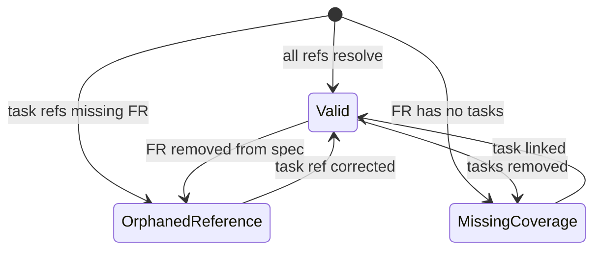
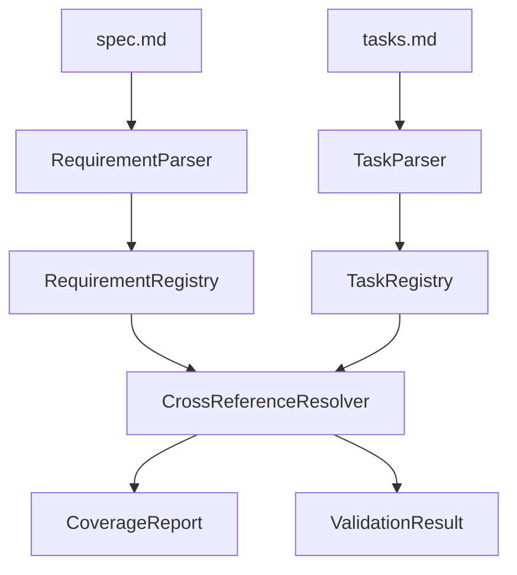

# Data Model: Cross-Reference Support

**Feature**: 033-spec-task-crossrefs
**Date**: 2026-01-16

## ER Diagram

<!-- BEGIN:AUTO-GENERATED section="er-diagram" -->

<!-- END:AUTO-GENERATED -->

## Entity Definitions

### FeatureDirectory

Represents a feature's working directory containing spec and task files.

| Field | Type | Description |
|-------|------|-------------|
| path | string (PK) | Absolute path to feature directory |
| name | string | Directory name (e.g., "033-spec-task-crossrefs") |

**Derived from**: File system discovery via `specs/*/` glob

### Specification

A spec.md file containing feature requirements.

| Field | Type | Description |
|-------|------|-------------|
| path | string (PK) | Path to spec.md file |
| status | SpecState | Draft, In Progress, Complete, Approved |
| last_modified | datetime | File modification timestamp |

**Source**: Existing `SpecScanner.scan()` method

### Requirement

A functional requirement defined in a specification.

| Field | Type | Description |
|-------|------|-------------|
| id | string (PK) | Requirement ID (FR-001 format) |
| spec_path | string (FK) | Path to containing spec.md |
| description | string | Full requirement text |
| line_number | int | Line number in spec.md |

**Extraction Pattern**: `r"^\s*-\s*\*\*(FR-\d{3})\*\*:\s*(.+)$"`

### TasksFile

A tasks.md file containing implementation tasks.

| Field | Type | Description |
|-------|------|-------------|
| path | string (PK) | Path to tasks.md file |
| last_modified | datetime | File modification timestamp |

**Source**: File system check for `{feature_dir}/tasks.md`

### Task

An individual task item within tasks.md.

| Field | Type | Description |
|-------|------|-------------|
| id | string (PK) | Hash of normalized description |
| tasks_file | string (FK) | Path to containing tasks.md |
| description | string | Task text (without references) |
| completed | bool | Checkbox state |
| line_number | int | Line number in tasks.md |

**Extraction Pattern**: `r"^\s*-\s*\[([ xX])\]\s*(.+?)(?:\s*\[FR-\d{3}(?:,\s*FR-\d{3})*\])?\s*$"`

### CrossReference

A link between a task and a requirement.

| Field | Type | Description |
|-------|------|-------------|
| id | string (PK) | Composite: `{requirement_id}:{task_id}` |
| requirement_id | string (FK) | FK to Requirement.id |
| task_id | string (FK) | FK to Task.id |
| position | int | Order when multiple refs (0-indexed) |

**Extraction Pattern**: `r"\[(FR-\d{3}(?:,\s*FR-\d{3})*)\]"`

## State Diagrams

### CoverageStatus State Machine

| State | Description |
|-------|-------------|
| Uncovered | Requirement has no linked tasks |
| Partial | Requirement has linked tasks, not all complete |
| Covered | Requirement has linked tasks, all complete |

### ValidationState State Machine

| State | Description |
|-------|-------------|
| Valid | All cross-references are valid |
| OrphanedReference | Task references non-existent requirement |
| MissingCoverage | Requirement exists without any linked tasks |

## Validation Rules

### New Rules for Traceability Category

| Rule ID | Severity | Condition |
|---------|----------|-----------|
| orphaned-task-reference | ERROR | Task references FR-XXX not in spec.md |
| uncovered-requirement | WARNING | FR-XXX exists with no task references |
| uncovered-requirement-strict | ERROR | Same as above (strict mode) |
| duplicate-task-reference | INFO | Same FR-XXX referenced multiple times in one task |

## Data Flow

## Storage Notes

- **No persistent storage**: All data is parsed on-demand from markdown files
- **Caching**: Optional in-memory cache during single command execution
- **Consistency**: File modification timestamps used to invalidate cache
