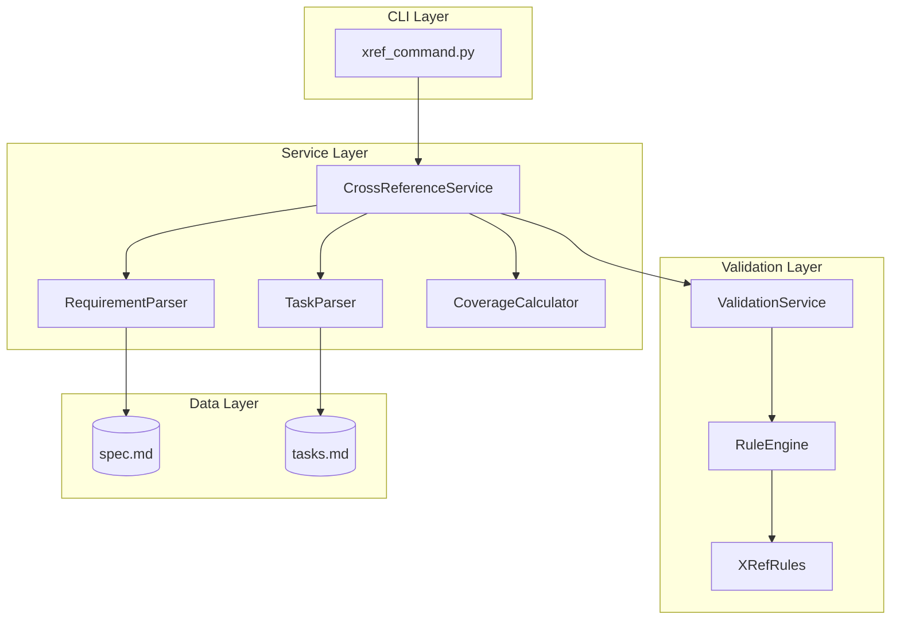

# Implementation Plan: Cross-Reference Support Between Specs and Tasks

**Branch**: `033-spec-task-crossrefs` | **Date**: 2026-01-16 | **Spec**: [spec.md](spec.md)
**Input**: Feature specification from `/specs/033-spec-task-crossrefs/spec.md`

## Summary

Implement bidirectional linking between specification requirements (FR-XXX) and implementation tasks with full traceability, coverage reporting, and validation integration. The solution extends the existing validation infrastructure (feature 029) with new cross-reference parsing, coverage calculation, and CLI commands (`doit xref coverage|locate|tasks|validate`).

## Technical Context

**Language/Version**: Python 3.11+ (per constitution)
**Primary Dependencies**: Typer (CLI), Rich (output), pytest (testing)
**Storage**: File-based (markdown in specs/ directory)
**Testing**: pytest with fixtures for mock spec/task files
**Target Platform**: Cross-platform CLI (macOS, Linux, Windows)
**Project Type**: single (CLI tool)
**Performance Goals**: Coverage reports in <2s for 50 requirements
**Constraints**: No external dependencies beyond constitution tech stack
**Scale/Scope**: Single project, ~500 LOC for new services

## Architecture Overview

<!-- BEGIN:AUTO-GENERATED section="architecture" -->

<!-- END:AUTO-GENERATED -->

## Constitution Check

*GATE: Must pass before Phase 0 research. Re-check after Phase 1 design.*

| Principle | Status | Evidence |
|-----------|--------|----------|
| I. Specification-First | ✓ PASS | Spec created via `/doit.specit` before planning |
| II. Persistent Memory | ✓ PASS | All data stored in markdown files |
| III. Auto-Generated Diagrams | ✓ PASS | Architecture and ER diagrams generated |
| IV. Opinionated Workflow | ✓ PASS | Integrates with existing doit commands |
| V. AI-Native Design | ✓ PASS | Slash commands + markdown interface |
| Tech Stack Compliance | ✓ PASS | Python 3.11+, Typer, Rich, pytest only |
| Quality Standards | ✓ PASS | Tests required; pytest infrastructure exists |

**Gate Status**: PASS - All constitution principles satisfied

## Project Structure

### Documentation (this feature)

```text
specs/033-spec-task-crossrefs/
├── spec.md              # Feature specification
├── plan.md              # This file
├── research.md          # Research findings and decisions
├── data-model.md        # Entity definitions and relationships
├── quickstart.md        # User guide
├── contracts/
│   └── cli-interface.md # CLI command contracts
├── checklists/
│   └── requirements.md  # Spec quality checklist
└── tasks.md             # Implementation tasks (via /doit.taskit)
```

### Source Code (repository root)

```text
src/doit_cli/
├── models/
│   ├── __init__.py              # Update exports
│   └── crossref_models.py       # NEW: CrossReference, CoverageReport
├── services/
│   ├── __init__.py              # Update exports
│   ├── crossref_service.py      # NEW: CrossReferenceService
│   ├── requirement_parser.py    # NEW: Extract FR-XXX from spec.md
│   ├── task_parser.py           # NEW: Extract tasks and refs from tasks.md
│   └── coverage_calculator.py   # NEW: Compute coverage metrics
├── cli/
│   ├── __init__.py              # Update with xref group
│   └── xref_command.py          # NEW: doit xref subcommands
└── rules/
    └── builtin_rules.py         # UPDATE: Add traceability rules

tests/
├── unit/
│   ├── services/
│   │   ├── test_crossref_service.py    # NEW
│   │   ├── test_requirement_parser.py  # NEW
│   │   ├── test_task_parser.py         # NEW
│   │   └── test_coverage_calculator.py # NEW
│   └── cli/
│       └── test_xref_command.py        # NEW
└── integration/
    └── test_xref_integration.py        # NEW: End-to-end tests
```

**Structure Decision**: Single project structure (Option 1) - consistent with existing doit-cli architecture. New components follow established patterns in services/ and cli/ directories.

## Implementation Phases

### Phase 1: Core Parsing (FR-001, FR-002)

1. Create `models/crossref_models.py`:
   - `Requirement` dataclass
   - `Task` dataclass
   - `CrossReference` dataclass
   - `CoverageReport` dataclass

2. Create `services/requirement_parser.py`:
   - Parse spec.md for FR-XXX patterns
   - Return list of `Requirement` objects with line numbers

3. Create `services/task_parser.py`:
   - Parse tasks.md for checkbox items
   - Extract `[FR-XXX]` references from task text
   - Return list of `Task` objects with cross-references

4. Write unit tests for parsers

### Phase 2: Coverage Calculation (FR-003, FR-004)

1. Create `services/coverage_calculator.py`:
   - Match requirements to tasks via references
   - Calculate coverage percentage
   - Identify uncovered requirements

2. Create `services/crossref_service.py`:
   - Orchestrate parsers and calculator
   - Provide unified API for CLI commands

3. Write unit tests for coverage logic

### Phase 3: CLI Commands (FR-007, FR-008)

1. Create `cli/xref_command.py`:
   - `doit xref coverage` - Show coverage report
   - `doit xref locate` - Find requirement in spec
   - `doit xref tasks` - List tasks for requirement
   - `doit xref validate` - Check cross-reference integrity

2. Add `xref` command group to main CLI

3. Write CLI integration tests

### Phase 4: Validation Integration (FR-005, FR-006)

1. Update `rules/builtin_rules.py`:
   - Add `orphaned-task-reference` rule
   - Add `uncovered-requirement` rule

2. Update `RuleEngine` to support cross-file validation

3. Write validation rule tests

### Phase 5: Preservation Logic (FR-009, FR-010)

1. Update task parser for reference preservation
2. Implement fuzzy matching for task descriptions
3. Support relative path syntax for multi-spec features
4. Write preservation tests

## Risk Mitigations

| Risk | Mitigation |
|------|------------|
| Performance on large specs | Lazy loading, cache parsed results during single command |
| Breaking existing validation | Add new rule category, don't modify existing rules |
| Cross-file validation complexity | Scope to feature directory, single spec+tasks pair |

## Complexity Tracking

> No constitution violations - this section left empty.

## Artifacts Generated

| Artifact | Purpose |
|----------|---------|
| [research.md](research.md) | Research decisions and alternatives |
| [data-model.md](data-model.md) | Entity definitions and ER diagram |
| [quickstart.md](quickstart.md) | User guide for feature |
| [contracts/cli-interface.md](contracts/cli-interface.md) | CLI command specifications |
