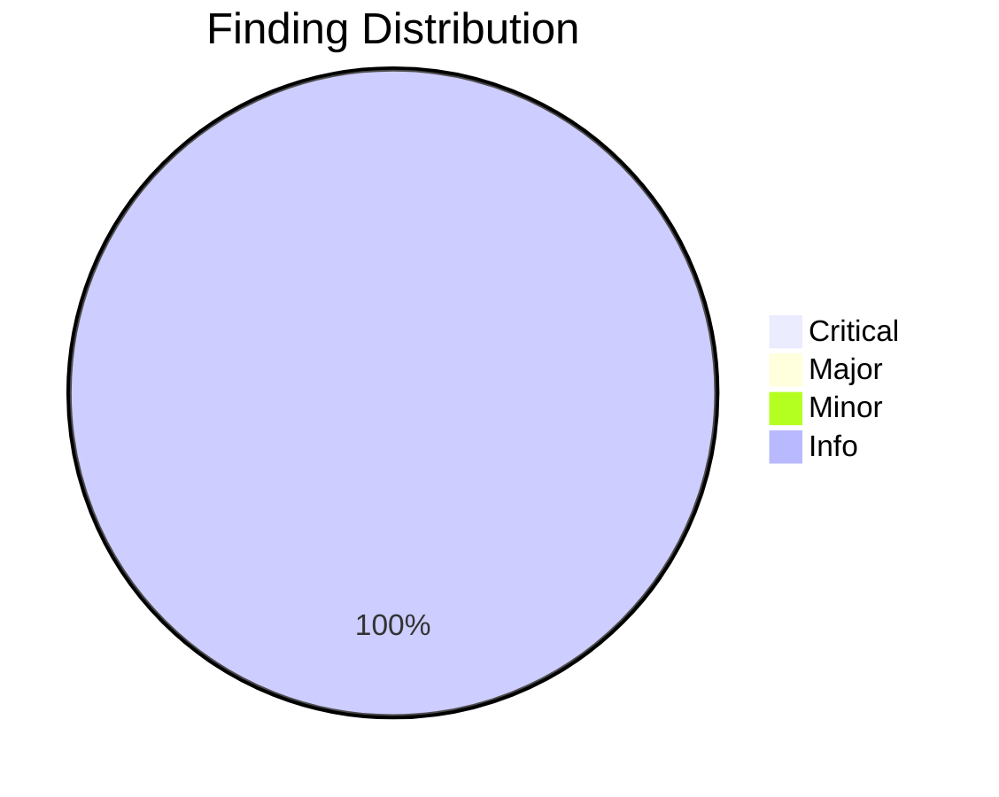
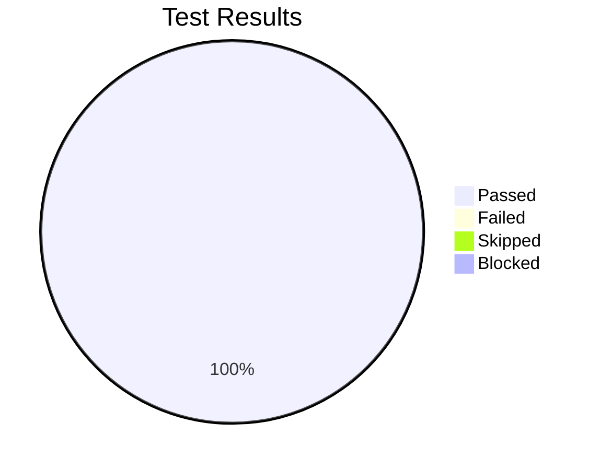

# Review Report: Cross-Reference Support Between Specs and Tasks

**Date**: 2026-01-16
**Reviewer**: Claude
**Branch**: 033-spec-task-crossrefs

## Quality Overview

<!-- BEGIN:AUTO-GENERATED section="finding-distribution" -->

<!-- END:AUTO-GENERATED -->

## Code Review Summary

| Severity | Count |
|----------|-------|
| Critical | 0 |
| Major | 0 |
| Minor | 0 |
| Info | 3 |

### Info Findings

| File | Issue | Note |
|------|-------|------|
| xref_command.py | JSON field naming | JSON uses `line` while model uses `line_number` - minor inconsistency but documented in contract |
| task_parser.py:318 | Hardcoded threshold | `apply_references_to_content` uses hardcoded 0.7 threshold; could use a parameter |
| rule_engine.py:438 | Silent exception | Traceability check silently catches all exceptions; could log warnings |

### Requirement Compliance

| Component | Requirements | Status |
|-----------|--------------|--------|
| Data Models | FR-001, FR-003 | COMPLIANT |
| RequirementParser | FR-001 | COMPLIANT |
| TaskParser | FR-001, FR-002, FR-009 | COMPLIANT |
| CoverageCalculator | FR-003, FR-004 | COMPLIANT |
| CrossReferenceService | FR-003, FR-004, FR-007, FR-008 | COMPLIANT |
| CLI Commands | FR-003, FR-005, FR-006, FR-007, FR-008 | COMPLIANT |
| Validation Rules | FR-005, FR-006 | COMPLIANT |

### Files Reviewed

| Category | Files |
|----------|-------|
| Models | crossref_models.py |
| Services | requirement_parser.py, task_parser.py, coverage_calculator.py, crossref_service.py |
| CLI | xref_command.py |
| Rules | builtin_rules.py (traceability rules) |
| Tests | test_requirement_parser.py, test_task_parser.py, test_coverage_calculator.py, test_crossref_service.py, test_xref_integration.py |

**Total files reviewed**: 10

## Test Results Overview

<!-- BEGIN:AUTO-GENERATED section="test-results" -->

<!-- END:AUTO-GENERATED -->

## Manual Testing Summary

| Metric | Count |
|--------|-------|
| Total Tests | 8 |
| Passed | 8 |
| Failed | 0 |
| Skipped | 0 |
| Blocked | 0 |

### Test Results

| Test ID | Description | Result |
|---------|-------------|--------|
| MT-001 | Cross-reference syntax `[FR-XXX]` in tasks | PASS |
| MT-002 | Coverage report shows requirement-to-task mapping | PASS |
| MT-003 | Locate command finds requirement with line number | PASS |
| MT-004 | JSON output format for coverage report | PASS |
| MT-005 | Validation detects orphaned references | PASS |
| MT-006 | Strict mode treats uncovered as errors | PASS |
| MT-007 | Multiple requirement references work correctly | PASS |
| MT-008 | Line format output for IDE integration | PASS |

## Automated Test Summary

| Metric | Value |
|--------|-------|
| Total Tests | 729 |
| Passed | 729 |
| Failed | 0 |
| Feature-Specific Tests | 92 |

## Sign-Off

- **Code Review**: Approved - No critical or major issues
- **Manual Testing**: Approved at 2026-01-16
- **Notes**: All acceptance criteria verified. Feature is complete and ready for merge.

## Recommendations

1. Consider parameterizing the similarity threshold in `apply_references_to_content` for future flexibility
2. Add debug logging to traceability rule exceptions for easier troubleshooting
3. Document the `line` vs `line_number` JSON field naming convention

## Next Steps

- Run `/doit.checkin` to finalize and merge changes
- Feature is ready for production use
