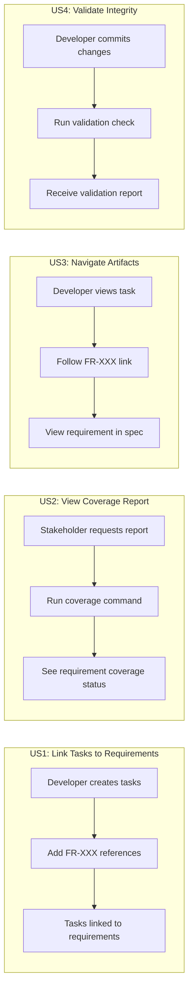
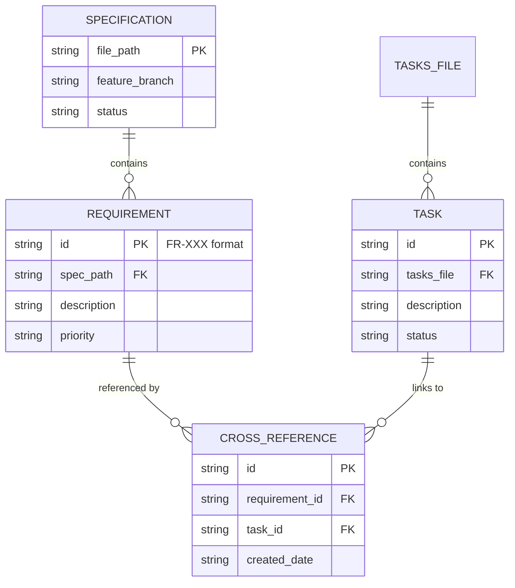

# Feature Specification: Cross-Reference Support Between Specs and Tasks

**Feature Branch**: `033-spec-task-crossrefs`
**Created**: 2026-01-16
**Status**: Complete
**Input**: User description: "Cross-reference support between specs and tasks - Maintains traceability from requirements through implementation"

## Summary

This feature enables bidirectional linking between specification requirements (FR-XXX) and implementation tasks, providing full traceability from requirements through implementation. Users can see which requirements are covered by tasks, which tasks implement specific requirements, and navigate seamlessly between related artifacts.

## User Scenarios & Testing *(mandatory)*

### User Story 1 - Link Tasks to Requirements (Priority: P1)

As a developer creating implementation tasks, I want to link each task to the specific spec requirement(s) it implements, so that I maintain traceability throughout the development process.

**Why this priority**: This is the foundational capability that enables all cross-referencing. Without the ability to create links, no other traceability features can work.

**Independent Test**: Can be fully tested by running `/doit.taskit` on a spec with FR-XXX requirements and verifying tasks contain references like `[FR-001]` that link back to the spec.

**Acceptance Scenarios**:

1. **Given** a spec.md file with functional requirements (FR-001, FR-002, etc.), **When** the user runs `/doit.taskit`, **Then** the generated tasks.md file includes requirement references for each task in the format `[FR-XXX]`.
2. **Given** an existing tasks.md file, **When** the user manually adds `[FR-XXX]` to a task description, **Then** the system recognizes and tracks this as a valid cross-reference.
3. **Given** a task with multiple requirements, **When** the user specifies `[FR-001, FR-003]`, **Then** the system links the task to both requirements.

---

### User Story 2 - View Requirement Coverage Report (Priority: P2)

As a project manager or tech lead, I want to see which specification requirements have implementing tasks and which are uncovered, so that I can ensure complete implementation coverage before release.

**Why this priority**: Once links exist, stakeholders need visibility into coverage. This provides the oversight capability that makes cross-references valuable.

**Independent Test**: Can be fully tested by running a coverage report command on a feature directory containing spec.md and tasks.md, producing a table showing FR-XXX requirements and their linked tasks.

**Acceptance Scenarios**:

1. **Given** a feature with spec.md containing 5 requirements and tasks.md with some linked tasks, **When** the user runs the coverage report, **Then** they see a table showing each requirement, its linked tasks, and coverage status.
2. **Given** a requirement with no linked tasks, **When** viewing the coverage report, **Then** the requirement is flagged as "Uncovered" with a warning indicator.
3. **Given** all requirements have linked tasks, **When** viewing the coverage report, **Then** a summary shows "100% coverage" status.

---

### User Story 3 - Navigate Between Linked Artifacts (Priority: P2)

As a developer reviewing code or specifications, I want to navigate from a task to its source requirement and from a requirement to its implementing tasks, so that I can understand context quickly.

**Why this priority**: Navigation improves developer experience and enables faster context-switching during code review and debugging.

**Independent Test**: Can be tested by clicking/following a cross-reference link in tasks.md and verifying it resolves to the correct location in spec.md, and vice versa.

**Acceptance Scenarios**:

1. **Given** a task in tasks.md with reference `[FR-002]`, **When** the user follows the reference, **Then** they are directed to the FR-002 definition in spec.md.
2. **Given** FR-002 in spec.md, **When** the user requests linked tasks, **Then** they see a list of all tasks that reference FR-002.
3. **Given** a cross-reference to a non-existent requirement, **When** validating the file, **Then** a warning is displayed about the broken reference.

---

### User Story 4 - Validate Cross-Reference Integrity (Priority: P3)

As a developer committing changes, I want the system to validate that all cross-references are valid and no orphaned links exist, so that I maintain data integrity.

**Why this priority**: Integrity checks prevent technical debt from accumulating over time as specs and tasks evolve.

**Independent Test**: Can be tested by running validation with intentionally broken references and verifying appropriate warnings are generated.

**Acceptance Scenarios**:

1. **Given** tasks.md with reference `[FR-099]` but spec.md has no FR-099, **When** validation runs, **Then** a warning identifies the orphaned task reference.
2. **Given** spec.md with FR-003 but no task references it, **When** validation runs with strict mode, **Then** a warning identifies the unimplemented requirement.
3. **Given** all cross-references are valid and complete, **When** validation runs, **Then** no warnings are generated and status shows "All cross-references valid".

---

### Edge Cases

- What happens when a requirement is removed from spec.md but tasks still reference it?
  - System displays warning about orphaned references during validation
- How does the system handle tasks that span multiple specs (if a feature has sub-specs)?
  - References include the relative spec path: `[spec.md#FR-001]` or `[subfeature/spec.md#FR-001]`
- What happens when a task has no requirement reference?
  - Optional warning during validation; some tasks may be infrastructure/setup without direct requirement mapping
- How are references handled when requirements are renumbered?
  - Manual update required; validation warns about broken references to guide correction

## User Journey Visualization

<!-- BEGIN:AUTO-GENERATED section="user-journey" -->

<!-- END:AUTO-GENERATED -->

## Entity Relationships

<!-- BEGIN:AUTO-GENERATED section="entity-relationships" -->

<!-- END:AUTO-GENERATED -->

## Requirements *(mandatory)*

### Functional Requirements

- **FR-001**: System MUST support cross-reference syntax `[FR-XXX]` in task descriptions to link tasks to specification requirements
- **FR-002**: System MUST support multiple requirement references in a single task using comma-separated format `[FR-001, FR-002]`
- **FR-003**: System MUST generate a coverage report showing all requirements and their linked tasks
- **FR-004**: System MUST identify uncovered requirements (those with no linked tasks) in the coverage report
- **FR-005**: System MUST validate cross-references and warn about orphaned references (tasks referencing non-existent requirements)
- **FR-006**: System MUST warn about unimplemented requirements (requirements with no linking tasks) when running in strict validation mode
- **FR-007**: System MUST support navigation from task references to the corresponding requirement definition
- **FR-008**: System MUST support listing all tasks that implement a specific requirement
- **FR-009**: System MUST preserve existing cross-references when tasks.md or spec.md files are regenerated or updated
- **FR-010**: System MUST support relative path references for multi-spec features using format `[path/to/spec.md#FR-XXX]`

### Key Entities

- **Specification**: A spec.md file containing feature requirements; identified by file path
- **Requirement**: A functional requirement within a specification; identified by FR-XXX pattern
- **Task**: An implementation task within tasks.md; has description and status
- **Cross-Reference**: A link between a task and one or more requirements; enables bidirectional traceability

## Success Criteria *(mandatory)*

### Measurable Outcomes

- **SC-001**: Developers can add requirement references to tasks in under 10 seconds per task
- **SC-002**: Coverage reports generate within 2 seconds for features with up to 50 requirements
- **SC-003**: 100% of cross-reference validation errors are detected and reported with actionable messages
- **SC-004**: Navigation from task to requirement completes in a single action (one click or command)
- **SC-005**: 90% of developers report improved traceability confidence in user feedback
- **SC-006**: Reduction in "requirement missed" bugs by 50% for projects using cross-reference validation

## Assumptions

- Users are familiar with the existing doit workflow (`specit` → `planit` → `taskit` → `implementit`)
- Spec files follow the standard template with FR-XXX formatted requirements
- Tasks files follow the standard markdown format generated by `/doit.taskit`
- Cross-references are stored inline in markdown files, not in a separate database
- The `doit validate` command (feature 029) provides the integration point for cross-reference validation

## Dependencies

- Feature 029 (Spec Validation and Linting) - Provides validation infrastructure to hook into
- Existing spec.md template with FR-XXX requirement format
- Existing tasks.md format from `/doit.taskit` command

## Out of Scope

- Automatic cross-reference generation (users must explicitly add references)
- IDE plugins or editor extensions for cross-reference navigation
- Cross-references between different features/projects
- Version tracking of cross-references over time
- Graphical visualization of cross-reference networks (beyond coverage report)
