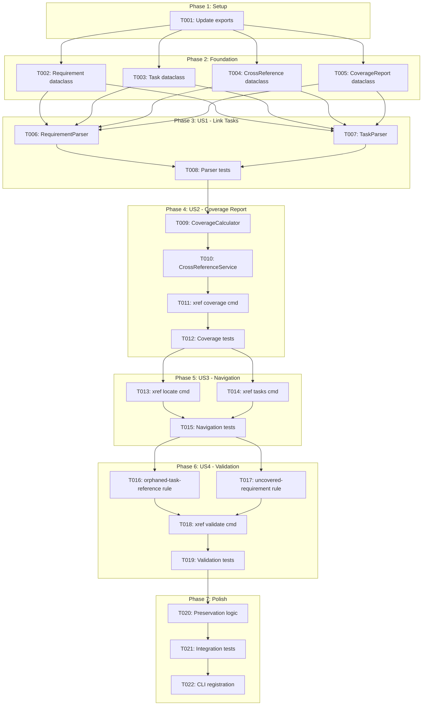
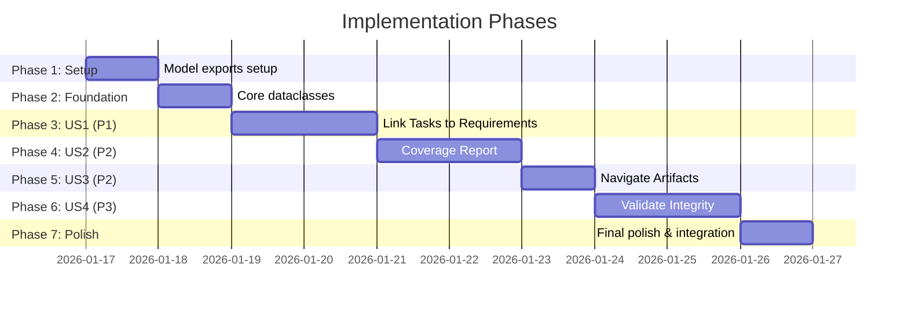

# Tasks: Cross-Reference Support Between Specs and Tasks

**Input**: Design documents from `/specs/033-spec-task-crossrefs/`
**Prerequisites**: plan.md, spec.md, research.md, data-model.md, contracts/cli-interface.md

**Organization**: Tasks are grouped by user story to enable independent implementation and testing of each story.

## Task Dependencies

<!-- BEGIN:AUTO-GENERATED section="task-dependencies" -->

<!-- END:AUTO-GENERATED -->

## Phase Timeline

<!-- BEGIN:AUTO-GENERATED section="phase-timeline" -->

<!-- END:AUTO-GENERATED -->

## Format: `[ID] [P?] [Story] Description`

- **[P]**: Can run in parallel (different files, no dependencies)
- **[Story]**: Which user story this task belongs to (US1, US2, US3, US4)
- Include exact file paths in descriptions

---

## Phase 1: Setup (Shared Infrastructure)

**Purpose**: Prepare model and service exports for new cross-reference components

- [x] T001 Update model and service exports in src/doit_cli/models/__init__.py and src/doit_cli/services/__init__.py

---

## Phase 2: Foundational (Blocking Prerequisites)

**Purpose**: Core dataclasses that ALL user stories depend on

**CRITICAL**: No user story work can begin until these models exist

- [x] T002 [P] Create Requirement dataclass in src/doit_cli/models/crossref_models.py (id, spec_path, description, line_number) [FR-001]
- [x] T003 [P] Create Task dataclass in src/doit_cli/models/crossref_models.py (id, tasks_file, description, completed, line_number, references) [FR-001]
- [x] T004 [P] Create CrossReference dataclass in src/doit_cli/models/crossref_models.py (requirement_id, task_id, position) [FR-001]
- [x] T005 [P] Create CoverageReport dataclass in src/doit_cli/models/crossref_models.py (spec_path, requirements, coverage_percent, covered_count, total_count) [FR-003]

**Checkpoint**: Foundation ready - user story implementation can now begin

---

## Phase 3: User Story 1 - Link Tasks to Requirements (Priority: P1) MVP

**Goal**: Enable developers to link tasks to spec requirements using `[FR-XXX]` syntax

**Independent Test**: Run RequirementParser on a spec.md and TaskParser on a tasks.md with `[FR-XXX]` references; verify correct extraction

**Implements**: FR-001 (cross-reference syntax), FR-002 (multiple references)

### Implementation for User Story 1

- [x] T006 [P] [US1] Create RequirementParser class in src/doit_cli/services/requirement_parser.py with parse() method that extracts FR-XXX from spec.md using pattern `r"^\s*-\s*\*\*(FR-\d{3})\*\*:\s*(.+)$"` [FR-001]
- [x] T007 [P] [US1] Create TaskParser class in src/doit_cli/services/task_parser.py with parse() method that extracts tasks and `[FR-XXX]` references using pattern `r"\[(FR-\d{3}(?:,\s*FR-\d{3})*)\]"` [FR-001, FR-002]
- [x] T008 [US1] Write unit tests for RequirementParser and TaskParser in tests/unit/services/test_requirement_parser.py and tests/unit/services/test_task_parser.py [FR-001, FR-002]

**Checkpoint**: User Story 1 complete - can parse specs and tasks with cross-references

---

## Phase 4: User Story 2 - View Requirement Coverage Report (Priority: P2)

**Goal**: Enable stakeholders to see which requirements have implementing tasks and coverage percentage

**Independent Test**: Run `doit xref coverage` on a feature directory; verify Rich table output shows requirement coverage status

**Implements**: FR-003 (coverage report), FR-004 (identify uncovered requirements)

### Implementation for User Story 2

- [x] T009 [US2] Create CoverageCalculator class in src/doit_cli/services/coverage_calculator.py with calculate() method that matches requirements to tasks and computes coverage metrics [FR-003, FR-004]
- [x] T010 [US2] Create CrossReferenceService class in src/doit_cli/services/crossref_service.py that orchestrates parsers and calculator, provides get_coverage() and get_tasks_for_requirement() APIs [FR-003, FR-004]
- [x] T011 [US2] Implement `doit xref coverage` command in src/doit_cli/cli/xref_command.py with --format (rich/json/markdown) and --strict options [FR-003, FR-004]
- [x] T012 [US2] Write unit tests for CoverageCalculator and CrossReferenceService in tests/unit/services/test_coverage_calculator.py and tests/unit/services/test_crossref_service.py [FR-003, FR-004]

**Checkpoint**: User Story 2 complete - can generate coverage reports showing requirement status

---

## Phase 5: User Story 3 - Navigate Between Linked Artifacts (Priority: P2)

**Goal**: Enable developers to navigate from task to requirement and from requirement to tasks

**Independent Test**: Run `doit xref locate FR-001` to get spec.md line number; run `doit xref tasks FR-001` to list implementing tasks

**Implements**: FR-007 (navigate to requirement), FR-008 (list tasks for requirement)

### Implementation for User Story 3

- [x] T013 [P] [US3] Implement `doit xref locate` command in src/doit_cli/cli/xref_command.py with --spec and --format (rich/json/line) options [FR-007]
- [x] T014 [P] [US3] Implement `doit xref tasks` command in src/doit_cli/cli/xref_command.py with --spec and --format (rich/json/markdown) options [FR-008]
- [x] T015 [US3] Write CLI tests for xref locate and xref tasks in tests/unit/cli/test_xref_command.py [FR-007, FR-008]

**Checkpoint**: User Story 3 complete - can navigate bidirectionally between specs and tasks

---

## Phase 6: User Story 4 - Validate Cross-Reference Integrity (Priority: P3)

**Goal**: Ensure all cross-references are valid and flag orphaned/uncovered items

**Independent Test**: Run `doit xref validate` with intentionally broken references; verify appropriate warnings are generated

**Implements**: FR-005 (orphaned reference warning), FR-006 (unimplemented requirement warning)

### Implementation for User Story 4

- [x] T016 [P] [US4] Add orphaned-task-reference validation rule in src/doit_cli/rules/builtin_rules.py that checks task references against spec requirements [FR-005]
- [x] T017 [P] [US4] Add uncovered-requirement validation rule in src/doit_cli/rules/builtin_rules.py that checks for requirements with no linked tasks (warning by default, error in strict mode) [FR-006]
- [x] T018 [US4] Implement `doit xref validate` command in src/doit_cli/cli/xref_command.py with --strict and --format options [FR-005, FR-006]
- [x] T019 [US4] Write validation rule tests in tests/unit/rules/test_crossref_rules.py [FR-005, FR-006]

**Checkpoint**: User Story 4 complete - validation catches orphaned references and uncovered requirements

---

## Phase 7: Polish & Cross-Cutting Concerns

**Purpose**: Preservation logic, integration, and final registration

- [x] T020 Implement reference preservation in TaskParser for regeneration scenarios (parse existing refs, apply to matching tasks by description similarity) in src/doit_cli/services/task_parser.py [FR-009]
- [x] T021 Write integration tests for end-to-end xref workflow in tests/integration/test_xref_integration.py [FR-010]
- [x] T022 Register xref command group in main CLI in src/doit_cli/main.py

---

## Dependencies & Execution Order

### Phase Dependencies

- **Setup (Phase 1)**: No dependencies - can start immediately
- **Foundational (Phase 2)**: Depends on Setup completion - BLOCKS all user stories
- **User Story 1 (Phase 3)**: Depends on Foundational models
- **User Story 2 (Phase 4)**: Depends on User Story 1 parsers
- **User Story 3 (Phase 5)**: Depends on User Story 2 service layer
- **User Story 4 (Phase 6)**: Depends on User Story 3 navigation infrastructure
- **Polish (Phase 7)**: Depends on all user stories being complete

### User Story Dependencies

- **User Story 1 (P1)**: Requires foundational models only - CORE MVP
- **User Story 2 (P2)**: Requires US1 parsers - builds on parsing capability
- **User Story 3 (P2)**: Requires US2 service layer - adds navigation commands
- **User Story 4 (P3)**: Requires US3 infrastructure - adds validation rules

### Parallel Opportunities

Within Phase 2 (Foundation):
- T002, T003, T004, T005 can run in parallel (different dataclasses in same file)

Within Phase 3 (US1):
- T006, T007 can run in parallel (different parser files)

Within Phase 5 (US3):
- T013, T014 can run in parallel (different commands in same file, no dependencies)

Within Phase 6 (US4):
- T016, T017 can run in parallel (different rules in same file)

---

## Parallel Example: Phase 2 Foundation

```bash
# Launch all foundation model tasks together:
Task: "Create Requirement dataclass in src/doit_cli/models/crossref_models.py"
Task: "Create Task dataclass in src/doit_cli/models/crossref_models.py"
Task: "Create CrossReference dataclass in src/doit_cli/models/crossref_models.py"
Task: "Create CoverageReport dataclass in src/doit_cli/models/crossref_models.py"
```

---

## Implementation Strategy

### MVP First (User Story 1 + 2)

1. Complete Phase 1: Setup
2. Complete Phase 2: Foundation dataclasses
3. Complete Phase 3: User Story 1 (parsing)
4. Complete Phase 4: User Story 2 (coverage reporting)
5. **STOP and VALIDATE**: Test `doit xref coverage` independently
6. Deploy/demo if ready

### Incremental Delivery

1. Setup + Foundation → Core models ready
2. Add User Story 1 → Test parsing → Can link tasks to requirements
3. Add User Story 2 → Test coverage → Can view coverage reports
4. Add User Story 3 → Test navigation → Can navigate between artifacts
5. Add User Story 4 → Test validation → Full cross-reference integrity
6. Polish → Integration tests → Production ready

---

## Notes

- [P] tasks = different files or independent sections, no dependencies
- [FR-XXX] labels map tasks to specification requirements for traceability
- Each user story should be independently completable and testable
- Commit after each task or logical group
- Stop at any checkpoint to validate story independently
