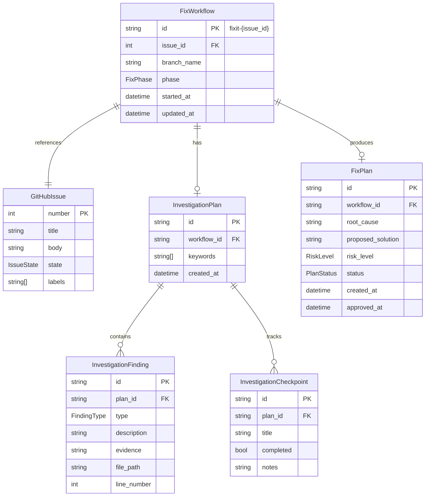
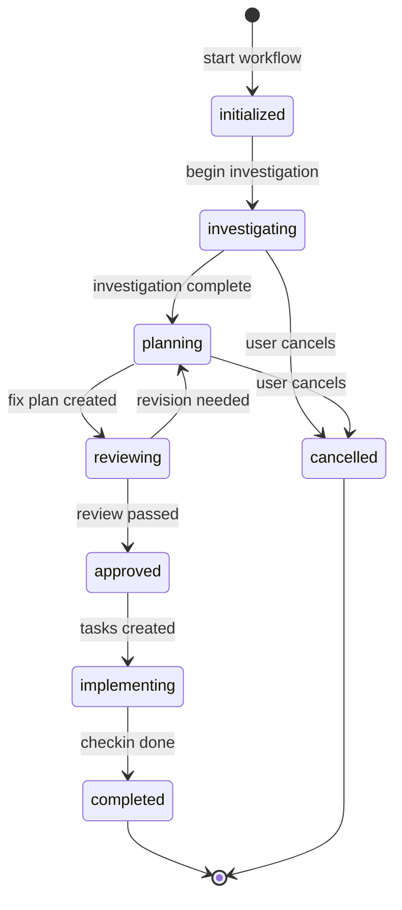
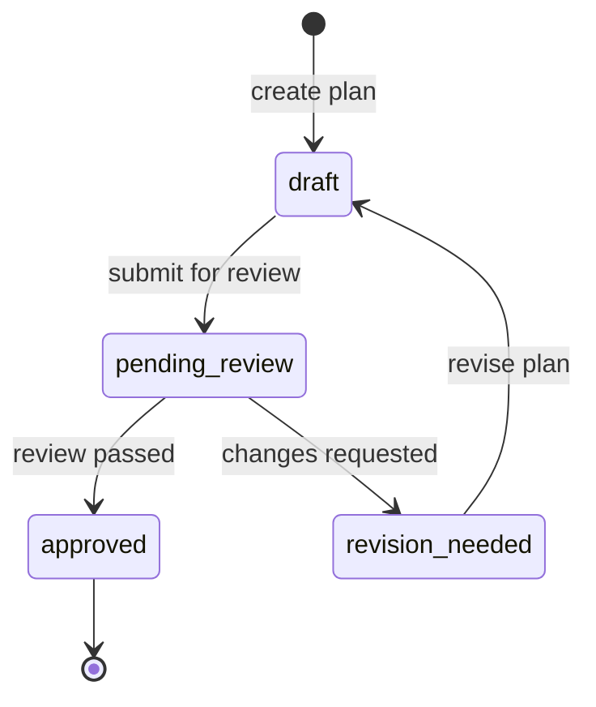

# Data Model: Bug-Fix Workflow Command

**Date**: 2026-01-16
**Feature**: 034-fixit-workflow

## Entity Relationship Diagram

<!-- BEGIN:AUTO-GENERATED section="er-diagram" -->

<!-- END:AUTO-GENERATED -->

---

## Entities

### FixWorkflow

Represents an in-progress bug fix workflow with its current phase and state.

| Field | Type | Description | Constraints |
|-------|------|-------------|-------------|
| id | string | Unique identifier | Format: `fixit-{issue_id}` |
| issue_id | int | GitHub issue number | Required, FK to GitHubIssue |
| branch_name | string | Git branch for the fix | Format: `fix/{id}-{slug}` |
| phase | FixPhase | Current workflow phase | Enum value |
| started_at | datetime | When workflow started | Auto-set on creation |
| updated_at | datetime | Last state change | Auto-updated |

#### FixPhase State Machine



| Phase | Description | Next Phases |
|-------|-------------|-------------|
| `initialized` | Workflow created, branch ready | `investigating` |
| `investigating` | AI-assisted root cause analysis | `planning`, `cancelled` |
| `planning` | Fix plan being written | `reviewing`, `cancelled` |
| `reviewing` | Fix plan under review | `approved`, `planning` |
| `approved` | Fix plan approved | `implementing` |
| `implementing` | Tasks being executed | `completed` |
| `completed` | Fix merged, issue closed | (terminal) |
| `cancelled` | Workflow abandoned | (terminal) |

---

### GitHubIssue

Represents a GitHub issue fetched from the repository.

| Field | Type | Description | Constraints |
|-------|------|-------------|-------------|
| number | int | Issue number | Primary key |
| title | string | Issue title | Required |
| body | string | Issue description | Optional (can be empty) |
| state | IssueState | Open/closed status | Enum value |
| labels | string[] | Issue labels | Default: empty array |
| created_at | datetime | When issue was created | From GitHub |
| comments | Comment[] | Issue comments | Optional |

#### IssueState Enum

| Value | Description |
|-------|-------------|
| `open` | Issue is open |
| `closed` | Issue has been closed |

---

### InvestigationPlan

Documents the approach for investigating a bug.

| Field | Type | Description | Constraints |
|-------|------|-------------|-------------|
| id | string | Unique identifier | UUID |
| workflow_id | string | Parent workflow | FK to FixWorkflow |
| keywords | string[] | Search keywords from issue | Extracted from title/body |
| created_at | datetime | When plan was created | Auto-set |

---

### InvestigationFinding

A discovered fact during investigation.

| Field | Type | Description | Constraints |
|-------|------|-------------|-------------|
| id | string | Unique identifier | UUID |
| plan_id | string | Parent investigation plan | FK to InvestigationPlan |
| type | FindingType | Category of finding | Enum value |
| description | string | What was found | Required |
| evidence | string | Supporting evidence | Optional |
| file_path | string | Related source file | Optional |
| line_number | int | Line number in file | Optional |

#### FindingType Enum

| Value | Description |
|-------|-------------|
| `hypothesis` | Potential root cause theory |
| `confirmed_cause` | Verified root cause |
| `affected_file` | File that needs changes |
| `reproduction_step` | Step to reproduce the bug |
| `related_commit` | Commit that may have caused issue |

---

### InvestigationCheckpoint

Tracks progress through investigation steps.

| Field | Type | Description | Constraints |
|-------|------|-------------|-------------|
| id | string | Unique identifier | UUID |
| plan_id | string | Parent investigation plan | FK to InvestigationPlan |
| title | string | Checkpoint description | Required |
| completed | bool | Whether checkpoint is done | Default: false |
| notes | string | Additional notes | Optional |

---

### FixPlan

Documents the approved approach to fix the bug.

| Field | Type | Description | Constraints |
|-------|------|-------------|-------------|
| id | string | Unique identifier | UUID |
| workflow_id | string | Parent workflow | FK to FixWorkflow |
| root_cause | string | Confirmed root cause | Required |
| proposed_solution | string | How to fix it | Required |
| risk_level | RiskLevel | Fix complexity/risk | Enum value |
| status | PlanStatus | Review status | Enum value |
| affected_files | FileChange[] | Files to modify | Array |
| created_at | datetime | When plan was created | Auto-set |
| approved_at | datetime | When plan was approved | Set on approval |

#### RiskLevel Enum

| Value | Description |
|-------|-------------|
| `low` | Simple fix, minimal risk |
| `medium` | Moderate changes, some risk |
| `high` | Complex fix, significant risk |

#### PlanStatus State Machine



| Status | Description |
|--------|-------------|
| `draft` | Plan being written |
| `pending_review` | Awaiting review |
| `revision_needed` | Reviewer requested changes |
| `approved` | Plan approved for implementation |

---

### FileChange

Embedded entity describing a file modification.

| Field | Type | Description |
|-------|------|-------------|
| file_path | string | Path to file |
| change_type | ChangeType | Type of change |
| description | string | What will be changed |

#### ChangeType Enum

| Value | Description |
|-------|-------------|
| `modify` | Change existing code |
| `add` | Add new file |
| `delete` | Remove file |

---

## Validation Rules

| Entity | Rule | Error Message |
|--------|------|---------------|
| FixWorkflow | issue_id must be positive | "Invalid issue ID" |
| FixWorkflow | branch_name must start with `fix/` | "Branch name must follow fix/* pattern" |
| FixPlan | root_cause required when status is approved | "Root cause must be documented before approval" |
| FixPlan | at least one affected_file required | "Fix plan must identify affected files" |
| InvestigationFinding | type=confirmed_cause limited to 1 per plan | "Only one confirmed root cause allowed" |

---

## Storage Format

All entities are persisted as JSON in `.doit/state/fixit-{issue_id}.json`:

```json
{
  "workflow": {
    "id": "fixit-123",
    "issue_id": 123,
    "branch_name": "fix/123-button-click-error",
    "phase": "investigating",
    "started_at": "2026-01-16T10:00:00Z",
    "updated_at": "2026-01-16T10:30:00Z"
  },
  "issue": {
    "number": 123,
    "title": "Button click causes error",
    "body": "When clicking the submit button...",
    "state": "open",
    "labels": ["bug", "priority:high"]
  },
  "investigation_plan": {
    "id": "inv-abc123",
    "keywords": ["button", "click", "submit", "error"],
    "checkpoints": [...],
    "findings": [...]
  },
  "fix_plan": null
}
```
