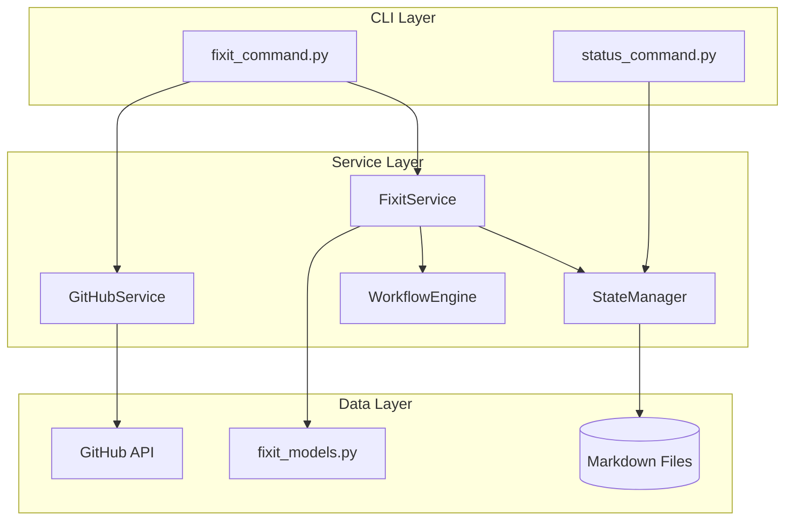

# Implementation Plan: Bug-Fix Workflow Command

**Branch**: `034-fixit-workflow` | **Date**: 2026-01-16 | **Spec**: [spec.md](spec.md)
**Input**: Feature specification from `/specs/034-fixit-workflow/spec.md`

## Summary

Implement the `doit.fixit` command - a structured bug-fix workflow that integrates with GitHub issues. The command accepts an issue ID or lists open bugs, creates fix branches, guides AI-assisted investigation, generates fix plans for review, and integrates with existing taskit/reviewit/checkin commands. State persistence enables workflow resumption.

## Technical Context

**Language/Version**: Python 3.11+ (per constitution)
**Primary Dependencies**: Typer (CLI), Rich (output formatting), httpx (GitHub API)
**Storage**: File-based markdown in `.doit/memory/` and feature directory
**Testing**: pytest (per constitution)
**Target Platform**: macOS, Linux, Windows (CLI tool)
**Project Type**: single - CLI extension to existing doit-cli package
**Performance Goals**: Command startup < 2s, GitHub API calls < 5s per request
**Constraints**: Works offline with graceful degradation, no external database
**Scale/Scope**: Single developer workflow, ~5 concurrent fix workflows per project

## Architecture Overview

<!-- BEGIN:AUTO-GENERATED section="architecture" -->

<!-- END:AUTO-GENERATED -->

## Constitution Check

*GATE: Must pass before Phase 0 research. Re-check after Phase 1 design.*

| Principle | Status | Notes |
|-----------|--------|-------|
| I. Specification-First | PASS | Feature has complete spec.md with user stories |
| II. Persistent Memory | PASS | Workflow state stored in `.doit/memory/` as markdown |
| III. Auto-Generated Diagrams | PASS | Fix plan will use Mermaid for visualization |
| IV. Opinionated Workflow | PASS | Integrates with existing reviewit/taskit/checkin |
| V. AI-Native Design | PASS | Designed as slash command with AI assistance |
| Tech Stack Alignment | PASS | Uses Python 3.11+, Typer, Rich, pytest |

**Gate Result**: PASS - All constitution checks satisfied

## Project Structure

### Documentation (this feature)

```text
specs/034-fixit-workflow/
├── spec.md              # Feature specification
├── plan.md              # This file
├── research.md          # Phase 0 output
├── data-model.md        # Phase 1 output
├── quickstart.md        # Phase 1 output
├── contracts/           # Phase 1 output
│   └── cli-interface.md # CLI command interface specification
└── tasks.md             # Phase 2 output (from /doit.taskit)
```

### Source Code (repository root)

```text
src/doit_cli/
├── cli/
│   └── fixit_command.py     # NEW: Fixit CLI command
├── models/
│   └── fixit_models.py      # NEW: FixWorkflow, InvestigationPlan, FixPlan models
├── services/
│   ├── fixit_service.py     # NEW: Fix workflow orchestration
│   ├── github_service.py    # NEW: GitHub issue operations
│   └── state_manager.py     # EXISTING: Workflow state persistence
├── prompts/
│   └── fixit_prompts.py     # NEW: Interactive prompts for fixit workflow
└── main.py                  # MODIFY: Register fixit command

tests/
├── unit/
│   ├── test_fixit_models.py
│   ├── test_fixit_service.py
│   └── test_github_service.py
└── integration/
    └── test_fixit_workflow.py
```

**Structure Decision**: Single project structure (Option 1) - extends existing doit_cli package following established patterns. New modules follow existing conventions (services for logic, models for data, cli for commands).

## Integration Points

| Existing Component | Integration | Notes |
|-------------------|-------------|-------|
| `WorkflowEngine` | Reuse for fix phases | Already supports state persistence |
| `StateManager` | Store fix workflow state | Extend for fix-specific data |
| `status_command.py` | Display fix progress | Add fix workflow to dashboard |
| `/doit.reviewit` | Review fix plans | Pass fix-plan.md as artifact |
| `/doit.taskit` | Generate fix tasks | Pass approved fix plan |
| `/doit.checkin` | Close GitHub issue | Hook into checkin completion |

## Complexity Tracking

> No constitution violations - no entries needed.

| Violation | Why Needed | Simpler Alternative Rejected Because |
|-----------|------------|-------------------------------------|
| (none) | - | - |
