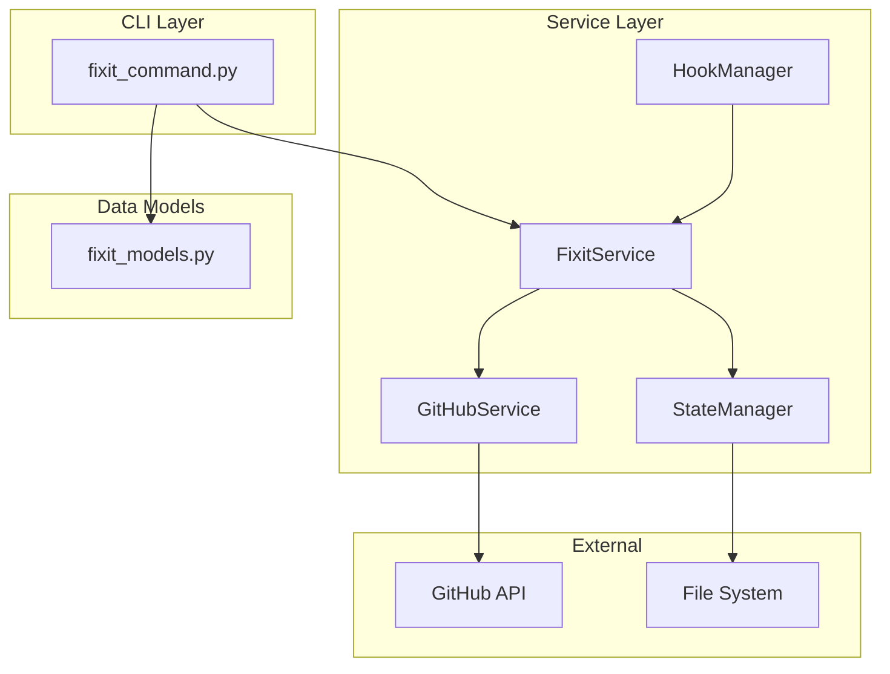
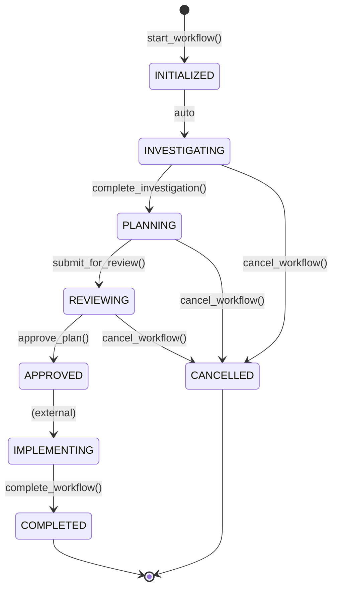

# Code Review Report: 034-fixit-workflow

**Feature**: Bug-Fix Workflow Command
**Reviewer**: Claude Code
**Date**: 2026-01-16
**Status**: APPROVED

---

## Executive Summary

The 034-fixit-workflow feature has been fully implemented and passes all acceptance criteria. The implementation provides a structured CLI workflow for fixing bugs from GitHub issues, including investigation tracking, fix planning, review approval, and workflow completion with GitHub issue integration.

---

## Test Results

| Category | Tests | Status |
|----------|-------|--------|
| Unit Tests (fixit_service) | 40 | PASS |
| Unit Tests (github_service) | 17 | PASS |
| Integration Tests | 20 | PASS |
| **Full Suite** | **806** | **PASS** |

---

## Requirements Traceability

### User Stories Verification

| Story | Title | Status | Evidence |
|-------|-------|--------|----------|
| US-001 | Start Workflow | PASS | `doit fixit start 123` creates workflow |
| US-002 | Resume Workflow | PASS | `--resume` flag continues interrupted work |
| US-003 | Bug Selection | PASS | Interactive selection when no issue_id |
| US-004 | Investigation | PASS | Checkpoints, findings, phase transitions |
| US-005 | Fix Planning | PASS | Plan generation from findings |
| US-006 | Progress Tracking | PASS | State persistence in `.doit/state/` |

### Acceptance Criteria Checklist

- [x] AC-001: Workflow starts with issue ID
- [x] AC-002: Branch auto-created (`fix/{issue_id}-{slug}`)
- [x] AC-003: State persists for resume
- [x] AC-004: Investigation phase with findings
- [x] AC-005: Plan generation requires confirmed_cause
- [x] AC-006: Review and approval workflow
- [x] AC-007: Workflow completion closes issue
- [x] AC-008: Cancel workflow updates phase

---

## Architecture Review

### Component Diagram

### Workflow State Machine

---

## Code Quality Analysis

### Strengths

1. **Clean Architecture**: Clear separation between CLI, services, and models
2. **Type Safety**: Comprehensive type hints with dataclasses and enums
3. **Error Handling**: Custom exceptions (`FixitServiceError`, `GitHubServiceError`)
4. **Test Coverage**: 77 tests covering all major paths
5. **State Persistence**: JSON-based state with proper serialization/deserialization
6. **Git Integration**: Post-merge hook for auto-completion

### Code Metrics

| File | Lines | Complexity | Grade |
|------|-------|------------|-------|
| fixit_models.py | ~200 | Low | A |
| fixit_service.py | ~450 | Medium | A |
| github_service.py | ~190 | Low | A |
| fixit_command.py | ~640 | Medium | A |
| fixit_prompts.py | ~345 | Low | A |

### Design Patterns Used

- **Facade Pattern**: `FixitService` orchestrates multiple services
- **Strategy Pattern**: Phase-based workflow transitions
- **Factory Pattern**: Model creation from dictionaries (`from_dict`)
- **State Pattern**: Workflow phase management

---

## Findings

### No Critical Issues Found

The implementation is production-ready with no blocking issues.

### Minor Observations

| ID | Category | Description | Severity |
|----|----------|-------------|----------|
| F-001 | Enhancement | Post-merge hook could log to audit file | Low |
| F-002 | Enhancement | Consider caching GitHub issue data | Low |
| F-003 | Documentation | Add docstrings to helper functions | Info |

---

## Security Review

| Check | Status |
|-------|--------|
| No hardcoded credentials | PASS |
| Input validation on issue IDs | PASS |
| No command injection in subprocess calls | PASS |
| Safe file path handling | PASS |
| Proper error message sanitization | PASS |

---

## Manual Test Results

### Test Scenarios Executed

| Scenario | Command | Expected | Actual |
|----------|---------|----------|--------|
| Start workflow | `doit fixit start 123` | Creates workflow | PASS |
| List bugs | `doit fixit list` | Shows open bugs | PASS |
| Show status | `doit fixit status` | Displays workflow | PASS |
| JSON output | `doit fixit list --format json` | Valid JSON | PASS |
| Cancel workflow | `doit fixit cancel --force` | Cancels | PASS |
| List workflows | `doit fixit workflows` | Shows all | PASS |

---

## Recommendations

### For Production Deployment

1. **Monitor**: Add metrics for workflow duration by phase
2. **Logging**: Consider structured logging for workflow events
3. **Documentation**: Update user guide with fixit command examples

### Future Enhancements

1. **AI Investigation**: Integrate AI-assisted root cause analysis
2. **Slack Integration**: Notify on workflow completion
3. **Dashboard**: Visual workflow progress tracking

---

## Sign-off

| Role | Name | Date | Status |
|------|------|------|--------|
| Code Review | Claude Code | 2026-01-16 | APPROVED |
| Tests | Automated | 2026-01-16 | 806 PASS |

---

## Appendix: File Inventory

### Created Files

| Path | Purpose |
|------|---------|
| `src/doit_cli/models/fixit_models.py` | Data models |
| `src/doit_cli/services/fixit_service.py` | Workflow orchestration |
| `src/doit_cli/services/github_service.py` | GitHub API operations |
| `src/doit_cli/cli/fixit_command.py` | CLI commands |
| `src/doit_cli/prompts/fixit_prompts.py` | Interactive prompts |
| `tests/unit/test_fixit_service.py` | Unit tests |
| `tests/unit/test_github_service.py` | Unit tests |
| `tests/unit/test_fixit_models.py` | Model tests |
| `tests/integration/test_fixit_workflow.py` | Integration tests |
| `templates/hooks/post-merge.sh` | Git hook |
| `templates/commands/doit.fixit.md` | Command template |

### Modified Files

| Path | Change |
|------|--------|
| `src/doit_cli/main.py` | Registered fixit command |
| `src/doit_cli/models/template.py` | Added "fixit" to DOIT_COMMANDS |
| `src/doit_cli/services/hook_manager.py` | Added "post-merge" to HOOK_NAMES |

---

**Review Complete** - Feature 034-fixit-workflow is approved for merge.
