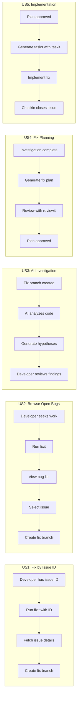
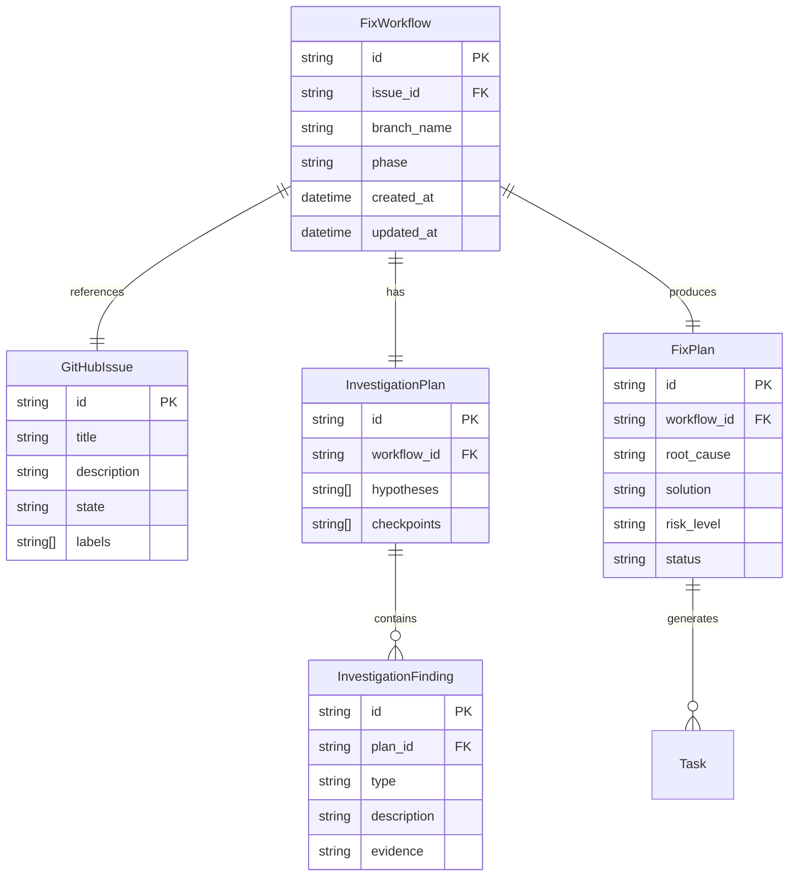

# Feature Specification: Bug-Fix Workflow Command

**Feature Branch**: `034-fixit-workflow`
**Created**: 2026-01-16
**Status**: Complete
**Input**: User description: "Bug-fix workflow command (doit.fixit) - takes in a GitHub issue ID for a bug or retrieves all open bugs, creates a fix branch, investigation plan, AI-assisted investigation, fix plan with review, then task creation"

## Summary

The `doit.fixit` command provides a structured workflow for fixing bugs reported as GitHub issues. It integrates with the existing doit command ecosystem by guiding developers through investigation, planning, and implementation phases while leveraging AI assistance for root cause analysis. The workflow reuses existing `reviewit` and `testit` commands for consistency.

## User Scenarios & Testing *(mandatory)*

### User Story 1 - Fix a Specific Bug by Issue ID (Priority: P1)

As a developer assigned to fix a specific bug, I want to start the fix workflow by providing the GitHub issue ID so that I can immediately begin investigating and resolving the reported problem.

**Why this priority**: This is the primary use case - developers typically know which issue they need to fix from their task board or assignment notification.

**Independent Test**: Can be fully tested by running `/doit.fixit #123` with a valid GitHub issue ID and verifying the workflow creates a fix branch, generates investigation plan, and guides through the fix process.

**Acceptance Scenarios**:

1. **Given** a valid GitHub issue ID for an open bug, **When** the user runs `/doit.fixit #123`, **Then** the system fetches issue details, creates a fix branch named `fix/123-brief-description`, and initiates the investigation phase.
2. **Given** a GitHub issue ID that doesn't exist, **When** the user runs `/doit.fixit #999`, **Then** the system displays an error message "Issue #999 not found" and suggests checking the issue number.
3. **Given** a GitHub issue that is already closed, **When** the user runs `/doit.fixit #50`, **Then** the system warns "Issue #50 is already closed" and asks for confirmation to proceed anyway.

---

### User Story 2 - Browse and Select from Open Bugs (Priority: P1)

As a developer looking to pick up a bug to fix, I want to see a list of all open bugs so that I can select one to work on based on priority and complexity.

**Why this priority**: Equally important as the direct ID approach - many developers browse available bugs rather than having a specific assignment.

**Independent Test**: Can be fully tested by running `/doit.fixit` without arguments and verifying it displays open bugs and allows selection.

**Acceptance Scenarios**:

1. **Given** the repository has open issues labeled as bugs, **When** the user runs `/doit.fixit` without arguments, **Then** the system displays a list of open bug issues with ID, title, labels, and creation date.
2. **Given** the displayed list of bugs, **When** the user selects issue #45 from the list, **Then** the system proceeds with that issue as if the user had run `/doit.fixit #45`.
3. **Given** no open bug issues exist in the repository, **When** the user runs `/doit.fixit`, **Then** the system displays "No open bugs found" and suggests checking issue labels or creating a new issue.

---

### User Story 3 - AI-Assisted Investigation (Priority: P2)

As a developer investigating a bug, I want AI assistance to analyze error patterns, related code, and suggest root cause hypotheses so that I can understand the problem faster.

**Why this priority**: Accelerates the investigation phase but the workflow can function without it (manual investigation is always possible).

**Independent Test**: Can be fully tested by triggering the investigation phase and verifying AI generates relevant hypotheses and suggests files to examine.

**Acceptance Scenarios**:

1. **Given** an issue with error messages or stack traces, **When** the investigation phase begins, **Then** the AI analyzes the error patterns and suggests potential root causes ranked by likelihood.
2. **Given** an issue describing unexpected behavior, **When** the AI investigates, **Then** it identifies related code files, recent commits affecting those files, and proposes investigation paths.
3. **Given** investigation results, **When** the user reviews AI suggestions, **Then** they can accept, modify, or reject each hypothesis and add their own findings.

---

### User Story 4 - Create Fix Plan (Priority: P2)

As a developer who has completed investigation, I want to create a structured fix plan that documents the root cause and proposed solution so that the approach can be reviewed before implementation.

**Why this priority**: Ensures quality by requiring review before coding, reducing wasted effort on incorrect approaches.

**Independent Test**: Can be fully tested by completing investigation and generating a fix-plan.md document that captures findings and proposed changes.

**Acceptance Scenarios**:

1. **Given** completed investigation with identified root cause, **When** the user confirms investigation is complete, **Then** the system generates a fix-plan.md with sections for root cause, proposed fix, affected files, and risk assessment.
2. **Given** a generated fix plan, **When** the user runs `/doit.reviewit`, **Then** the fix plan undergoes the standard review process with approval required before task creation.
3. **Given** an approved fix plan, **When** the user runs `/doit.taskit`, **Then** tasks are generated specifically for implementing the fix, referencing the fix plan requirements.

---

### User Story 5 - Track Fix Progress (Priority: P3)

As a developer working through a fix, I want to see my progress through the workflow phases so that I know what steps remain and can resume if interrupted.

**Why this priority**: Improves user experience and supports workflow resumption but is not essential for core functionality.

**Independent Test**: Can be fully tested by starting a fix workflow, interrupting it, and verifying status display and resume capability.

**Acceptance Scenarios**:

1. **Given** an in-progress fix workflow, **When** the user runs `doit status`, **Then** the dashboard shows the fix with current phase (investigation, planning, implementation) and completion percentage.
2. **Given** an interrupted fix workflow, **When** the user returns and runs `/doit.fixit --resume`, **Then** the system resumes from the last saved state without losing progress.
3. **Given** a fix that references issue #123, **When** the fix is checked in, **Then** the GitHub issue is automatically closed with a reference to the fixing commit/PR.

---

### Edge Cases

- What happens when the GitHub API is unavailable?
  - System displays warning and allows manual issue entry (ID, title, description)
- What happens when a fix branch already exists for the selected issue?
  - System asks whether to continue with existing branch or create a new one with suffix
- What happens if investigation finds the bug is not reproducible?
  - Workflow allows marking issue as "cannot reproduce" with investigation findings attached
- What happens when multiple developers try to fix the same issue?
  - System warns if a fix branch already exists remotely for this issue
- What happens when the fix requires changes outside the expected scope?
  - Fix plan review process should catch scope creep; plan can be revised or new issues created

## User Journey Visualization

<!-- BEGIN:AUTO-GENERATED section="user-journey" -->

<!-- END:AUTO-GENERATED -->

## Entity Relationships

<!-- BEGIN:AUTO-GENERATED section="entity-relationships" -->

<!-- END:AUTO-GENERATED -->

## Requirements *(mandatory)*

### Functional Requirements

- **FR-001**: System MUST accept a GitHub issue ID as an argument to start the fix workflow for a specific bug
- **FR-002**: System MUST list all open issues labeled as "bug" when no issue ID is provided
- **FR-003**: System MUST create a fix branch following the naming convention `fix/{issue-id}-{brief-description}`
- **FR-004**: System MUST fetch and display issue details (title, description, labels, comments) when starting a fix
- **FR-005**: System MUST generate an investigation-plan.md documenting investigation approach and checkpoints
- **FR-006**: System MUST provide AI-assisted analysis of error patterns, related code, and potential root causes
- **FR-007**: System MUST allow users to record investigation findings (root cause, affected components, reproduction steps)
- **FR-008**: System MUST generate a fix-plan.md documenting the root cause and proposed solution after investigation
- **FR-009**: System MUST integrate with existing `/doit.reviewit` command for fix plan review
- **FR-010**: System MUST integrate with existing `/doit.taskit` command to generate implementation tasks from approved fix plan
- **FR-011**: System MUST persist workflow state to allow resumption if interrupted
- **FR-012**: System MUST close the GitHub issue automatically when the fix is checked in via `/doit.checkin`
- **FR-013**: System MUST warn if a fix branch already exists for the selected issue (local or remote)
- **FR-014**: System MUST display workflow progress and current phase in the status dashboard
- **FR-015**: System MUST handle GitHub API unavailability gracefully with manual fallback option

### Key Entities

- **FixWorkflow**: Represents an in-progress bug fix with its current phase, issue reference, and state data
- **InvestigationPlan**: Documents the approach for investigating a bug, including checkpoints and hypotheses
- **InvestigationFinding**: A discovered fact during investigation (root cause hypothesis, affected file, reproduction step)
- **FixPlan**: Documents the approved approach to fix the bug, including root cause, solution, and risk assessment

## Success Criteria *(mandatory)*

### Measurable Outcomes

- **SC-001**: Developers can start a bug fix workflow within 30 seconds of running the command
- **SC-002**: AI investigation suggestions are generated within 2 minutes of starting investigation phase
- **SC-003**: 80% of developers report that AI suggestions helped identify root cause faster than manual investigation alone
- **SC-004**: Fix plan generation completes within 1 minute after investigation is marked complete
- **SC-005**: Workflow state is preserved and can be resumed after interruption with no data loss
- **SC-006**: GitHub issues are automatically closed within 1 minute of successful checkin
- **SC-007**: Developers complete the full fix workflow (issue to checkin) in 40% less time compared to ad-hoc bug fixing

## Assumptions

- GitHub CLI (`gh`) is installed and authenticated for issue operations
- The repository uses GitHub Issues for bug tracking with a "bug" label
- Developers have permission to create branches and issues in the repository
- The existing doit commands (reviewit, taskit, checkin) are installed and functional
- Internet connectivity is available for GitHub API calls (with graceful degradation when unavailable)
