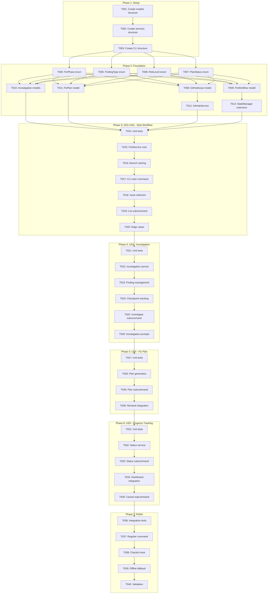
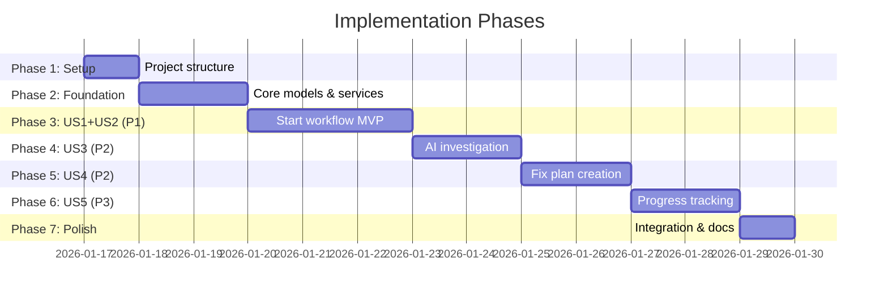

# Tasks: Bug-Fix Workflow Command (doit.fixit)

**Input**: Design documents from `/specs/034-fixit-workflow/`
**Prerequisites**: plan.md (required), spec.md (required for user stories), research.md, data-model.md, contracts/

**Tests**: Unit and integration tests are included per constitution (pytest).

**Organization**: Tasks are grouped by user story to enable independent implementation and testing of each story.

## Task Dependencies

<!-- BEGIN:AUTO-GENERATED section="task-dependencies" -->

<!-- END:AUTO-GENERATED -->

## Phase Timeline

<!-- BEGIN:AUTO-GENERATED section="phase-timeline" -->

<!-- END:AUTO-GENERATED -->

## Format: `[ID] [P?] [Story] Description`

- **[P]**: Can run in parallel (different files, no dependencies)
- **[Story]**: Which user story this task belongs to (e.g., US1, US2, US3)
- Include exact file paths in descriptions

## Path Conventions

- **Single project**: `src/doit_cli/`, `tests/` at repository root
- Paths follow existing doit-cli package structure

---

## Phase 1: Setup (Shared Infrastructure)

**Purpose**: Project initialization and file structure

- [x] T001 Create models file structure at src/doit_cli/models/fixit_models.py
- [x] T002 Create services file structure at src/doit_cli/services/github_service.py and src/doit_cli/services/fixit_service.py
- [x] T003 Create CLI file structure at src/doit_cli/cli/fixit_command.py and src/doit_cli/prompts/fixit_prompts.py

---

## Phase 2: Foundational (Blocking Prerequisites)

**Purpose**: Core models and services that MUST be complete before ANY user story can be implemented

**⚠️ CRITICAL**: No user story work can begin until this phase is complete

### Core Enums

- [x] T004 [P] Implement FixPhase enum (initialized, investigating, planning, reviewing, approved, implementing, completed, cancelled) in src/doit_cli/models/fixit_models.py
- [x] T005 [P] Implement FindingType enum (hypothesis, confirmed_cause, affected_file, reproduction_step, related_commit) in src/doit_cli/models/fixit_models.py
- [x] T006 [P] Implement RiskLevel enum (low, medium, high) and PlanStatus enum (draft, pending_review, revision_needed, approved) in src/doit_cli/models/fixit_models.py
- [x] T007 [P] Implement IssueState enum (open, closed) and ChangeType enum (modify, add, delete) in src/doit_cli/models/fixit_models.py

### Core Models

- [x] T008 Implement GitHubIssue dataclass (number, title, body, state, labels) in src/doit_cli/models/fixit_models.py
- [x] T009 Implement FixWorkflow dataclass (id, issue_id, branch_name, phase, started_at, updated_at) in src/doit_cli/models/fixit_models.py
- [x] T010 [P] Implement InvestigationPlan, InvestigationFinding, InvestigationCheckpoint dataclasses in src/doit_cli/models/fixit_models.py
- [x] T011 [P] Implement FixPlan and FileChange dataclasses in src/doit_cli/models/fixit_models.py

### Core Services

- [x] T012 Implement GitHubService class with get_issue(), list_bugs(), close_issue() methods in src/doit_cli/services/github_service.py
- [x] T013 Extend StateManager for fixit workflow state persistence (load/save fixit-{issue_id}.json) in src/doit_cli/services/state_manager.py

**Checkpoint**: Foundation ready - user story implementation can now begin

---

## Phase 3: User Story 1 & 2 - Start Fix Workflow (Priority: P1) 🎯 MVP

**Goal**: Start a bug fix workflow by issue ID or by browsing/selecting from open bugs

**Independent Test**: Run `doit fixit 123` or `doit fixit` and verify workflow creates fix branch and enters investigating phase

### Tests for US1 & US2

> **NOTE: Write these tests FIRST, ensure they FAIL before implementation**

- [x] T014 [P] [US1/US2] Unit tests for FixitService.start_workflow() and GitHubService in tests/unit/test_fixit_service.py and tests/unit/test_github_service.py

### Implementation for US1 & US2

- [x] T015 [US1/US2] Implement FixitService class with start_workflow() method in src/doit_cli/services/fixit_service.py
- [x] T016 [US1/US2] Implement _create_branch_name() helper (fix/{issue_id}-{slug}) in src/doit_cli/services/fixit_service.py
- [x] T017 [US1/US2] Implement main fixit CLI command with Typer (ISSUE_ID arg, --resume, --manual, --branch options) in src/doit_cli/cli/fixit_command.py
- [x] T018 [US1/US2] Implement interactive issue selection prompt using Rich in src/doit_cli/prompts/fixit_prompts.py
- [x] T019 [US1/US2] Implement `doit fixit list` subcommand with --label, --format, --limit options in src/doit_cli/cli/fixit_command.py
- [x] T020 [US1/US2] Handle edge cases: branch already exists, issue already closed, no open bugs in src/doit_cli/services/fixit_service.py

**Checkpoint**: Users can start a fix workflow for any bug. US1 & US2 fully functional.

---

## Phase 4: User Story 3 - AI-Assisted Investigation (Priority: P2)

**Goal**: AI assistance to analyze error patterns, related code, and suggest root cause hypotheses

**Independent Test**: Start workflow, run `doit fixit investigate`, verify investigation-plan.md is generated with checkpoints

### Tests for US3

- [x] T021 [P] [US3] Unit tests for investigation operations (add_finding, complete_checkpoint) in tests/unit/test_fixit_service.py

### Implementation for US3

- [x] T022 [US3] Implement FixitService.start_investigation() to create InvestigationPlan in src/doit_cli/services/fixit_service.py
- [x] T023 [US3] Implement FixitService.add_finding() to add InvestigationFinding in src/doit_cli/services/fixit_service.py
- [x] T024 [US3] Implement FixitService.complete_checkpoint() to mark checkpoints done in src/doit_cli/services/fixit_service.py
- [x] T025 [US3] Implement `doit fixit investigate` subcommand with --add-finding, --checkpoint, --done options in src/doit_cli/cli/fixit_command.py
- [x] T026 [US3] Generate investigation-plan.md template with AI prompts for root cause analysis in src/doit_cli/prompts/fixit_prompts.py

**Checkpoint**: Users can investigate bugs with AI-generated prompts and track findings. US3 fully functional.

---

## Phase 5: User Story 4 - Create Fix Plan (Priority: P2)

**Goal**: Create a structured fix plan documenting root cause and proposed solution for review

**Independent Test**: Complete investigation, run `doit fixit plan`, verify fix-plan.md is generated with findings

### Tests for US4

- [x] T027 [P] [US4] Unit tests for fix plan generation in tests/unit/test_fixit_service.py

### Implementation for US4

- [x] T028 [US4] Implement FixitService.generate_fix_plan() to create FixPlan from findings in src/doit_cli/services/fixit_service.py
- [x] T029 [US4] Implement `doit fixit plan` subcommand with --edit, --output options in src/doit_cli/cli/fixit_command.py
- [x] T030 [US4] Integrate fix-plan.md with /doit.reviewit command (set as review artifact) in src/doit_cli/services/fixit_service.py

**Checkpoint**: Users can generate fix plans and submit for review. US4 fully functional.

---

## Phase 6: User Story 5 - Track Fix Progress (Priority: P3)

**Goal**: Track workflow progress and enable resume after interruption

**Independent Test**: Start workflow, run `doit fixit status`, verify progress display shows current phase

### Tests for US5

- [x] T031 [P] [US5] Unit tests for status and cancel operations in tests/unit/test_fixit_service.py

### Implementation for US5

- [x] T032 [US5] Implement FixitService.get_workflow_status() to return workflow state in src/doit_cli/services/fixit_service.py
- [x] T033 [US5] Implement `doit fixit status` subcommand with progress visualization in src/doit_cli/cli/fixit_command.py
- [x] T034 [US5] Integrate fixit progress with main `doit status` dashboard in src/doit_cli/cli/status_command.py
- [x] T035 [US5] Implement `doit fixit cancel` subcommand with --delete-branch, --force options in src/doit_cli/cli/fixit_command.py

**Checkpoint**: Users can track progress and resume/cancel workflows. US5 fully functional.

---

## Phase 7: Polish & Cross-Cutting Concerns

**Purpose**: Integration, testing, and final touches

- [x] T036 [P] Integration tests for full workflow (start → investigate → plan → complete) in tests/integration/test_fixit_workflow.py
- [x] T037 Register fixit command in main.py with `app.add_typer(fixit_app, name="fixit")` in src/doit_cli/main.py
- [x] T038 Implement checkin hook to auto-close GitHub issues on fix branch merge in templates/hooks/post-merge.sh
- [x] T039 Add offline/manual mode fallback for GitHub API unavailability in src/doit_cli/services/github_service.py
- [x] T040 [P] Create doit.fixit command template in templates/commands/doit.fixit.md
- [x] T041 [P] Sync fixit command to Claude at .claude/commands/doit.fixit.md (run `doit sync-prompts`)
- [x] T042 [P] Sync fixit command to Copilot at .github/prompts/doit.fixit.prompt.md (run `doit sync-prompts`)
- [x] T043 Run quickstart.md validation and verify all acceptance criteria pass

---

## Dependencies & Execution Order

### Phase Dependencies

- **Setup (Phase 1)**: No dependencies - can start immediately
- **Foundational (Phase 2)**: Depends on Setup completion - BLOCKS all user stories
- **US1 & US2 (Phase 3)**: Depends on Foundational phase completion - MVP
- **US3 (Phase 4)**: Depends on Phase 3 completion (needs workflow started)
- **US4 (Phase 5)**: Depends on Phase 4 completion (needs investigation findings)
- **US5 (Phase 6)**: Can technically start after Phase 3, but placed after US4 for logical flow
- **Polish (Phase 7)**: Depends on all user stories being complete

### User Story Dependencies

- **US1 & US2 (P1)**: Can start after Foundational (Phase 2) - No dependencies on other stories - **MVP**
- **US3 (P2)**: Requires workflow started (depends on US1/US2)
- **US4 (P2)**: Requires investigation findings (depends on US3)
- **US5 (P3)**: Can start after US1/US2, integrates with all workflows

### Within Each User Story

- Tests MUST be written and FAIL before implementation
- Models before services
- Services before CLI commands
- Core implementation before edge cases
- Story complete before moving to next priority

### Parallel Opportunities

- All Setup tasks (T001-T003) run sequentially (directory dependencies)
- All enum tasks (T004-T007) marked [P] can run in parallel
- Model tasks (T008-T011) with [P] can run in parallel after enums
- Test tasks marked [P] can run in parallel within their phase
- Different phases cannot run in parallel (sequential dependency)

---

## Parallel Example: Phase 2 Foundation

```bash
# Launch all enum implementations together:
Task: T004 - Implement FixPhase enum
Task: T005 - Implement FindingType enum
Task: T006 - Implement RiskLevel/PlanStatus enums
Task: T007 - Implement IssueState/ChangeType enums

# After enums, launch independent model implementations:
Task: T010 - InvestigationPlan, InvestigationFinding, InvestigationCheckpoint
Task: T011 - FixPlan and FileChange
```

---

## Implementation Strategy

### MVP First (US1 & US2 Only)

1. Complete Phase 1: Setup
2. Complete Phase 2: Foundational (CRITICAL - blocks all stories)
3. Complete Phase 3: US1 & US2
4. **STOP and VALIDATE**: Test starting workflows independently
5. Deploy/demo if ready - users can start fix workflows!

### Incremental Delivery

1. Complete Setup + Foundational → Foundation ready
2. Add US1 & US2 → Test independently → Deploy/Demo (**MVP!**)
3. Add US3 → Test independently → Deploy/Demo (AI investigation)
4. Add US4 → Test independently → Deploy/Demo (Fix planning)
5. Add US5 → Test independently → Deploy/Demo (Progress tracking)
6. Each story adds value without breaking previous stories

### Sequential Execution (Recommended)

Given the dependencies between user stories in this feature:
1. Phase 1: Setup (3 tasks)
2. Phase 2: Foundation (10 tasks)
3. Phase 3: US1 & US2 MVP (7 tasks)
4. Phase 4: US3 Investigation (6 tasks)
5. Phase 5: US4 Fix Plan (4 tasks)
6. Phase 6: US5 Progress (5 tasks)
7. Phase 7: Polish (5 tasks)

**Total: 40 tasks**

---

## Summary

| Phase | User Story | Tasks | Parallel |
|-------|------------|-------|----------|
| 1 | Setup | 3 | No |
| 2 | Foundation | 10 | Yes (enums, some models) |
| 3 | US1 & US2 (P1) | 7 | Limited |
| 4 | US3 (P2) | 6 | Limited |
| 5 | US4 (P2) | 4 | Limited |
| 6 | US5 (P3) | 5 | Limited |
| 7 | Polish | 8 | Yes (tests, templates) |
| **Total** | | **43** | |

---

## Notes

- [P] tasks = different files, no dependencies
- [Story] label maps task to specific user story for traceability
- US1 & US2 combined as they share infrastructure (starting workflows)
- Verify tests fail before implementing
- Commit after each task or logical group
- Stop at any checkpoint to validate story independently
