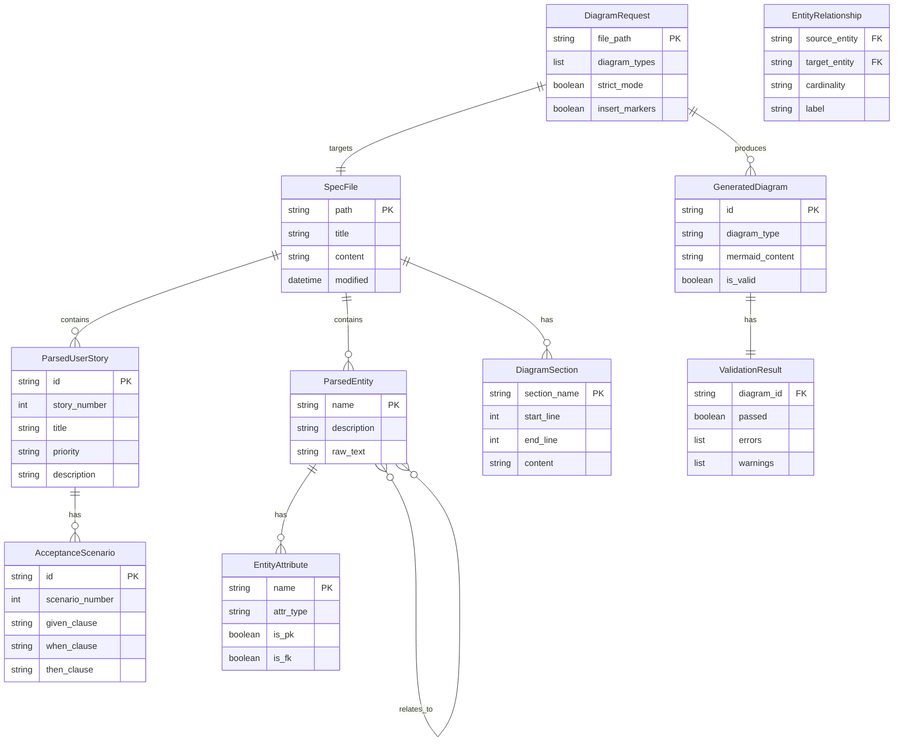
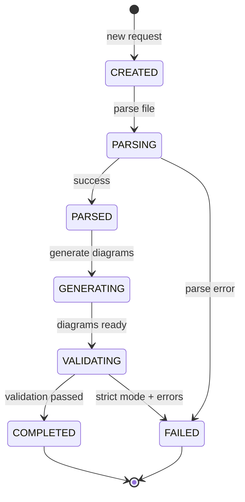
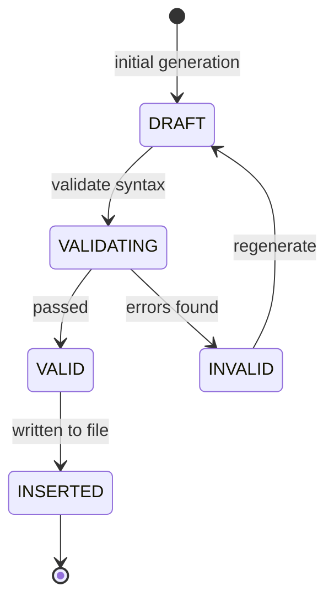

# Data Model: Auto-Mermaid Diagram Generation

**Feature**: 035-auto-mermaid-diagrams
**Date**: 2026-01-16

## Entity Relationship Diagram

<!-- BEGIN:AUTO-GENERATED section="er-diagram" -->

<!-- END:AUTO-GENERATED -->

## Entity Definitions

### DiagramRequest

Request to generate diagrams for a specification file.

| Field | Type | Description |
|-------|------|-------------|
| `file_path` | string | Path to the target spec/plan file |
| `diagram_types` | list[DiagramType] | Types to generate (USER_JOURNEY, ER_DIAGRAM, ARCHITECTURE) |
| `strict_mode` | bool | If true, fail on validation errors |
| `insert_markers` | bool | If true, insert markers when missing |

```python
class DiagramType(str, Enum):
    USER_JOURNEY = "user_journey"
    ER_DIAGRAM = "er_diagram"
    ARCHITECTURE = "architecture"
```

### SpecFile

Represents a parsed specification or plan file.

| Field | Type | Description |
|-------|------|-------------|
| `path` | Path | Absolute path to the file |
| `title` | str | Feature title from header |
| `content` | str | Raw file content |
| `modified` | datetime | Last modification timestamp |

### ParsedUserStory

Structured representation of a user story extracted from spec.

| Field | Type | Description |
|-------|------|-------------|
| `id` | str | Unique ID (e.g., "US1") |
| `story_number` | int | Story number (1, 2, 3...) |
| `title` | str | Brief title from header |
| `priority` | str | Priority level (P1, P2, P3) |
| `description` | str | User story description |
| `scenarios` | list[AcceptanceScenario] | Acceptance scenarios |

### AcceptanceScenario

Represents a Given/When/Then acceptance scenario.

| Field | Type | Description |
|-------|------|-------------|
| `id` | str | Unique ID (e.g., "US1_S1") |
| `scenario_number` | int | Scenario number within story |
| `given_clause` | str | Initial state condition |
| `when_clause` | str | Action or trigger |
| `then_clause` | str | Expected outcome |

### ParsedEntity

Structured representation of an entity from Key Entities section.

| Field | Type | Description |
|-------|------|-------------|
| `name` | str | Entity name (e.g., "User") |
| `description` | str | What the entity represents |
| `raw_text` | str | Original markdown text |
| `attributes` | list[EntityAttribute] | Parsed attributes |
| `relationships` | list[EntityRelationship] | Relationships to other entities |

### EntityAttribute

Attribute within an entity definition.

| Field | Type | Description |
|-------|------|-------------|
| `name` | str | Attribute name |
| `attr_type` | str | Data type (string, int, uuid, etc.) |
| `is_pk` | bool | Primary key flag |
| `is_fk` | bool | Foreign key flag |

### EntityRelationship

Relationship between two entities.

| Field | Type | Description |
|-------|------|-------------|
| `source_entity` | str | Source entity name |
| `target_entity` | str | Target entity name |
| `cardinality` | Cardinality | Relationship cardinality |
| `label` | str | Relationship label |

```python
class Cardinality(str, Enum):
    ONE_TO_ONE = "||--||"
    ONE_TO_MANY = "||--o{"
    MANY_TO_ONE = "}o--||"
    MANY_TO_MANY = "}o--o{"
```

### DiagramSection

Represents an AUTO-GENERATED section in a file.

| Field | Type | Description |
|-------|------|-------------|
| `section_name` | str | Section identifier (e.g., "user-journey") |
| `start_line` | int | Start line number (BEGIN marker) |
| `end_line` | int | End line number (END marker) |
| `content` | str | Content between markers |

### GeneratedDiagram

Result of diagram generation.

| Field | Type | Description |
|-------|------|-------------|
| `id` | str | Unique diagram ID |
| `diagram_type` | DiagramType | Type of diagram generated |
| `mermaid_content` | str | Generated Mermaid syntax |
| `is_valid` | bool | Whether syntax validation passed |
| `validation` | ValidationResult | Detailed validation result |

### ValidationResult

Result of Mermaid syntax validation.

| Field | Type | Description |
|-------|------|-------------|
| `diagram_id` | str | Associated diagram ID |
| `passed` | bool | Overall pass/fail |
| `errors` | list[str] | Syntax errors found |
| `warnings` | list[str] | Non-blocking warnings |

## State Transitions

### DiagramRequest Lifecycle



### Generated Diagram States



## Validation Rules

### User Story Parsing

| Rule | Description |
|------|-------------|
| V001 | Story header must match pattern `### User Story N - Title (Priority: PN)` |
| V002 | Story number must be sequential (1, 2, 3...) |
| V003 | Priority must be P1, P2, P3, or P4 |
| V004 | At least one acceptance scenario required |

### Entity Parsing

| Rule | Description |
|------|-------------|
| V010 | Entity name must be alphanumeric |
| V011 | Entity must have description |
| V012 | Attributes must have type and name |
| V013 | PK/FK constraints must be on valid attributes |

### Mermaid Syntax

| Rule | Description |
|------|-------------|
| V020 | Diagram type must be declared (flowchart, erDiagram) |
| V021 | All brackets/braces must be balanced |
| V022 | Node IDs must be alphanumeric |
| V023 | Arrow syntax must be valid |
| V024 | ER cardinality must use valid notation |
