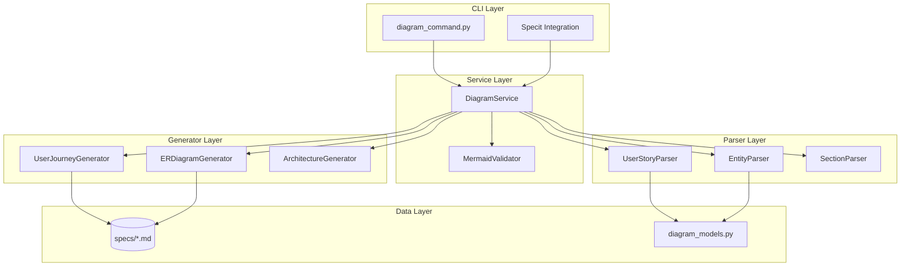

# Implementation Plan: Automatic Mermaid Diagram Generation

**Branch**: `035-auto-mermaid-diagrams` | **Date**: 2026-01-16 | **Spec**: [spec.md](spec.md)
**Input**: Feature specification from `/specs/035-auto-mermaid-diagrams/spec.md`

## Summary

Implement automatic generation of Mermaid diagrams from specification content to fulfill Constitution Principle III: "Diagrams MUST be generated automatically from specifications using Mermaid syntax." The feature includes parsing user stories into flowcharts, extracting Key Entities into ER diagrams, and integrating with the specit workflow for seamless diagram generation.

## Technical Context

**Language/Version**: Python 3.11+ (per constitution)
**Primary Dependencies**: Typer (CLI), Rich (output), regex (parsing)
**Storage**: File-based (markdown files in specs/)
**Testing**: pytest with fixtures for spec parsing
**Target Platform**: Local CLI (cross-platform: macOS, Linux, Windows)
**Project Type**: single
**Performance Goals**: <1 second generation for specs with up to 10 user stories
**Constraints**: No external dependencies for basic validation (mermaid-cli optional for strict mode)
**Scale/Scope**: Generate diagrams for all spec.md and plan.md files in a project

## Architecture Overview

<!-- BEGIN:AUTO-GENERATED section="architecture" -->

<!-- END:AUTO-GENERATED -->

## Constitution Check

*GATE: Must pass before Phase 0 research. Re-check after Phase 1 design.*

| Principle | Requirement | Status |
|-----------|-------------|--------|
| I. Specification-First | Spec must exist before implementation | ✅ PASS - spec.md complete |
| II. Persistent Memory | Store context in .doit/memory/ | ✅ N/A - No memory storage needed |
| III. Auto-Generated Diagrams | Generate diagrams from specs | ✅ PASS - This feature implements Principle III |
| IV. Opinionated Workflow | Follow specit → planit → taskit flow | ✅ PASS - Following workflow |
| V. AI-Native Design | Work with AI assistants via slash commands | ✅ PASS - Integrates with specit |

**Post-Design Check**: ✅ All principles satisfied. No deviations requiring justification.

## Project Structure

### Documentation (this feature)

```text
specs/035-auto-mermaid-diagrams/
├── spec.md              # Feature specification
├── plan.md              # This file
├── research.md          # Phase 0 research findings
├── data-model.md        # Data model with ER diagram
├── quickstart.md        # Usage guide
├── contracts/           # Interface contracts
│   └── cli-interface.md # CLI command specifications
└── tasks.md             # Implementation tasks (next step)
```

### Source Code (repository root)

```text
src/doit_cli/
├── models/
│   └── diagram_models.py       # DiagramRequest, ParsedUserStory, etc.
├── services/
│   ├── diagram_service.py      # Main orchestrator
│   ├── user_story_parser.py    # Parse user stories from spec
│   ├── entity_parser.py        # Parse Key Entities
│   ├── section_parser.py       # Parse AUTO-GENERATED sections
│   ├── user_journey_generator.py   # Generate flowcharts
│   ├── er_diagram_generator.py     # Generate ER diagrams
│   └── mermaid_validator.py    # Syntax validation
└── cli/
    └── diagram_command.py      # CLI subcommands

tests/
├── unit/
│   ├── test_diagram_models.py
│   ├── test_user_story_parser.py
│   ├── test_entity_parser.py
│   ├── test_user_journey_generator.py
│   ├── test_er_diagram_generator.py
│   └── test_mermaid_validator.py
└── integration/
    └── test_diagram_workflow.py
```

**Structure Decision**: Single project structure (Option 1) - CLI tool with no frontend/backend split.

## Implementation Approach

### Phase 1: Core Models & Parsers

1. **Models** (`diagram_models.py`):
   - `DiagramType` enum (USER_JOURNEY, ER_DIAGRAM, ARCHITECTURE)
   - `ParsedUserStory` dataclass with title, priority, scenarios
   - `AcceptanceScenario` dataclass with given/when/then
   - `ParsedEntity` dataclass with name, description, attributes, relationships
   - `Cardinality` enum (ONE_TO_ONE, ONE_TO_MANY, etc.)
   - `DiagramSection` dataclass for AUTO-GENERATED markers
   - `GeneratedDiagram` dataclass with content and validation status

2. **Parsers**:
   - `UserStoryParser`: Regex-based extraction of user stories
   - `EntityParser`: Parse Key Entities section with relationship inference
   - `SectionParser`: Find and extract AUTO-GENERATED sections

### Phase 2: Generators

1. **UserJourneyGenerator**:
   - Convert parsed stories to flowchart subgraphs
   - Generate unique node IDs (US1_A, US1_B, etc.)
   - Handle acceptance scenarios as flow steps

2. **ERDiagramGenerator**:
   - Convert parsed entities to ER diagram
   - Infer relationships from text patterns
   - Generate proper Mermaid cardinality syntax

### Phase 3: Validation & Service

1. **MermaidValidator**:
   - Regex-based basic validation (default)
   - Optional mermaid-cli integration (strict mode)
   - Return detailed error/warning messages

2. **DiagramService**:
   - Orchestrate parsing → generation → validation → insertion
   - Handle file I/O with safe writes
   - Support dry-run mode (no file modification)

### Phase 4: CLI Integration

1. **diagram_command.py**:
   - `doit diagram generate [FILE]` command
   - `doit diagram validate [FILE]` command
   - Options: `--strict`, `--type`, `--output`, `--no-insert`

2. **Specit Integration**:
   - Hook into specit workflow template
   - Auto-generate diagrams on spec creation

## Key Technical Decisions

### Parsing Strategy

**Decision**: Regex-based parsing without external markdown parser.

**Rationale**:
- Spec template has predictable structure
- Regex handles the specific patterns reliably
- Avoids adding markdown parsing dependency
- Faster execution for simple patterns

### Validation Approach

**Decision**: Two-tier validation (basic + strict).

**Rationale**:
- Basic regex validation catches 80%+ of common errors
- mermaid-cli for strict mode adds optional heavy dependency
- Users choose their validation level

### File Modification Safety

**Decision**: Atomic write with backup.

**Rationale**:
- Read file → modify in memory → write atomically
- Keep original if write fails
- Never corrupt user's spec file

## Dependencies

### Existing (Reuse)

- Typer (CLI framework)
- Rich (terminal output)
- pytest (testing)

### New (Minimal)

- None for basic functionality
- mermaid-cli (optional, for strict validation)

## Risk Assessment

| Risk | Probability | Impact | Mitigation |
|------|-------------|--------|------------|
| Regex fails on edge cases | Medium | Low | Graceful degradation, log warnings |
| Mermaid syntax evolves | Low | Medium | Use stable syntax subset |
| Large specs slow generation | Low | Low | Performance target: <1s for 10 stories |

## Complexity Tracking

> No Constitution violations requiring justification.

| Decision | Rationale |
|----------|-----------|
| Split into multiple parser/generator files | Separation of concerns, testability |
| Two-tier validation | Balance between speed and accuracy |
