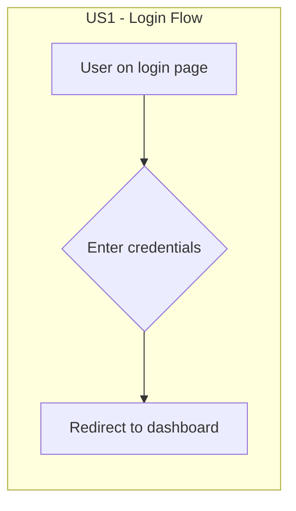
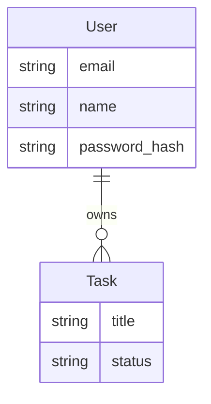

# Quickstart: Auto-Mermaid Diagram Generation

**Feature**: 035-auto-mermaid-diagrams
**Date**: 2026-01-16

## Overview

Generate Mermaid diagrams automatically from specification content, implementing Constitution Principle III.

## Quick Usage

### Generate diagrams for a spec file

```bash
doit diagram generate specs/XXX-feature/spec.md
```

### Generate diagrams for current branch spec

```bash
doit diagram generate
```

### Regenerate with strict validation

```bash
doit diagram generate --strict
```

## What Gets Generated

| Diagram Type | Source Section | Target Section |
|-------------|----------------|----------------|
| User Journey Flowchart | User Stories | `<!-- BEGIN:AUTO-GENERATED section="user-journey" -->` |
| Entity Relationship | Key Entities | `<!-- BEGIN:AUTO-GENERATED section="entity-relationships" -->` |
| Architecture | Technical Context | `<!-- BEGIN:AUTO-GENERATED section="architecture" -->` |

## Example Output

### User Journey (from User Stories)

Input spec.md:
```markdown
### User Story 1 - Login Flow (Priority: P1)
1. **Given** user on login page, **When** entering valid credentials, **Then** redirected to dashboard
```

Generated flowchart:


### ER Diagram (from Key Entities)

Input spec.md:
```markdown
### Key Entities
- **User**: Represents a user account with email, name, and password hash
- **Task**: Represents a task owned by a user with title and status
```

Generated ER diagram:


## Integration with Workflow

### Automatic Generation

Diagrams are automatically generated when:
- Running `/doit.specit` to create a new spec
- Running `/doit.planit` to create implementation plan

### Manual Regeneration

Regenerate diagrams after spec changes:
```bash
doit diagram generate specs/035-auto-mermaid-diagrams/spec.md
```

### Skip Generation

Skip diagram generation during specit:
```bash
# Pass --no-diagrams when invoking specit (future feature)
```

## Validation

### Default Validation

Basic regex-based validation catches:
- Missing diagram type declaration
- Unbalanced brackets/braces
- Invalid node IDs
- Malformed ER cardinality

### Strict Mode

Enable canonical Mermaid validation:
```bash
doit diagram generate --strict
```

Strict mode:
- Uses mermaid-cli for full syntax validation
- Exits with error on any syntax issue
- Recommended for CI/CD pipelines

## Troubleshooting

### "No user stories found"

Ensure user stories follow the template format:
```markdown
### User Story N - Title (Priority: PN)
```

### "Could not parse entity"

Ensure Key Entities use bullet format:
```markdown
### Key Entities
- **EntityName**: Description with attributes
```

### Diagrams not rendering in GitHub

- Check Mermaid syntax in [Mermaid Live Editor](https://mermaid.live)
- Ensure no special characters in node labels
- Keep diagrams under 20 nodes (GitHub rendering limit)

## Configuration

No configuration required. Uses constitution principles by default.

## Next Steps

1. Write your spec.md with user stories and key entities
2. Run `doit diagram generate` to generate diagrams
3. Commit the updated spec with auto-generated diagrams
