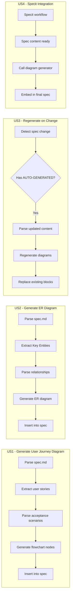
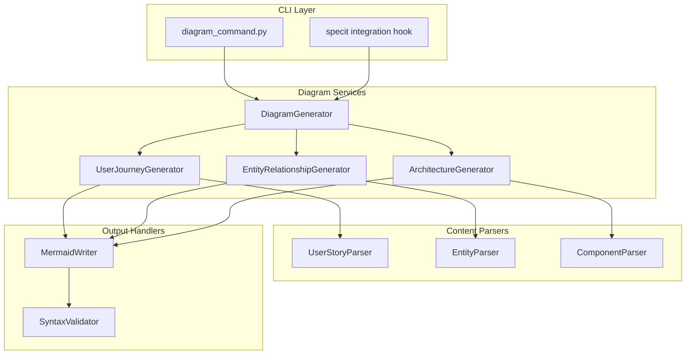
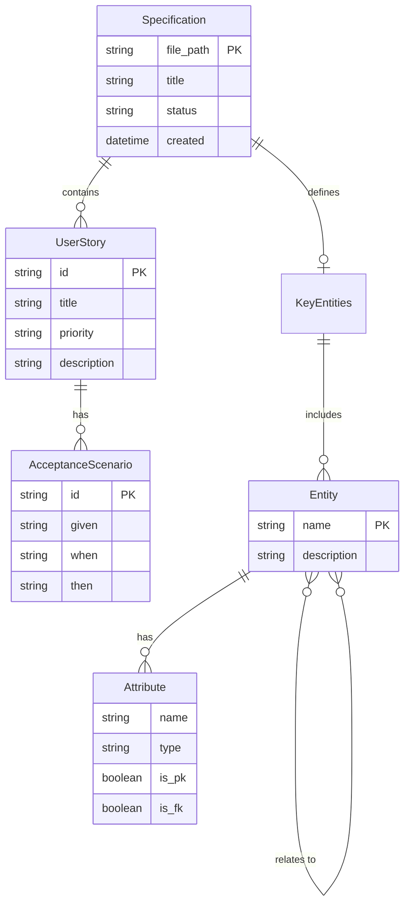

# Feature Specification: Automatic Mermaid Diagram Generation

**Feature Branch**: `035-auto-mermaid-diagrams`
**Created**: 2026-01-16
**Status**: Complete
**Input**: User description: "Automatic Mermaid diagram generation from specs"

## User Scenarios & Testing *(mandatory)*

### User Story 1 - Generate User Journey Diagram (Priority: P1)

As a developer writing a specification, I want Mermaid flowcharts automatically generated from my user stories, so I can visualize user journeys without manually creating diagrams.

**Why this priority**: Core functionality - user journey diagrams are required by the spec template and constitution principle III mandates auto-generation.

**Independent Test**: Can be fully tested by running `doit diagram generate spec.md` on a spec with user stories and verifying a valid Mermaid flowchart is inserted.

**Acceptance Scenarios**:

1. **Given** a spec.md with defined user stories, **When** I run `doit diagram generate`, **Then** the `<!-- BEGIN:AUTO-GENERATED section="user-journey" -->` section is populated with a valid Mermaid flowchart
2. **Given** a spec.md with multiple user stories, **When** I run `doit diagram generate`, **Then** each user story appears as a labeled subgraph in the flowchart
3. **Given** user stories with acceptance scenarios, **When** diagrams are generated, **Then** the flowchart includes decision points derived from Given/When/Then conditions
4. **Given** a spec.md with no user stories, **When** I run `doit diagram generate`, **Then** I receive a warning that no user stories were found to diagram

---

### User Story 2 - Generate Entity Relationship Diagram (Priority: P1)

As a developer designing data models, I want ER diagrams automatically generated from my Key Entities section, so I can visualize data relationships without manual diagramming.

**Why this priority**: Essential for data-driven features - ER diagrams help teams understand data models before implementation.

**Independent Test**: Can be fully tested by running `doit diagram generate spec.md` on a spec with Key Entities and verifying a valid Mermaid ER diagram is inserted.

**Acceptance Scenarios**:

1. **Given** a spec.md with Key Entities defined, **When** I run `doit diagram generate`, **Then** the `<!-- BEGIN:AUTO-GENERATED section="entity-relationships" -->` section contains a valid Mermaid ER diagram
2. **Given** entities with attributes described, **When** diagrams are generated, **Then** each entity shows its key attributes in the ER diagram
3. **Given** entities with relationships described (e.g., "User has many Tasks"), **When** diagrams are generated, **Then** relationships are shown with correct cardinality (1:1, 1:N, N:M)
4. **Given** a spec.md without Key Entities section, **When** I run `doit diagram generate`, **Then** the entity-relationships section is omitted entirely

---

### User Story 3 - Regenerate Diagrams on Spec Change (Priority: P2)

As a developer iterating on specifications, I want diagrams to automatically regenerate when I modify user stories or entities, so diagrams always reflect current spec content.

**Why this priority**: Maintains diagram accuracy - constitution principle III prohibits manual diagram maintenance, so auto-regeneration is essential.

**Independent Test**: Can be fully tested by modifying a spec's user stories, running regeneration, and verifying diagrams update accordingly.

**Acceptance Scenarios**:

1. **Given** a spec.md with existing auto-generated diagrams, **When** I modify a user story and run `doit diagram generate`, **Then** the flowchart updates to reflect changes
2. **Given** a spec.md with existing diagrams, **When** I add a new entity, **Then** the ER diagram includes the new entity after regeneration
3. **Given** a spec.md with diagrams, **When** I remove a user story, **Then** the corresponding subgraph is removed from the flowchart
4. **Given** existing diagrams, **When** regeneration runs, **Then** any manual edits within AUTO-GENERATED blocks are replaced (as per constitution)

---

### User Story 4 - Generate Diagrams During Specit Workflow (Priority: P2)

As a developer using the specit workflow, I want diagrams automatically generated when I create or update specs via `/doit.specit`, so diagram creation is seamlessly integrated.

**Why this priority**: Improves workflow - eliminates manual diagram generation step in spec-first development.

**Independent Test**: Can be fully tested by running `/doit.specit` to create a spec and verifying diagrams are auto-generated.

**Acceptance Scenarios**:

1. **Given** I am running `/doit.specit` to create a new spec, **When** the spec content is finalized, **Then** Mermaid diagrams are automatically generated before saving
2. **Given** I am updating an existing spec via specit, **When** user stories or entities change, **Then** diagrams are regenerated automatically
3. **Given** diagram generation fails (e.g., invalid entity syntax), **When** specit runs, **Then** a warning is displayed but spec creation continues
4. **Given** the `--no-diagrams` flag is passed, **When** specit runs, **Then** diagram generation is skipped

---

### User Story 5 - Validate Diagram Syntax (Priority: P3)

As a developer, I want generated Mermaid diagrams validated for syntax correctness, so I know diagrams will render properly in GitHub and VS Code.

**Why this priority**: Quality assurance - ensures generated diagrams are valid and renderable.

**Independent Test**: Can be fully tested by generating diagrams with known edge cases and verifying syntax validation catches errors.

**Acceptance Scenarios**:

1. **Given** diagrams are generated, **When** generation completes, **Then** diagrams are validated against Mermaid syntax rules
2. **Given** generated diagram syntax is invalid, **When** validation runs, **Then** specific syntax errors are reported with line numbers
3. **Given** valid diagrams, **When** validation runs, **Then** a success indicator confirms diagrams are renderable
4. **Given** the `--strict` flag, **When** validation fails, **Then** the command exits with non-zero status

---

### User Story 6 - Generate Architecture Diagram from Plan (Priority: P3)

As a developer working on implementation planning, I want architecture diagrams automatically generated from plan.md component descriptions, so I can visualize system architecture.

**Why this priority**: Extends value to planning phase - architecture visualization aids technical design reviews.

**Independent Test**: Can be fully tested by running `doit diagram generate plan.md` on a plan with component descriptions.

**Acceptance Scenarios**:

1. **Given** a plan.md with System Components section, **When** I run `doit diagram generate plan.md`, **Then** a component diagram is generated
2. **Given** components with dependency relationships, **When** diagrams are generated, **Then** dependencies are shown as directed edges
3. **Given** layers described (CLI, Service, Data), **When** diagrams are generated, **Then** components are grouped into layer subgraphs
4. **Given** a plan.md without structured components, **When** diagram generation runs, **Then** a warning indicates no components found

---

### Edge Cases

- What happens when user story text cannot be parsed into a flowchart structure?
  - Generate a simplified flowchart with story title only, log parsing warning
- How does system handle very long entity names or descriptions?
  - Truncate displayed text to 30 characters with ellipsis, full text in tooltip comment
- What happens when the AUTO-GENERATED markers are missing from spec.md?
  - Insert markers at appropriate locations, then populate with diagrams
- How does system handle circular entity relationships?
  - Support circular relationships in ER diagram, display warning about potential design issue
- What if there are syntax errors in the entity description that prevent parsing?
  - Skip the malformed entity, log error, continue with remaining entities
- What happens when running on a spec with mixed valid and invalid user stories?
  - Generate diagrams for valid stories, log warnings for stories that couldn't be parsed

## User Journey Visualization

<!-- BEGIN:AUTO-GENERATED section="user-journey" -->

<!-- END:AUTO-GENERATED -->

## System Architecture

## Entity Relationships

<!-- BEGIN:AUTO-GENERATED section="entity-relationships" -->

<!-- END:AUTO-GENERATED -->

## Requirements *(mandatory)*

### Functional Requirements

#### Core Generation

- **FR-001**: System MUST parse user stories from spec.md and generate Mermaid flowcharts
- **FR-002**: System MUST parse Key Entities section and generate Mermaid ER diagrams
- **FR-003**: System MUST insert generated diagrams within `<!-- BEGIN:AUTO-GENERATED -->` markers
- **FR-004**: System MUST replace existing content within AUTO-GENERATED blocks on regeneration
- **FR-005**: System MUST preserve all content outside AUTO-GENERATED blocks

#### User Journey Generation

- **FR-006**: System MUST create a subgraph for each user story with its title as label
- **FR-007**: System MUST derive flowchart nodes from acceptance scenario steps (Given/When/Then)
- **FR-008**: System MUST connect nodes with appropriate flow arrows
- **FR-009**: System MUST use decision diamonds for branching scenarios (When conditions with multiple outcomes)
- **FR-010**: System MUST assign unique node IDs to prevent collisions (e.g., US1_A, US2_B)

#### ER Diagram Generation

- **FR-011**: System MUST create an entity box for each Key Entity
- **FR-012**: System MUST extract attributes from entity descriptions and display in entity box
- **FR-013**: System MUST infer relationships from descriptive text (e.g., "User has many Tasks" -> 1:N)
- **FR-014**: System MUST support relationship cardinalities: 1:1 (||--||), 1:N (||--o{), N:M (}o--o{)
- **FR-015**: System MUST mark primary key (PK) and foreign key (FK) attributes when identifiable

#### Integration

- **FR-016**: System MUST provide a `doit diagram generate <file>` CLI command
- **FR-017**: System MUST integrate with specit workflow to auto-generate diagrams on spec creation
- **FR-018**: System MUST support `--no-diagrams` flag to skip generation
- **FR-019**: System MUST support generating diagrams for plan.md architecture sections

#### Validation

- **FR-020**: System MUST validate generated Mermaid syntax before insertion
- **FR-021**: System MUST report syntax errors with descriptive messages
- **FR-022**: System MUST support `--strict` flag to fail on validation errors
- **FR-023**: System MUST log warnings for content that cannot be parsed into diagrams

#### Error Handling

- **FR-024**: System MUST gracefully handle missing AUTO-GENERATED markers by inserting them
- **FR-025**: System MUST continue processing when individual user stories fail to parse
- **FR-026**: System MUST preserve original spec content if generation fails completely

### Key Entities

- **DiagramRequest**: Request to generate diagrams for a file including file path, diagram types to generate, and options (strict mode, etc.)
- **ParsedUserStory**: Structured representation of a user story with title, priority, description, and acceptance scenarios
- **ParsedEntity**: Structured representation of an entity with name, description, attributes, and relationships
- **GeneratedDiagram**: Result of diagram generation including diagram type, Mermaid content, and validation status
- **DiagramSection**: Represents an AUTO-GENERATED section in a file including section name, start/end positions, and content

## Success Criteria *(mandatory)*

### Measurable Outcomes

- **SC-001**: Generated user journey flowcharts accurately reflect all user stories in the spec (100% coverage)
- **SC-002**: Generated ER diagrams include all Key Entities with correct relationships
- **SC-003**: All generated diagrams pass Mermaid syntax validation and render in GitHub/VS Code
- **SC-004**: Diagram generation completes in under 1 second for specs with up to 10 user stories
- **SC-005**: Regeneration preserves all content outside AUTO-GENERATED blocks with byte-for-byte accuracy
- **SC-006**: Constitution principle III compliance: no manual diagram maintenance required for derived diagrams
- **SC-007**: Integration with specit achieves seamless diagram creation without additional user commands
