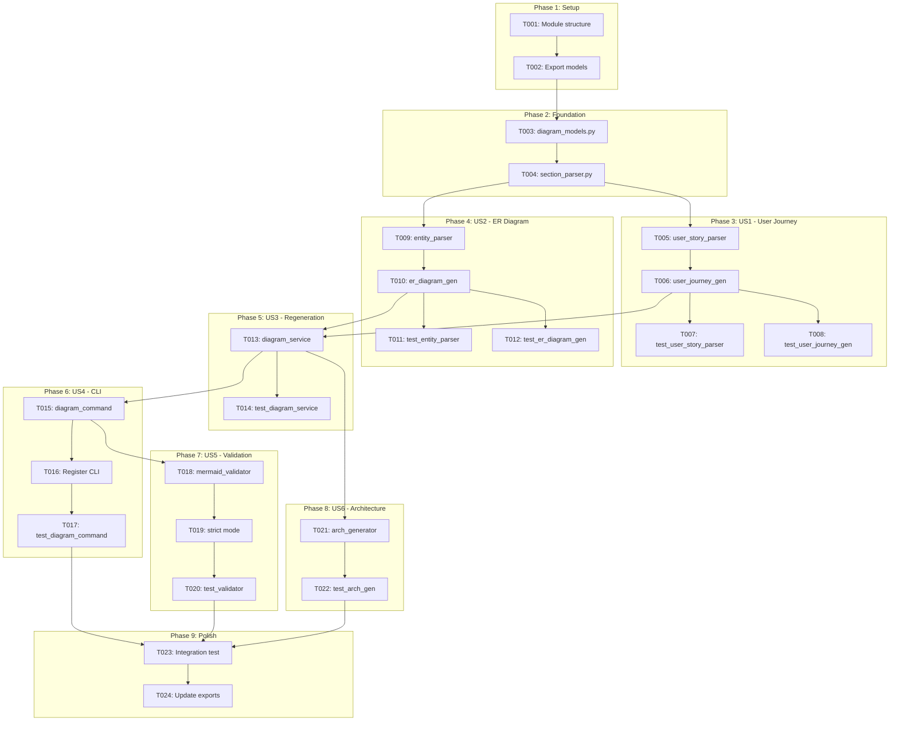
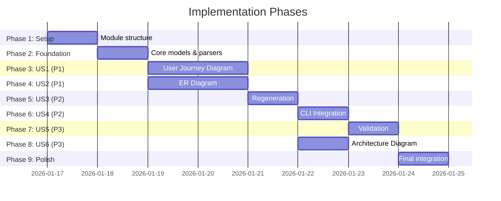

# Tasks: Automatic Mermaid Diagram Generation

**Input**: Design documents from `/specs/035-auto-mermaid-diagrams/`
**Prerequisites**: plan.md, spec.md, research.md, data-model.md, contracts/

**Tests**: Tests will be included following the existing project patterns with pytest.

**Organization**: Tasks are grouped by user story to enable independent implementation and testing.

## Task Dependencies

<!-- BEGIN:AUTO-GENERATED section="task-dependencies" -->

<!-- END:AUTO-GENERATED -->

## Phase Timeline

<!-- BEGIN:AUTO-GENERATED section="phase-timeline" -->

<!-- END:AUTO-GENERATED -->

## Format: `[ID] [P?] [Story?] Description`

- **[P]**: Can run in parallel (different files, no dependencies)
- **[Story]**: Which user story this task belongs to (e.g., US1, US2)
- Include exact file paths in descriptions

---

## Phase 1: Setup (Shared Infrastructure)

**Purpose**: Project initialization and module structure

- [x] T001 Create diagram module directory structure at src/doit_cli/services/ and src/doit_cli/models/
- [x] T002 Add diagram module exports to src/doit_cli/services/__init__.py and src/doit_cli/models/__init__.py

---

## Phase 2: Foundational (Blocking Prerequisites)

**Purpose**: Core infrastructure that MUST be complete before ANY user story

**⚠️ CRITICAL**: No user story work can begin until this phase is complete

- [x] T003 Create diagram_models.py with DiagramType enum, ParsedUserStory, AcceptanceScenario, ParsedEntity, EntityAttribute, EntityRelationship, Cardinality enum, DiagramSection, GeneratedDiagram, and ValidationResult dataclasses in src/doit_cli/models/diagram_models.py
- [x] T004 Implement SectionParser class to find and extract AUTO-GENERATED sections with regex patterns for BEGIN/END markers in src/doit_cli/services/section_parser.py

**Checkpoint**: Foundation ready - user story implementation can now begin

---

## Phase 3: User Story 1 - Generate User Journey Diagram (Priority: P1) 🎯 MVP

**Goal**: Generate Mermaid flowcharts from user stories in spec.md

**Independent Test**: Run `doit diagram generate spec.md` on a spec with user stories and verify a valid flowchart is inserted in the user-journey section.

### Implementation for User Story 1

- [x] T005 [US1] Implement UserStoryParser class with regex patterns to extract user story headers (title, priority, number), descriptions, and acceptance scenarios (Given/When/Then) in src/doit_cli/services/user_story_parser.py
- [x] T006 [US1] Implement UserJourneyGenerator class to convert ParsedUserStory list into Mermaid flowchart with subgraphs per story, unique node IDs (US1_A, US1_B), and flow arrows in src/doit_cli/services/user_journey_generator.py
- [x] T007 [P] [US1] Create unit tests for UserStoryParser with fixtures for valid specs, empty specs, and malformed user stories in tests/unit/test_user_story_parser.py
- [x] T008 [P] [US1] Create unit tests for UserJourneyGenerator verifying flowchart syntax, subgraph structure, and node ID uniqueness in tests/unit/test_user_journey_generator.py

**Checkpoint**: User Story 1 complete - flowchart generation from user stories works independently

---

## Phase 4: User Story 2 - Generate Entity Relationship Diagram (Priority: P1)

**Goal**: Generate Mermaid ER diagrams from Key Entities section

**Independent Test**: Run `doit diagram generate spec.md` on a spec with Key Entities and verify a valid ER diagram is inserted.

### Implementation for User Story 2

- [x] T009 [US2] Implement EntityParser class with regex patterns to extract entity names, descriptions, attributes, and relationship keywords (has many, belongs to, has one) in src/doit_cli/services/entity_parser.py
- [x] T010 [US2] Implement ERDiagramGenerator class to convert ParsedEntity list into Mermaid erDiagram with entity boxes, attributes, PK/FK markers, and cardinality notation in src/doit_cli/services/er_diagram_generator.py
- [x] T011 [P] [US2] Create unit tests for EntityParser with fixtures for various entity formats, relationship patterns, and edge cases in tests/unit/test_entity_parser.py
- [x] T012 [P] [US2] Create unit tests for ERDiagramGenerator verifying ER diagram syntax, cardinality notation, and attribute formatting in tests/unit/test_er_diagram_generator.py

**Checkpoint**: User Story 2 complete - ER diagram generation from Key Entities works independently

---

## Phase 5: User Story 3 - Regenerate Diagrams on Spec Change (Priority: P2)

**Goal**: Orchestrate diagram generation with safe file modification and regeneration support

**Independent Test**: Modify a spec's user stories, run regeneration, and verify diagrams update while preserving content outside AUTO-GENERATED blocks.

### Implementation for User Story 3

- [x] T013 [US3] Implement DiagramService class to orchestrate parsing, generation, and file modification with atomic writes, backup on failure, and section replacement using SectionParser, UserJourneyGenerator, and ERDiagramGenerator in src/doit_cli/services/diagram_service.py
- [x] T014 [US3] Create unit tests for DiagramService verifying regeneration replaces existing content, preserves non-generated content, and handles missing markers gracefully in tests/unit/test_diagram_service.py

**Checkpoint**: User Story 3 complete - regeneration preserves content and updates diagrams correctly

---

## Phase 6: User Story 4 - CLI Integration (Priority: P2)

**Goal**: Provide `doit diagram generate` CLI command

**Independent Test**: Run `doit diagram generate specs/035-auto-mermaid-diagrams/spec.md` and verify diagrams are generated.

### Implementation for User Story 4

- [x] T015 [US4] Create diagram_command.py with Typer app, `generate` subcommand accepting FILE argument and --type, --no-insert, --output options in src/doit_cli/cli/diagram_command.py
- [x] T016 [US4] Register diagram subcommand in main CLI app by adding import and app.add_typer() call in src/doit_cli/main.py
- [x] T017 [US4] Create integration tests for CLI commands verifying file argument handling, option parsing, and output formatting in tests/integration/test_diagram_command.py

**Checkpoint**: User Story 4 complete - CLI provides working diagram generation command

---

## Phase 7: User Story 5 - Validate Diagram Syntax (Priority: P3)

**Goal**: Validate generated Mermaid syntax before insertion

**Independent Test**: Generate diagrams with edge cases and verify syntax validation catches common errors.

### Implementation for User Story 5

- [x] T018 [US5] Implement MermaidValidator class with regex-based validation for flowchart and erDiagram syntax including balanced brackets, valid node IDs, and cardinality notation in src/doit_cli/services/mermaid_validator.py
- [x] T019 [US5] Add --strict flag to diagram_command.py that fails on validation errors and integrate ValidationResult display in CLI output in src/doit_cli/cli/diagram_command.py
- [x] T020 [US5] Create unit tests for MermaidValidator with fixtures for valid diagrams, syntax errors, and edge cases in tests/unit/test_mermaid_validator.py

**Checkpoint**: User Story 5 complete - validation catches syntax errors before insertion

---

## Phase 8: User Story 6 - Generate Architecture Diagram from Plan (Priority: P3)

**Goal**: Generate architecture diagrams from plan.md component descriptions

**Independent Test**: Run `doit diagram generate plan.md` and verify architecture diagram is generated from System Components section.

### Implementation for User Story 6

- [x] T021 [US6] Implement ArchitectureGenerator class to parse plan.md Technical Context and Project Structure sections and generate flowchart with layer subgraphs in src/doit_cli/services/architecture_generator.py
- [x] T022 [US6] Create unit tests for ArchitectureGenerator verifying layer grouping, component extraction, and dependency arrows in tests/unit/test_architecture_generator.py

**Checkpoint**: User Story 6 complete - architecture diagrams generated from plan.md

---

## Phase 9: Polish & Cross-Cutting Concerns

**Purpose**: Final integration, documentation, and cleanup

- [x] T023 Create comprehensive integration test covering full workflow: parse spec → generate user journey → generate ER diagram → validate → insert in tests/integration/test_diagram_workflow.py
- [x] T024 Update module exports in src/doit_cli/services/__init__.py and src/doit_cli/models/__init__.py to include all new classes

---

## Dependencies & Execution Order

### Phase Dependencies

- **Setup (Phase 1)**: No dependencies - can start immediately
- **Foundational (Phase 2)**: Depends on Setup completion - BLOCKS all user stories
- **US1 (Phase 3)**: Depends on Foundational - User Journey generation
- **US2 (Phase 4)**: Depends on Foundational - ER Diagram generation (can run parallel with US1)
- **US3 (Phase 5)**: Depends on US1 + US2 - Orchestration service
- **US4 (Phase 6)**: Depends on US3 - CLI integration
- **US5 (Phase 7)**: Depends on US4 - Validation
- **US6 (Phase 8)**: Depends on US3 - Architecture diagrams (can run parallel with US4-5)
- **Polish (Phase 9)**: Depends on all user stories complete

### User Story Dependencies

| Story | Depends On | Can Parallel With |
|-------|------------|-------------------|
| US1 (P1) | Foundation | US2 |
| US2 (P1) | Foundation | US1 |
| US3 (P2) | US1, US2 | - |
| US4 (P2) | US3 | - |
| US5 (P3) | US4 | US6 |
| US6 (P3) | US3 | US5 |

### Parallel Opportunities

- T007, T008 can run in parallel (different test files)
- T011, T012 can run in parallel (different test files)
- US1 and US2 can run in parallel after Foundation
- US5 and US6 can run in parallel after US4/US3 respectively

---

## Parallel Example: User Story 1 + 2 (After Foundation)

```bash
# Launch US1 and US2 in parallel after Foundation:
Task: "Implement UserStoryParser in src/doit_cli/services/user_story_parser.py"
Task: "Implement EntityParser in src/doit_cli/services/entity_parser.py"

# Then generators in parallel:
Task: "Implement UserJourneyGenerator in src/doit_cli/services/user_journey_generator.py"
Task: "Implement ERDiagramGenerator in src/doit_cli/services/er_diagram_generator.py"

# Then all tests in parallel:
Task: "Create tests for UserStoryParser in tests/unit/test_user_story_parser.py"
Task: "Create tests for UserJourneyGenerator in tests/unit/test_user_journey_generator.py"
Task: "Create tests for EntityParser in tests/unit/test_entity_parser.py"
Task: "Create tests for ERDiagramGenerator in tests/unit/test_er_diagram_generator.py"
```

---

## Implementation Strategy

### MVP First (User Stories 1 + 2 Only)

1. Complete Phase 1: Setup
2. Complete Phase 2: Foundational (CRITICAL - blocks all stories)
3. Complete Phase 3: User Story 1 (User Journey)
4. Complete Phase 4: User Story 2 (ER Diagram)
5. **STOP and VALIDATE**: Test diagram generation independently
6. Deploy/demo if ready - basic diagram generation works!

### Incremental Delivery

1. Setup + Foundation → Core models and parsers ready
2. Add US1 + US2 → Test independently → MVP with both diagram types
3. Add US3 → Test independently → Regeneration works
4. Add US4 → Test independently → CLI available
5. Add US5 → Test independently → Validation active
6. Add US6 → Test independently → Plan.md support added
7. Polish → Full feature complete

---

## Task Summary

| Phase | Tasks | Effort |
|-------|-------|--------|
| Setup | 2 | ~0.5d |
| Foundation | 2 | ~1d |
| US1 (P1) | 4 | ~2d |
| US2 (P1) | 4 | ~2d |
| US3 (P2) | 2 | ~1d |
| US4 (P2) | 3 | ~1d |
| US5 (P3) | 3 | ~1d |
| US6 (P3) | 2 | ~1d |
| Polish | 2 | ~0.5d |
| **Total** | **24** | **~10d** |

---

## Notes

- [P] tasks = different files, no dependencies
- [Story] label maps task to specific user story for traceability
- Each user story is independently completable and testable
- Commit after each task or logical group
- MVP = US1 + US2 (both P1 priorities)
