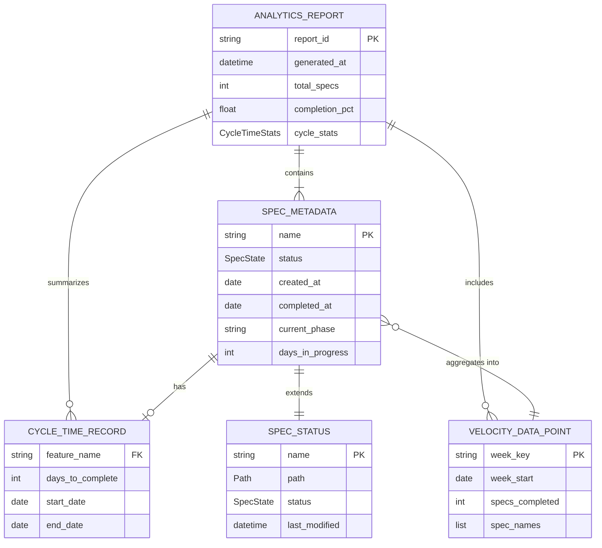
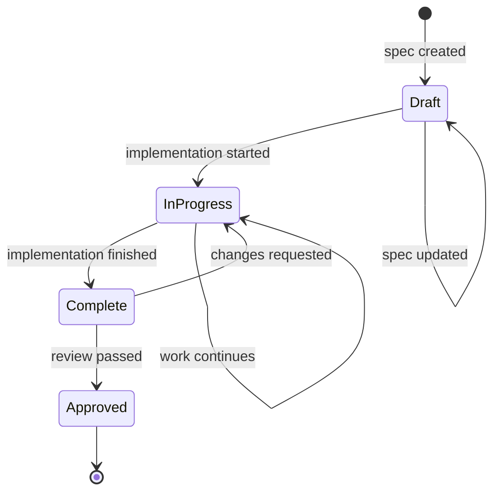

# Data Model: Spec Analytics and Metrics Dashboard

**Feature**: 036-spec-analytics-dashboard
**Date**: 2026-01-16

## Entity Relationship Diagram

<!-- BEGIN:AUTO-GENERATED section="er-diagram" -->

<!-- END:AUTO-GENERATED -->

---

## Entity Definitions

### SpecMetadata

Extended spec information including lifecycle dates. Builds on existing SpecStatus from status_models.py.

```python
@dataclass
class SpecMetadata:
    """Extended spec metadata with lifecycle dates.

    Attributes:
        name: Spec directory name (e.g., "036-spec-analytics-dashboard")
        status: Current spec state (Draft, In Progress, Complete, Approved)
        created_at: Date spec was created (from metadata or git)
        completed_at: Date spec reached Complete status (None if not complete)
        current_phase: Human-readable phase description
        days_in_progress: Days since creation (for in-progress specs)
    """

    name: str
    status: SpecState
    created_at: date | None
    completed_at: date | None
    current_phase: str = ""
    days_in_progress: int = 0

    @classmethod
    def from_spec_status(
        cls,
        spec_status: SpecStatus,
        created_at: date | None,
        completed_at: date | None,
    ) -> "SpecMetadata":
        """Create from existing SpecStatus with added dates."""
        days = 0
        if created_at and not completed_at:
            days = (date.today() - created_at).days

        phase = cls._determine_phase(spec_status.status)

        return cls(
            name=spec_status.name,
            status=spec_status.status,
            created_at=created_at,
            completed_at=completed_at,
            current_phase=phase,
            days_in_progress=days,
        )

    @staticmethod
    def _determine_phase(status: SpecState) -> str:
        """Map status to human-readable phase."""
        phases = {
            SpecState.DRAFT: "Specification",
            SpecState.IN_PROGRESS: "Implementation",
            SpecState.COMPLETE: "Review",
            SpecState.APPROVED: "Done",
            SpecState.ERROR: "Unknown",
        }
        return phases.get(status, "Unknown")
```

**Validation Rules**:

- `name` must be non-empty and match directory naming pattern
- `created_at` should be <= `completed_at` when both present
- `days_in_progress` calculated automatically, not stored

---

### CycleTimeRecord

Represents the lifecycle duration for a completed spec.

```python
@dataclass
class CycleTimeRecord:
    """Cycle time for a single completed spec.

    Attributes:
        feature_name: Spec name (foreign key to SpecMetadata)
        days_to_complete: Total days from creation to completion
        start_date: Creation date
        end_date: Completion date
    """

    feature_name: str
    days_to_complete: int
    start_date: date
    end_date: date

    @classmethod
    def from_metadata(cls, metadata: SpecMetadata) -> "CycleTimeRecord | None":
        """Create from SpecMetadata if spec is complete."""
        if not metadata.created_at or not metadata.completed_at:
            return None

        days = (metadata.completed_at - metadata.created_at).days
        return cls(
            feature_name=metadata.name,
            days_to_complete=max(days, 0),  # Handle negative edge case
            start_date=metadata.created_at,
            end_date=metadata.completed_at,
        )
```

**Validation Rules**:

- `days_to_complete` must be >= 0
- `start_date` must be <= `end_date`

---

### CycleTimeStats

Aggregated statistics for cycle times across all completed specs.

```python
@dataclass
class CycleTimeStats:
    """Statistical summary of cycle times.

    Attributes:
        average_days: Mean cycle time
        median_days: Median cycle time
        min_days: Shortest cycle time
        max_days: Longest cycle time
        std_dev_days: Standard deviation
        sample_count: Number of completed specs in calculation
    """

    average_days: float
    median_days: float
    min_days: int
    max_days: int
    std_dev_days: float
    sample_count: int

    @classmethod
    def calculate(cls, records: list[CycleTimeRecord]) -> "CycleTimeStats | None":
        """Calculate statistics from cycle time records."""
        if not records:
            return None

        days = [r.days_to_complete for r in records]

        return cls(
            average_days=round(mean(days), 1),
            median_days=round(median(days), 1),
            min_days=min(days),
            max_days=max(days),
            std_dev_days=round(stdev(days), 1) if len(days) > 1 else 0.0,
            sample_count=len(days),
        )
```

---

### VelocityDataPoint

Weekly aggregation of spec completions for trend analysis.

```python
@dataclass
class VelocityDataPoint:
    """Velocity data for a single week.

    Attributes:
        week_key: ISO week identifier (e.g., "2026-W03")
        week_start: Monday of the week
        specs_completed: Number of specs completed this week
        spec_names: Names of specs completed this week
    """

    week_key: str
    week_start: date
    specs_completed: int
    spec_names: list[str] = field(default_factory=list)

    @classmethod
    def from_completion(cls, completion_date: date, spec_name: str) -> "VelocityDataPoint":
        """Create a velocity point from a single completion."""
        year, week, _ = completion_date.isocalendar()
        week_key = f"{year}-W{week:02d}"

        # Calculate Monday of this ISO week
        monday = completion_date - timedelta(days=completion_date.weekday())

        return cls(
            week_key=week_key,
            week_start=monday,
            specs_completed=1,
            spec_names=[spec_name],
        )

    def merge(self, other: "VelocityDataPoint") -> "VelocityDataPoint":
        """Merge another data point for the same week."""
        if self.week_key != other.week_key:
            raise ValueError("Cannot merge different weeks")

        return VelocityDataPoint(
            week_key=self.week_key,
            week_start=self.week_start,
            specs_completed=self.specs_completed + other.specs_completed,
            spec_names=self.spec_names + other.spec_names,
        )
```

---

### AnalyticsReport

Complete analytics report containing all metrics and data.

```python
@dataclass
class AnalyticsReport:
    """Complete analytics report.

    Attributes:
        report_id: Unique identifier (timestamp-based)
        generated_at: Report generation timestamp
        project_root: Project directory path
        specs: All spec metadata
        total_specs: Total spec count
        completion_pct: Percentage of completed/approved specs
        by_status: Counts grouped by status
        cycle_stats: Cycle time statistics (None if no completions)
        velocity: Weekly velocity data points
    """

    report_id: str
    generated_at: datetime
    project_root: Path
    specs: list[SpecMetadata]
    total_specs: int
    completion_pct: float
    by_status: dict[SpecState, int]
    cycle_stats: CycleTimeStats | None
    velocity: list[VelocityDataPoint]

    @classmethod
    def generate(
        cls,
        specs: list[SpecMetadata],
        project_root: Path,
    ) -> "AnalyticsReport":
        """Generate a complete analytics report."""
        now = datetime.now()
        report_id = now.strftime("%Y%m%d-%H%M%S")

        # Calculate completion percentage
        completed = sum(
            1 for s in specs
            if s.status in (SpecState.COMPLETE, SpecState.APPROVED)
        )
        pct = (completed / len(specs) * 100) if specs else 0.0

        # Group by status
        by_status: dict[SpecState, int] = {}
        for spec in specs:
            by_status[spec.status] = by_status.get(spec.status, 0) + 1

        # Calculate cycle times
        records = [CycleTimeRecord.from_metadata(s) for s in specs]
        records = [r for r in records if r is not None]
        cycle_stats = CycleTimeStats.calculate(records)

        # Calculate velocity
        velocity = cls._calculate_velocity(specs)

        return cls(
            report_id=report_id,
            generated_at=now,
            project_root=project_root,
            specs=specs,
            total_specs=len(specs),
            completion_pct=round(pct, 1),
            by_status=by_status,
            cycle_stats=cycle_stats,
            velocity=velocity,
        )

    @staticmethod
    def _calculate_velocity(specs: list[SpecMetadata]) -> list[VelocityDataPoint]:
        """Aggregate completions by week."""
        weekly: dict[str, VelocityDataPoint] = {}

        for spec in specs:
            if spec.completed_at:
                point = VelocityDataPoint.from_completion(
                    spec.completed_at, spec.name
                )
                if point.week_key in weekly:
                    weekly[point.week_key] = weekly[point.week_key].merge(point)
                else:
                    weekly[point.week_key] = point

        return sorted(weekly.values(), key=lambda v: v.week_key)
```

---

## State Transitions

### SpecState Flow



---

## Relationships Summary

| From | To | Cardinality | Description |
|------|-----|-------------|-------------|
| SpecMetadata | CycleTimeRecord | 1:0..1 | Completed specs have one cycle record |
| SpecMetadata | VelocityDataPoint | N:1 | Multiple specs aggregate to one week |
| AnalyticsReport | SpecMetadata | 1:N | Report contains all specs |
| AnalyticsReport | CycleTimeStats | 1:0..1 | Report has optional cycle stats |
| AnalyticsReport | VelocityDataPoint | 1:N | Report contains velocity points |
