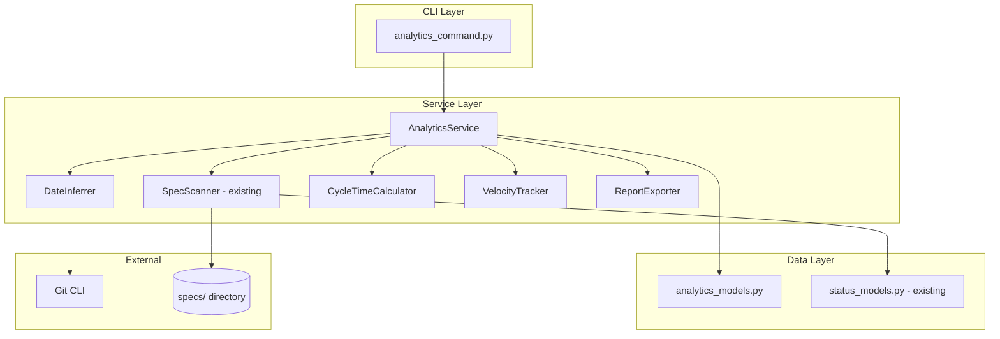

# Implementation Plan: Spec Analytics and Metrics Dashboard

**Branch**: `036-spec-analytics-dashboard` | **Date**: 2026-01-16 | **Spec**: [spec.md](spec.md)
**Input**: Feature specification from `/specs/036-spec-analytics-dashboard/spec.md`

## Summary

This feature extends the existing spec scanning infrastructure to provide analytics and metrics about specification lifecycle. Building on the SpecScanner and StatusReport services from feature 032, we'll add date extraction from git history, cycle time calculations, velocity trend analysis, and export functionality. The CLI will expose a new `doit analytics` subcommand with options for viewing completion metrics, cycle times, velocity trends, and individual spec details.

## Technical Context

**Language/Version**: Python 3.11+ (per constitution)
**Primary Dependencies**: Typer (CLI), Rich (output formatting), statistics (stdlib)
**Storage**: File-based (reads specs/ directory and git history, writes to .doit/reports/)
**Testing**: pytest (per constitution)
**Target Platform**: Cross-platform CLI (Linux, macOS, Windows)
**Project Type**: single (extends existing CLI structure)
**Performance Goals**: <2s for 100 specs, <5s for 200+ specs
**Constraints**: No external dependencies beyond constitution stack
**Scale/Scope**: Projects with 1-500 specs

## Architecture Overview

<!-- BEGIN:AUTO-GENERATED section="architecture" -->

<!-- END:AUTO-GENERATED -->

## Constitution Check

*GATE: Must pass before Phase 0 research. Re-check after Phase 1 design.*

| Principle | Status | Notes |
|-----------|--------|-------|
| I. Specification-First | ✅ PASS | Spec exists at specs/036-spec-analytics-dashboard/spec.md |
| II. Persistent Memory | ✅ PASS | Reports saved to .doit/reports/ (file-based) |
| III. Auto-Generated Diagrams | ✅ PASS | Velocity trends displayed as Rich tables (CLI-native) |
| IV. Opinionated Workflow | ✅ PASS | Follows specit → planit → taskit flow |
| V. AI-Native Design | ✅ PASS | CLI command with markdown-friendly output |
| Tech Stack Alignment | ✅ PASS | Uses Python 3.11+, Typer, Rich, pytest only |

## Project Structure

### Documentation (this feature)

```text
specs/036-spec-analytics-dashboard/
├── spec.md              # Feature specification
├── plan.md              # This file
├── research.md          # Phase 0 output
├── data-model.md        # Phase 1 output
├── quickstart.md        # Phase 1 output
├── contracts/           # Phase 1 output (CLI interface contracts)
│   └── analytics-cli.md # CLI command specifications
└── checklists/
    └── requirements.md  # Spec validation checklist
```

### Source Code (repository root)

```text
src/doit_cli/
├── cli/
│   └── analytics_command.py     # NEW: doit analytics subcommand
├── models/
│   ├── status_models.py         # EXISTING: SpecStatus, StatusReport
│   └── analytics_models.py      # NEW: CycleTimeRecord, VelocityDataPoint, AnalyticsReport
└── services/
    ├── spec_scanner.py          # EXISTING: SpecScanner (reuse)
    ├── analytics_service.py     # NEW: Main analytics orchestrator
    ├── date_inferrer.py         # NEW: Git-based date extraction
    ├── cycle_time_calculator.py # NEW: Statistical cycle time analysis
    ├── velocity_tracker.py      # NEW: Weekly velocity aggregation
    └── report_exporter.py       # NEW: Markdown/JSON export

tests/
├── unit/
│   ├── test_analytics_models.py
│   ├── test_date_inferrer.py
│   ├── test_cycle_time_calculator.py
│   ├── test_velocity_tracker.py
│   └── test_report_exporter.py
└── integration/
    └── test_analytics_command.py
```

**Structure Decision**: Single project layout extending existing src/doit_cli/ structure. New files follow existing patterns from status_command.py and diagram_service.py implementations.

## Design Decisions

### D1: Reuse Existing SpecScanner

The SpecScanner service already handles:
- Spec discovery in specs/ directory
- Status parsing from spec.md frontmatter
- File modification timestamps

We will extend, not replace, this service by:
1. Adding a DateInferrer service for git-based date extraction
2. Composing SpecScanner output with date information in AnalyticsService

### D2: Date Extraction Strategy

1. **Primary**: Read `**Created**:` and `**Status**: Complete` change dates from spec.md
2. **Fallback**: Use git log to find first commit and status change commits
3. **Last resort**: Use file modification time

### D3: Statistical Calculations

Use Python's stdlib `statistics` module for:
- mean() for average cycle time
- median() for median cycle time
- min/max for range

No external dependencies required.

### D4: Velocity Aggregation

Aggregate completions by ISO week (Monday-Sunday) using datetime.isocalendar().
Display as Rich table with sparkline-style indicators if Rich supports it.

### D5: Export Formats

- **Markdown**: Using string formatting, saved to .doit/reports/analytics-{date}.md
- **JSON**: Using stdlib json module, saved to .doit/reports/analytics-{date}.json

## Integration Points

### With Existing Features

| Feature | Integration |
|---------|-------------|
| 032-status-dashboard | Reuse SpecScanner, StatusReport, SpecState |
| 029-spec-validation | Optionally include validation data in analytics |
| 035-auto-mermaid-diagrams | None (CLI output only, no diagram generation) |

### CLI Structure

```text
doit analytics
├── show       # US1: Completion metrics (default)
├── cycles     # US2: Cycle time statistics
├── velocity   # US3: Weekly velocity trends
├── spec       # US4: Individual spec metrics
└── export     # US5: Export to file
```

## Complexity Tracking

> No Constitution violations requiring justification.

| Decision | Rationale |
|----------|-----------|
| Multiple service files | Separation of concerns, testability |
| Git fallback for dates | Robustness when spec metadata is incomplete |
