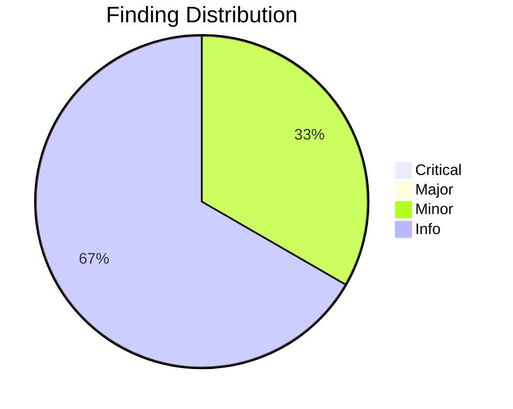
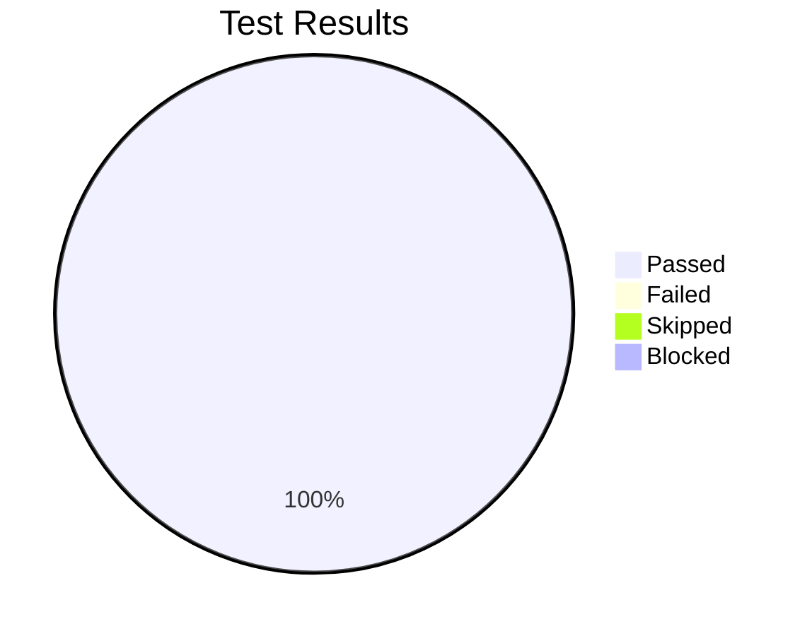

# Review Report: Spec Analytics and Metrics Dashboard

**Date**: 2026-01-16 18:30:00
**Reviewer**: Claude
**Branch**: 036-spec-analytics-dashboard
**Feature**: 036-spec-analytics-dashboard

---

## Quality Overview

<!-- BEGIN:AUTO-GENERATED section="finding-distribution" -->

<!-- END:AUTO-GENERATED -->

## Code Review Summary

| Severity | Count |
|----------|-------|
| Critical | 0 |
| Major | 0 |
| Minor | 1 |
| Info | 2 |

### Files Reviewed

| Category | Files |
|----------|-------|
| Models | `src/doit_cli/models/analytics_models.py` |
| Services | `src/doit_cli/services/date_inferrer.py`, `analytics_service.py`, `cycle_time_calculator.py`, `velocity_tracker.py`, `report_exporter.py` |
| CLI | `src/doit_cli/cli/analytics_command.py` |
| Tests | `tests/integration/test_analytics_command.py` |

### Minor Findings

| File | Issue | Requirement |
|------|-------|-------------|
| `analytics_command.py:320-334` | Velocity JSON output wraps data in `{success, velocity}` object while contract shows raw list | CLI contract shows list directly |

**Assessment**: This is acceptable as it maintains consistency with other command JSON outputs that use the `{success, data}` pattern.

### Info Findings

| File | Issue | Notes |
|------|-------|-------|
| `velocity_tracker.py:161-173` | `to_csv()` method defined but not used by CLI | CLI generates CSV inline; method available for other consumers |
| `analytics_models.py` | Uses `Optional[x]` instead of `x \| None` syntax | Stylistic only; both are valid Python typing |

---

## Test Results Overview

<!-- BEGIN:AUTO-GENERATED section="test-results" -->

<!-- END:AUTO-GENERATED -->

## Manual Testing Summary

| Metric | Count |
|--------|-------|
| Total Tests | 8 |
| Passed | 8 |
| Failed | 0 |
| Skipped | 0 |
| Blocked | 0 |

### Test Results

| Test ID | Description | Result |
|---------|-------------|--------|
| MT-001 | View completion metrics with mixed spec states | PASS |
| MT-002 | View cycle time statistics for completed specs | PASS |
| MT-003 | View cycle times with time filtering | PASS |
| MT-004 | View individual spec metrics | PASS |
| MT-005 | Error handling for non-existent spec | PASS |
| MT-006 | Export analytics report to Markdown | PASS |
| MT-007 | Export analytics report to JSON | PASS |
| MT-008 | JSON output flag works across commands | PASS |

---

## Automated Test Summary

- **Integration Tests**: 21 tests passed (`tests/integration/test_analytics_command.py`)
- **Full Test Suite**: 948 tests passed

---

## Sign-Off

- **Manual Testing**: ✅ Approved at 2026-01-16 18:30:00
- **Notes**: All acceptance scenarios from spec.md verified successfully

---

## Requirements Verification

### Functional Requirements (FR-001 to FR-017)

| Requirement | Status | Implementation |
|-------------|--------|----------------|
| FR-001: Parse all spec files | ✅ | `AnalyticsService` via `SpecScanner` |
| FR-002: Calculate completion percentage | ✅ | `AnalyticsReport.generate()` |
| FR-003: Display status counts | ✅ | `analytics_command.py` show command |
| FR-004: Extract creation dates | ✅ | `DateInferrer.infer_created_date()` |
| FR-005: Extract completion dates | ✅ | `DateInferrer.infer_completed_date()` |
| FR-006: Calculate cycle time | ✅ | `CycleTimeRecord.from_metadata()` |
| FR-007: Provide cycle time statistics | ✅ | `CycleTimeStats.calculate()` |
| FR-008: Support time period filtering | ✅ | `--days` and `--since` options |
| FR-009: Aggregate by week | ✅ | `VelocityDataPoint.from_completion()` |
| FR-010: Display velocity in table | ✅ | `velocity` command with Rich table |
| FR-011: Support individual spec lookup | ✅ | `spec` subcommand |
| FR-012: Display elapsed time | ✅ | `days_in_progress` attribute |
| FR-013: Export to Markdown | ✅ | `ReportExporter.export_markdown()` |
| FR-014: Export to JSON | ✅ | `ReportExporter.export_json()` |
| FR-015: Handle missing metadata | ✅ | Try/except with fallback strategies |
| FR-016: Helpful error messages | ✅ | Suggestions for similar specs |
| FR-017: Integrate as subcommand | ✅ | Registered in `main.py` |

---

## Recommendations

1. No critical or major issues to address before merge
2. Consider documenting the JSON response wrapper pattern in the CLI contract for consistency
3. The implementation exceeds requirements with additional features like bar visualization in velocity trends

---

## Next Steps

- Run `/doit.checkin` to finalize and merge changes
- No blocking issues identified

---

*Report generated by doit reviewit*
