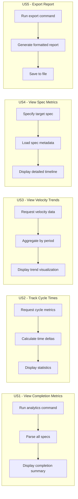
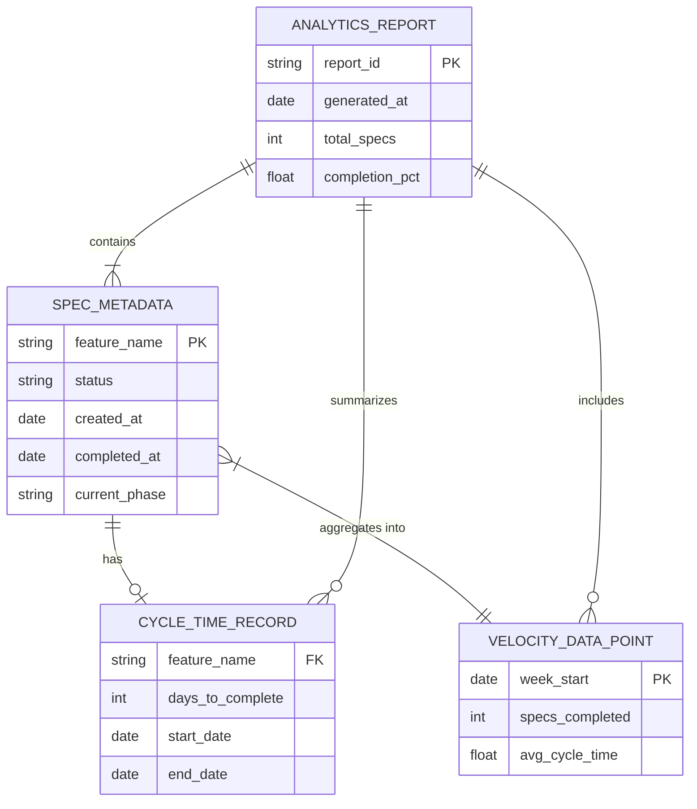

# Feature Specification: Spec Analytics and Metrics Dashboard

**Feature Branch**: `036-spec-analytics-dashboard`
**Created**: 2026-01-16
**Status**: Complete
**Input**: User description: "spec analytics and metrics dashboard"

## User Scenarios & Testing *(mandatory)*

### User Story 1 - View Spec Completion Metrics (Priority: P1)

As a project lead, I want to view metrics about specification completion across the project, so I can track progress and identify bottlenecks in the development workflow.

**Why this priority**: Understanding overall progress is the foundational use case - all other analytics build on this core visibility.

**Independent Test**: Can be fully tested by running `doit analytics show` on a project with completed and in-progress specs, verifying completion percentages and status counts are displayed.

**Acceptance Scenarios**:

1. **Given** a project with multiple specs in various states (Draft, In Progress, Complete), **When** the user runs the analytics command, **Then** the system displays a summary showing total specs, completed count, in-progress count, and completion percentage.
2. **Given** a project with no specs, **When** the user runs the analytics command, **Then** the system displays a message indicating no specs found with guidance to create one.
3. **Given** a project with all specs completed, **When** the user runs the analytics command, **Then** the system shows 100% completion with congratulatory messaging.

---

### User Story 2 - Track Cycle Time Metrics (Priority: P1)

As a development team member, I want to see how long specs take from creation to completion, so I can understand our typical delivery cadence and set realistic expectations.

**Why this priority**: Cycle time is a critical metric for planning and estimation - essential for team velocity understanding.

**Independent Test**: Can be fully tested by running `doit analytics cycles` on a project with completed specs that have timestamps, verifying cycle time statistics are calculated and displayed.

**Acceptance Scenarios**:

1. **Given** a project with completed specs that have creation and completion dates, **When** the user requests cycle time metrics, **Then** the system displays average, median, minimum, and maximum cycle times.
2. **Given** a project with completed specs in the last 30 days, **When** the user requests cycle time metrics with default period, **Then** the system shows metrics for the last 30 days by default.
3. **Given** a user wants to see cycle times for a specific period, **When** the user specifies `--since 2026-01-01` or `--days 14`, **Then** the system filters metrics to that time range.

---

### User Story 3 - View Velocity Trends (Priority: P2)

As a project lead, I want to see velocity trends over time, so I can identify whether the team is improving, maintaining, or slowing down in spec throughput.

**Why this priority**: Trend analysis adds value but requires historical data - builds on completion metrics foundation.

**Independent Test**: Can be fully tested by running `doit analytics velocity` on a project with specs completed over multiple weeks, verifying a trend visualization is displayed.

**Acceptance Scenarios**:

1. **Given** a project with specs completed over multiple weeks, **When** the user requests velocity trends, **Then** the system displays specs completed per week in a visual format (table or chart).
2. **Given** a project with insufficient data for trends (less than 2 weeks of completions), **When** the user requests velocity trends, **Then** the system indicates more data is needed and shows available data points.
3. **Given** the user wants to export velocity data, **When** the user specifies `--format json` or `--format csv`, **Then** the system outputs the data in the requested format.

---

### User Story 4 - View Individual Spec Metrics (Priority: P2)

As a developer, I want to see detailed metrics for a specific specification, so I can understand its lifecycle and any blockers.

**Why this priority**: Individual spec insights complement aggregate metrics for detailed analysis.

**Independent Test**: Can be fully tested by running `doit analytics spec 036-feature-name` on a specific spec directory, verifying detailed timing and status information is displayed.

**Acceptance Scenarios**:

1. **Given** a spec with recorded timestamps (created, started, completed), **When** the user requests metrics for that spec, **Then** the system displays time spent in each phase.
2. **Given** a spec that is currently in progress, **When** the user requests metrics for that spec, **Then** the system shows elapsed time and current phase.
3. **Given** a spec identifier that doesn't exist, **When** the user requests metrics for it, **Then** the system displays an error message with suggestions.

---

### User Story 5 - Export Analytics Report (Priority: P3)

As a stakeholder, I want to export analytics to share with others, so I can report on project health without requiring CLI access.

**Why this priority**: Export functionality is valuable but not essential for core analytics use cases.

**Independent Test**: Can be fully tested by running `doit analytics export --format markdown` and verifying a formatted report file is created.

**Acceptance Scenarios**:

1. **Given** a project with analytics data, **When** the user runs export with markdown format, **Then** the system creates a report file in the `.doit/reports/` directory.
2. **Given** a user wants a specific output location, **When** the user specifies `--output path/to/report.md`, **Then** the system saves the report to that location.
3. **Given** the user exports to JSON format, **When** the export completes, **Then** the output contains structured data suitable for external tools.

---

### Edge Cases

- What happens when spec files have missing or malformed metadata (no dates)?
- How does the system handle specs that were never completed (abandoned)?
- What happens when the specs directory is empty or doesn't exist?
- How does the system handle corrupted or unparseable spec files?
- What happens when cycle time would be negative (completion date before creation)?

## User Journey Visualization

<!-- BEGIN:AUTO-GENERATED section="user-journey" -->

<!-- END:AUTO-GENERATED -->

## Entity Relationships

<!-- BEGIN:AUTO-GENERATED section="entity-relationships" -->

<!-- END:AUTO-GENERATED -->

## Requirements *(mandatory)*

### Functional Requirements

- **FR-001**: System MUST parse all spec files in the `specs/` directory to extract metadata (status, dates, feature names).
- **FR-002**: System MUST calculate completion percentage as (completed specs / total specs) * 100.
- **FR-003**: System MUST display spec counts by status (Draft, In Progress, Complete, Approved).
- **FR-004**: System MUST extract creation dates from spec metadata or git history if not present.
- **FR-005**: System MUST extract completion dates from spec metadata or git history.
- **FR-006**: System MUST calculate cycle time as the duration between creation and completion.
- **FR-007**: System MUST provide average, median, minimum, and maximum cycle time statistics.
- **FR-008**: System MUST support filtering metrics by time period (days, date range).
- **FR-009**: System MUST aggregate completions by week for velocity trend analysis.
- **FR-010**: System MUST display velocity data in tabular format by default.
- **FR-011**: System MUST support individual spec lookup by feature number or name.
- **FR-012**: System MUST display elapsed time for in-progress specs.
- **FR-013**: System MUST export analytics to Markdown format.
- **FR-014**: System MUST export analytics to JSON format.
- **FR-015**: System MUST gracefully handle missing or malformed spec metadata.
- **FR-016**: System MUST provide helpful error messages when specs cannot be parsed.
- **FR-017**: System MUST integrate with existing CLI as `doit analytics` subcommand.

### Key Entities

- **SpecMetadata**: Represents parsed information from a spec file including feature name, status, creation date, completion date, and current phase.
- **CycleTimeRecord**: Represents the time duration a spec spent from creation to completion, used for statistical calculations.
- **VelocityDataPoint**: Represents completions aggregated by time period (week), used for trend analysis.
- **AnalyticsReport**: Represents a compiled summary of all metrics, suitable for export.

## Success Criteria *(mandatory)*

### Measurable Outcomes

- **SC-001**: Users can view project-wide completion metrics in under 2 seconds for projects with up to 100 specs.
- **SC-002**: Cycle time calculations are accurate within 1 day (accounting for timezone/date parsing).
- **SC-003**: Velocity trends are displayed for any project with at least 2 completed specs.
- **SC-004**: Export functionality generates valid Markdown that renders correctly in GitHub and VS Code.
- **SC-005**: Export functionality generates valid JSON that can be parsed by standard tools.
- **SC-006**: 95% of spec files in test projects parse successfully without errors.
- **SC-007**: Error messages for unparseable specs include the file path and specific issue.
- **SC-008**: Analytics command execution completes in under 5 seconds for projects with 200+ specs.

## Assumptions

- Spec files follow the established template structure with consistent metadata sections.
- Creation dates can be inferred from git history if not present in spec metadata.
- Completion dates are determined by status changes recorded in spec files or git commits.
- The `specs/` directory structure follows the `###-feature-name/spec.md` pattern.
- Users have read access to all spec files in the project.
- Projects using doit have git history available for date inference fallback.

## Dependencies

- Existing spec parsing functionality from `doit status` command (feature 032).
- Git CLI for date inference from commit history.
- Rich library for terminal output formatting (consistent with existing CLI).

## Out of Scope

- Real-time dashboards or web interfaces (this is CLI-focused).
- Team member attribution (who completed which spec).
- Integration with external project management tools (Jira, Linear, etc.).
- Predictive analytics or AI-powered insights.
- Historical data archival or long-term storage.
