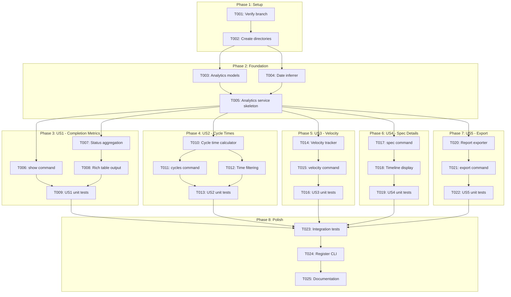
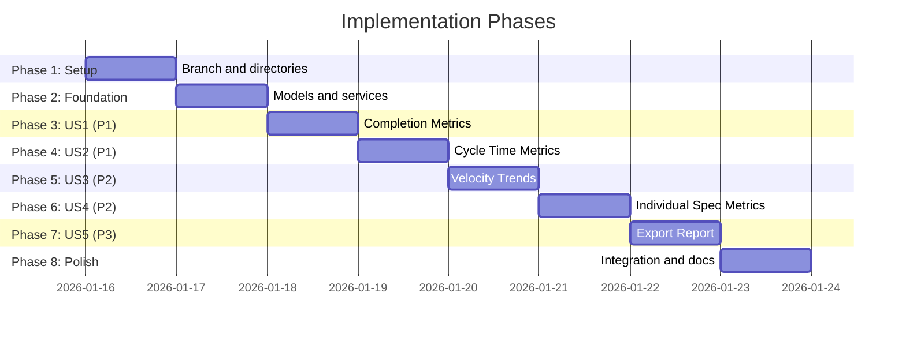

# Tasks: Spec Analytics and Metrics Dashboard

**Input**: Design documents from `/specs/036-spec-analytics-dashboard/`
**Prerequisites**: plan.md (required), spec.md (required for user stories), research.md, data-model.md, contracts/

**Tests**: Tests are included as the feature is a core analytics capability requiring reliability.

**Organization**: Tasks are grouped by user story to enable independent implementation and testing of each story.

## Task Dependencies

<!-- BEGIN:AUTO-GENERATED section="task-dependencies" -->

<!-- END:AUTO-GENERATED -->

## Phase Timeline

<!-- BEGIN:AUTO-GENERATED section="phase-timeline" -->

<!-- END:AUTO-GENERATED -->

## Format: `[ID] [P?] [Story] Description`

- **[P]**: Can run in parallel (different files, no dependencies)
- **[Story]**: Which user story this task belongs to (e.g., US1, US2, US3)
- Include exact file paths in descriptions

---

## Phase 1: Setup (Shared Infrastructure)

**Purpose**: Project initialization and verify working environment

- [x] T001 Verify working on branch `036-spec-analytics-dashboard`
- [x] T002 [P] Create new service and test directories if not present

---

## Phase 2: Foundational (Blocking Prerequisites)

**Purpose**: Core models and date extraction infrastructure that ALL user stories depend on

**CRITICAL**: No user story work can begin until this phase is complete

- [x] T003 Create analytics_models.py in src/doit_cli/models/ with SpecMetadata, CycleTimeRecord, CycleTimeStats, VelocityDataPoint, AnalyticsReport dataclasses per data-model.md
- [x] T004 [P] Create date_inferrer.py in src/doit_cli/services/ with multi-tier date extraction (metadata → git → filesystem) per research.md R1
- [x] T005 Create analytics_service.py skeleton in src/doit_cli/services/ that composes SpecScanner with DateInferrer to enrich specs with date metadata

**Checkpoint**: Foundation ready - user story implementation can now begin

---

## Phase 3: User Story 1 - View Spec Completion Metrics (Priority: P1)

**Goal**: Display project-wide completion metrics showing total specs, status breakdown, and completion percentage

**Independent Test**: Run `doit analytics show` on project with mixed spec states, verify counts and percentage display correctly

### Tests for User Story 1

- [ ] T006-T [P] [US1] Unit test for AnalyticsService.get_completion_summary() in tests/unit/test_analytics_service.py

### Implementation for User Story 1

- [x] T006 [US1] Create analytics_command.py in src/doit_cli/cli/ with `show` subcommand (default when no subcommand given)
- [x] T007 [US1] Implement get_completion_summary() in analytics_service.py that calculates total, by-status counts, and completion percentage
- [x] T008 [US1] Implement Rich table output for completion metrics per contracts/analytics-cli.md format
- [x] T009 [US1] Add --json flag support to show command for JSON output

**Checkpoint**: `doit analytics` and `doit analytics show` display completion metrics

---

## Phase 4: User Story 2 - Track Cycle Time Metrics (Priority: P1)

**Goal**: Calculate and display cycle time statistics (average, median, min, max, std dev) for completed specs

**Independent Test**: Run `doit analytics cycles` on project with completed specs, verify statistical calculations are displayed

### Tests for User Story 2

- [ ] T010-T [P] [US2] Unit test for CycleTimeCalculator.calculate_stats() in tests/unit/test_cycle_time_calculator.py

### Implementation for User Story 2

- [x] T010 [US2] Create cycle_time_calculator.py in src/doit_cli/services/ with calculate_stats() method using statistics module
- [x] T011 [US2] Add `cycles` subcommand to analytics_command.py displaying statistics table and recent completions
- [x] T012 [US2] Implement --days and --since options for time period filtering
- [x] T013 [US2] Add --json flag support to cycles command

**Checkpoint**: `doit analytics cycles` displays cycle time statistics with filtering

---

## Phase 5: User Story 3 - View Velocity Trends (Priority: P2)

**Goal**: Display weekly velocity trends showing specs completed per week with visual indicators

**Independent Test**: Run `doit analytics velocity` on project with multi-week completion history, verify weekly breakdown is displayed

### Tests for User Story 3

- [ ] T014-T [P] [US3] Unit test for VelocityTracker.aggregate_by_week() in tests/unit/test_velocity_tracker.py

### Implementation for User Story 3

- [x] T014 [US3] Create velocity_tracker.py in src/doit_cli/services/ with aggregate_by_week() using ISO week calculation
- [x] T015 [US3] Add `velocity` subcommand to analytics_command.py with Rich table and bar visualization
- [x] T016 [US3] Implement --weeks option and --format (table, json, csv) options

**Checkpoint**: `doit analytics velocity` displays weekly velocity trends

---

## Phase 6: User Story 4 - View Individual Spec Metrics (Priority: P2)

**Goal**: Display detailed metrics for a specific spec including status, dates, cycle time, and phase timeline

**Independent Test**: Run `doit analytics spec 036-spec-analytics-dashboard` and verify detailed spec information is displayed

### Tests for User Story 4

- [ ] T017-T [P] [US4] Unit test for AnalyticsService.get_spec_details() in tests/unit/test_analytics_service.py

### Implementation for User Story 4

- [x] T017 [US4] Add `spec SPEC_NAME` subcommand to analytics_command.py that looks up single spec
- [x] T018 [US4] Implement detailed Rich table output with field/value pairs and timeline table per contracts/analytics-cli.md
- [x] T019 [US4] Add --json flag support and error handling for spec not found

**Checkpoint**: `doit analytics spec NAME` displays individual spec details

---

## Phase 7: User Story 5 - Export Analytics Report (Priority: P3)

**Goal**: Export complete analytics report to Markdown or JSON file

**Independent Test**: Run `doit analytics export --format markdown` and verify report file is created in .doit/reports/

### Tests for User Story 5

- [ ] T020-T [P] [US5] Unit test for ReportExporter.export_markdown() and export_json() in tests/unit/test_report_exporter.py

### Implementation for User Story 5

- [x] T020 [US5] Create report_exporter.py in src/doit_cli/services/ with export_markdown() and export_json() methods
- [x] T021 [US5] Add `export` subcommand to analytics_command.py with --format and --output options
- [x] T022 [US5] Ensure .doit/reports/ directory is created if needed, implement default filename with timestamp

**Checkpoint**: `doit analytics export` generates report files

---

## Phase 8: Polish & Cross-Cutting Concerns

**Purpose**: Integration, registration, and final validation

- [x] T023 Create integration test in tests/integration/test_analytics_command.py testing all subcommands end-to-end
- [x] T024 Register analytics_command.py in src/doit_cli/main.py with `app.add_typer(analytics_app, name="analytics")`
- [x] T025 [P] Run quickstart.md testing checklist to validate all commands work as documented

---

## Dependencies & Execution Order

### Phase Dependencies

- **Setup (Phase 1)**: No dependencies - can start immediately
- **Foundational (Phase 2)**: Depends on Setup - BLOCKS all user stories
- **US1-US5 (Phases 3-7)**: All depend on Foundational completion
  - Can proceed sequentially (P1 → P1 → P2 → P2 → P3)
  - US1 and US2 share P1 priority
- **Polish (Phase 8)**: Depends on all user stories being complete

### User Story Dependencies

- **US1 (P1)**: Depends only on Foundation - base analytics
- **US2 (P1)**: Depends on Foundation + uses models from US1
- **US3 (P2)**: Depends on Foundation + uses VelocityDataPoint from models
- **US4 (P2)**: Depends on Foundation + uses SpecMetadata enrichment
- **US5 (P3)**: Depends on all above - exports aggregated data

### Parallel Opportunities

- T002 can run in parallel (different directories)
- T003 and T004 can run in parallel (different files)
- Test tasks marked [P] can run in parallel with their implementations
- Models marked [P] within a phase can run in parallel

---

## Implementation Strategy

### MVP First (US1 + US2 Only)

1. Complete Phase 1: Setup
2. Complete Phase 2: Foundational (CRITICAL)
3. Complete Phase 3: User Story 1 (completion metrics)
4. Complete Phase 4: User Story 2 (cycle times)
5. **STOP and VALIDATE**: Test US1 + US2 independently
6. Deploy/demo core analytics

### Full Feature Delivery

1. Setup → Foundation → US1 → US2 → MVP complete
2. Add US3 (velocity) → Enhanced insights
3. Add US4 (spec details) → Drill-down capability
4. Add US5 (export) → Stakeholder reporting
5. Polish → Integration tests → Documentation

---

## Notes

- [P] tasks = different files, no dependencies
- [Story] label maps task to specific user story for traceability
- Each user story independently completable and testable
- Reuse SpecScanner from spec_scanner.py
- Reuse SpecStatus/SpecState from status_models.py
- Use statistics module from stdlib (no external deps)
- Commit after each task or logical group
