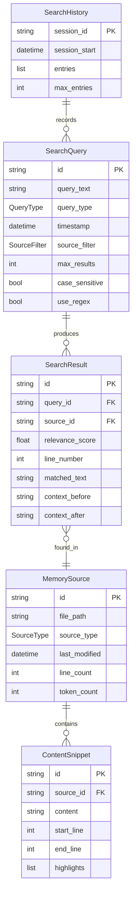
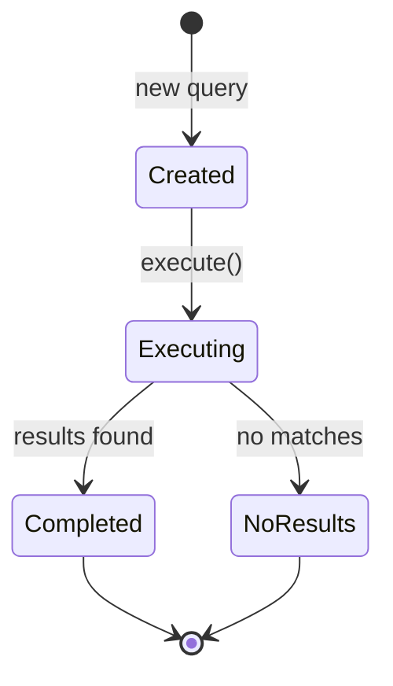

# Data Model: Memory Search and Query

**Feature**: 037-memory-search-query
**Date**: 2026-01-16

## Entity Relationship Diagram

<!-- BEGIN:AUTO-GENERATED section="er-diagram" -->

<!-- END:AUTO-GENERATED -->

## Entities

### SearchQuery

Represents a user's search request with all parameters.

| Field | Type | Required | Description |
|-------|------|----------|-------------|
| id | string | Yes | Unique identifier (UUID) |
| query_text | string | Yes | The search term or natural language question |
| query_type | QueryType | Yes | Type of query (KEYWORD, PHRASE, NATURAL, REGEX) |
| timestamp | datetime | Yes | When the query was executed |
| source_filter | SourceFilter | No | Filter to specific source types (default: ALL) |
| max_results | int | No | Maximum results to return (default: 20) |
| case_sensitive | bool | No | Case-sensitive matching (default: False) |
| use_regex | bool | No | Interpret query as regex (default: False) |

**State Machine**:



### SearchResult

A single search match with context and scoring.

| Field | Type | Required | Description |
|-------|------|----------|-------------|
| id | string | Yes | Unique identifier |
| query_id | string | Yes | Reference to parent query |
| source_id | string | Yes | Reference to source file |
| relevance_score | float | Yes | Score between 0.0 and 1.0 |
| line_number | int | Yes | Line where match was found |
| matched_text | string | Yes | The actual matched text |
| context_before | string | No | Lines before the match |
| context_after | string | No | Lines after the match |

### MemorySource

A searchable file in the project memory.

| Field | Type | Required | Description |
|-------|------|----------|-------------|
| id | string | Yes | Unique identifier (file path hash) |
| file_path | Path | Yes | Absolute path to the file |
| source_type | SourceType | Yes | Classification (GOVERNANCE, SPEC) |
| last_modified | datetime | Yes | File modification timestamp |
| line_count | int | No | Total lines in file |
| token_count | int | No | Estimated token count |

### ContentSnippet

A portion of text extracted for display.

| Field | Type | Required | Description |
|-------|------|----------|-------------|
| id | string | Yes | Unique identifier |
| source_id | string | Yes | Reference to source file |
| content | string | Yes | The snippet text |
| start_line | int | Yes | First line number |
| end_line | int | Yes | Last line number |
| highlights | list[tuple] | No | Character positions to highlight |

### SearchHistory

Session-scoped history of queries.

| Field | Type | Required | Description |
|-------|------|----------|-------------|
| session_id | string | Yes | Unique session identifier |
| session_start | datetime | Yes | When session began |
| entries | list[SearchQuery] | Yes | List of past queries |
| max_entries | int | No | Maximum entries to keep (default: 10) |

## Enumerations

### QueryType

```python
class QueryType(str, Enum):
    KEYWORD = "keyword"    # Simple word/phrase search
    PHRASE = "phrase"      # Exact phrase (quoted)
    NATURAL = "natural"    # Natural language question
    REGEX = "regex"        # Regular expression
```

### SourceType

```python
class SourceType(str, Enum):
    GOVERNANCE = "governance"  # constitution, roadmap
    SPEC = "spec"             # spec.md files
```

### SourceFilter

```python
class SourceFilter(str, Enum):
    ALL = "all"               # Search everything
    GOVERNANCE = "governance"  # Only governance files
    SPECS = "specs"           # Only spec files
```

## Validation Rules

1. **SearchQuery.query_text**: Must not be empty, max 500 characters
2. **SearchQuery.max_results**: Must be between 1 and 100
3. **SearchResult.relevance_score**: Must be between 0.0 and 1.0
4. **MemorySource.file_path**: Must exist and be readable
5. **ContentSnippet.content**: Max 1000 characters (truncate with ellipsis)

## Relationships

| From | To | Cardinality | Description |
|------|-----|-------------|-------------|
| SearchQuery | SearchResult | 1:N | Query produces multiple results |
| SearchResult | MemorySource | N:1 | Results reference source files |
| MemorySource | ContentSnippet | 1:N | Source contains snippets |
| SearchHistory | SearchQuery | 1:N | History tracks queries |
