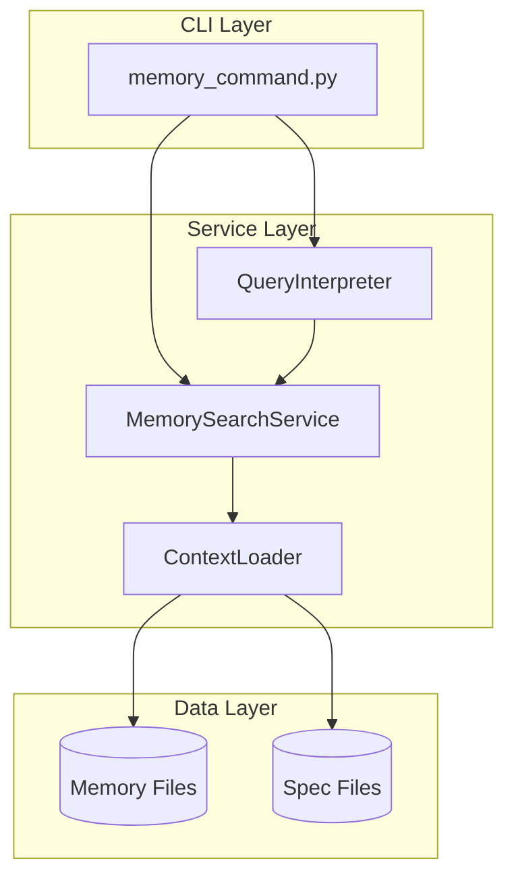

# Implementation Plan: Memory Search and Query

**Branch**: `037-memory-search-query` | **Date**: 2026-01-16 | **Spec**: [spec.md](spec.md)
**Input**: Feature specification from `/specs/037-memory-search-query/spec.md`

## Summary

Implement a memory search and query system that enables users to search across all project context files (constitution, roadmap, completed roadmap, specifications) using keyword search and natural language queries. The system integrates with the existing context loader (feature 026) and provides Rich-formatted terminal output with highlighting, filtering, and JSON export capabilities.

## Technical Context

**Language/Version**: Python 3.11+ (per constitution)
**Primary Dependencies**: Typer (CLI), Rich (terminal formatting), existing context_loader.py
**Storage**: File-based (markdown files in `.doit/memory/` and `specs/`)
**Testing**: pytest (per constitution)
**Target Platform**: Cross-platform CLI (macOS, Linux, Windows)
**Project Type**: single
**Performance Goals**: Search results returned in under 5 seconds for typical projects (<100 spec files)
**Constraints**: No external API calls for v1 (NLP uses local keyword extraction)
**Scale/Scope**: Projects with up to 100 spec files and 1MB total memory content

## Architecture Overview

<!-- BEGIN:AUTO-GENERATED section="architecture" -->

<!-- END:AUTO-GENERATED -->

## Constitution Check

*GATE: Must pass before Phase 0 research. Re-check after Phase 1 design.*

| Principle | Status | Notes |
|-----------|--------|-------|
| I. Specification-First | PASS | Spec created before implementation |
| II. Persistent Memory | PASS | Uses existing `.doit/memory/` structure |
| III. Auto-Generated Diagrams | PASS | ER and flowchart diagrams included |
| IV. Opinionated Workflow | PASS | Follows specit → planit → taskit flow |
| V. AI-Native Design | PASS | Slash command integration via `/doit.memory` |

**Tech Stack Alignment**:
- Language: Python 3.11+ (ALIGNED)
- CLI Framework: Typer (ALIGNED)
- Output: Rich (ALIGNED)
- Testing: pytest (ALIGNED)
- Storage: File-based markdown (ALIGNED)

## Project Structure

### Documentation (this feature)

```text
specs/037-memory-search-query/
├── spec.md              # Feature specification
├── plan.md              # This file
├── research.md          # Phase 0 output
├── data-model.md        # Phase 1 output
├── quickstart.md        # Phase 1 output
├── contracts/           # Phase 1 output
│   └── memory-cli.md    # CLI contract
└── tasks.md             # Phase 2 output (taskit command)
```

### Source Code (repository root)

```text
src/doit_cli/
├── models/
│   └── search_models.py       # SearchQuery, SearchResult, MemorySource
├── services/
│   ├── context_loader.py      # Existing - reuse for file loading
│   ├── memory_search.py       # NEW - search service
│   └── query_interpreter.py   # NEW - NLP query interpretation
└── cli/
    └── memory_command.py      # NEW - doit memory subcommand

tests/
├── integration/
│   └── test_memory_command.py
└── unit/
    ├── test_memory_search.py
    └── test_query_interpreter.py
```

**Structure Decision**: Single project structure extending existing `src/doit_cli/` layout. New files follow existing patterns (models/, services/, cli/).

## Complexity Tracking

No constitution violations requiring justification.
