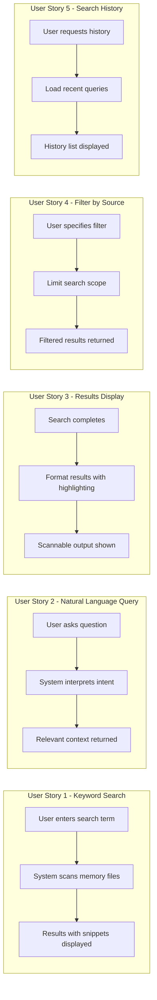
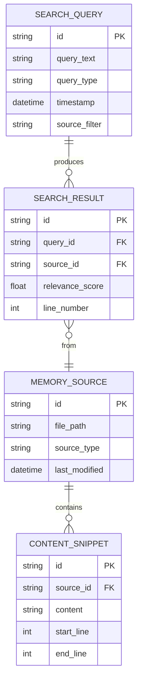

# Feature Specification: Memory Search and Query

**Feature Branch**: `037-memory-search-query`
**Created**: 2026-01-16
**Status**: Complete
**Input**: User description: "memory search and query"

## Summary

Enable users to search and query across all project context files (constitution, roadmap, completed roadmap, specifications) to find relevant information quickly. This extends the AI context injection system (026) by adding explicit search capabilities that surface related decisions, principles, and historical context on demand.

## User Scenarios & Testing *(mandatory)*

### User Story 1 - Keyword Search Across Project Memory (Priority: P1)

As a developer, I want to search for specific keywords or phrases across all project memory files, so I can quickly find relevant decisions, requirements, and context without manually opening multiple files.

**Why this priority**: This is the foundational search capability that all other features build upon. Users need basic search before advanced features.

**Independent Test**: Can be fully tested by running `doit memory search "authentication"` and verifying results from relevant files are returned with source attribution.

**Acceptance Scenarios**:

1. **Given** project memory files containing the term "validation", **When** the user searches for "validation", **Then** the system returns matching snippets with file paths and line numbers.
2. **Given** a search term that appears in multiple files, **When** the user searches for it, **Then** results are grouped by source file and ranked by relevance.
3. **Given** a search term with no matches, **When** the user searches for it, **Then** the system displays a helpful message with suggestions for similar terms.
4. **Given** project memory files in various locations, **When** the user searches, **Then** the system searches constitution, roadmap, completed_roadmap, and all spec.md files.

---

### User Story 2 - Natural Language Query (Priority: P1)

As a developer, I want to ask questions in natural language about the project, so I can understand context, decisions, and rationale without knowing exact keywords.

**Why this priority**: Natural language queries dramatically improve usability - users can ask "why did we choose Python?" instead of guessing exact terms.

**Independent Test**: Can be tested by running `doit memory ask "what is the project vision?"` and verifying the system returns relevant content from the constitution/roadmap.

**Acceptance Scenarios**:

1. **Given** a constitution with a vision statement, **When** the user asks "what is the project vision?", **Then** the system returns the vision section from the roadmap.
2. **Given** completed roadmap items, **When** the user asks "what features have been completed?", **Then** the system returns a summary of completed items.
3. **Given** a question about a specific feature, **When** the user asks "what does feature 026 do?", **Then** the system returns the summary from that spec.

---

### User Story 3 - Search Results Display (Priority: P2)

As a developer, I want search results displayed in a clear, scannable format, so I can quickly identify the most relevant information and navigate to source files.

**Why this priority**: Good display formatting makes search usable in practice. Builds on US1 foundation.

**Independent Test**: Can be tested by running a search and verifying output shows context snippets, file paths, relevance scores, and is formatted for terminal readability.

**Acceptance Scenarios**:

1. **Given** search results from multiple files, **When** displaying results, **Then** each result shows: file path, line number, relevance score, and context snippet.
2. **Given** a long snippet, **When** displaying results, **Then** the system truncates to configurable length with ellipsis and highlights matching terms.
3. **Given** the user wants machine-readable output, **When** the user specifies `--json`, **Then** results are output in structured JSON format.

---

### User Story 4 - Filter Search by Source Type (Priority: P2)

As a developer, I want to filter searches to specific source types, so I can focus on constitution, roadmap, or specs as needed.

**Why this priority**: Filtering improves efficiency when users know where to look. Enhances core search.

**Independent Test**: Can be tested by running `doit memory search "workflow" --source specs` and verifying only spec files are searched.

**Acceptance Scenarios**:

1. **Given** the user wants to search only specs, **When** the user specifies `--source specs`, **Then** only spec.md files are searched.
2. **Given** the user wants to search governance files, **When** the user specifies `--source governance`, **Then** only constitution and roadmap files are searched.
3. **Given** no source filter specified, **When** the user searches, **Then** all memory sources are searched (default behavior).

---

### User Story 5 - Search History and Recent Queries (Priority: P3)

As a developer, I want to see my recent searches and quickly re-run them, so I can efficiently revisit previous queries.

**Why this priority**: Convenience feature that improves workflow efficiency. Not required for core functionality.

**Independent Test**: Can be tested by running multiple searches, then running `doit memory history` and verifying recent queries are listed.

**Acceptance Scenarios**:

1. **Given** previous searches in the session, **When** the user runs `doit memory history`, **Then** the last 10 searches are displayed with timestamps.
2. **Given** a search history entry, **When** the user runs `doit memory history --run 1`, **Then** the first historical query is re-executed.
3. **Given** no previous searches, **When** the user runs `doit memory history`, **Then** the system shows a helpful message about search usage.

---

### Edge Cases

- What happens when memory files are very large? System uses streaming search and pagination.
- What happens when memory files contain binary content? System skips non-text files with warning.
- What happens when search index is out of date? System performs fresh scan on each search (no persistent index in v1).
- What happens when user searches with special regex characters? System escapes them by default unless `--regex` flag is used.
- What happens when no memory files exist? System displays guidance on initializing project memory.

## User Journey Visualization

<!-- BEGIN:AUTO-GENERATED section="user-journey" -->

<!-- END:AUTO-GENERATED -->

## Entity Relationships *(include if Key Entities defined)*

<!-- BEGIN:AUTO-GENERATED section="entity-relationships" -->

<!-- END:AUTO-GENERATED -->

## Requirements *(mandatory)*

### Functional Requirements

- **FR-001**: System MUST search across constitution.md, roadmap.md, completed_roadmap.md, and all spec.md files
- **FR-002**: System MUST return search results with file path, line number, and relevance score
- **FR-003**: System MUST display context snippets around matching terms (configurable, default 3 lines)
- **FR-004**: System MUST highlight matching terms in output using terminal formatting
- **FR-005**: System MUST support case-insensitive search by default
- **FR-006**: System MUST support exact phrase search with quoted terms
- **FR-007**: System MUST support filtering by source type (governance, specs, all)
- **FR-008**: System MUST support natural language queries that interpret user intent
- **FR-009**: System MUST provide JSON output format via `--json` flag
- **FR-010**: System MUST handle missing memory files gracefully with guidance
- **FR-011**: System MUST escape special characters in search terms by default
- **FR-012**: System MUST support regex search via `--regex` flag
- **FR-013**: System MUST limit results to configurable maximum (default 20)
- **FR-014**: System MUST track search history within session
- **FR-015**: System MUST integrate with existing context loader from feature 026

### Key Entities

- **SearchQuery**: Represents a user's search or question, including query text, type (keyword/natural), and filters
- **SearchResult**: A single matching result with source attribution, relevance score, and snippet
- **MemorySource**: A searchable file in project memory with type classification (governance, spec, etc.)
- **ContentSnippet**: A portion of text from a memory source with line number context

## Success Criteria *(mandatory)*

### Measurable Outcomes

- **SC-001**: Users can find relevant project context in under 5 seconds for typical queries
- **SC-002**: Search results accurately reflect query intent at least 90% of the time
- **SC-003**: Natural language queries successfully interpret user questions and return relevant content
- **SC-004**: Search command reduces time spent manually browsing files by 70%
- **SC-005**: All memory file types (constitution, roadmap, specs) are searchable with single command
- **SC-006**: Results display is clear enough that users can identify relevant content without opening files

## Assumptions

- Project has been initialized with doit (`.doit/memory/` directory exists)
- Memory files use standard markdown format
- Natural language processing uses existing context injection infrastructure (no external AI API calls for v1)
- Search is performed fresh each time (no persistent index to maintain in v1)
- Session-based history (not persisted across CLI invocations in v1)
