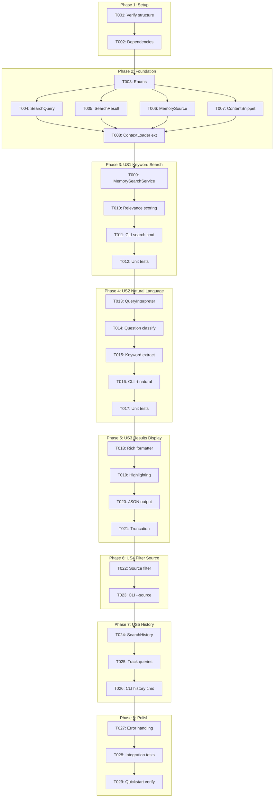
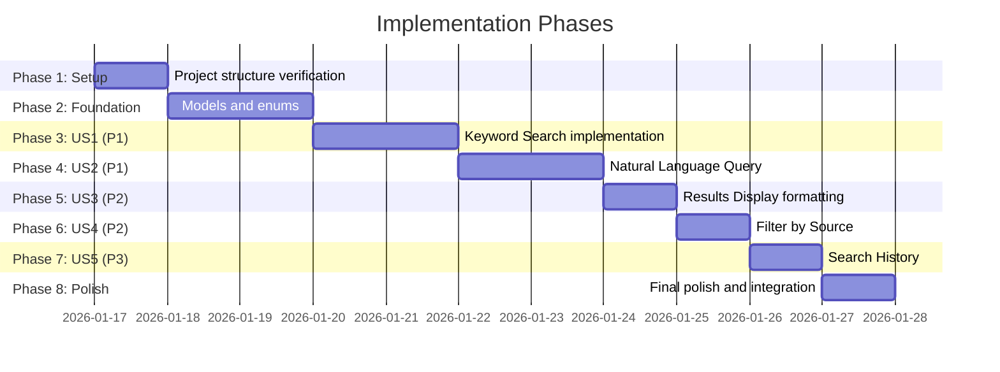

# Tasks: Memory Search and Query

**Input**: Design documents from `/specs/037-memory-search-query/`
**Prerequisites**: plan.md (required), spec.md (required for user stories), research.md, data-model.md, contracts/

**Tests**: Test tasks included per standard testing requirements.

**Organization**: Tasks are grouped by user story to enable independent implementation and testing of each story.

## Task Dependencies

<!-- BEGIN:AUTO-GENERATED section="task-dependencies" -->

<!-- END:AUTO-GENERATED -->

## Phase Timeline

<!-- BEGIN:AUTO-GENERATED section="phase-timeline" -->

<!-- END:AUTO-GENERATED -->

## Format: `[ID] [P?] [Story] Description`

- **[P]**: Can run in parallel (different files, no dependencies)
- **[Story]**: Which user story this task belongs to (e.g., US1, US2, US3)
- Include exact file paths in descriptions

## Path Conventions

- **Single project**: `src/doit_cli/`, `tests/` at repository root
- Paths follow existing project structure from plan.md

---

## Phase 1: Setup (Shared Infrastructure)

**Purpose**: Project initialization and dependency verification

- [x] T001 Verify project structure exists per plan.md (src/doit_cli/models/, src/doit_cli/services/, src/doit_cli/cli/)
- [x] T002 Verify dependencies available: typer, rich, re (stdlib), dataclasses (stdlib)

---

## Phase 2: Foundational (Blocking Prerequisites)

**Purpose**: Core models and enums that ALL user stories depend on

**⚠️ CRITICAL**: No user story work can begin until this phase is complete

- [x] T003 Create QueryType, SourceType, SourceFilter enums in src/doit_cli/models/search_models.py
- [x] T004 [P] Create SearchQuery dataclass in src/doit_cli/models/search_models.py
- [x] T005 [P] Create SearchResult dataclass in src/doit_cli/models/search_models.py
- [x] T006 [P] Create MemorySource dataclass in src/doit_cli/models/search_models.py
- [x] T007 [P] Create ContentSnippet dataclass in src/doit_cli/models/search_models.py
- [x] T008 Add search integration methods to existing src/doit_cli/services/context_loader.py (get_memory_files, get_spec_files)

**Checkpoint**: Foundation ready - user story implementation can now begin

---

## Phase 3: User Story 1 - Keyword Search (Priority: P1) 🎯 MVP

**Goal**: Users can search for keywords across all project memory files and get results with source attribution

**Independent Test**: Run `doit memory search "authentication"` and verify results from relevant files are returned with file paths and line numbers

### Implementation for User Story 1

- [x] T009 [US1] Create MemorySearchService class with search_keyword() method in src/doit_cli/services/memory_search.py
- [x] T010 [US1] Implement relevance scoring algorithm (TF + position + section bonus) in src/doit_cli/services/memory_search.py
- [x] T011 [US1] Create basic `doit memory search` CLI command in src/doit_cli/cli/memory_command.py
- [x] T012 [US1] Add unit tests for MemorySearchService.search_keyword() in tests/unit/test_memory_search.py

**Checkpoint**: User Story 1 complete - basic keyword search works independently

---

## Phase 4: User Story 2 - Natural Language Query (Priority: P1)

**Goal**: Users can ask natural language questions and get relevant results based on intent interpretation

**Independent Test**: Run `doit memory search -t natural "what is the project vision?"` and verify relevant content from roadmap is returned

### Implementation for User Story 2

- [x] T013 [US2] Create QueryInterpreter class in src/doit_cli/services/query_interpreter.py
- [x] T014 [US2] Implement question type classification (what, why, how, where) in src/doit_cli/services/query_interpreter.py
- [x] T015 [US2] Implement keyword extraction (remove stop words, extract noun phrases) in src/doit_cli/services/query_interpreter.py
- [x] T016 [US2] Add `-t natural` query type option to CLI in src/doit_cli/cli/memory_command.py
- [x] T017 [US2] Add unit tests for QueryInterpreter in tests/unit/test_query_interpreter.py

**Checkpoint**: User Story 2 complete - natural language queries work independently

---

## Phase 5: User Story 3 - Search Results Display (Priority: P2)

**Goal**: Search results are displayed in a clear, scannable format with highlighting and context

**Independent Test**: Run a search and verify output shows context snippets, file paths, relevance scores, and highlighted matching terms

### Implementation for User Story 3

- [x] T018 [US3] Create Rich-based result formatter with box panels in src/doit_cli/services/memory_search.py
- [x] T019 [US3] Implement match highlighting using Rich markup in src/doit_cli/services/memory_search.py
- [x] T020 [US3] Implement JSON output format via `--json` flag in src/doit_cli/cli/memory_command.py
- [x] T021 [US3] Implement context snippet truncation with ellipsis (max 1000 chars) in src/doit_cli/services/memory_search.py

**Checkpoint**: User Story 3 complete - results display is clear and scannable

---

## Phase 6: User Story 4 - Filter Search by Source Type (Priority: P2)

**Goal**: Users can filter searches to specific source types (governance, specs, all)

**Independent Test**: Run `doit memory search "workflow" --source specs` and verify only spec files are searched

### Implementation for User Story 4

- [x] T022 [US4] Implement source filtering in MemorySearchService (governance vs specs) in src/doit_cli/services/memory_search.py
- [x] T023 [US4] Add `--source` CLI option with validation in src/doit_cli/cli/memory_command.py

**Checkpoint**: User Story 4 complete - source filtering works independently

---

## Phase 7: User Story 5 - Search History (Priority: P3)

**Goal**: Users can view recent searches and re-run them within a session

**Independent Test**: Run multiple searches, then run `doit memory history` and verify recent queries are listed with timestamps

### Implementation for User Story 5

- [x] T024 [US5] Create SearchHistory dataclass with session tracking in src/doit_cli/models/search_models.py
- [x] T025 [US5] Implement history tracking in MemorySearchService (in-memory, session-scoped) in src/doit_cli/services/memory_search.py
- [x] T026 [US5] Create `doit memory history` CLI command with --clear option in src/doit_cli/cli/memory_command.py

**Checkpoint**: User Story 5 complete - search history works independently

---

## Phase 8: Polish & Cross-Cutting Concerns

**Purpose**: Improvements that affect multiple user stories

- [x] T027 [P] Add comprehensive error handling (missing files, invalid regex, empty results) in src/doit_cli/services/memory_search.py
- [x] T028 [P] Add integration tests for CLI commands in tests/integration/test_memory_command.py
- [x] T029 Run quickstart.md validation to verify all documented commands work

---

## Dependencies & Execution Order

### Phase Dependencies

- **Setup (Phase 1)**: No dependencies - can start immediately
- **Foundational (Phase 2)**: Depends on Setup completion - BLOCKS all user stories
- **User Stories (Phase 3-7)**: All depend on Foundational phase completion
  - US1 and US2 are both P1 - implement sequentially (US2 builds on US1's search infrastructure)
  - US3 and US4 are both P2 - can be done in either order
  - US5 is P3 - lowest priority
- **Polish (Phase 8)**: Depends on all user stories being complete

### User Story Dependencies

- **User Story 1 (P1)**: Can start after Foundational (Phase 2) - No dependencies on other stories
- **User Story 2 (P1)**: Depends on US1 search infrastructure - adds NLP interpretation layer
- **User Story 3 (P2)**: Can start after US1 - enhances output formatting
- **User Story 4 (P2)**: Can start after US1 - adds filtering capability
- **User Story 5 (P3)**: Can start after US1 - adds history tracking

### Within Each User Story

- Models before services
- Services before CLI commands
- Core implementation before tests
- Story complete before moving to next priority

### Parallel Opportunities

- All Foundation model tasks T004-T007 can run in parallel
- Polish tasks T027-T028 can run in parallel
- Different team members could work on US3 and US4 in parallel after US1/US2 complete

---

## Parallel Example: Foundation Phase

```bash
# Launch all model creation tasks together:
Task: "Create SearchQuery dataclass in src/doit_cli/models/search_models.py"
Task: "Create SearchResult dataclass in src/doit_cli/models/search_models.py"
Task: "Create MemorySource dataclass in src/doit_cli/models/search_models.py"
Task: "Create ContentSnippet dataclass in src/doit_cli/models/search_models.py"
```

---

## Implementation Strategy

### MVP First (User Story 1 Only)

1. Complete Phase 1: Setup
2. Complete Phase 2: Foundational (CRITICAL - blocks all stories)
3. Complete Phase 3: User Story 1 - Keyword Search
4. **STOP and VALIDATE**: Test `doit memory search "term"` works
5. Deploy/demo if ready

### Incremental Delivery

1. Complete Setup + Foundational → Foundation ready
2. Add User Story 1 → Basic search works → MVP!
3. Add User Story 2 → Natural language queries work
4. Add User Story 3 → Results display enhanced
5. Add User Story 4 → Filtering works
6. Add User Story 5 → History tracking works
7. Polish → Production ready

---

## Notes

- [P] tasks = different files, no dependencies
- [Story] label maps task to specific user story for traceability
- Each user story should be independently completable and testable
- Commit after each task or logical group
- Stop at any checkpoint to validate story independently
- Existing context_loader.py is extended, not replaced (reuse file discovery logic)
