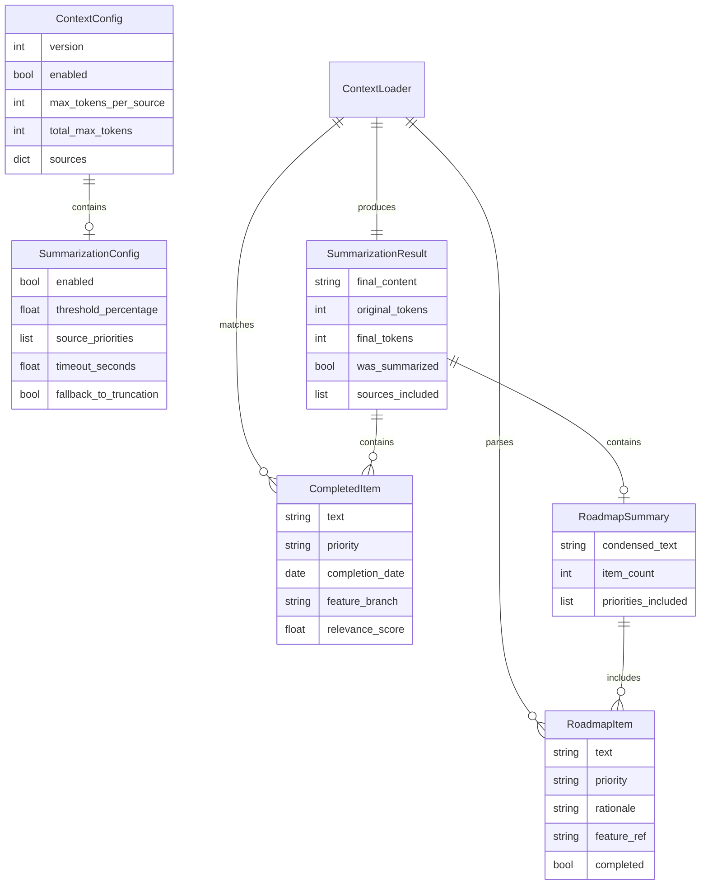
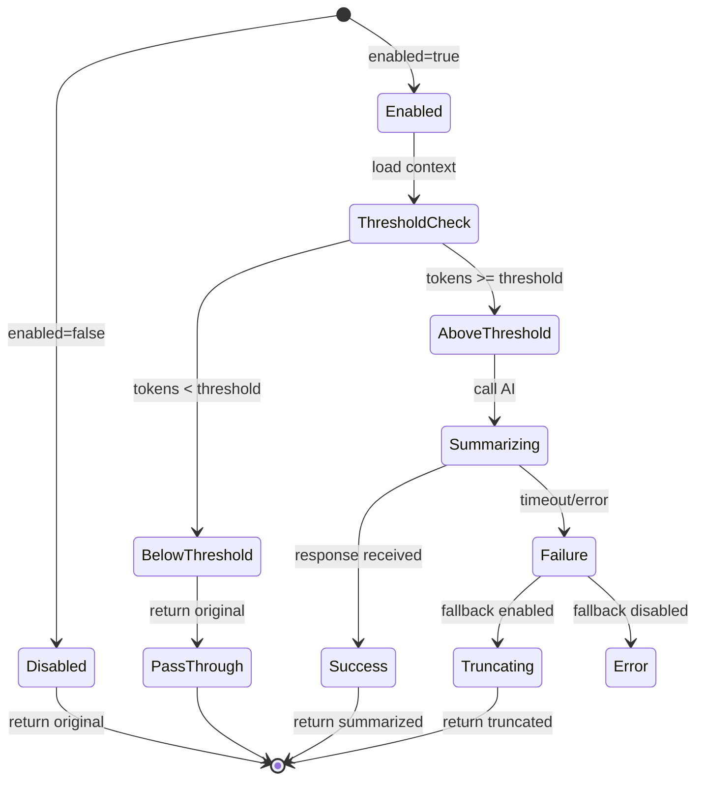

# Data Model: Context Roadmap Summary

**Feature**: `038-context-roadmap-summary`
**Date**: 2026-01-20

## Entity Relationship Diagram

<!-- BEGIN:AUTO-GENERATED section="er-diagram" -->

<!-- END:AUTO-GENERATED -->

## Entity Definitions

### SummarizationConfig

Configuration for context summarization behavior. Extends ContextConfig.

| Field | Type | Description | Default |
|-------|------|-------------|---------|
| enabled | bool | Whether AI summarization is enabled | True |
| threshold_percentage | float | Percentage of total_max_tokens that triggers summarization | 80.0 |
| source_priorities | list[str] | Order of priority for preserving content during summarization | ["constitution", "roadmap", "completed_roadmap"] |
| timeout_seconds | float | Timeout for AI summarization API call | 10.0 |
| fallback_to_truncation | bool | Whether to fall back to truncation on AI failure | True |

**Validation Rules**:
- threshold_percentage must be between 50.0 and 100.0
- timeout_seconds must be positive
- source_priorities must contain valid source type names

### RoadmapItem

Represents a single item from roadmap.md.

| Field | Type | Description |
|-------|------|-------------|
| text | str | The item text/description |
| priority | str | Priority level (P1, P2, P3, P4) |
| rationale | str | Optional rationale/reason for the item |
| feature_ref | str | Optional feature branch reference (e.g., "034-fixit-workflow") |
| completed | bool | Whether the item is marked as completed |

**Parsing Rules**:
- Priority extracted from section header: `### P1 - Critical`
- Rationale follows item with `- **Rationale**:` prefix
- Feature ref in backticks or brackets: `` `[###-name]` `` or `[###-name]`
- Completed indicated by `[x]` checkbox

### CompletedItem

Represents a matched item from completed_roadmap.md.

| Field | Type | Description |
|-------|------|-------------|
| text | str | The completed item description |
| priority | str | Original priority when active |
| completion_date | date | Date the item was completed |
| feature_branch | str | Feature branch that implemented it |
| relevance_score | float | TF-IDF similarity score (0.0 - 1.0) |

**Matching Rules**:
- Minimum relevance_score threshold: 0.3
- Maximum items returned: 5 (configurable)
- Score calculated using keyword overlap with current feature

### RoadmapSummary

Condensed representation of the roadmap for context injection.

| Field | Type | Description |
|-------|------|-------------|
| condensed_text | str | Summarized markdown content |
| item_count | int | Number of items included in summary |
| priorities_included | list[str] | Which priority levels were included |

**Summary Structure**:
```markdown
## Roadmap Summary

### High Priority (P1-P2)
- [Full text with rationale for P1/P2 items]

### Other Priorities
- [Titles only for P3/P4 items]

### Current Feature
- [Items matching current branch highlighted]
```

### SummarizationResult

Output of the summarization process.

| Field | Type | Description |
|-------|------|-------------|
| final_content | str | The summarized/condensed content |
| original_tokens | int | Token count before summarization |
| final_tokens | int | Token count after summarization |
| was_summarized | bool | Whether AI summarization was used |
| sources_included | list[str] | Which sources are in the result |

## State Transitions

### SummarizationConfig States



## Storage Locations

| Entity | Storage | Format |
|--------|---------|--------|
| SummarizationConfig | `.doit/config/context.yaml` | YAML |
| RoadmapItem | `.doit/memory/roadmap.md` | Markdown (parsed) |
| CompletedItem | `.doit/memory/completed_roadmap.md` | Markdown (parsed) |
| RoadmapSummary | In-memory only | N/A |
| SummarizationResult | In-memory only | N/A |

## Configuration Schema

```yaml
# .doit/config/context.yaml extension
version: 1
enabled: true
max_tokens_per_source: 4000
total_max_tokens: 16000

# NEW: Summarization settings
summarization:
  enabled: true
  threshold_percentage: 80.0
  source_priorities:
    - constitution
    - roadmap
    - completed_roadmap
  timeout_seconds: 10.0
  fallback_to_truncation: true
  completed_items:
    max_count: 5
    min_relevance: 0.3

sources:
  constitution:
    enabled: true
    priority: 1
  roadmap:
    enabled: true
    priority: 2
  # NEW: Completed roadmap source
  completed_roadmap:
    enabled: true
    priority: 3
    max_count: 5
```
