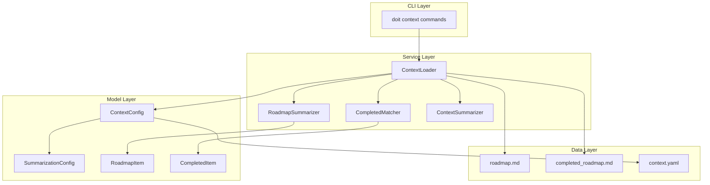
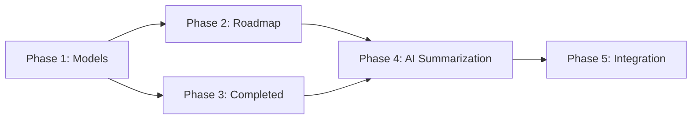

# Implementation Plan: Context Roadmap Summary

**Branch**: `038-context-roadmap-summary` | **Date**: 2026-01-20 | **Spec**: [spec.md](spec.md)
**Input**: Feature specification from `/specs/038-context-roadmap-summary/spec.md`

## Summary

Enhance the AI context injection system to provide intelligent roadmap summarization. The implementation will:
1. Parse roadmap.md by priority sections and generate condensed summaries preserving P1/P2 rationale
2. Include completed_roadmap.md items formatted for AI agent semantic matching (Claude/Copilot)
3. Apply AI-powered summarization when combined context exceeds configurable token threshold
4. Extend ContextConfig with SummarizationConfig for user customization

**Key Design Decision**: Leverage the AI coding agent (Claude or Copilot) for semantic matching of completed items rather than implementing TF-IDF ourselves. The AI agent already has superior semantic understanding capabilities.

## Technical Context

**Language/Version**: Python 3.11+
**Primary Dependencies**: Typer (CLI), Rich (output), httpx (HTTP client)
**Storage**: File-based (markdown in `.doit/memory/`)
**Testing**: pytest
**Target Platform**: Cross-platform CLI (Linux, macOS, Windows)
**Project Type**: single
**Performance Goals**: Context generation < 3 seconds including AI summarization
**Constraints**: Token limits configurable (default 16,000 total), timeout 10s for AI calls
**Scale/Scope**: Projects with roadmaps up to 200 items

## Architecture Overview

<!-- BEGIN:AUTO-GENERATED section="architecture" -->

<!-- END:AUTO-GENERATED -->

## Constitution Check

*GATE: Must pass before Phase 0 research. Re-check after Phase 1 design.*

| Principle | Status | Notes |
|-----------|--------|-------|
| I. Specification-First | PASS | Spec created before planning |
| II. Persistent Memory | PASS | All context stored in `.doit/memory/` markdown |
| III. Auto-Generated Diagrams | PASS | Mermaid diagrams generated from spec |
| IV. Opinionated Workflow | PASS | Following specit → planit flow |
| V. AI-Native Design | PASS | Feature enhances AI context injection |

**Tech Stack Alignment**:
- Python 3.11+ - aligned with constitution
- Typer/Rich - aligned with constitution
- httpx - aligned with constitution (existing dependency)
- No new external dependencies required

## Project Structure

### Documentation (this feature)

```text
specs/038-context-roadmap-summary/
├── spec.md              # Feature specification
├── plan.md              # This file
├── research.md          # Research decisions
├── data-model.md        # Entity definitions
├── quickstart.md        # Usage guide
├── contracts/           # Interface contracts
│   └── interfaces.md
├── checklists/          # Quality checklists
│   └── requirements.md
└── tasks.md             # Implementation tasks (created by /doit.taskit)
```

### Source Code (repository root)

```text
src/doit_cli/
├── models/
│   └── context_config.py      # MODIFY: Add SummarizationConfig
├── services/
│   ├── context_loader.py      # MODIFY: Add summarization logic
│   ├── roadmap_summarizer.py  # NEW: Roadmap parsing and summarization
│   └── memory_search.py       # REUSE: Keyword extraction

tests/
├── unit/
│   ├── test_roadmap_summarizer.py  # NEW
│   ├── test_completed_matcher.py   # NEW
│   └── test_context_config.py      # MODIFY: Add summarization tests
└── integration/
    └── test_context_loader.py      # MODIFY: Add summarization tests
```

**Structure Decision**: Single project structure (existing doit CLI). All new code integrates into existing `src/doit_cli/` with corresponding tests in `tests/`.

## Implementation Phases

### Phase 1: Core Models (P1 - Foundation)

1. Extend `ContextConfig` with `SummarizationConfig` dataclass
2. Add `RoadmapItem` and `CompletedItem` models
3. Update YAML parsing for new configuration section
4. Add unit tests for new models

### Phase 2: Roadmap Summarization (P1 - Core Feature)

1. Create `RoadmapSummarizer` service
2. Implement markdown parsing by priority sections
3. Generate condensed summaries preserving P1/P2 rationale
4. Highlight current feature items
5. Add unit tests

### Phase 3: Completed Item Matching (P1 - Core Feature)

1. Create completed item parsing from completed_roadmap.md
2. Format completed items with metadata (date, branch, description)
3. Include in context for AI agent semantic matching
4. Let AI coding agent (Claude/Copilot) determine relevance contextually
5. Add unit tests for parsing and formatting

**Note**: We leverage the AI coding agent's semantic understanding rather than implementing TF-IDF matching. The AI already understands context and can identify relevant completed work based on the current feature being implemented.

### Phase 4: Context Condensation (P2 - Enhancement)

1. Create `ContextCondenser` service for threshold checking
2. Add guidance prompt when context exceeds threshold (tells AI to prioritize)
3. Implement simple truncation as hard limit fallback
4. Integrate into ContextLoader
5. Add integration tests

**Note**: Leverages the current AI coding agent (Claude or Copilot) for intelligent prioritization. No external API calls needed - the AI running the command IS the summarizer.

### Phase 5: Integration (P3 - Polish)

1. Update `doit context show` command output
2. Add verbose mode showing before/after tokens
3. Update documentation
4. End-to-end testing

## Dependencies Graph



## Risk Mitigation

| Risk | Impact | Mitigation |
|------|--------|------------|
| AI API unavailable | Medium | Fallback to truncation with warning |
| Slow summarization | Low | Configurable timeout (default 10s) |
| Poor keyword matching | Low | Adjustable similarity threshold |
| Breaking existing behavior | High | Feature flag (enabled by default but graceful) |
| Token estimation inaccuracy | Low | Conservative threshold (80% default) |

## Artifacts Generated

- [research.md](research.md) - Research decisions and technical choices
- [data-model.md](data-model.md) - Entity definitions with ER diagram
- [contracts/interfaces.md](contracts/interfaces.md) - Public interface contracts
- [quickstart.md](quickstart.md) - Usage guide and configuration examples
- [checklists/requirements.md](checklists/requirements.md) - Quality validation checklist

## Complexity Tracking

No constitution violations requiring justification. All implementation choices align with established patterns:
- Python 3.11+ with Typer/Rich
- File-based markdown storage
- pytest for testing
- httpx for HTTP (existing dependency)
