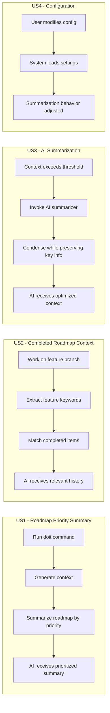
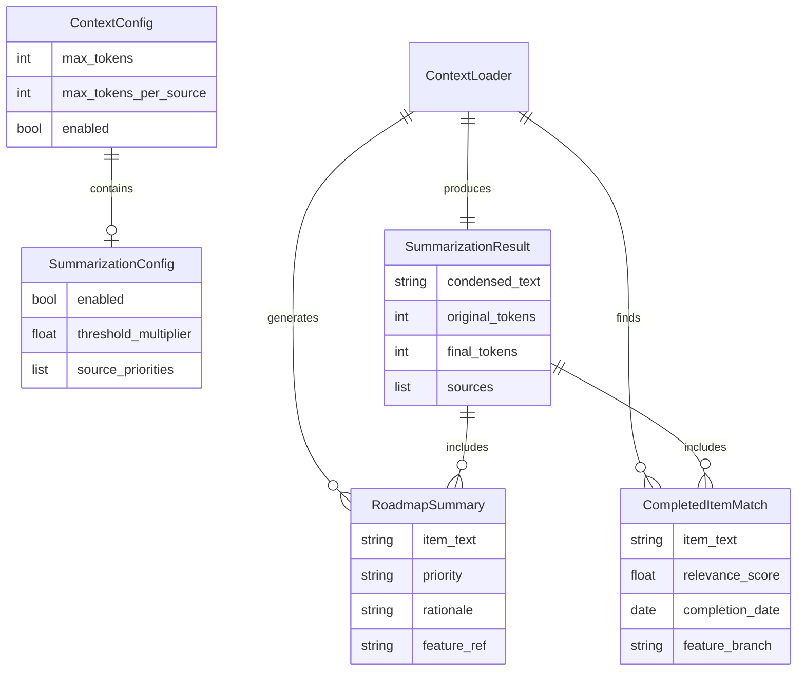

# Feature Specification: Context Roadmap Summary

**Feature Branch**: `038-context-roadmap-summary`
**Created**: 2026-01-20
**Status**: Complete
**Input**: User description: "The context that we are adding from the command line to enhance the AI agent needs to be updated to summarize the key roadmap items as well as include key completed roadmap items for the spec being implemented. We need to use AI to summarize the additional context when it is over the threshold."

## Summary

Enhance the AI context injection system to provide more intelligent and relevant roadmap context to AI agents. Currently, the context loader includes the full roadmap and constitution, but it doesn't prioritize key roadmap items, include relevant completed work history, or intelligently summarize when context exceeds token limits. This feature adds smart summarization capabilities to maximize the value of context within token constraints.

## User Scenarios & Testing *(mandatory)*

### User Story 1 - Roadmap Priority Summary (Priority: P1)

When a developer runs a doit command (like `/doit.specit` or `/doit.planit`), the AI agent receives a summarized view of the roadmap that highlights the most important priorities. Instead of receiving the full roadmap text, the AI gets a condensed summary that emphasizes P1 and P2 items, current focus areas, and items related to the current feature branch.

**Why this priority**: This is the core value proposition - ensuring AI agents understand project priorities without consuming excessive context tokens. Every command execution benefits from better roadmap awareness.

**Independent Test**: Can be fully tested by running any doit command and verifying the injected context contains summarized roadmap priorities rather than the full roadmap text.

**Acceptance Scenarios**:

1. **Given** a project with a roadmap containing P1-P4 items, **When** a user runs `/doit.specit`, **Then** the AI context includes a prioritized summary showing P1/P2 items first with their rationale.
2. **Given** a roadmap with 20+ items, **When** context is generated, **Then** the summary fits within the configured token limit while preserving the most critical information.
3. **Given** a feature branch like `038-context-roadmap-summary`, **When** context is generated, **Then** any roadmap items matching this feature are highlighted in the summary.

---

### User Story 2 - Completed Roadmap Context (Priority: P1)

When working on a new feature, the AI agent receives relevant context about previously completed features that relate to the current work. This helps the AI understand existing patterns, avoid duplicating work, and build upon established conventions.

**Why this priority**: Understanding what has already been done is critical for AI to make informed suggestions. Without this, AI may propose solutions that conflict with existing implementations or miss opportunities to reuse established patterns.

**Independent Test**: Can be fully tested by running a command on a feature branch and verifying the context includes relevant entries from completed_roadmap.md.

**Acceptance Scenarios**:

1. **Given** a user working on a context-related feature, **When** context is generated, **Then** related completed items (like "AI context injection", "Memory search") are included.
2. **Given** a completed_roadmap.md with 15 items, **When** context is generated, **Then** only items relevant to the current feature (by keyword match) are included.
3. **Given** no relevant completed items exist, **When** context is generated, **Then** a brief note indicates no related historical work was found.

---

### User Story 3 - AI-Powered Context Summarization (Priority: P2)

When the combined context (constitution, roadmap, completed items, related specs) exceeds the configured token threshold, an AI summarization service condenses the content while preserving key information. This ensures context is always within limits while maximizing information density.

**Why this priority**: While basic truncation exists, AI summarization provides intelligent condensation that preserves meaning. This is more complex to implement but significantly improves context quality when limits are reached.

**Independent Test**: Can be fully tested by configuring a low token threshold and verifying context is intelligently summarized rather than simply truncated.

**Acceptance Scenarios**:

1. **Given** combined context exceeds the threshold by 50%, **When** summarization is triggered, **Then** the result fits within the threshold while retaining key points from all sources.
2. **Given** AI summarization is enabled, **When** context is generated, **Then** the summarized output maintains coherent structure with clear attribution to source documents.
3. **Given** AI summarization fails (network error, API unavailable), **When** context is generated, **Then** the system falls back to truncation with a warning message.

---

### User Story 4 - Summarization Configuration (Priority: P3)

Users can configure summarization behavior through the context configuration, including enabling/disabling AI summarization, setting summarization thresholds, and specifying which sources to prioritize when condensing.

**Why this priority**: Power users need control over summarization behavior. The defaults should work well for most cases, but configurability enables optimization for specific project needs.

**Independent Test**: Can be fully tested by modifying configuration values and verifying they affect summarization behavior.

**Acceptance Scenarios**:

1. **Given** a user sets `summarization.enabled: false`, **When** context exceeds threshold, **Then** truncation is used instead of AI summarization.
2. **Given** a user sets `summarization.priority: [constitution, roadmap]`, **When** summarizing, **Then** constitution content is preserved more completely than other sources.
3. **Given** default configuration, **When** a new project runs doit commands, **Then** sensible defaults provide good summarization without configuration.

---

### Edge Cases

- What happens when roadmap.md doesn't exist? System continues with other context sources.
- What happens when completed_roadmap.md is empty? System notes no completed items and proceeds.
- How does the system handle malformed markdown in source files? System uses best-effort parsing with graceful degradation.
- What happens when the AI summarization service is slow? System implements timeout with fallback to truncation.
- How does the system handle very large roadmaps (100+ items)? Summarization kicks in earlier with stricter condensation.

## User Journey Visualization

<!-- BEGIN:AUTO-GENERATED section="user-journey" -->

<!-- END:AUTO-GENERATED -->

## Requirements *(mandatory)*

### Functional Requirements

- **FR-001**: System MUST generate a summarized view of roadmap.md that prioritizes P1 and P2 items
- **FR-002**: System MUST include rationale for each roadmap item in the summary when available
- **FR-003**: System MUST highlight roadmap items that match the current feature branch name
- **FR-004**: System MUST search completed_roadmap.md for items relevant to the current feature
- **FR-005**: System MUST use keyword extraction from feature branch and spec title to find relevant completed items
- **FR-006**: System MUST include completion date and feature branch reference for included completed items
- **FR-007**: System MUST invoke AI summarization when combined context exceeds the configured threshold
- **FR-008**: System MUST preserve source attribution in summarized output (e.g., "[From roadmap]", "[From completed]")
- **FR-009**: System MUST fall back to truncation when AI summarization is unavailable or fails
- **FR-010**: System MUST support configuration options for summarization behavior
- **FR-011**: System MUST provide sensible defaults that work without explicit configuration
- **FR-012**: System MUST log summarization activity for debugging and auditing
- **FR-013**: System MUST respect existing token limits from ContextConfig

### Key Entities *(include if feature involves data)*

- **RoadmapSummary**: Condensed representation of roadmap priorities with item text, priority level, rationale, and feature branch references
- **CompletedItemMatch**: A matched completed roadmap item with relevance score, completion date, and feature branch
- **SummarizationConfig**: User configuration for summarization behavior including enabled flag, threshold multiplier, and source priorities
- **SummarizationResult**: Output of summarization containing condensed text, original token count, final token count, and sources included

## Entity Relationships *(include if Key Entities defined)*

<!-- BEGIN:AUTO-GENERATED section="entity-relationships" -->

<!-- END:AUTO-GENERATED -->

## Success Criteria *(mandatory)*

### Measurable Outcomes

- **SC-001**: Context generation completes within 3 seconds including summarization for typical projects
- **SC-002**: Summarized roadmap content is at least 60% smaller than full roadmap while retaining all P1/P2 items
- **SC-003**: Relevant completed items are identified with at least 80% precision (relevant items correctly identified)
- **SC-004**: AI summarization produces coherent, grammatically correct output 95% of the time
- **SC-005**: Fallback to truncation occurs within 500ms when AI summarization fails
- **SC-006**: Zero breaking changes to existing context loading behavior when summarization is disabled
- **SC-007**: Configuration changes take effect without requiring restart or re-initialization

## Assumptions

- The AI summarization service will use the existing Claude API integration pattern
- Roadmap and completed_roadmap follow the established markdown format
- Token estimation continues to use tiktoken or fallback character-based estimation
- Projects have reasonable roadmap sizes (under 200 items) for performance assumptions
- Feature branch naming follows the `###-short-name` convention for matching

## Dependencies

- Existing context_loader.py provides the foundation for this enhancement
- memory_search.py provides keyword extraction capabilities that can be reused
- ContextConfig model supports extension for summarization settings
- Claude API access for AI-powered summarization (with graceful degradation when unavailable)

## Out of Scope

- Real-time roadmap updates during long-running commands
- Multi-language support for non-English roadmaps
- Integration with external project management tools
- Caching of summarized content across sessions (may be added in future iteration)
- Custom summarization prompts (uses standard summarization approach)
