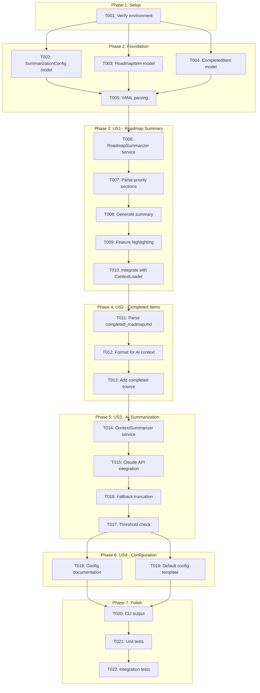
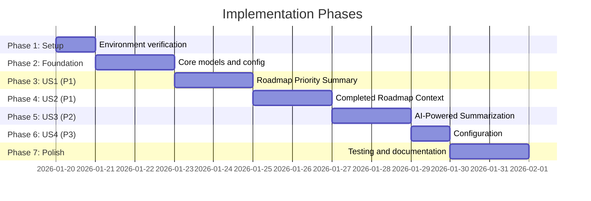

# Tasks: Context Roadmap Summary

**Input**: Design documents from `/specs/038-context-roadmap-summary/`
**Prerequisites**: plan.md, spec.md, research.md, data-model.md, contracts/

**Organization**: Tasks are grouped by user story to enable independent implementation and testing of each story.

## Task Dependencies

<!-- BEGIN:AUTO-GENERATED section="task-dependencies" -->

<!-- END:AUTO-GENERATED -->

## Phase Timeline

<!-- BEGIN:AUTO-GENERATED section="phase-timeline" -->

<!-- END:AUTO-GENERATED -->

## Format: `[ID] [P?] [Story] Description`

- **[P]**: Can run in parallel (different files, no dependencies)
- **[Story]**: Which user story this task belongs to (US1, US2, US3, US4)
- Include exact file paths in descriptions

---

## Phase 1: Setup

**Purpose**: Verify development environment is ready

- [x] T001 Verify Python 3.11+ environment and dependencies (pytest, httpx, tiktoken optional) are available

---

## Phase 2: Foundation (Blocking Prerequisites)

**Purpose**: Core models that MUST be complete before ANY user story can be implemented

**⚠️ CRITICAL**: No user story work can begin until this phase is complete

- [x] T002 [P] Add SummarizationConfig dataclass in src/doit_cli/models/context_config.py with enabled, threshold_percentage, source_priorities, timeout_seconds, fallback_to_truncation fields
- [x] T003 [P] Add RoadmapItem dataclass in src/doit_cli/models/context_config.py with text, priority, rationale, feature_ref, completed fields
- [x] T004 [P] Add CompletedItem dataclass in src/doit_cli/models/context_config.py with text, priority, completion_date, feature_branch, relevance_score fields
- [x] T005 Update ContextConfig._from_dict() to parse summarization section from YAML in src/doit_cli/models/context_config.py

**Checkpoint**: Foundation ready - user story implementation can now begin

---

## Phase 3: User Story 1 - Roadmap Priority Summary (Priority: P1)

**Goal**: AI agent receives summarized roadmap with P1/P2 items prioritized, P3/P4 as titles only, current feature highlighted

**Independent Test**: Run `doit context show` and verify roadmap source shows "summarized" status with reduced token count

### Implementation for User Story 1

- [x] T006 [US1] Create RoadmapSummarizer class skeleton in src/doit_cli/services/roadmap_summarizer.py with __init__, parse_roadmap, summarize methods
- [x] T007 [US1] Implement parse_roadmap() to extract RoadmapItem list from markdown, parsing P1-P4 sections, rationale, and feature refs in src/doit_cli/services/roadmap_summarizer.py
- [x] T008 [US1] Implement summarize() to generate condensed markdown with full P1/P2 items and P3/P4 titles only in src/doit_cli/services/roadmap_summarizer.py
- [x] T009 [US1] Add current feature branch highlighting in summarize() when feature_ref matches current branch in src/doit_cli/services/roadmap_summarizer.py
- [x] T010 [US1] Integrate RoadmapSummarizer into ContextLoader._load_roadmap() to return summarized content in src/doit_cli/services/context_loader.py

**Checkpoint**: User Story 1 should be fully functional - roadmap is summarized by priority

---

## Phase 4: User Story 2 - Completed Roadmap Context (Priority: P1)

**Goal**: AI agent receives completed features formatted for semantic understanding by the AI coding agent (Claude/Copilot)

**Design Decision**: Leverage the AI coding agent's semantic understanding rather than implementing TF-IDF matching. The AI already understands context and can identify relevant completed work.

**Independent Test**: Run `doit context show` on a feature branch and verify completed_roadmap source appears with formatted items

### Implementation for User Story 2

- [x] T011 [US2] Add parse_completed_roadmap() function to parse completed_roadmap.md table rows into CompletedItem list in src/doit_cli/services/context_loader.py
- [x] T012 [US2] Add format_completed_for_context() function to format CompletedItem list as AI-friendly markdown with date, branch, and description in src/doit_cli/services/context_loader.py
- [x] T013 [US2] Add load_completed_roadmap() method to ContextLoader that returns ContextSource with formatted items in src/doit_cli/services/context_loader.py

**Checkpoint**: User Story 2 should be fully functional - completed items formatted for AI semantic matching

---

## Phase 5: User Story 3 - Context Condensation (Priority: P2)

**Goal**: When combined context exceeds token threshold, guide the AI agent to prioritize and provide fallback truncation

**Design Decision**: Leverage the current AI coding agent (Claude or Copilot) for summarization. The agent running the doit command IS the summarizer - no external API calls needed.

**Independent Test**: Set threshold_percentage to 10% and verify guidance prompt appears and context is handled appropriately

### Implementation for User Story 3

- [x] T014 [US3] Create ContextCondenser class in src/doit_cli/services/context_loader.py with check_threshold, add_guidance_prompt, truncate_if_needed methods
- [x] T015 [US3] Implement add_guidance_prompt() to prepend AI instruction when context exceeds soft threshold (e.g., "Focus on P1/P2 items, current feature context") in src/doit_cli/services/context_loader.py
- [x] T016 [US3] Implement truncate_if_needed() as hard limit fallback using source_priorities config in src/doit_cli/services/context_loader.py
- [x] T017 [US3] Add _check_and_apply_condensation() to ContextLoader.load_context() that triggers condensation when tokens exceed threshold in src/doit_cli/services/context_loader.py

**Checkpoint**: User Story 3 should be fully functional - works identically for Claude, Copilot, Cursor, or any AI agent

---

## Phase 6: User Story 4 - Summarization Configuration (Priority: P3)

**Goal**: Users can configure summarization behavior via context.yaml

**Independent Test**: Modify context.yaml summarization settings and verify they affect behavior

### Implementation for User Story 4

- [x] T018 [US4] Add configuration documentation to quickstart.md showing all summarization options in specs/038-context-roadmap-summary/quickstart.md
- [x] T019 [US4] Create default context.yaml template with summarization section in .doit/templates/context-config-template.yaml (if not exists)

**Checkpoint**: User Story 4 should be fully functional - configuration affects behavior

---

## Phase 7: Polish & Cross-Cutting Concerns

**Purpose**: Testing, documentation, and final integration

- [x] T020 Update doit context show output to display summarization status (summarized vs complete) in src/doit_cli/commands/context.py
- [x] T021 [P] Add unit tests for RoadmapSummarizer in tests/unit/test_roadmap_summarizer.py
- [x] T022 [P] Add integration tests for summarization in context loading in tests/integration/test_context_loader.py

---

## Dependencies & Execution Order

### Phase Dependencies

- **Setup (Phase 1)**: No dependencies - can start immediately
- **Foundation (Phase 2)**: Depends on Setup - BLOCKS all user stories
- **US1 (Phase 3)**: Depends on Foundation
- **US2 (Phase 4)**: Depends on US1 (uses same integration point)
- **US3 (Phase 5)**: Depends on US2 (applies to all loaded sources)
- **US4 (Phase 6)**: Depends on US3 (configuration affects AI summarization)
- **Polish (Phase 7)**: Depends on all user stories

### User Story Dependencies

- **US1 (P1)**: Can start after Foundation - no dependencies on other stories
- **US2 (P1)**: Can start after US1 - integrates into same context loading flow
- **US3 (P2)**: Can start after US2 - applies summarization to all sources
- **US4 (P3)**: Can start after US3 - configuration for summarization behavior

### Within Each User Story

- Models/dataclasses before services
- Parsing before transformation
- Core implementation before integration

### Parallel Opportunities

- T002, T003, T004 can run in parallel (different dataclasses)
- T021, T022 can run in parallel (different test files)

---

## Parallel Example: Foundation Phase

```bash
# Launch all model definitions together:
Task: "Add SummarizationConfig dataclass in src/doit_cli/models/context_config.py"
Task: "Add RoadmapItem dataclass in src/doit_cli/models/context_config.py"
Task: "Add CompletedItem dataclass in src/doit_cli/models/context_config.py"
```

---

## Implementation Strategy

### MVP First (User Story 1 Only)

1. Complete Phase 1: Setup
2. Complete Phase 2: Foundation
3. Complete Phase 3: User Story 1 (Roadmap Summary)
4. **STOP and VALIDATE**: Test that roadmap is summarized by priority
5. Deploy/demo if ready

### Incremental Delivery

1. Setup + Foundation → Core models ready
2. Add US1 (Roadmap Summary) → Verify prioritized summary works
3. Add US2 (Completed Items) → Verify relevant items matched
4. Add US3 (AI Summarization) → Verify intelligent condensation
5. Add US4 (Configuration) → Verify user control
6. Polish → Tests and documentation

---

## Notes

- [P] tasks = different files, no dependencies
- [Story] label maps task to specific user story for traceability
- Each user story should be independently completable and testable
- Commit after each task or logical group
- Stop at any checkpoint to validate story independently
- Total tasks: 22
- **AI-First Design**: Completed items and roadmap items are formatted for AI semantic matching rather than implementing TF-IDF
