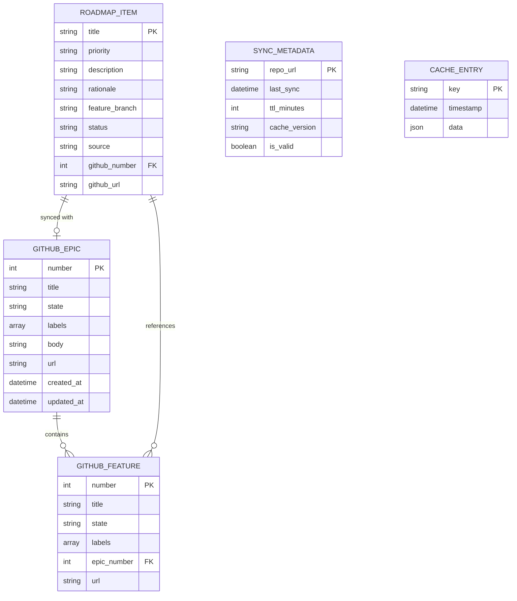
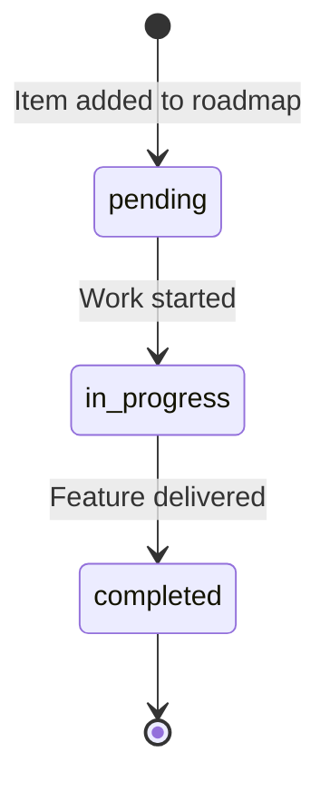

# Data Model: GitHub Epic Integration

**Feature**: GitHub Epic and Issue Integration for Roadmap Command
**Date**: 2026-01-21
**Status**: Design Phase

## Entity Relationship Diagram

<!-- BEGIN:AUTO-GENERATED section="er-diagram" -->

<!-- END:AUTO-GENERATED -->

---

## Entity Definitions

### RoadmapItem

Represents a planned feature or requirement in the roadmap.

**Attributes**:
- `title` (string): Feature title (e.g., "User authentication")
- `priority` (string): Priority level - one of P1, P2, P3, P4
- `description` (string): Detailed description of the feature
- `rationale` (string): Business rationale for this priority
- `feature_branch` (string, optional): Branch reference like `[039-feature-name]`
- `status` (string): Current status - one of pending, in-progress, completed
- `source` (string): Origin of this item - one of local, github, merged
- `github_number` (int, optional): Associated GitHub issue number
- `github_url` (string, optional): GitHub issue URL

**Relationships**:
- May be synced with one GitHub Epic (0..1)
- May reference multiple GitHub Features (0..n)

**State Transitions**:


**Validation Rules**:
- `title` must not be empty
- `priority` must be one of P1, P2, P3, P4
- `status` must be one of pending, in-progress, completed
- `source` must be one of local, github, merged
- If `github_number` is set, `github_url` must also be set
- `feature_branch` format must match `[###-name]` pattern if present

**Example**:
```python
RoadmapItem(
    title="GitHub epic integration",
    priority="P2",
    description="Sync GitHub epics with roadmap",
    rationale="Reduces duplication between GitHub and roadmap",
    feature_branch="[039-github-roadmap-sync]",
    status="in-progress",
    source="merged",
    github_number=577,
    github_url="https://github.com/owner/repo/issues/577"
)
```

---

### GitHubEpic

Represents a GitHub issue labeled as "epic".

**Attributes**:
- `number` (int): GitHub issue number (unique identifier)
- `title` (string): Issue title
- `state` (string): Issue state - one of open, closed
- `labels` (list[string]): All labels attached to the issue
- `body` (string): Issue description/body text
- `url` (string): GitHub issue URL
- `created_at` (datetime): When the issue was created
- `updated_at` (datetime): When the issue was last updated
- `features` (list[GitHubFeature]): Linked feature issues

**Relationships**:
- May be synced with one RoadmapItem (0..1)
- Contains zero or more GitHubFeature items (0..n)

**Derived Properties**:
- `priority` (computed): Extracted from labels using priority mapper
- `is_epic` (computed): True if "epic" label present

**Validation Rules**:
- `number` must be positive integer
- `state` must be one of open, closed
- `url` must be valid GitHub URL format
- Must have "epic" label to be considered an epic

**Example**:
```python
GitHubEpic(
    number=577,
    title="[Epic]: GitHub Epic Integration",
    state="open",
    labels=["epic", "priority:P2"],
    body="Integrates GitHub epics with roadmap...",
    url="https://github.com/owner/repo/issues/577",
    created_at=datetime(2026, 1, 21, 10, 0, 0),
    updated_at=datetime(2026, 1, 21, 15, 30, 0),
    features=[...]
)
```

---

### GitHubFeature

Represents a GitHub issue labeled as "feature" that is linked to an epic.

**Attributes**:
- `number` (int): GitHub issue number
- `title` (string): Issue title
- `state` (string): Issue state - one of open, closed
- `labels` (list[string]): All labels attached to the issue
- `epic_number` (int): Parent epic issue number
- `url` (string): GitHub issue URL

**Relationships**:
- Belongs to one GitHubEpic (1..1)
- May be referenced by one RoadmapItem (0..1)

**Derived Properties**:
- `priority` (computed): Extracted from labels using priority mapper

**Validation Rules**:
- `number` must be positive integer
- `state` must be one of open, closed
- `epic_number` must reference a valid epic
- `url` must be valid GitHub URL format

**Example**:
```python
GitHubFeature(
    number=578,
    title="[Feature]: Display epics in roadmap",
    state="open",
    labels=["feature", "priority:P1"],
    epic_number=577,
    url="https://github.com/owner/repo/issues/578"
)
```

---

### SyncMetadata

Tracks synchronization state between GitHub and local roadmap.

**Attributes**:
- `repo_url` (string): GitHub repository URL (e.g., "https://github.com/owner/repo")
- `last_sync` (datetime): Timestamp of last successful sync
- `ttl_minutes` (int): Cache time-to-live in minutes (default: 30)
- `cache_version` (string): Cache format version (for migrations)
- `is_valid` (bool): Whether cache is currently valid (not expired)

**Validation Rules**:
- `repo_url` must be valid GitHub URL
- `ttl_minutes` must be positive integer
- `cache_version` must follow semver format

**Example**:
```python
SyncMetadata(
    repo_url="https://github.com/seanbarlow/doit",
    last_sync=datetime(2026, 1, 21, 15, 30, 0),
    ttl_minutes=30,
    cache_version="1.0.0",
    is_valid=True
)
```

---

### CacheEntry

Generic cache storage for GitHub API responses.

**Attributes**:
- `key` (string): Cache key (e.g., "epics:owner/repo")
- `timestamp` (datetime): When the data was cached
- `data` (dict): Cached data as JSON

**Validation Rules**:
- `key` must not be empty
- `data` must be valid JSON

**Example**:
```python
CacheEntry(
    key="epics:seanbarlow/doit",
    timestamp=datetime(2026, 1, 21, 15, 30, 0),
    data={
        "epics": [...],
        "metadata": {...}
    }
)
```

---

## Data Flow

### Read Flow (Fetch Epics)

```
User runs roadmapit
    ↓
Check cache validity
    ↓
[Cache valid] → Load from cache → Display merged roadmap
    ↓
[Cache invalid/missing] → Fetch from GitHub API
    ↓
Save to cache
    ↓
Merge with local roadmap
    ↓
Display merged roadmap
```

### Write Flow (Create Epic)

```
User runs roadmapit add "Feature X"
    ↓
Add to local roadmap
    ↓
Check GitHub configured
    ↓
[Not configured] → Done
    ↓
[Configured] → Create GitHub epic via gh CLI
    ↓
Link epic number to roadmap item
    ↓
Invalidate cache
    ↓
Display updated roadmap
```

---

## Merge Algorithm

```python
def merge_roadmap_items(
    local: list[RoadmapItem],
    github: list[GitHubEpic]
) -> list[RoadmapItem]:
    """
    Merge local and GitHub roadmap items.

    Rules:
    1. Match by feature_branch reference
    2. For matches: preserve local, enrich with GitHub data
    3. For GitHub-only: add as new items with source=github
    4. For local-only: preserve as-is with source=local
    5. Never delete local items
    """
    merged = []
    matched_github = set()

    # Pass 1: Match and merge
    for local_item in local:
        if local_item.feature_branch:
            epic = find_epic_by_branch(github, local_item.feature_branch)
            if epic:
                # Merge: local + GitHub metadata
                item = local_item.copy()
                item.github_number = epic.number
                item.github_url = epic.url
                item.source = "merged"
                merged.append(item)
                matched_github.add(epic.number)
                continue

        # No match: preserve local
        local_item.source = "local"
        merged.append(local_item)

    # Pass 2: Add unmatched GitHub items
    for epic in github:
        if epic.number not in matched_github:
            item = RoadmapItem.from_github_epic(epic)
            item.source = "github"
            merged.append(item)

    return sorted(merged, key=lambda x: (x.priority, x.title))
```

---

## File Format (Cache)

### .doit/cache/github_epics.json

```json
{
  "version": "1.0.0",
  "metadata": {
    "repo_url": "https://github.com/owner/repo",
    "last_sync": "2026-01-21T15:30:00Z",
    "ttl_minutes": 30
  },
  "epics": [
    {
      "number": 577,
      "title": "[Epic]: GitHub Epic Integration",
      "state": "open",
      "labels": ["epic", "priority:P2"],
      "body": "Feature description...",
      "url": "https://github.com/owner/repo/issues/577",
      "created_at": "2026-01-21T10:00:00Z",
      "updated_at": "2026-01-21T15:30:00Z",
      "features": [
        {
          "number": 578,
          "title": "[Feature]: Display epics in roadmap",
          "state": "open",
          "labels": ["feature", "priority:P1"],
          "url": "https://github.com/owner/repo/issues/578"
        }
      ]
    }
  ]
}
```

---

## Performance Considerations

- Cache file size: ~1-2KB per epic, ~100KB for 100 epics (acceptable)
- Memory footprint: Load entire cache into memory (typical: <1MB)
- API calls: Minimize with caching (1 call per 30 minutes typical usage)
- Merge complexity: O(n*m) where n=local items, m=GitHub epics (acceptable for n,m < 200)
