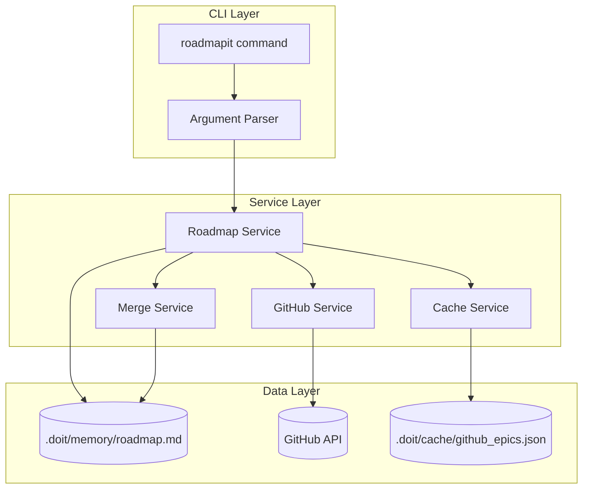

# Implementation Plan: GitHub Epic and Issue Integration for Roadmap Command

**Branch**: `[039-github-roadmap-sync]` | **Date**: 2026-01-21 | **Spec**: [spec.md](spec.md)
**Input**: Feature specification from `/specs/039-github-roadmap-sync/spec.md`

**Note**: This template is filled in by the `/doit.planit` command. See `.claude/commands/doit.planit.md` for the execution workflow.

## Summary

Extends the `/doit.roadmapit` command to synchronize with GitHub issues, enabling bidirectional integration between `.doit/memory/roadmap.md` and GitHub project tracking. The implementation fetches open GitHub epics (issues labeled "epic"), displays them within the roadmap with priority mapping, shows linked feature issues as sub-items, and optionally creates GitHub epics when adding roadmap items. This eliminates manual duplication between roadmap files and GitHub issues, provides a single source of truth, and enables team visibility through both interfaces.

## Technical Context

**Language/Version**: Python 3.11+ (per constitution)
**Primary Dependencies**: Typer (CLI), Rich (terminal output), httpx (HTTP client)
**Storage**: File-based markdown in `.doit/memory/` + GitHub API (read/write)
**Testing**: pytest (per constitution)
**Target Platform**: Linux/macOS/Windows CLI (cross-platform)
**Project Type**: single (CLI tool extension)
**Performance Goals**: Roadmap sync completes in <5 seconds for repos with 50 open epics, <2 seconds for cached offline mode
**Constraints**: Must handle GitHub API rate limits gracefully, zero data loss of local roadmap items, backward compatible with existing roadmap command
**Scale/Scope**: Support repos with up to 200 open issues (epics + features), handle 10+ priority levels in GitHub labels, cache up to 100 epics for offline viewing

## Architecture Overview

<!--
  AUTO-GENERATED: This section is populated by /doit.planit based on Technical Context above.
  Shows the high-level system architecture with component layers.
  Regenerate by running /doit.planit again.
-->

<!-- BEGIN:AUTO-GENERATED section="architecture" -->

<!-- END:AUTO-GENERATED -->

## Constitution Check

*GATE: Must pass before Phase 0 research. Re-check after Phase 1 design.*

**Tech Stack Alignment**:
- ✅ Language: Python 3.11+ (matches constitution)
- ✅ CLI Framework: Typer (matches constitution)
- ✅ Output Formatting: Rich (matches constitution)
- ✅ HTTP Client: httpx (matches constitution, already used for other features)
- ✅ Testing: pytest (matches constitution)
- ✅ Storage: File-based markdown (matches constitution - Persistent Memory principle)

**Core Principles Compliance**:

1. ✅ **Specification-First**: Spec created via `/doit.specit` before planning
2. ✅ **Persistent Memory**: All roadmap data stored in `.doit/memory/roadmap.md` (GitHub acts as secondary sync source, not primary storage)
3. ✅ **Auto-Generated Diagrams**: Mermaid diagrams generated in plan.md
4. ✅ **Opinionated Workflow**: Follows specit → planit → taskit → implementit workflow
5. ✅ **AI-Native Design**: Command integrates with existing `/doit.roadmapit` slash command, maintains markdown interface

**Deviations**: None

**Quality Standards**: All new code will include pytest unit tests and integration tests for GitHub API interactions (mocked)

## Project Structure

### Documentation (this feature)

```text
specs/039-github-roadmap-sync/
├── spec.md              # Feature specification (created by /doit.specit)
├── plan.md              # This file (/doit.planit command output)
├── research.md          # Phase 0 output (GitHub API research, caching strategy)
├── data-model.md        # Phase 1 output (Epic, Feature, Cache data models)
├── quickstart.md        # Phase 1 output (Developer guide for GitHub integration)
├── contracts/           # Phase 1 output
│   └── github_api.yaml  # GitHub API contract (issues, labels, search)
├── checklists/          # Created by /doit.specit
│   └── requirements.md  # Spec quality checklist
└── tasks.md             # Phase 2 output (/doit.taskit command - NOT created by /doit.planit)
```

### Source Code (repository root)

```text
src/doit_toolkit_cli/
├── commands/
│   └── roadmapit.py                    # [MODIFY] Add GitHub integration flags
├── services/
│   ├── roadmap_service.py              # [MODIFY] Extend with GitHub sync
│   ├── github_service.py               # [NEW] GitHub API interactions
│   ├── github_cache_service.py         # [NEW] Cache management
│   └── roadmap_merge_service.py        # [NEW] Merge local + GitHub data
├── models/
│   ├── roadmap.py                      # [MODIFY] Add source field (local/github)
│   ├── github_epic.py                  # [NEW] GitHub epic model
│   ├── github_feature.py               # [NEW] GitHub feature issue model
│   └── sync_metadata.py                # [NEW] Sync tracking model
└── utils/
    ├── github_auth.py                  # [NEW] Detect & validate GitHub config
    └── priority_mapper.py              # [NEW] Map GitHub labels to P1-P4

tests/
├── unit/
│   ├── test_github_service.py          # [NEW] Mock GitHub API calls
│   ├── test_github_cache_service.py    # [NEW] Cache read/write tests
│   ├── test_roadmap_merge_service.py   # [NEW] Merge logic tests
│   └── test_priority_mapper.py         # [NEW] Label mapping tests
├── integration/
│   └── test_roadmapit_github.py        # [NEW] End-to-end roadmapit with GitHub
└── fixtures/
    └── github_responses.json           # [NEW] Mock GitHub API responses

.doit/
├── memory/
│   └── roadmap.md                      # [READ/WRITE] Roadmap file
└── cache/
    └── github_epics.json               # [NEW] Cached GitHub data
```

**Structure Decision**: Single project structure (CLI tool). All code goes under `src/doit_toolkit_cli/` following existing conventions. New services for GitHub integration are isolated for testability and follow separation of concerns (API client, cache, merge logic).

## Complexity Tracking

No constitution violations - all complexity is justified by feature requirements and follows existing patterns.

---

## Phase 0: Research & Unknowns

**Status**: ⏳ In Progress

### Research Tasks

1. **GitHub CLI (`gh`) vs Direct API Access**
   - **Question**: Should we use `gh` CLI via subprocess or httpx for direct API calls?
   - **Research**: Evaluate both approaches for reliability, error handling, testing
   - **Decision Criteria**: Ease of authentication, test mocking, error messages

2. **GitHub Issue Query Strategy**
   - **Question**: How to efficiently query epics and linked features?
   - **Research**: GitHub Search API, Issues API, label filters, pagination
   - **Decision Criteria**: Minimize API calls, handle rate limits, query performance

3. **Cache Strategy & Invalidation**
   - **Question**: When to cache, when to invalidate, cache format?
   - **Research**: TTL-based vs explicit invalidation, cache size limits
   - **Decision Criteria**: Balance freshness vs offline capability

4. **Priority Label Mapping**
   - **Question**: How to handle non-standard priority labels?
   - **Research**: Common GitHub labeling conventions, fuzzy matching
   - **Decision Criteria**: Flexibility vs consistency

5. **Conflict Resolution Strategy**
   - **Question**: When local and GitHub have same-named items, which wins?
   - **Research**: Git merge strategies, feature branch reference matching
   - **Decision Criteria**: Preserve user intent, minimize data loss

### Output

See [research.md](research.md) for detailed findings and decisions.

---

## Phase 1: Design Artifacts

**Status**: ⏳ Pending Phase 0 completion

### Data Model

See [data-model.md](data-model.md) for entity definitions:
- `GitHubEpic`: Issue number, title, state, labels, body, url, linked features
- `GitHubFeature`: Issue number, title, state, labels, epic reference
- `RoadmapItem`: Title, priority, status, source (local/github), epic reference
- `SyncMetadata`: Last sync timestamp, cache status, error state

### API Contracts

See [contracts/github_api.yaml](contracts/github_api.yaml) for:
- GitHub Issues API v3 contract
- Search issues endpoint
- List issue comments endpoint
- Create issue endpoint

### Developer Guide

See [quickstart.md](quickstart.md) for:
- Setting up GitHub authentication
- Running roadmapit with GitHub sync
- Testing GitHub integration locally
- Debugging GitHub API issues

---

## Phase 2: Implementation

**Status**: ⏳ Pending Phase 1 completion

Tasks will be generated by `/doit.taskit` and tracked in [tasks.md](tasks.md).

**Estimated Task Breakdown** (preliminary):
1. Implement `github_auth.py` utility (detect remote, validate gh CLI)
2. Implement `github_service.py` (fetch epics, fetch features, create epic)
3. Implement `github_cache_service.py` (read cache, write cache, invalidate)
4. Implement `priority_mapper.py` (map GitHub labels to P1-P4)
5. Implement `roadmap_merge_service.py` (merge local + GitHub items)
6. Extend `roadmapit.py` command (add --skip-github flag, integrate services)
7. Add unit tests for all new services
8. Add integration test for end-to-end workflow
9. Update documentation and help text

---

## Implementation Notes

### GitHub Authentication Detection

```python
# Pseudo-code for github_auth.py
def detect_github_config() -> bool:
    """Check if GitHub remote exists and gh CLI is available."""
    remote = subprocess.run(["git", "remote", "get-url", "origin"], capture_output=True)
    if "github.com" not in remote.stdout.decode():
        return False

    gh_check = subprocess.run(["gh", "auth", "status"], capture_output=True)
    return gh_check.returncode == 0
```

### Priority Label Mapping Strategy

```python
# Pseudo-code for priority_mapper.py
PRIORITY_MAP = {
    "priority:P1": "P1",
    "priority:p1": "P1",
    "P1": "P1",
    "critical": "P1",
    "priority:P2": "P2",
    # ... etc
}

def map_labels_to_priority(labels: list[str]) -> str:
    """Map GitHub labels to roadmap priority. Defaults to P3."""
    for label in labels:
        if label in PRIORITY_MAP:
            return PRIORITY_MAP[label]
    return "P3"  # Default
```

### Cache Structure

```json
{
  "last_sync": "2026-01-21T10:30:00Z",
  "repo": "owner/repo",
  "epics": [
    {
      "number": 577,
      "title": "[Epic]: Feature X",
      "state": "open",
      "labels": ["epic", "priority:P2"],
      "body": "Epic description...",
      "url": "https://github.com/owner/repo/issues/577",
      "features": [
        {
          "number": 578,
          "title": "[Feature]: Sub-feature Y",
          "state": "open",
          "labels": ["feature", "priority:P1"]
        }
      ]
    }
  ]
}
```

### Merge Strategy

1. Load local roadmap items from `.doit/memory/roadmap.md`
2. Fetch GitHub epics (or load from cache if offline)
3. Match items by feature branch reference `[###-feature-name]`
4. For matched items: prefer local data, add GitHub URL
5. For GitHub-only items: add to roadmap with source indicator
6. For local-only items: preserve as-is
7. Sort by priority (P1 > P2 > P3 > P4)
8. Write merged roadmap back to file

---

## Testing Strategy

### Unit Tests
- Mock GitHub API responses using `pytest-httpx`
- Test priority mapping edge cases (missing labels, unrecognized labels)
- Test cache read/write with various cache states (empty, stale, corrupted)
- Test merge logic with different conflict scenarios

### Integration Tests
- Test full roadmapit workflow with mock GitHub server
- Test offline mode with cached data
- Test graceful degradation (no GitHub remote, auth failure, API error)

### Manual Testing
- Create test repo with sample epics and features
- Run roadmapit command and verify output
- Test with various GitHub configurations (authenticated, not authenticated, no remote)

---

## Risk Mitigation

| Risk | Impact | Mitigation |
|------|--------|------------|
| GitHub API rate limit hit during sync | High | Implement caching, batch requests, respect rate limit headers |
| `gh` CLI not installed | Medium | Detect during command execution, show helpful error with install instructions |
| Large repos with 100+ epics slow sync | Medium | Implement pagination, limit to first 100 epics, show progress indicator |
| Cache corruption causes data loss | High | Validate cache on read, fall back to fresh API call if invalid |
| Merge conflicts lose user data | Critical | Never delete local roadmap items, always preserve in case of conflict |

---

## Success Metrics

- ✅ All 15 functional requirements from spec.md implemented
- ✅ All user stories (P1, P2, P3) have passing acceptance tests
- ✅ Code coverage >80% for new services
- ✅ Integration test passes with mock GitHub server
- ✅ Manual testing confirms <5 second sync time for 50 epics
- ✅ Zero data loss of local roadmap items in all test scenarios
