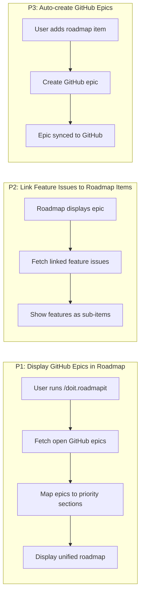
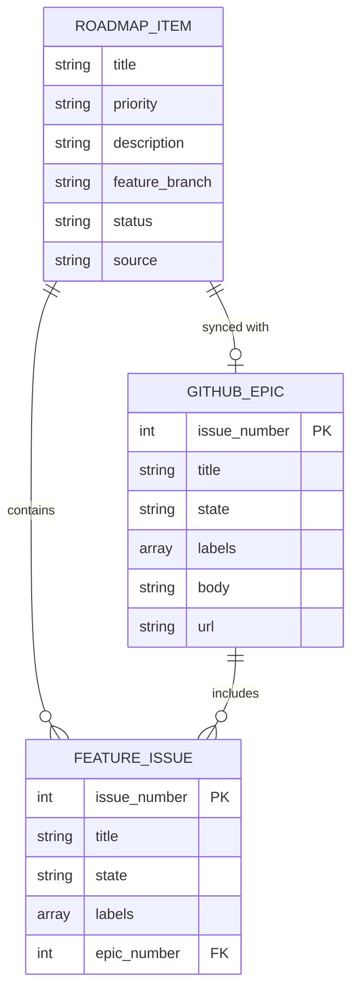

# Feature Specification: GitHub Epic and Issue Integration for Roadmap Command

**Feature Branch**: `[039-github-roadmap-sync]`
**Created**: 2026-01-21
**Status**: Complete
**Input**: User description: "GitHub epic and issue integration for roadmap command"

## User Scenarios & Testing *(mandatory)*

### User Story 1 - Display GitHub Epics in Roadmap (Priority: P1)

When a user runs `/doit.roadmapit`, the command automatically fetches open GitHub issues labeled as "epic" and displays them within the roadmap alongside manually added items. This provides a unified view of planned work regardless of where it was originally created.

**Why this priority**: This is the core functionality that enables roadmap synchronization with GitHub. Without this, users must manually duplicate information between GitHub and the roadmap file, leading to inconsistencies and extra maintenance overhead.

**Independent Test**: Can be fully tested by creating GitHub issues with "epic" label, running `/doit.roadmapit`, and verifying that the epics appear in the `.doit/memory/roadmap.md` file with proper formatting and priority mapping.

**Acceptance Scenarios**:

1. **Given** a GitHub repository with 3 open issues labeled "epic", **When** user runs `/doit.roadmapit`, **Then** all 3 epics appear in the roadmap with their titles, descriptions, and GitHub issue numbers
2. **Given** a GitHub repository with no remote configured, **When** user runs `/doit.roadmapit`, **Then** the command continues normally without GitHub integration and displays only local roadmap items
3. **Given** GitHub epics with priority labels (P1, P2, P3, P4), **When** user runs `/doit.roadmapit`, **Then** each epic is placed in the appropriate priority section of the roadmap
4. **Given** a closed GitHub epic, **When** user runs `/doit.roadmapit`, **Then** the closed epic does not appear in the active roadmap sections

---

### User Story 2 - Link Feature Issues to Roadmap Items (Priority: P2)

When displaying GitHub epics in the roadmap, the command also fetches and displays all feature issues that reference the epic (via "Part of Epic #XXX" or linked issues). This provides visibility into the work breakdown for each roadmap item.

**Why this priority**: This adds valuable context to roadmap items by showing their constituent features, but the roadmap is still useful without this detail. Users can navigate to GitHub to see linked issues if needed.

**Independent Test**: Can be tested by creating an epic with 2-3 linked feature issues, running `/doit.roadmapit`, and verifying that the feature issues appear as sub-items under the epic in the roadmap.

**Acceptance Scenarios**:

1. **Given** a GitHub epic with 3 feature issues linked to it, **When** user runs `/doit.roadmapit`, **Then** the epic appears in the roadmap with all 3 feature issues listed as sub-items
2. **Given** a feature issue with "Part of Epic #123" in its description, **When** user runs `/doit.roadmapit`, **Then** the feature issue is associated with the corresponding epic in the roadmap
3. **Given** an epic with no linked features, **When** user runs `/doit.roadmapit`, **Then** the epic appears in the roadmap without sub-items
4. **Given** a feature issue with priority label, **When** displaying linked features, **Then** the priority is shown alongside the feature title

---

### User Story 3 - Auto-create GitHub Epics for Roadmap Items (Priority: P3)

When a user adds a new item to the roadmap using `/doit.roadmapit add [item]`, the command automatically creates a corresponding GitHub epic issue if GitHub is configured. This ensures bidirectional synchronization and provides a GitHub-native tracking mechanism.

**Why this priority**: This completes the bidirectional sync, but the core value (viewing GitHub epics in roadmap) is delivered by P1. This enhancement reduces manual work but is not essential for the initial integration.

**Independent Test**: Can be tested by running `/doit.roadmapit add "New feature X"`, then checking GitHub to verify an epic issue was created with appropriate labels and content.

**Acceptance Scenarios**:

1. **Given** GitHub is configured, **When** user runs `/doit.roadmapit add "New dashboard feature"`, **Then** a new GitHub issue is created with label "epic" and title matching the roadmap item
2. **Given** user specifies priority P2 when adding an item, **When** creating the GitHub epic, **Then** the epic includes a "priority:P2" label
3. **Given** GitHub is not configured, **When** user adds a roadmap item, **Then** the item is added to the local roadmap without attempting to create a GitHub issue
4. **Given** GitHub API returns an error, **When** creating an epic, **Then** the roadmap item is still added locally and the user is notified about the GitHub failure

---

### Edge Cases

- What happens when GitHub authentication fails or rate limits are hit?
  - Command degrades gracefully: displays local roadmap items and shows warning about GitHub sync failure
  - Cached GitHub data from previous sync is used if available

- How does the system handle epics with invalid or missing priority labels?
  - Epics without priority labels default to P3 (medium priority)
  - Epics with unrecognized labels are placed in P3 with a note about the original label

- What happens when a roadmap item exists locally but not in GitHub?
  - Local items are preserved and displayed alongside GitHub epics
  - User is optionally prompted to create GitHub epic for untracked items

- How are conflicts handled when both local and GitHub have same-named items?
  - GitHub epic takes precedence if it has a feature branch reference matching local item
  - Otherwise, both are displayed with indicators showing the source (local vs GitHub)

## User Journey Visualization

<!--
  AUTO-GENERATED: This section is populated by /doit.specit based on user stories above.
  The flowchart shows each user story as a subgraph with key actions.
  Regenerate by running /doit.specit again.
-->

<!-- BEGIN:AUTO-GENERATED section="user-journey" -->

<!-- END:AUTO-GENERATED -->

## Entity Relationships *(include if Key Entities defined)*

<!--
  AUTO-GENERATED: This section is populated by /doit.specit when Key Entities are defined.
  Shows entity relationships as an ER diagram.
  If no entities are defined, this entire section should be omitted (not left empty).
-->

<!-- BEGIN:AUTO-GENERATED section="entity-relationships" -->

<!-- END:AUTO-GENERATED -->

## Requirements *(mandatory)*

### Functional Requirements

- **FR-001**: System MUST detect if GitHub remote is configured before attempting GitHub integration
- **FR-002**: System MUST fetch all open GitHub issues with label "epic" when `/doit.roadmapit` is executed
- **FR-003**: System MUST map GitHub epic priority labels (priority:P1, priority:P2, priority:P3, priority:P4) to roadmap priority sections
- **FR-004**: System MUST display GitHub epics in the roadmap alongside locally defined items in a visually distinguishable manner
- **FR-005**: System MUST fetch feature issues linked to each epic via GitHub issue relationships or "Part of Epic #XXX" pattern in issue body
- **FR-006**: System MUST display linked feature issues as sub-items under their parent epic in the roadmap
- **FR-007**: System MUST preserve all existing local roadmap items when displaying GitHub epics
- **FR-008**: System MUST create a GitHub epic issue when user adds a roadmap item via `/doit.roadmapit add [item]` (P3 story)
- **FR-009**: System MUST apply appropriate labels to created GitHub epics (epic, priority:PX) based on roadmap item priority
- **FR-010**: System MUST handle GitHub authentication failures gracefully without blocking roadmap operations
- **FR-011**: System MUST cache GitHub epic data to support offline viewing of previously synced items
- **FR-012**: System MUST update roadmap item status (pending/in-progress/completed) based on GitHub epic state when sync is performed
- **FR-013**: System MUST support a `--skip-github` flag to disable GitHub integration for a single command execution
- **FR-014**: System MUST link roadmap items to GitHub epics using feature branch references [###-feature-name]
- **FR-015**: System MUST display GitHub issue URLs alongside epic titles in the roadmap for quick navigation

### Key Entities *(include if feature involves data)*

- **Roadmap Item**: Represents a planned feature or requirement with title, priority (P1-P4), status, rationale, and optional feature branch reference. May originate from local roadmap file or GitHub epic.
- **GitHub Epic**: GitHub issue with "epic" label that represents a high-level feature or initiative. Contains issue number, title, state (open/closed), labels (including priority), description, and linked feature issues.
- **Feature Issue**: GitHub issue with "feature" label that represents a specific piece of work contributing to an epic. Contains issue number, title, state, labels, and reference to parent epic.
- **Sync Metadata**: Tracking information for GitHub integration including last sync timestamp, cached epic data, sync status, and authentication state.

## Success Criteria *(mandatory)*

### Measurable Outcomes

- **SC-001**: Users can view all open GitHub epics within the roadmap without manually checking GitHub issues (100% of open epics are displayed)
- **SC-002**: Roadmap sync completes in under 5 seconds for repositories with up to 50 open epics
- **SC-003**: Zero data loss of local roadmap items when GitHub integration is active (all local items preserved after sync)
- **SC-004**: 95% reduction in manual effort to maintain roadmap-GitHub consistency (measured by time spent on duplicate entry and status updates)
- **SC-005**: Users can successfully use the roadmap command offline or without GitHub configured (graceful degradation works 100% of the time)
- **SC-006**: Feature issues are correctly associated with their parent epics in 100% of cases when using standard linking patterns

### Assumptions

- GitHub epics use standard label naming: "epic", "priority:P1", "priority:P2", "priority:P3", "priority:P4"
- Feature issues link to epics using either GitHub issue relationships or "Part of Epic #XXX" pattern in issue body
- Users have GitHub CLI (`gh`) installed and authenticated for GitHub operations
- Roadmap priority levels (P1-P4) map directly to GitHub priority labels
- GitHub API rate limits allow fetching all epics and their linked issues in a single sync operation (typically sufficient for projects with <100 open issues)
- Local roadmap file format remains consistent with existing structure (priority sections, markdown formatting)
