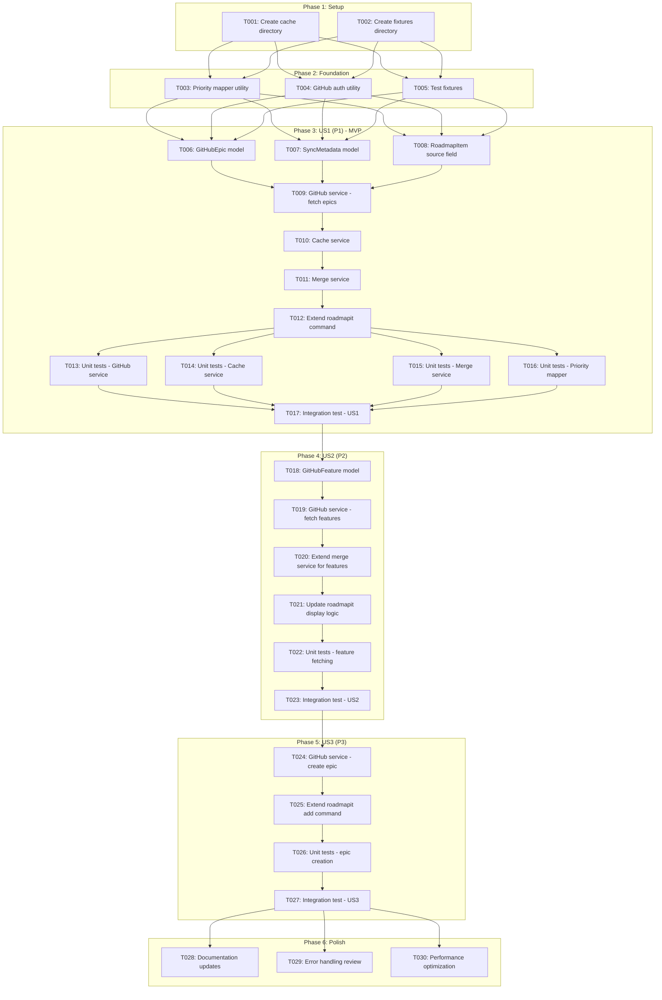
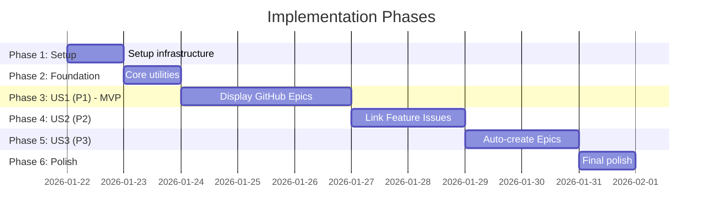

# Tasks: GitHub Epic and Issue Integration for Roadmap Command

**Input**: Design documents from `/specs/039-github-roadmap-sync/`
**Prerequisites**: plan.md, spec.md, research.md, data-model.md, contracts/github_api.yaml

**Tests**: Unit and integration tests are included per constitution requirement (Quality Standards: "All code MUST include tests")

**Organization**: Tasks are grouped by user story to enable independent implementation and testing of each story.

## Task Dependencies

<!--
  AUTO-GENERATED: This section is populated by /doit.taskit based on task relationships.
  The flowchart shows task execution order and parallel opportunities.
  Regenerate by running /doit.taskit again.
-->

<!-- BEGIN:AUTO-GENERATED section="task-dependencies" -->

<!-- END:AUTO-GENERATED -->

## Phase Timeline

<!--
  AUTO-GENERATED: This section is populated by /doit.taskit based on phase structure.
  The gantt chart shows estimated phase durations and dependencies.
  Regenerate by running /doit.taskit again.
-->

<!-- BEGIN:AUTO-GENERATED section="phase-timeline" -->

<!-- END:AUTO-GENERATED -->

## Format: `[ID] [P?] [Story] Description`

- **[P]**: Can run in parallel (different files, no dependencies)
- **[Story]**: Which user story this task belongs to (e.g., US1, US2, US3)
- Include exact file paths in descriptions

## Path Conventions

- Single project structure at repository root
- Source: `src/doit_toolkit_cli/`
- Tests: `tests/`

---

## Phase 1: Setup (Shared Infrastructure)

**Purpose**: Project initialization and directory structure for GitHub integration

- [x] T001 Create cache directory structure at `.doit/cache/` for storing GitHub epic data
- [x] T002 [P] Create test fixtures directory at `tests/fixtures/` for mock GitHub API responses

---

## Phase 2: Foundational (Blocking Prerequisites)

**Purpose**: Core utilities that MUST be complete before ANY user story can be implemented

**⚠️ CRITICAL**: No user story work can begin until this phase is complete

- [x] T003 [P] Implement priority mapper utility in `src/doit_toolkit_cli/utils/priority_mapper.py` with label-to-priority mapping logic (P1/P2/P3/P4)
- [x] T004 [P] Implement GitHub auth detection utility in `src/doit_toolkit_cli/utils/github_auth.py` to detect GitHub remote and gh CLI availability
- [x] T005 [P] Create mock GitHub API response fixtures in `tests/fixtures/github_responses.json` with sample epic and feature issue data

**Checkpoint**: Foundation ready - user story implementation can now begin in parallel

---

## Phase 3: User Story 1 - Display GitHub Epics in Roadmap (Priority: P1) 🎯 MVP

**Goal**: Users can run `/doit.roadmapit` and see open GitHub epics displayed within the roadmap alongside manually added items, with proper priority mapping and graceful offline fallback.

**Independent Test**: Create GitHub issues with "epic" label, run `/doit.roadmapit`, and verify epics appear in `.doit/memory/roadmap.md` with proper formatting and priority mapping. Test offline mode with cached data.

### Implementation for User Story 1

- [x] T006 [P] [US1] Create GitHubEpic model in `src/doit_toolkit_cli/models/github_epic.py` with number, title, state, labels, body, url, created_at, updated_at fields
- [x] T007 [P] [US1] Create SyncMetadata model in `src/doit_toolkit_cli/models/sync_metadata.py` for tracking last_sync, ttl_minutes, cache_version, is_valid
- [x] T008 [P] [US1] Add source field (local/github/merged) to RoadmapItem model in `src/doit_toolkit_cli/models/roadmap.py` plus github_number and github_url fields
- [x] T009 [US1] Implement fetch_epics() method in `src/doit_toolkit_cli/services/github_service.py` using gh CLI to list open issues with "epic" label (depends on T003, T004)
- [x] T010 [US1] Implement GitHubCacheService in `src/doit_toolkit_cli/services/github_cache_service.py` with load_cache, save_cache, is_valid, invalidate methods using `.doit/cache/github_epics.json`
- [x] T011 [US1] Implement RoadmapMergeService in `src/doit_toolkit_cli/services/roadmap_merge_service.py` with merge_roadmap_items() logic matching by feature branch reference
- [x] T012 [US1] Extend roadmapit command in `src/doit_toolkit_cli/commands/roadmapit.py` to add --skip-github and --refresh flags, integrate GitHub service, cache service, and merge service

### Unit Tests for User Story 1

- [x] T013 [P] [US1] Unit tests for GitHub service in `tests/unit/test_github_roadmap_service.py` mocking subprocess calls to gh CLI (test fetch_epics success, failure, rate limit)
- [x] T014 [P] [US1] Unit tests for cache service in `tests/unit/test_github_cache_service.py` testing cache read/write, validation, TTL expiration, corruption handling
- [x] T015 [P] [US1] Unit tests for merge service in `tests/unit/test_roadmap_merge_service.py` testing merge logic with matched items, GitHub-only items, local-only items, conflicts
- [x] T016 [P] [US1] Unit tests for priority mapper in `tests/unit/test_priority_mapper.py` testing all label formats (priority:P1, P1, critical, etc) and default behavior

### Integration Test for User Story 1

- [x] T017 [US1] Integration test for end-to-end roadmapit workflow in `tests/integration/test_roadmapit_github.py` testing full cycle with mock GitHub API, cache population, offline mode (depends on T012-T016)

**Checkpoint**: At this point, User Story 1 should be fully functional - users can see GitHub epics in roadmap, cache works, offline mode degrades gracefully

---

## Phase 4: User Story 2 - Link Feature Issues to Roadmap Items (Priority: P2)

**Goal**: When displaying GitHub epics in the roadmap, also fetch and display linked feature issues as sub-items under their parent epic, providing visibility into work breakdown.

**Independent Test**: Create an epic with 2-3 linked feature issues, run `/doit.roadmapit`, and verify feature issues appear as sub-items under the epic in the roadmap with proper formatting.

### Implementation for User Story 2

- [x] T018 [US2] Create GitHubFeature model in `src/doit_toolkit_cli/models/github_feature.py` with number, title, state, labels, epic_number, url fields
- [x] T019 [US2] Implement fetch_features_for_epic() method in `src/doit_toolkit_cli/services/github_service.py` using gh CLI to search for issues with "Part of Epic #XXX" pattern
- [x] T020 [US2] Extend merge_roadmap_items() in `src/doit_toolkit_cli/services/roadmap_merge_service.py` to include feature issues as sub-items under epics
- [x] T021 [US2] Update roadmap display logic in `src/doit_toolkit_cli/commands/roadmapit.py` to format and display feature issues as sub-items with indentation

### Unit Tests for User Story 2

- [x] T022 [P] [US2] Unit tests for feature fetching in `tests/unit/test_github_service.py` testing fetch_features_for_epic with various linking patterns (mocked gh CLI responses)

### Integration Test for User Story 2

- [x] T023 [US2] Integration test for feature linking in `tests/integration/test_roadmapit_github.py` testing epic with linked features displays correctly (depends on T018-T022)

**Checkpoint**: At this point, User Stories 1 AND 2 should both work - epics show with linked features as sub-items

---

## Phase 5: User Story 3 - Auto-create GitHub Epics for Roadmap Items (Priority: P3)

**Goal**: When a user adds a new item to the roadmap using `/doit.roadmapit add [item]`, automatically create a corresponding GitHub epic issue if GitHub is configured, completing bidirectional synchronization.

**Independent Test**: Run `/doit.roadmapit add "New feature X"`, then check GitHub to verify an epic issue was created with appropriate labels (epic, priority:PX) and content.

### Implementation for User Story 3

- [x] T024 [US3] Implement create_epic() method in `src/doit_toolkit_cli/services/github_service.py` using gh CLI to create GitHub issue with epic and priority labels
- [x] T025 [US3] Extend roadmapit add command in `src/doit_toolkit_cli/commands/roadmapit.py` to call create_epic when GitHub is configured, handle errors gracefully
- [x] T026 [P] [US3] Unit tests for epic creation in `tests/unit/test_github_service.py` testing create_epic with success, GitHub not configured, API error scenarios

### Integration Test for User Story 3

- [x] T027 [US3] Integration test for epic creation in `tests/integration/test_roadmapit_github.py` testing roadmapit add creates GitHub epic and links it to roadmap item (depends on T024-T026)

**Checkpoint**: All user stories should now be independently functional - full bidirectional sync between roadmap and GitHub

---

## Phase 6: Polish & Cross-Cutting Concerns

**Purpose**: Improvements that affect multiple user stories or finalize the feature

- [x] T028 [P] Update command help text and user-facing documentation in `src/doit_toolkit_cli/commands/roadmapit.py` to document new flags (--skip-github, --refresh)
- [x] T029 [P] Review error handling across all GitHub integration points ensuring graceful degradation, helpful error messages, and proper logging
- [x] T030 [P] Performance optimization: verify <5 second sync time for 50 epics, <2 second cached mode per success criteria in spec.md

---

## Dependencies & Execution Order

### Phase Dependencies

- **Setup (Phase 1)**: No dependencies - can start immediately
- **Foundational (Phase 2)**: Depends on Setup completion - BLOCKS all user stories
- **User Stories (Phase 3-5)**: All depend on Foundational phase completion
  - User Story 1 (P1): Can start after Foundational - No dependencies on other stories
  - User Story 2 (P2): Can start after US1 complete - Extends US1 functionality
  - User Story 3 (P3): Can start after US1 complete - Adds write capability to US1's read functionality
- **Polish (Phase 6)**: Depends on all user stories being complete

### User Story Dependencies

- **User Story 1 (P1)**: Can start after Foundational (Phase 2) - No dependencies on other stories - **THIS IS THE MVP**
- **User Story 2 (P2)**: Should complete after US1 - Extends epic display with feature sub-items
- **User Story 3 (P3)**: Should complete after US1 - Adds epic creation to complement epic reading

### Within Each User Story

- Models first (can be parallel if independent)
- Services after models (depend on model definitions)
- Command modifications after services (depend on service implementations)
- Unit tests in parallel with or after implementation
- Integration test last (depends on all implementations for that story)

### Parallel Opportunities

- Phase 1: Both tasks (T001, T002) can run in parallel
- Phase 2: All three tasks (T003, T004, T005) can run in parallel
- Phase 3: Models (T006, T007, T008) can run in parallel; Unit tests (T013-T016) can run in parallel
- Phase 4: T022 can run in parallel with other unit tests
- Phase 5: T026 can run in parallel with other unit tests
- Phase 6: All three tasks (T028, T029, T030) can run in parallel

---

## Parallel Example: User Story 1

```bash
# Launch all models for User Story 1 together:
Task: "Create GitHubEpic model in src/doit_toolkit_cli/models/github_epic.py"
Task: "Create SyncMetadata model in src/doit_toolkit_cli/models/sync_metadata.py"
Task: "Add source field to RoadmapItem model in src/doit_toolkit_cli/models/roadmap.py"

# Launch all unit tests for User Story 1 together:
Task: "Unit tests for GitHub service in tests/unit/test_github_service.py"
Task: "Unit tests for cache service in tests/unit/test_github_cache_service.py"
Task: "Unit tests for merge service in tests/unit/test_roadmap_merge_service.py"
Task: "Unit tests for priority mapper in tests/unit/test_priority_mapper.py"
```

---

## Implementation Strategy

### MVP First (User Story 1 Only)

1. Complete Phase 1: Setup (0.5 day)
2. Complete Phase 2: Foundational (1 day) - CRITICAL - blocks all stories
3. Complete Phase 3: User Story 1 (3 days)
4. **STOP and VALIDATE**: Test User Story 1 independently
5. Deploy/demo basic GitHub epic sync capability

**MVP Delivery**: After Phase 3, users can view GitHub epics in their roadmap with caching and offline support. This is a complete, useful feature on its own.

### Incremental Delivery

1. Complete Setup + Foundational → Foundation ready (1.5 days)
2. Add User Story 1 → Test independently → Deploy/Demo (MVP! - 3 days)
3. Add User Story 2 → Test independently → Deploy/Demo (2 days - now shows feature breakdown)
4. Add User Story 3 → Test independently → Deploy/Demo (1.5 days - now bidirectional sync)
5. Polish → Final release (0.5 days)

**Total estimated time**: ~8.5 days for full feature with all three user stories

### Parallel Team Strategy

With multiple developers after Foundational phase completes:

**Option 1: Sequential (Single Developer)**
- Day 1-1.5: Setup + Foundational
- Day 2-4.5: User Story 1 (MVP)
- Day 5-6.5: User Story 2
- Day 7-8.5: User Story 3 + Polish

**Option 2: Parallel (2-3 Developers)**
- Day 1-1.5: Everyone completes Setup + Foundational together
- Day 2-4.5: Dev A focuses on US1 (blocking); Dev B writes extensive tests
- Day 5-6.5: Dev A on US2; Dev B on US3 (can work in parallel after US1)
- Day 7-8: Integration and polish

---

## Notes

- [P] tasks = different files, no dependencies - can run in parallel
- [Story] label maps task to specific user story for traceability
- Each user story should be independently completable and testable
- Constitution requires tests: all new code includes pytest unit and integration tests
- Commit after each task or logical group
- Stop at any checkpoint to validate story independently
- MVP scope = Phase 1 + Phase 2 + Phase 3 (User Story 1 only)
- Research decisions from research.md inform implementation: use gh CLI, 30min TTL cache, smart merge by feature branch reference
- Performance targets from spec.md: <5 sec sync for 50 epics, <2 sec cached mode
