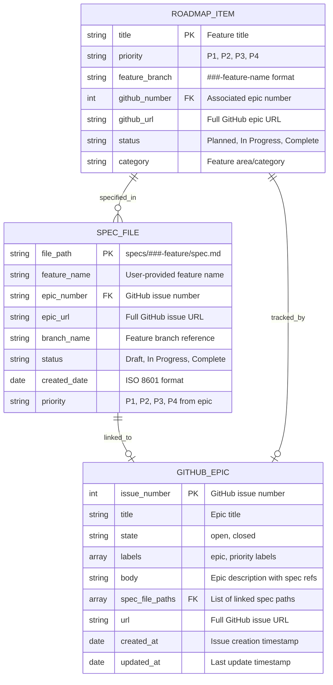
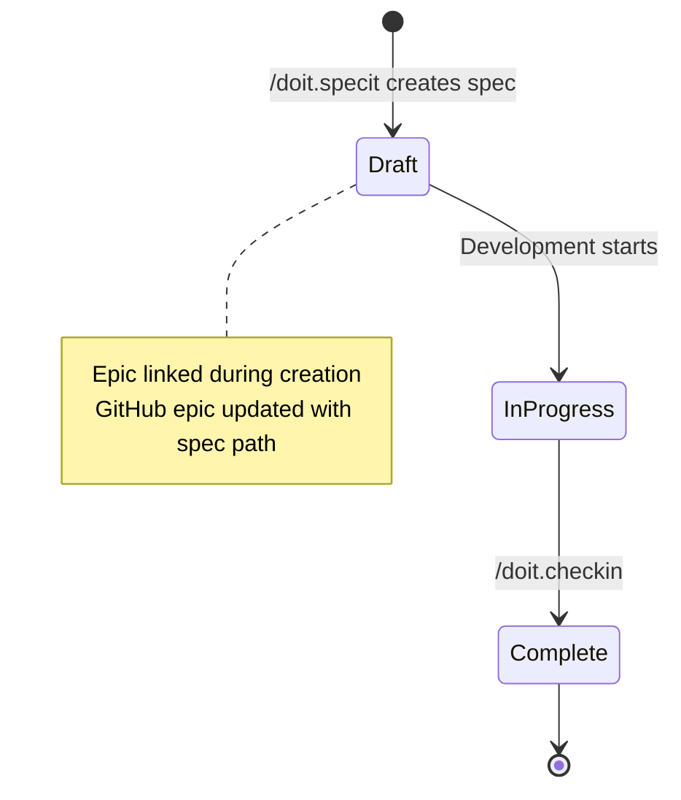
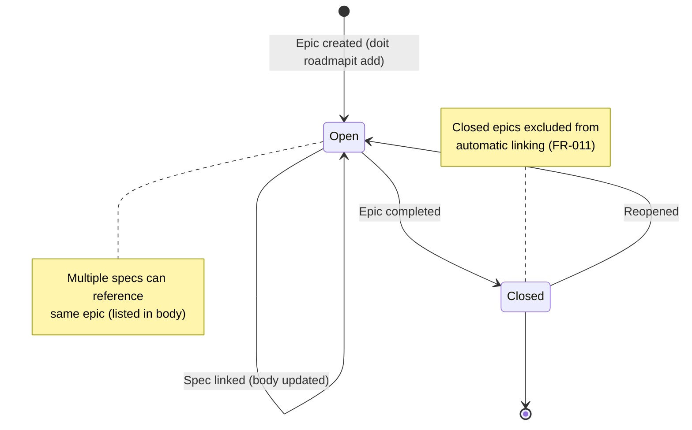

# Data Model: GitHub Issue Auto-linking in Spec Creation

**Feature**: 040-spec-github-linking
**Date**: 2026-01-22

## Entity Relationship Diagram

<!-- BEGIN:AUTO-GENERATED section="er-diagram" -->

<!-- END:AUTO-GENERATED -->

## Entity Definitions

### Spec File

**Description**: Markdown specification document with YAML frontmatter containing metadata about a feature implementation.

**Storage**: File system at `specs/[###-feature-name]/spec.md`

**Schema**:

```yaml
# YAML Frontmatter
Feature: "Feature name"
Branch: "[###-feature-name]"
Created: "2026-01-22"
Status: "Draft | In Progress | Complete"
Epic: "[#123](https://github.com/owner/repo/issues/123)"
Epic URL: "https://github.com/owner/repo/issues/123"
Priority: "P1 | P2 | P3 | P4"
```

**Validation Rules**:

- `file_path` MUST follow pattern `specs/###-feature-name/spec.md`
- `feature_name` MUST be non-empty string
- `epic_number` MUST be positive integer if present
- `epic_url` MUST be valid GitHub issue URL if present
- `branch_name` MUST follow pattern `###-feature-name`
- `status` MUST be one of: Draft, In Progress, Complete
- `created_date` MUST be valid ISO 8601 date
- `priority` MUST be one of: P1, P2, P3, P4 if present

**State Transitions**:

<!-- BEGIN:AUTO-GENERATED section="spec-state-machine" -->

<!-- END:AUTO-GENERATED -->

### GitHub Epic

**Description**: GitHub issue with "epic" label representing a high-level feature or initiative tracked in the project.

**Storage**: GitHub API (external system)

**Schema**:

```json
{
  "issue_number": 123,
  "title": "GitHub Issue Auto-linking in Spec Creation",
  "state": "open",
  "labels": ["epic", "priority:P1"],
  "body": "Epic description...\n\n## Specification\n\n- `specs/040-spec-github-linking/spec.md`",
  "spec_file_paths": ["specs/040-spec-github-linking/spec.md"],
  "url": "https://github.com/owner/repo/issues/123",
  "created_at": "2026-01-20T10:00:00Z",
  "updated_at": "2026-01-22T14:30:00Z"
}
```

**Validation Rules**:

- `issue_number` MUST be positive integer
- `title` MUST be non-empty string
- `state` MUST be one of: open, closed
- `labels` MUST include "epic" label
- `body` MAY contain "## Specification" section with spec paths
- `spec_file_paths` extracted from body, MUST be valid spec paths
- `url` MUST be valid GitHub issue URL
- `created_at` and `updated_at` MUST be valid ISO 8601 timestamps

**State Transitions**:

<!-- BEGIN:AUTO-GENERATED section="epic-state-machine" -->

<!-- END:AUTO-GENERATED -->

### Roadmap Item

**Description**: Entry in the project roadmap representing a planned or in-progress feature.

**Storage**: File system at `.doit/memory/roadmap.md` (markdown table)

**Schema**:

```markdown
| Title | Priority | Branch | GitHub | Status | Category |
|-------|----------|--------|--------|--------|----------|
| GitHub Issue Auto-linking | P1 | [040-spec-github-linking] | [#123](https://github.com/.../issues/123) | In Progress | Integration |
```

**Validation Rules**:

- `title` MUST be non-empty string, unique within roadmap
- `priority` MUST be one of: P1, P2, P3, P4
- `feature_branch` MUST follow pattern `[###-feature-name]`
- `github_number` MUST be positive integer if present
- `github_url` MUST be valid GitHub issue URL if present
- `status` MUST be one of: Planned, In Progress, Complete, Deferred
- `category` MAY be any string describing feature area

**Relationships**:

- One roadmap item MAY reference zero or one GitHub epic
- One roadmap item MAY have zero or many spec files
- One GitHub epic MAY be referenced by one or many roadmap items (edge case)

### Link Metadata

**Description**: Bidirectional relationship metadata connecting spec files and GitHub epics.

**Storage**: Distributed (spec frontmatter + epic body)

**Schema**:

In Spec Frontmatter:

```yaml
Epic: "[#123](https://github.com/owner/repo/issues/123)"
Epic URL: "https://github.com/owner/repo/issues/123"
```

In Epic Body:

```markdown
## Specification

- `specs/040-spec-github-linking/spec.md`
- `specs/040-spec-github-linking-v2/spec.md`
```

**Validation Rules**:

- Epic reference in spec MUST match actual GitHub issue number
- Spec path in epic MUST match actual file path
- Links SHOULD be bidirectional (spec→epic AND epic→spec)
- If link is broken (file moved, epic deleted), either side MAY be stale

**Synchronization**:

- Links created during `/doit.specit` command execution
- Links can be refreshed using `/doit.specit --update-links`
- No automatic synchronization (user must explicitly trigger updates)
- Stale links detected during `doit context show` (future feature)

## Cardinality Rules

1. **Spec to Epic**: Many-to-One
   - Multiple specs MAY reference the same epic (e.g., spec.md and spec-v2.md)
   - Each spec references at most one epic

2. **Roadmap to Epic**: Many-to-One
   - Multiple roadmap items MAY reference the same epic (edge case, not recommended)
   - Each roadmap item references at most one epic

3. **Roadmap to Spec**: One-to-Many
   - One roadmap item MAY have multiple spec files (e.g., redesign, iteration)
   - Each spec is associated with one roadmap item (identified by feature name match)

## Data Access Patterns

### Read Operations

1. **Find Roadmap Item by Feature Name**:
   - Input: User-provided feature name string
   - Process: Parse `.doit/memory/roadmap.md`, fuzzy match on title column
   - Output: Best matching roadmap item or top 3 candidates
   - Performance: O(n) where n = number of roadmap items, cache result

2. **Get Epic Details by Number**:
   - Input: GitHub issue number
   - Process: Call `gh api repos/{owner}/{repo}/issues/{number}`
   - Output: Epic JSON with title, labels, state, body
   - Performance: 200-500ms API call, cache for 5 minutes

3. **Parse Spec Frontmatter**:
   - Input: Spec file path
   - Process: Read file, parse YAML frontmatter using PyYAML
   - Output: Dictionary of frontmatter fields
   - Performance: <10ms for typical spec file

### Write Operations

1. **Update Spec Frontmatter with Epic**:
   - Input: Spec file path, epic number, epic URL, priority
   - Process: Read file, parse frontmatter, add epic fields, write atomically
   - Output: Updated spec file
   - Performance: <50ms
   - Atomicity: Use temp file + atomic rename

2. **Update Epic Body with Spec Path**:
   - Input: Epic number, spec file path
   - Process: Read epic body via API, append spec path to "## Specification" section, update via `gh issue edit`
   - Output: Updated epic on GitHub
   - Performance: 500-1000ms (2 API calls: read + write)
   - Error Handling: Retry once on API failure, log warning if fails

3. **Add Roadmap Item Entry**:
   - Input: Feature title, priority, GitHub number (optional)
   - Process: Append row to roadmap markdown table
   - Output: Updated roadmap.md
   - Performance: <20ms
   - Note: Handled by feature 039-github-roadmap-sync

## Caching Strategy

### Roadmap Cache

- **Scope**: In-memory, per command execution
- **Implementation**: Python `@lru_cache` decorator on parse function
- **TTL**: Duration of command (cleared on exit)
- **Invalidation**: Automatic on command completion

### GitHub API Cache

- **Scope**: In-memory, per command execution
- **Implementation**: Dictionary with timestamp metadata
- **TTL**: 5 minutes (FR-024)
- **Invalidation**: Check timestamp on each access, clear stale entries

### Spec File Cache

- **Scope**: No caching (files are small, reads are infrequent)
- **Rationale**: Avoid stale data risk, file I/O is fast enough

## Migration Considerations

### Adding Epic Links to Existing Specs

When this feature is deployed, existing specs won't have epic references. Users can:

1. Run `/doit.specit --update-links` to scan all specs and add epic references
2. Manually add epic fields to spec frontmatter
3. Leave specs without epic links (optional feature)

No automatic migration required - feature is additive.

### Handling Roadmap Format Changes

If roadmap format changes (e.g., new columns added by future features):

- Parser MUST be resilient to missing columns (use defaults)
- Parser MUST ignore unknown columns (forward compatibility)
- Add versioning to roadmap file if format changes significantly

## Constraints

1. **GitHub Rate Limits**: 5,000 requests/hour for authenticated users
   - Mitigation: Cache API responses, batch operations when possible

2. **File System Consistency**: Multiple processes may access roadmap.md
   - Mitigation: Use file locking if concurrent writes are possible
   - Current: Not needed (CLI is single-user, single-process)

3. **Network Availability**: GitHub API may be unreachable
   - Mitigation: All GitHub operations are non-blocking, fail gracefully

4. **Epic Deletion**: GitHub epic may be deleted after linking
   - Mitigation: Detect 404 errors, warn user, offer to unlink or create new epic

## Future Enhancements

1. **Bidirectional Sync**: Automatically update spec when epic labels change
2. **Link Validation**: `doit spec validate-links` command to check for broken references
3. **Epic Dashboard**: `doit epic list` to show all epics with linked specs
4. **Spec History**: Track epic changes over time in spec metadata
