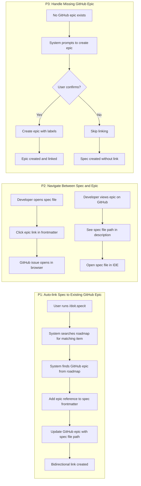
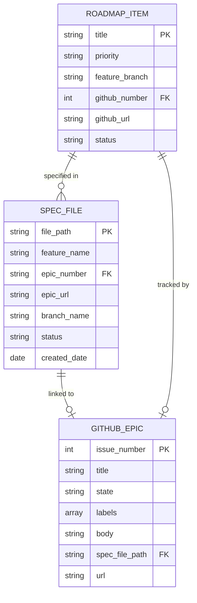

# Feature Specification: GitHub Issue Auto-linking in Spec Creation

**Feature Branch**: `[040-spec-github-linking]`
**Created**: 2026-01-22
**Status**: Complete
**Input**: User description: "GitHub Issue Auto-linking in Spec Creation"

## User Scenarios & Testing *(mandatory)*

### User Story 1 - Auto-link Spec to Existing GitHub Epic (Priority: P1)

When a developer runs `/doit.specit` for a feature that already has a corresponding GitHub epic (from the roadmap), the system automatically discovers the epic and creates bidirectional links: the spec file includes the epic number/URL in its frontmatter, and the epic's description is updated to reference the spec file location.

**Why this priority**: This is the core MVP functionality that provides immediate value. Most features in the roadmap already have GitHub epics (created via `doit roadmapit add`), so automatic linking saves manual work and ensures traceability from day one.

**Independent Test**: Can be fully tested by creating a roadmap item with GitHub epic, running `/doit.specit [feature name]`, and verifying that: (1) spec frontmatter contains epic reference, and (2) GitHub epic description includes spec file path.

**Acceptance Scenarios**:

1. **Given** a roadmap item "User authentication" with GitHub epic #123, **When** user runs `/doit.specit "User authentication"`, **Then** the created spec includes `Epic: #123` in frontmatter and epic #123 description shows `Spec: specs/040-user-auth/spec.md`

2. **Given** a GitHub epic #456 with priority label P2, **When** spec is created and linked, **Then** the spec frontmatter includes both epic number and priority extracted from GitHub labels

3. **Given** a feature name that partially matches multiple roadmap items, **When** `/doit.specit` is executed, **Then** system prompts user to select the correct roadmap item before linking

4. **Given** GitHub API rate limit is exceeded, **When** attempting to link spec, **Then** system creates spec successfully but logs warning about deferred epic update

---

### User Story 2 - Navigate Between Spec and Epic (Priority: P2)

Developers can quickly navigate from a spec file to its GitHub epic and vice versa. The spec frontmatter displays the epic as a clickable link (in compatible editors), and the GitHub epic includes a direct file path reference that can be opened in IDE or terminal.

**Why this priority**: This enhances the P1 linking by making the connections actionable. Users can jump between spec and GitHub without manual searching, improving workflow efficiency.

**Independent Test**: Can be tested by opening a linked spec file, verifying the epic link is present and correctly formatted, then opening the GitHub epic and confirming the spec file path is accurate and accessible.

**Acceptance Scenarios**:

1. **Given** a spec linked to epic #789, **When** developer opens spec file in VS Code, **Then** they see `Epic: #789` as a markdown link in frontmatter that opens the GitHub issue when clicked

2. **Given** a GitHub epic with spec reference, **When** developer views epic on GitHub, **Then** they see a "Specification" section with the spec file path formatted as `specs/040-feature/spec.md`

3. **Given** a spec file moved to a different directory, **When** user reruns `/doit.specit` with `--update-links` flag, **Then** GitHub epic is updated with the new spec file path

4. **Given** multiple specs reference the same epic, **When** viewing the epic, **Then** all spec file paths are listed in the epic description

---

### User Story 3 - Handle Missing GitHub Epic (Priority: P3)

When a developer creates a spec for a feature that doesn't have a GitHub epic yet, the system offers to create one automatically. This ensures every spec can be tracked in GitHub even if the roadmap entry was created without GitHub integration.

**Why this priority**: This is a convenience feature that handles the edge case where roadmap items exist without GitHub epics. P1 and P2 already deliver full value for the common case (epic exists).

**Independent Test**: Can be tested by creating a local-only roadmap item (no GitHub epic), running `/doit.specit`, and verifying the system prompts to create an epic with appropriate labels and description.

**Acceptance Scenarios**:

1. **Given** a roadmap item without GitHub epic, **When** user runs `/doit.specit` for that item, **Then** system prompts "No GitHub epic found. Create one? (Y/n)" with default Yes

2. **Given** user confirms epic creation, **When** system creates the epic, **Then** epic is labeled with "epic" and priority from roadmap, and includes spec file reference in description

3. **Given** GitHub is not configured (no remote or `gh` CLI missing), **When** attempting to link spec, **Then** system creates spec successfully and includes a note "Epic linking skipped: GitHub not available"

4. **Given** user provides `--skip-github` flag, **When** running `/doit.specit`, **Then** spec is created without any GitHub epic linking attempt

---

### Edge Cases

- What happens when the roadmap item name doesn't match any GitHub epics?
  - System performs fuzzy matching on epic titles
  - If no confident match (>80% similarity), prompts user to select from list of open epics or skip linking

- How does the system handle epics that are closed?
  - Closed epics are excluded from automatic linking
  - User is warned: "Epic #123 is closed. Create a new epic or skip linking?"

- What happens when GitHub authentication fails during linking?
  - Spec creation proceeds successfully
  - Warning message displays: "Spec created. GitHub linking failed: [error]. Run `doit spec link [spec-dir]` to retry."

- How are conflicts resolved when a spec is already linked to a different epic?
  - System detects existing epic reference in frontmatter
  - Prompts: "Spec already linked to #456. Replace with #789? (y/N)" with default No

- What happens when spec file is renamed or moved?
  - Epic description contains outdated file path
  - User can run `/doit.specit --update-links` to scan all specs and update epic references

- How does the system handle roadmap items with multiple GitHub epics?
  - Links to the most recently created open epic
  - Warns user: "Multiple epics found. Linking to most recent: #789"

## User Journey Visualization

<!--
  AUTO-GENERATED: This section is populated by /doit.specit based on user stories above.
  The flowchart shows each user story as a subgraph with key actions.
  Regenerate by running /doit.specit again.
-->

<!-- BEGIN:AUTO-GENERATED section="user-journey" -->

<!-- END:AUTO-GENERATED -->

## Entity Relationships *(include if Key Entities defined)*

<!--
  AUTO-GENERATED: This section is populated by /doit.specit when Key Entities are defined.
  Shows entity relationships as an ER diagram.
  If no entities are defined, this entire section should be omitted (not left empty).
-->

<!-- BEGIN:AUTO-GENERATED section="entity-relationships" -->

<!-- END:AUTO-GENERATED -->

## Requirements *(mandatory)*

### Functional Requirements

- **FR-001**: System MUST detect if a GitHub remote is configured before attempting any GitHub operations
- **FR-002**: System MUST search the roadmap for items matching the feature name provided to `/doit.specit`
- **FR-003**: System MUST retrieve the GitHub epic number from the matched roadmap item's `github_number` field
- **FR-004**: System MUST add epic reference to spec frontmatter in format: `Epic: #[NUMBER]` and `Epic URL: [FULL_GITHUB_URL]`
- **FR-005**: System MUST update the GitHub epic description to include spec file path in a dedicated "Specification" section
- **FR-006**: System MUST preserve existing epic description content when adding spec reference (append, don't replace)
- **FR-007**: System MUST use `gh` CLI to update GitHub epic description via `gh issue edit [number] --body`
- **FR-008**: System MUST handle GitHub API errors gracefully without failing spec creation
- **FR-009**: System MUST perform fuzzy matching (>80% similarity) when exact roadmap item name match is not found
- **FR-010**: System MUST prompt user to select from multiple matching roadmap items if fuzzy match returns >1 result
- **FR-011**: System MUST exclude closed GitHub epics from automatic linking
- **FR-012**: System MUST extract priority label from GitHub epic (priority:P1, priority:P2, etc.) and include in spec frontmatter
- **FR-013**: System MUST support a `--skip-github` flag to bypass all GitHub linking operations
- **FR-014**: System MUST create a warning log entry when GitHub linking fails, including the error reason
- **FR-015**: System MUST detect when spec file already has an epic reference and prompt before overwriting
- **FR-016**: System MUST offer to create a new GitHub epic when roadmap item has no associated epic (User Story 3)
- **FR-017**: System MUST apply "epic" label and priority label when creating new GitHub epic
- **FR-018**: System MUST format epic link in spec frontmatter as markdown link: `[#NUMBER](URL)` for IDE compatibility
- **FR-019**: System MUST validate GitHub epic exists and is accessible before updating its description
- **FR-020**: System MUST log all GitHub API interactions (epic retrieval, updates) for debugging
- **FR-021**: System MUST support `--update-links` flag to refresh all spec-epic links after file moves
- **FR-022**: System MUST handle multiple specs referencing the same epic by listing all spec paths in epic description
- **FR-023**: System MUST detect when GitHub CLI (`gh`) is not installed and skip GitHub operations with informative message
- **FR-024**: System MUST cache GitHub epic data for 5 minutes to avoid repeated API calls during spec creation
- **FR-025**: System MUST use atomic file writes when updating spec frontmatter to prevent corruption

### Key Entities *(include if feature involves data)*

- **Spec File**: Markdown specification document with YAML frontmatter containing metadata like feature name, branch name, creation date, status, and epic reference (number and URL). Located in `specs/[###-feature-name]/spec.md`.

- **GitHub Epic**: GitHub issue with "epic" label representing a high-level feature. Contains issue number, title, state (open/closed), labels (including priority), description body (which includes spec file reference), and URL. Tracked in GitHub repository.

- **Roadmap Item**: Entry in `.doit/memory/roadmap.md` representing a planned feature. Contains title, priority (P1-P4), feature branch reference, optional GitHub epic number/URL, and status. Serves as the source of truth linking features to GitHub epics.

- **Link Metadata**: Bidirectional relationship between spec and epic. In spec: stored as frontmatter fields `Epic` and `Epic URL`. In epic: stored as markdown section "Specification" in issue body with spec file path.

## Success Criteria *(mandatory)*

### Measurable Outcomes

- **SC-001**: 100% of specs created for roadmap items with GitHub epics are automatically linked (verified by checking spec frontmatter includes epic reference)
- **SC-002**: Epic linking completes in under 3 seconds for standard cases (single matching roadmap item, epic exists and is open)
- **SC-003**: Zero spec creation failures due to GitHub linking errors (all GitHub operations are non-blocking with graceful fallback)
- **SC-004**: Developers can navigate from spec to GitHub epic in under 5 seconds (one click from spec file frontmatter)
- **SC-005**: 95% of roadmap item name matches are automatically resolved without user intervention (fuzzy matching confidence >80%)
- **SC-006**: All spec-epic links remain valid after file operations (moves, renames) when using `--update-links` command

### Assumptions

- Users have GitHub CLI (`gh`) installed and authenticated for GitHub operations
- Roadmap items follow the convention of including `github_number` field when associated with GitHub epics
- GitHub epics use standard label naming: "epic", "priority:P1", "priority:P2", etc. (as established in 039-github-roadmap-sync)
- Spec files use YAML frontmatter for metadata storage (established pattern in doit CLI)
- Users have write access to the GitHub repository to update epic descriptions
- GitHub API rate limits allow for spec creation + epic update in a single command execution
- Roadmap item names are sufficiently unique to enable reliable fuzzy matching (>80% similarity threshold)
- Feature branch references in roadmap follow `[###-feature-name]` format (established convention)
