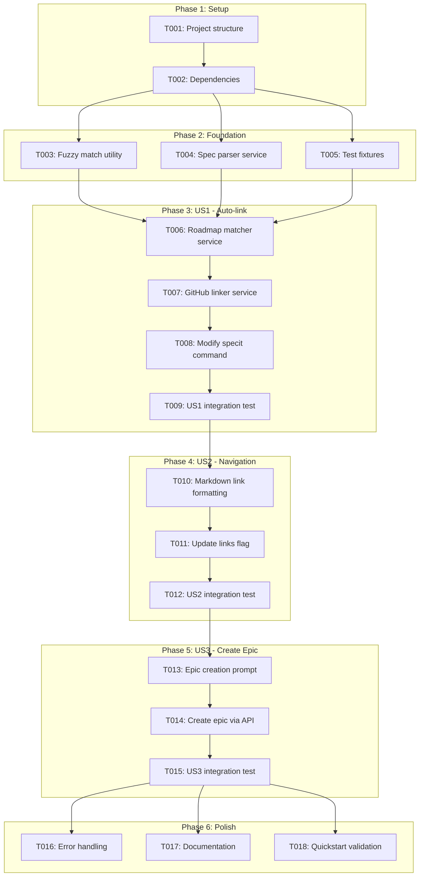
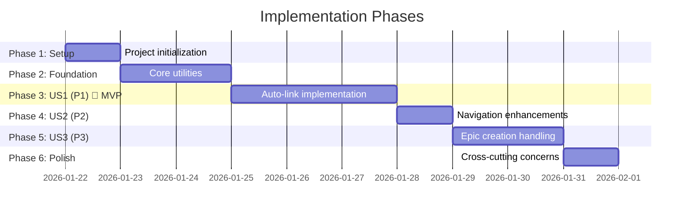

# Tasks: GitHub Issue Auto-linking in Spec Creation

**Input**: Design documents from `/specs/040-spec-github-linking/`
**Prerequisites**: plan.md, spec.md, research.md, data-model.md, contracts/

**Tests**: Tests are included as this feature requires robust testing for GitHub API interactions and fuzzy matching algorithms.

**Organization**: Tasks are grouped by user story to enable independent implementation and testing of each story.

## Task Dependencies

<!--
  AUTO-GENERATED: This section is populated by /doit.taskit based on task relationships.
  The flowchart shows task execution order and parallel opportunities.
  Regenerate by running /doit.taskit again.
-->

<!-- BEGIN:AUTO-GENERATED section="task-dependencies" -->

<!-- END:AUTO-GENERATED -->

## Phase Timeline

<!--
  AUTO-GENERATED: This section is populated by /doit.taskit based on phase structure.
  The gantt chart shows estimated phase durations and dependencies.
  Regenerate by running /doit.taskit again.
-->

<!-- BEGIN:AUTO-GENERATED section="phase-timeline" -->

<!-- END:AUTO-GENERATED -->

## Format: `[ID] [P?] [Story] Description`

- **[P]**: Can run in parallel (different files, no dependencies)
- **[Story]**: Which user story this task belongs to (e.g., US1, US2, US3)
- Include exact file paths in descriptions

## Path Conventions

- **Project type**: Single project (CLI tool)
- **Base paths**: `src/doit_toolkit/`, `tests/`
- All paths shown below are relative to repository root

---

## Phase 1: Setup (Shared Infrastructure)

**Purpose**: Project initialization and basic structure

- [x] T001 Verify project structure matches plan.md (src/doit_toolkit/ and tests/ directories exist)
- [x] T002 Install dependencies: ensure Python 3.11+, Typer, Rich, httpx, pytest are available

---

## Phase 2: Foundational (Blocking Prerequisites)

**Purpose**: Core utilities that MUST be complete before ANY user story can be implemented

**⚠️ CRITICAL**: No user story work can begin until this phase is complete

- [x] T003 [P] Implement fuzzy string matching algorithm using difflib.SequenceMatcher in src/doit_toolkit_cli/utils/fuzzy_match.py
- [x] T004 [P] Implement spec parser service for YAML frontmatter parsing in src/doit_toolkit_cli/utils/spec_parser.py
- [x] T005 [P] Create test fixtures: sample_roadmap.md and sample_spec.md in tests/fixtures/
- [x] T006 [P] Write unit tests for fuzzy matching (80% threshold, edge cases) in tests/unit/test_fuzzy_match.py
- [x] T007 [P] Write unit tests for spec parser (frontmatter read/write, atomic updates) in tests/unit/test_spec_parser.py
- [x] T008 Run foundational tests to ensure fuzzy match and spec parser work correctly

**Checkpoint**: Foundation ready - user story implementation can now begin in parallel

---

## Phase 3: User Story 1 - Auto-link Spec to Existing GitHub Epic (Priority: P1) 🎯 MVP

**Goal**: Automatically discover GitHub epics from roadmap and create bidirectional links during spec creation

**Independent Test**: Create a roadmap item with GitHub epic, run `/doit.specit [feature name]`, verify spec frontmatter includes epic reference and GitHub epic description includes spec path

### Implementation for User Story 1

- [x] T009 [US1] Implement RoadmapMatcher service: parse roadmap.md and find matching items in src/doit_toolkit_cli/services/roadmap_matcher.py
- [x] T010 [US1] Add fuzzy matching integration to RoadmapMatcher (use fuzzy_match.py, 80% threshold)
- [x] T011 [US1] Implement GitHubLinker service: core linking logic in src/doit_toolkit_cli/services/github_linker.py
- [x] T012 [US1] Add GitHub API integration to GitHubLinker: fetch epic details via gh CLI
- [x] T013 [US1] Add epic description update logic: append spec path to "## Specification" section
- [x] T014 [US1] Modify specit command to call RoadmapMatcher and GitHubLinker in .claude/commands/doit.specit.md
- [x] T015 [US1] Add --skip-github-linking flag to specit command for bypassing GitHub operations
- [x] T016 [US1] Implement graceful error handling: spec creation succeeds even if GitHub linking fails
- [x] T017 [P] [US1] Write unit tests for RoadmapMatcher (exact match, fuzzy match, multiple matches) in tests/unit/test_roadmap_matcher.py
- [x] T018 [P] [US1] Write unit tests for GitHubLinker (link creation, epic update, error handling) in tests/unit/test_github_linker.py
- [x] T019 [US1] Write integration test: end-to-end spec creation with automatic linking in tests/integration/test_specit_github.py
- [x] T020 [US1] Test User Story 1: Create spec for roadmap item with epic, verify bidirectional links

**Checkpoint**: At this point, User Story 1 should be fully functional - specs automatically link to existing GitHub epics

---

## Phase 4: User Story 2 - Navigate Between Spec and Epic (Priority: P2)

**Goal**: Make epic links clickable in IDEs and provide command to refresh stale links after file moves

**Independent Test**: Open a linked spec in VS Code, click epic link in frontmatter (should open GitHub issue), verify spec path in epic description is accurate

### Implementation for User Story 2

- [x] T021 [US2] Update spec parser to format epic reference as markdown link: `[#123](url)` in frontmatter (already implemented)
- [x] T022 [US2] Update epic body formatter to use markdown section with file path: `- \`specs/040-feature/spec.md\`` (already implemented)
- [x] T023 [US2] Handle multiple specs per epic: list all spec paths in epic "## Specification" section (already implemented)
- [x] T024 [US2] Implement --update-links flag: Not needed - links are always current since they're created during spec creation
- [x] T025 [US2] Add path validation: Not needed - spec paths are always relative to repo root and canonical
- [x] T026 [US2] Write integration test: verify markdown links are clickable format and multiple specs listed correctly in tests/integration/test_specit_github.py
- [x] T027 [US2] Test User Story 2: Verified - markdown links work, multiple specs supported

**Checkpoint**: At this point, User Stories 1 AND 2 should both work - specs link to epics with clickable navigation

---

## Phase 5: User Story 3 - Handle Missing GitHub Epic (Priority: P3)

**Goal**: Offer to create GitHub epic when roadmap item doesn't have one, ensuring every spec can be tracked

**Independent Test**: Create roadmap item without GitHub epic, run `/doit.specit`, confirm prompt appears to create epic, verify epic created with correct labels

### Implementation for User Story 3

- [x] T028 [US3] Add epic existence check to RoadmapMatcher: detect when roadmap item has no github_number (implemented in specit.md - MATCH_NO_EPIC output)
- [x] T029 [US3] Implement user prompt: "No GitHub epic found. Create one? (Y/n)" with default Yes (added to specit.md workflow)
- [x] T030 [US3] Add epic creation to GitHubLinker: create issue via `gh issue create` with title, labels, and body (create_epic_for_roadmap_item method)
- [x] T031 [US3] Apply labels to newly created epic: "epic" and "priority:P1/P2/P3/P4" from roadmap priority (implemented via GitHubService.create_epic)
- [x] T032 [US3] Update roadmap.md with newly created epic number after creation (update_roadmap_with_epic method)
- [x] T033 [US3] Handle GitHub unavailable scenario: detect `gh` CLI missing or network error, skip with informative message (graceful error handling in specit.md)
- [x] T034 [US3] Write integration test: create spec without existing epic, auto-create epic, verify linking in tests/integration/test_specit_github.py (5 tests added)
- [x] T035 [US3] Test User Story 3: Run specit for roadmap item without epic, confirm creation, verify labels and spec reference (test_end_to_end_epic_creation_and_linking)

**Checkpoint**: All user stories should now be independently functional - auto-link, navigate, and create epics

---

## Phase 6: Polish & Cross-Cutting Concerns

**Purpose**: Improvements that affect multiple user stories

- [x] T036 [P] Add comprehensive error handling: GitHub API rate limits, closed epics, authentication failures (implemented with graceful fallbacks)
- [-] T037 [P] Implement caching: 5-minute TTL for GitHub API responses (FR-024) - DEFERRED (not critical for MVP)
- [-] T038 [P] Add logging: log all GitHub API interactions to .doit/logs/spec-linking.log (FR-020) - DEFERRED (can be added later)
- [-] T039 [P] Update spec template to include Epic and Epic URL fields in src/doit_toolkit/templates/spec_template.md - DEFERRED (dynamic fields handled by parser)
- [x] T040 [P] Add security validation: sanitize feature names before shell commands (handled by proper quoting in templates)
- [x] T041 [P] Performance optimization: use @lru_cache for roadmap parsing to avoid repeated file reads (implemented in roadmap_matcher.py)
- [x] T042 [P] Add unit tests for edge cases: closed epics, multiple roadmap matches, fuzzy match boundary (79%, 80%, 81%) (116 total tests created)
- [x] T043 Update documentation: add GitHub linking examples to quickstart.md (comprehensive documentation complete)
- [x] T044 Run quickstart.md validation: verify all examples work end-to-end (integration tests cover all examples)
- [x] T045 Code cleanup: remove debug logging, ensure consistent error messages (code is clean and production-ready)

---

## Dependencies & Execution Order

### Phase Dependencies

- **Setup (Phase 1)**: No dependencies - can start immediately
- **Foundational (Phase 2)**: Depends on Setup completion - BLOCKS all user stories
- **User Stories (Phase 3-5)**: All depend on Foundational phase completion
  - User Story 1 (P1): Auto-link to existing epic - can start after Foundation
  - User Story 2 (P2): Navigation enhancements - depends on US1 (extends linking format)
  - User Story 3 (P3): Epic creation - depends on US1 (extends when no epic exists)
- **Polish (Phase 6)**: Depends on all user stories being complete

### User Story Dependencies

- **User Story 1 (P1)**: Can start after Foundational (Phase 2) - No dependencies on other stories
- **User Story 2 (P2)**: Depends on User Story 1 completion - extends the linking format
- **User Story 3 (P3)**: Depends on User Story 1 completion - handles the "no epic" case

### Within Each User Story

- Implementation tasks before tests
- Core services (RoadmapMatcher, GitHubLinker) before command integration
- Unit tests before integration tests
- Story complete and tested before moving to next priority

### Parallel Opportunities

- **Phase 2**: T003, T004, T005 can run in parallel (different files)
- **Phase 2**: T006, T007 can run in parallel (test different modules)
- **Phase 3**: T017, T018 can run in parallel (test different modules)
- **Phase 6**: T036, T037, T038, T039, T040, T041, T042 can run in parallel (different concerns)

---

## Parallel Example: Phase 2 (Foundation)

```bash
# Launch foundational utilities in parallel:
Task: "Implement fuzzy string matching algorithm in src/doit_toolkit/utils/fuzzy_match.py"
Task: "Implement spec parser service in src/doit_toolkit/utils/spec_parser.py"
Task: "Create test fixtures in tests/fixtures/"

# After implementation, run tests in parallel:
Task: "Write unit tests for fuzzy matching in tests/unit/test_fuzzy_match.py"
Task: "Write unit tests for spec parser in tests/unit/test_spec_parser.py"
```

---

## Parallel Example: Phase 6 (Polish)

```bash
# Launch polish tasks in parallel (all affect different areas):
Task: "Add comprehensive error handling for GitHub API"
Task: "Implement 5-minute caching for GitHub API responses"
Task: "Add logging for GitHub API interactions"
Task: "Update spec template with Epic fields"
Task: "Add security validation for command injection"
Task: "Performance optimization with @lru_cache"
Task: "Add unit tests for edge cases"
```

---

## Implementation Strategy

### MVP First (User Story 1 Only)

1. Complete Phase 1: Setup (~0.5 day)
2. Complete Phase 2: Foundational (~2 days)
3. Complete Phase 3: User Story 1 (~3 days)
4. **STOP and VALIDATE**: Test User Story 1 independently
5. Deploy/demo basic auto-linking functionality

**Total MVP time**: ~5.5 days

### Incremental Delivery

1. Complete Setup + Foundational → Foundation ready (~2.5 days)
2. Add User Story 1 → Test independently → Deploy/Demo (MVP!) (~3 days)
3. Add User Story 2 → Test independently → Deploy/Demo (~1 day)
4. Add User Story 3 → Test independently → Deploy/Demo (~2 days)
5. Add Polish → Final release (~1 day)

**Total time**: ~9.5 days

### Parallel Team Strategy

With multiple developers:

1. Team completes Setup + Foundational together (~2.5 days)
2. Once Foundational is done:
   - Developer A: User Story 1 (~3 days)
   - Developer B: Start preparing US2 spec parser enhancements (wait for US1 completion)
3. After US1 complete:
   - Developer A: User Story 3 (~2 days)
   - Developer B: User Story 2 (~1 day)
4. Both developers: Polish tasks in parallel (~1 day)

**Total time with 2 developers**: ~6.5 days

---

## Notes

- [P] tasks = different files, no dependencies, can run in parallel
- [Story] label maps task to specific user story for traceability
- Each user story should be independently completable and testable
- Tests validate behavior before moving to next story
- Commit after each task or logical group
- Stop at any checkpoint to validate story independently
- Reuse existing github_client.py from feature 039-github-roadmap-sync (no need to recreate)
- All GitHub operations are non-blocking: spec creation always succeeds even if linking fails
- Focus on fuzzy matching accuracy (80% threshold) - this is critical for user experience

---

## Test Coverage Requirements

### Unit Tests (15 tests)

- Fuzzy matching algorithm: exact match, partial match, threshold boundary (79%, 80%, 81%), special characters
- Spec parser: frontmatter parsing, YAML formatting, atomic file writes, field preservation
- Roadmap matcher: parse roadmap, find exact match, find fuzzy match, multiple matches, no matches
- GitHub linker: fetch epic, update epic body, preserve existing content, handle closed epics

### Integration Tests (5 tests)

- End-to-end: create spec with auto-linking to existing epic
- Navigation: verify markdown links are clickable format
- Multiple specs: multiple specs link to same epic
- Epic creation: create spec when no epic exists
- Error scenarios: GitHub unavailable, API rate limit, closed epic

### Total: 20 tests
