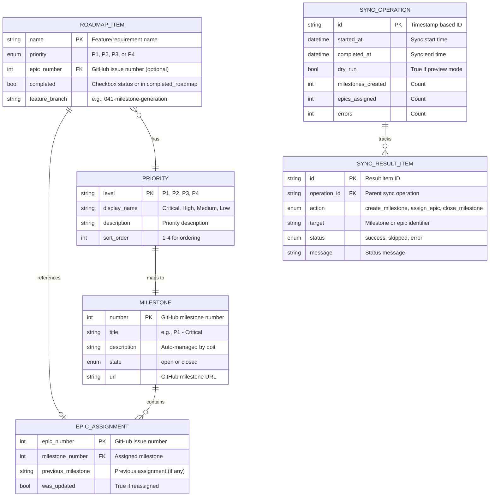
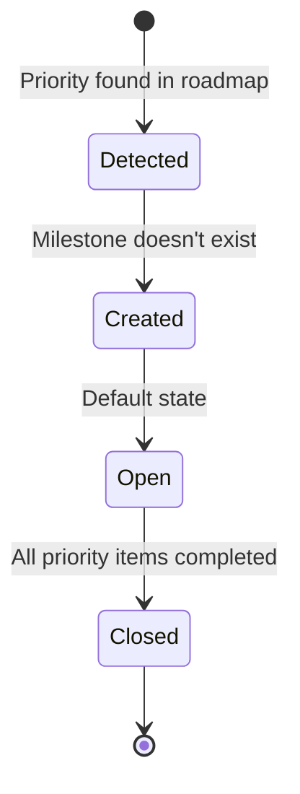
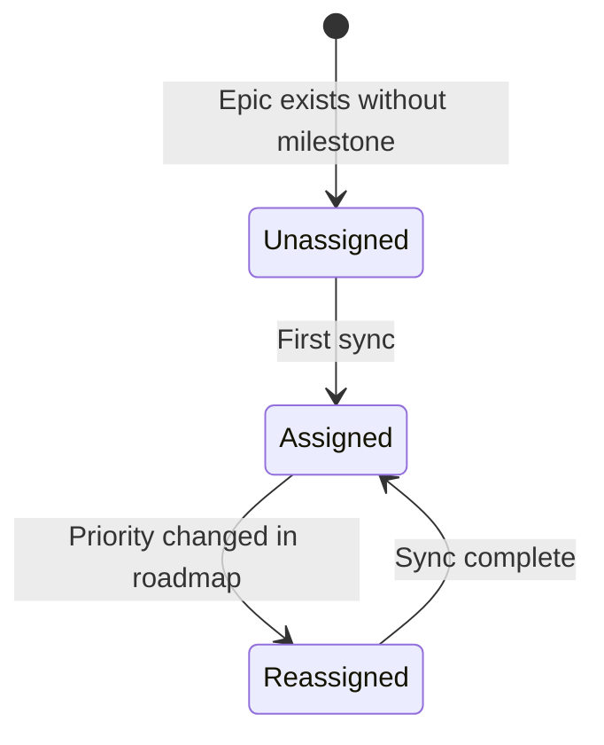
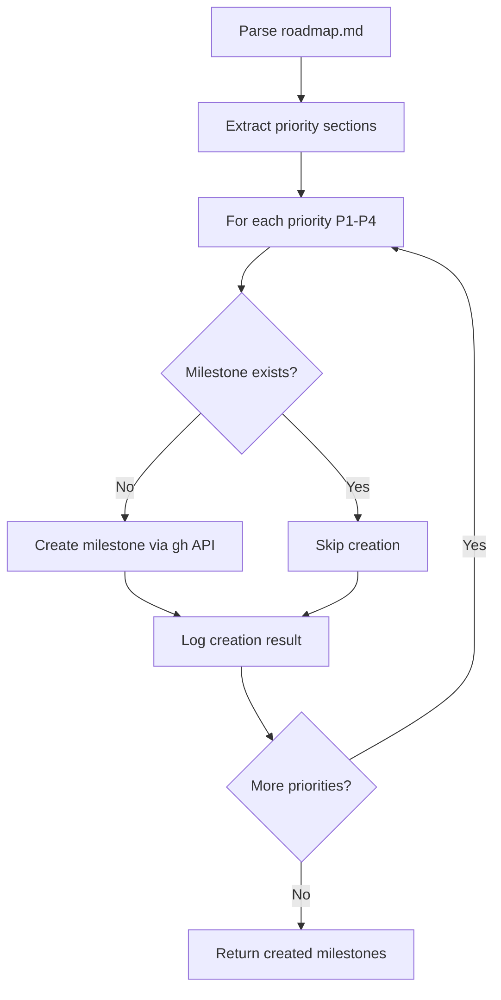
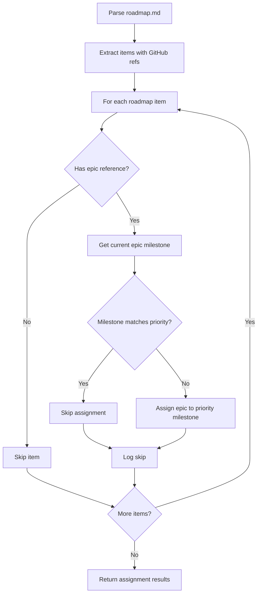
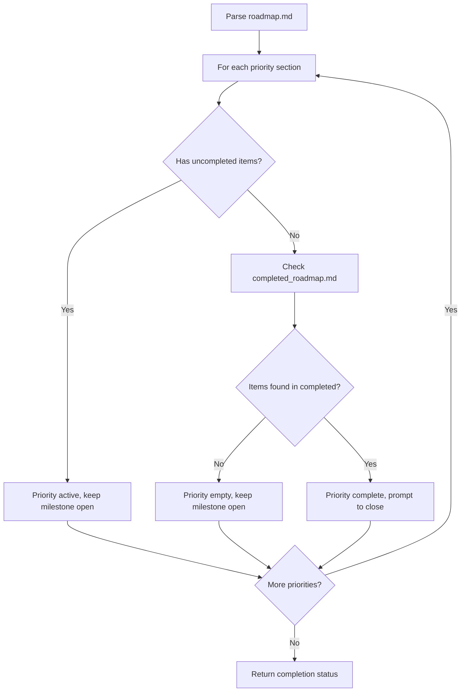

# Data Model: GitHub Milestone Generation from Priorities

**Feature**: 041-milestone-generation
**Date**: 2026-01-22
**Phase**: Phase 1 - Design & Contracts

## Entity Relationship Diagram

<!-- BEGIN:AUTO-GENERATED section="er-diagram" -->

<!-- END:AUTO-GENERATED -->

## Core Entities

### Milestone

Represents a GitHub milestone corresponding to a roadmap priority level.

**Attributes**:
- `number` (int): GitHub-assigned milestone number (primary key)
- `title` (str): Milestone title following format "P1 - Critical"
- `description` (str): Milestone description, includes "Auto-managed by doit"
- `state` (enum): Either "open" or "closed"
- `url` (str): Full GitHub URL to milestone

**Validation Rules**:
- Title MUST match pattern: `^P[1-4] - (Critical|High Priority|Medium Priority|Low Priority)$`
- Description SHOULD include "Auto-managed by doit" marker
- State can only transition from "open" to "closed" (not reversed automatically)

**Source**:
- Created via GitHub API: `gh api repos/{repo}/milestones --method POST`
- Retrieved via GitHub API: `gh api repos/{repo}/milestones`

**Lifecycle**:


---

### Epic Assignment

Represents the association between a GitHub epic (issue) and its assigned milestone.

**Attributes**:
- `epic_number` (int): GitHub issue number (primary key)
- `milestone_number` (int): Milestone number (foreign key to Milestone.number)
- `previous_milestone` (str | None): Title of previous milestone (if reassigned)
- `was_updated` (bool): True if assignment changed during sync

**Validation Rules**:
- Epic MUST exist in GitHub repository
- Milestone MUST exist before assignment
- Epic can only be assigned to one milestone at a time

**Source**:
- Created/Updated via: `gh issue edit {epic_number} --milestone "{title}"`
- Retrieved via: `gh issue view {epic_number} --json milestone`

**Lifecycle**:


---

### Roadmap Item

Represents a parsed entry from roadmap.md with priority and optional GitHub epic reference.

**Attributes**:
- `name` (str): Feature/requirement name (primary key within priority)
- `priority` (enum): One of "P1", "P2", "P3", "P4"
- `epic_number` (int | None): GitHub issue number extracted from "GitHub: #123"
- `completed` (bool): True if checkbox `[x]` or in completed_roadmap.md
- `feature_branch` (str | None): Feature branch reference like "041-milestone-generation"

**Validation Rules**:
- Name MUST be non-empty string
- Priority MUST be one of P1, P2, P3, P4
- Epic number MUST be positive integer if present
- Completed is derived, not directly settable

**Source**:
- Parsed from `.doit/memory/roadmap.md` and `.doit/memory/completed_roadmap.md`
- Not persisted separately (derived on each sync)

**Example**:
```markdown
### P2 - High Priority

- [ ] GitHub Milestone Generation from Priorities
  - **Rationale**: Automatically create GitHub milestones...
  - **GitHub**: #594
  - **Feature**: `[041-milestone-generation]`
```

Parsed as:
```python
RoadmapItem(
    name="GitHub Milestone Generation from Priorities",
    priority="P2",
    epic_number=594,
    completed=False,
    feature_branch="041-milestone-generation"
)
```

---

### Priority

Represents a priority level constant with display formatting.

**Attributes**:
- `level` (str): "P1", "P2", "P3", or "P4" (primary key)
- `display_name` (str): "Critical", "High Priority", "Medium Priority", "Low Priority"
- `description` (str): Long-form description from roadmap header
- `sort_order` (int): 1-4 for priority ordering

**Validation Rules**:
- Level MUST be one of P1, P2, P3, P4
- Display name MUST match milestone title format
- Sort order MUST be 1-4 (unique)

**Source**:
- Hardcoded constants in code
- Matched against roadmap.md section headers

**Mapping**:
```python
PRIORITIES = {
    "P1": Priority(
        level="P1",
        display_name="Critical",
        description="Must Have for MVP",
        sort_order=1
    ),
    "P2": Priority(
        level="P2",
        display_name="High Priority",
        description="Significant Business Value",
        sort_order=2
    ),
    "P3": Priority(
        level="P3",
        display_name="Medium Priority",
        description="Valuable",
        sort_order=3
    ),
    "P4": Priority(
        level="P4",
        display_name="Low Priority",
        description="Nice to Have",
        sort_order=4
    )
}
```

---

### Sync Operation

Represents a single execution of the milestone sync command.

**Attributes**:
- `id` (str): Timestamp-based identifier (e.g., "sync_20260122_143000")
- `started_at` (datetime): When sync began
- `completed_at` (datetime): When sync finished
- `dry_run` (bool): True if run with `--dry-run` flag
- `milestones_created` (int): Count of milestones created
- `epics_assigned` (int): Count of epics assigned/updated
- `errors` (int): Count of errors encountered

**Validation Rules**:
- Completed time MUST be after started time
- Counts MUST be non-negative integers
- Dry run operations have all counts but no side effects

**Source**:
- Created in-memory during sync execution
- Optionally logged to `.doit/logs/milestone-sync.log`

**Purpose**:
- Track sync execution for debugging
- Generate summary report after sync
- Audit history of milestone changes

---

### Sync Result Item

Represents a single action taken or skipped during a sync operation.

**Attributes**:
- `id` (str): Unique result identifier
- `operation_id` (str): Foreign key to parent SyncOperation
- `action` (enum): "create_milestone", "assign_epic", "close_milestone"
- `target` (str): Milestone title or epic number
- `status` (enum): "success", "skipped", "error"
- `message` (str): Human-readable status message

**Validation Rules**:
- Action MUST be one of defined types
- Status MUST be one of defined values
- Message SHOULD be descriptive for errors

**Example**:
```python
SyncResultItem(
    id="result_001",
    operation_id="sync_20260122_143000",
    action="create_milestone",
    target="P3 - Medium Priority",
    status="success",
    message="Created milestone #7"
)
```

**Purpose**:
- Detailed logging of sync actions
- Error tracking and debugging
- Dry-run output generation

---

## Data Flow

### Milestone Creation Flow



### Epic Assignment Flow



### Completion Detection Flow



## Storage Format

All entities are **ephemeral** (not persisted to database). Data is derived from:

1. **roadmap.md**: Source of truth for priorities and epic assignments
2. **GitHub API**: Source of truth for milestone state and epic assignments
3. **completed_roadmap.md**: Historical record of completed items

No additional storage required beyond existing markdown files.

## Validation

### Pre-Sync Validation

Before executing sync, validate:

1. ✅ Git repository is GitHub (not GitLab, Bitbucket)
2. ✅ `gh` CLI is installed and authenticated
3. ✅ roadmap.md exists and is parseable
4. ✅ roadmap.md contains at least one priority section

### Post-Sync Validation

After sync completes, verify:

1. ✅ All created milestones are visible via `gh api`
2. ✅ Epic assignments match roadmap priorities
3. ✅ No errors in sync results (or all errors logged)

## Performance Characteristics

**Parse Time** (roadmap with 100 items):
- Expected: <100ms
- Max acceptable: 500ms

**Sync Time** (4 milestones, 50 epics):
- Expected: 5-10 seconds
- Max acceptable: 30 seconds

**Memory Usage**:
- Expected: <10MB (all entities in-memory)
- Max acceptable: 50MB

## Error Recovery

| Error Type | Entity Affected | Recovery Strategy |
|------------|-----------------|-------------------|
| Milestone create fails | Milestone | Skip epic assignments for that priority, log error |
| Epic assignment fails | EpicAssignment | Log error, continue with next epic |
| Roadmap parse fails | RoadmapItem | Fail fast with clear error message |
| GitHub API rate limit | All | Pause sync, retry after rate limit reset |

## Future Extensions

Potential additions (not in current scope):

- **MilestoneCache**: Cache milestone list for 5 minutes (reduce API calls)
- **SyncHistory**: Persist sync operations to `.doit/logs/` for audit trail
- **ConflictResolution**: Interactive prompts for assignment conflicts
- **BulkOperations**: Batch API calls for improved performance

These extensions require additional design and are deferred to future features.
