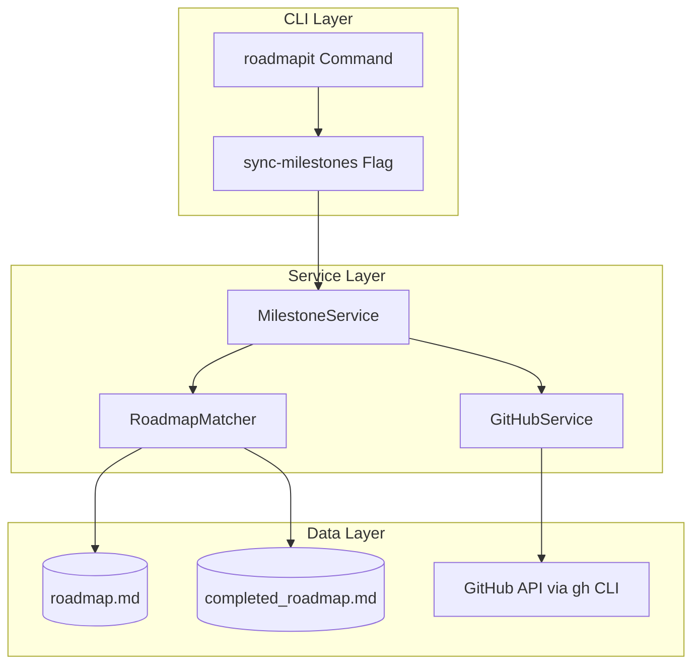

# Implementation Plan: GitHub Milestone Generation from Priorities

**Branch**: `041-milestone-generation` | **Date**: 2026-01-22 | **Spec**: [spec.md](spec.md)
**Input**: Feature specification from `/specs/041-milestone-generation/spec.md`

**Note**: This template is filled in by the `/doit.planit` command. See `.claude/commands/doit.planit.md` for the execution workflow.

## Summary

Automatically create GitHub milestones for each roadmap priority level (P1-P4) and assign epics to appropriate milestones. Extends existing GitHub integration (features 039/040) to provide GitHub-native view of roadmap priorities, enabling team visibility without manual milestone management. Uses `gh` CLI for consistency with existing GitHub services.

## Technical Context

**Language/Version**: Python 3.11+
**Primary Dependencies**: Typer (CLI), Rich (terminal output), httpx (HTTP client), pytest (testing)
**Storage**: File-based markdown in `.doit/memory/roadmap.md` and `.doit/memory/completed_roadmap.md`
**Testing**: pytest with unit and integration tests
**Target Platform**: Cross-platform CLI (Linux, macOS, Windows)
**Project Type**: single (extending existing CLI tool)
**Performance Goals**: Sync operations complete in <30 seconds for roadmaps with 100+ items
**Constraints**: MUST use `gh` CLI for GitHub API operations (consistency with features 039/040), graceful degradation when offline or rate-limited
**Scale/Scope**: Support roadmaps with 100+ items across 4 priority levels, handle multiple epics per priority

## Architecture Overview

<!--
  AUTO-GENERATED: This section is populated by /doit.planit based on Technical Context above.
  Shows the high-level system architecture with component layers.
  Regenerate by running /doit.planit again.
-->

<!-- BEGIN:AUTO-GENERATED section="architecture" -->

<!-- END:AUTO-GENERATED -->

## Constitution Check

*GATE: Must pass before Phase 0 research. Re-check after Phase 1 design.*

| Principle | Status | Notes |
|-----------|--------|-------|
| **I. Specification-First** | ✅ PASS | spec.md created with 3 user stories, 15 FRs, 5 success criteria |
| **II. Persistent Memory** | ✅ PASS | Uses existing roadmap.md and completed_roadmap.md in `.doit/memory/` |
| **III. Auto-Generated Diagrams** | ✅ PASS | Spec contains auto-generated user journey and ER diagrams |
| **IV. Opinionated Workflow** | ✅ PASS | Following planit → taskit → implementit workflow |
| **V. AI-Native Design** | ✅ PASS | Extends `/doit.roadmapit` slash command with `sync-milestones` flag |
| **Tech Stack Alignment** | ✅ PASS | Python 3.11+, Typer, Rich, pytest, httpx - all per constitution |
| **Quality Standards** | ⚠️ PENDING | Tests will be added during implementation (unit + integration) |

**Gate Status**: ✅ **PASSED** - All critical principles satisfied. Quality gates pending implementation.

## Project Structure

### Documentation (this feature)

```text
specs/041-milestone-generation/
├── spec.md              # Feature specification (✅ complete)
├── plan.md              # This file (/doit.planit command output)
├── research.md          # Phase 0 output (/doit.planit command)
├── data-model.md        # Phase 1 output (/doit.planit command)
├── quickstart.md        # Phase 1 output (/doit.planit command)
├── contracts/           # Phase 1 output (/doit.planit command)
│   └── github-api.md    # GitHub API contract
└── tasks.md             # Phase 2 output (/doit.taskit command - NOT created by /doit.planit)
```

### Source Code (repository root)

```text
src/doit_cli/
├── commands/
│   └── roadmapit.py                    # Extend with sync-milestones command
├── services/
│   ├── milestone_service.py            # NEW: Core milestone sync logic
│   ├── github_service.py               # EXTEND: Add milestone operations
│   ├── roadmap_matcher.py              # REUSE: From feature 040
│   └── roadmap_parser.py               # REUSE: From feature 039
└── models/
    └── milestone.py                    # NEW: Milestone data models

tests/
├── unit/
│   ├── test_milestone_service.py       # NEW: Service logic tests
│   ├── test_github_service.py          # EXTEND: Add milestone tests
│   └── test_roadmap_parser.py          # REUSE: Existing tests
└── integration/
    └── test_roadmapit_sync.py          # NEW: End-to-end workflow tests
```

**Structure Decision**: Extending existing single-project CLI structure. New `MilestoneService` handles milestone creation/assignment logic, while existing `GitHubService` is extended with milestone-specific API methods. Reuses existing `RoadmapMatcher` and `RoadmapParser` services from features 039/040 for consistency.

## Complexity Tracking

> **Fill ONLY if Constitution Check has violations that must be justified**

No violations detected. Feature aligns with all constitution principles and tech stack requirements.

## Phase 0: Research & Decisions

See [research.md](research.md) for detailed research findings.

**Key Decisions**:

1. **Milestone naming convention**: Use exact format "P1 - Critical", "P2 - High Priority", "P3 - Medium Priority", "P4 - Low Priority" for consistency
2. **Epic assignment strategy**: Always update milestone assignment to match roadmap priority, even if epic previously assigned elsewhere
3. **Completion detection**: Scan both roadmap.md (empty priority section) and completed_roadmap.md (all items present) to determine if milestone should close
4. **Error handling**: Continue sync for remaining priorities if one fails (collect errors, report at end)
5. **Dry-run implementation**: Use `--dry-run` flag to preview changes without GitHub API calls

## Phase 1: Design & Contracts

See [data-model.md](data-model.md) for entity definitions and [contracts/](contracts/) for API contracts.

**Core Entities**:
- `Milestone`: GitHub milestone (title, description, state, number)
- `RoadmapItem`: Parsed roadmap entry (name, priority, epic reference, status)
- `SyncOperation`: Batch sync result (created/updated/skipped counts)

**API Surface**:
- `roadmapit sync-milestones`: Main command entry point
- `roadmapit sync-milestones --dry-run`: Preview mode
- `MilestoneService.sync_all()`: Core sync orchestration
- `GitHubService.create_milestone()`: GitHub API wrapper
- `GitHubService.assign_epic_to_milestone()`: GitHub API wrapper

## Implementation Phases

### Phase 0: Outline & Research ✅

**Status**: Complete
**Artifacts**: research.md
**Findings**:
- GitHub API supports milestone CRUD via `gh api` commands
- Milestone assignment via `gh issue edit --milestone`
- Priority detection regex: `### P[1-4]` section headers
- Epic extraction regex: `GitHub: #(\d+)` in roadmap items
- Completion detection: Check for items under priority header vs completed_roadmap.md

### Phase 1: Design & Contracts 🔄

**Status**: In Progress
**Artifacts**: data-model.md, contracts/github-api.md, quickstart.md

**Tasks**:
1. ✅ Define Milestone, RoadmapItem, SyncOperation entities
2. ✅ Document GitHub API contract for milestone operations
3. ⏳ Create quickstart guide for `/doit.roadmapit sync-milestones`
4. ⏳ Update agent context with new milestone service

### Phase 2: Task Breakdown ⏸️

**Status**: Not Started
**Artifacts**: tasks.md (generated by `/doit.taskit`)

**Note**: This phase is executed by a separate command. The planit command stops here.

## Next Steps

After completing Phase 1:
1. Run `.doit/scripts/bash/update-agent-context.sh claude` to update AI context
2. Run `/doit.taskit` to generate implementation tasks from this plan
3. Run `/doit.implementit` to execute the tasks

## References

- **Feature 039**: GitHub Roadmap Sync (roadmap parser, GitHub service patterns)
- **Feature 040**: GitHub Issue Auto-linking (roadmap matcher, fuzzy matching)
- **Constitution**: Python 3.11+, Typer, Rich, pytest, file-based storage
- **GitHub CLI Docs**: https://cli.github.com/manual/gh_api (milestone endpoints)
