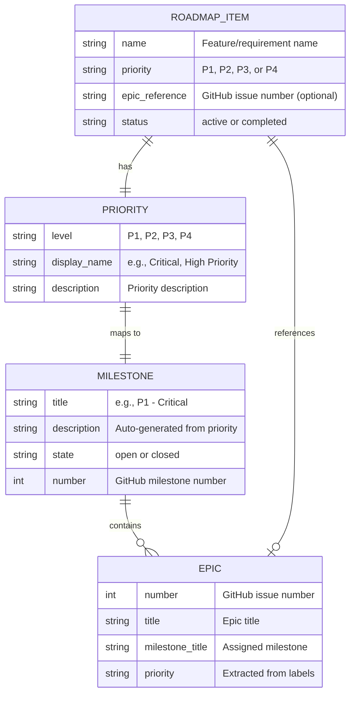

# Feature Specification: GitHub Milestone Generation from Priorities

**Feature Branch**: `[041-milestone-generation]`
**Created**: 2026-01-22
**Status**: Complete
**Input**: User description: "Automatically create GitHub milestones for each roadmap priority level (P1, P2, P3, P4) and assign epics to appropriate milestones. Provides GitHub-native view of roadmap priorities and enables team visibility through GitHub interface. Builds on recent GitHub integration momentum (039, 040)."

## User Scenarios & Testing *(mandatory)*

### User Story 1 - Auto-Create Milestones from Roadmap Priorities (Priority: P1)

When a developer syncs the roadmap to GitHub, the system automatically creates milestones for each priority level (P1, P2, P3, P4) if they don't already exist. This provides a GitHub-native view of roadmap priorities without manual milestone creation.

**Why this priority**: Core functionality that establishes the milestone structure. Without this, the feature cannot function. Delivers immediate value by organizing GitHub issues into priority-based milestones.

**Independent Test**: Can be fully tested by running `/doit.roadmapit sync-milestones` on a repository without existing priority milestones and verifying that 4 milestones (P1, P2, P3, P4) are created with appropriate titles and descriptions.

**Acceptance Scenarios**:

1. **Given** a GitHub repository with no existing priority milestones, **When** `/doit.roadmapit sync-milestones` is executed, **Then** 4 milestones are created: "P1 - Critical", "P2 - High Priority", "P3 - Medium Priority", "P4 - Low Priority"
2. **Given** milestones already exist for some priorities, **When** sync is executed, **Then** only missing milestones are created and existing ones are preserved
3. **Given** milestone creation fails due to GitHub API error, **When** sync is executed, **Then** the error is logged and the process continues for remaining milestones
4. **Given** the repository is not a GitHub repository, **When** sync is attempted, **Then** a clear error message is displayed and sync is skipped gracefully

---

### User Story 2 - Auto-Assign Epics to Priority Milestones (Priority: P2)

When roadmap items with GitHub epics are synced, the system automatically assigns each epic to its corresponding priority milestone. This ensures GitHub issues are organized by priority without manual assignment.

**Why this priority**: Extends P1 functionality by populating milestones with epics. Provides the organizational benefit users expect from milestones. Essential for team visibility.

**Independent Test**: Can be tested by creating a roadmap with mixed priority items (P1, P2, P3), running sync, and verifying that each epic is assigned to the correct milestone in GitHub.

**Acceptance Scenarios**:

1. **Given** roadmap items with GitHub epic references at different priorities, **When** sync is executed, **Then** each epic is assigned to its corresponding priority milestone
2. **Given** an epic is already assigned to a different milestone, **When** sync is executed, **Then** the epic's milestone is updated to match the roadmap priority
3. **Given** an epic doesn't exist in GitHub, **When** sync is executed, **Then** the assignment is skipped with a warning and sync continues
4. **Given** a roadmap item has no GitHub epic reference, **When** sync is executed, **Then** the item is skipped (no milestone assignment needed)

---

### User Story 3 - Close Completed Priority Milestones (Priority: P3)

When all items in a priority section are completed and moved to `completed_roadmap.md`, the system offers to close the corresponding GitHub milestone. This keeps GitHub milestones in sync with roadmap status.

**Why this priority**: Maintains consistency between roadmap and GitHub views. Nice-to-have cleanup feature that doesn't block core functionality.

**Independent Test**: Can be tested by completing all P2 items, moving them to completed_roadmap.md, running sync, and verifying the system prompts to close the "P2 - High Priority" milestone.

**Acceptance Scenarios**:

1. **Given** all items in a priority section are completed, **When** sync is executed, **Then** the system prompts "All P2 items completed. Close milestone 'P2 - High Priority'?"
2. **Given** user confirms closing the milestone, **When** prompt is accepted, **Then** the GitHub milestone is closed and a summary is logged
3. **Given** user declines closing the milestone, **When** prompt is declined, **Then** the milestone remains open and sync continues

---

### Edge Cases

- What happens when a roadmap item is reprioritized (moves from P2 to P1)? System should update epic's milestone assignment accordingly.
- How does system handle milestones with custom names (e.g., "Priority 1" instead of "P1 - Critical")? Should skip auto-management and log warning.
- What happens when GitHub API rate limit is reached during sync? Should cache operations and retry, or fail gracefully with clear error.
- How does system handle epics assigned to multiple priorities? Should use the highest priority assignment and log warning.

## User Journey Visualization

```mermaid
flowchart TB
    subgraph "User Story 1 - Auto-Create Milestones"
        US1_S[Developer runs sync-milestones] --> US1_A[System detects missing priority milestones]
        US1_A --> US1_B[Create P1, P2, P3, P4 milestones via GitHub API]
        US1_B --> US1_E[Milestones available in GitHub UI]
    end

    subgraph "User Story 2 - Auto-Assign Epics"
        US2_S[System reads roadmap priorities] --> US2_A[Find epic references with priority labels]
        US2_A --> US2_B[Assign each epic to matching milestone]
        US2_B --> US2_E[Epics organized by priority in GitHub]
    end

    subgraph "User Story 3 - Close Completed Milestones"
        US3_S[All P2 items moved to completed_roadmap] --> US3_A[Detect empty P2 priority section]
        US3_A --> US3_B{Prompt to close milestone?}
        US3_B -->|Yes| US3_C[Close P2 milestone in GitHub]
        US3_B -->|No| US3_D[Keep milestone open]
        US3_C --> US3_E[Milestone marked complete]
        US3_D --> US3_E
    end
```

<!-- BEGIN:AUTO-GENERATED section="user-journey" -->

<!-- END:AUTO-GENERATED -->

## Entity Relationships *(include if Key Entities defined)*

<!-- BEGIN:AUTO-GENERATED section="entity-relationships" -->

<!-- END:AUTO-GENERATED -->

## Requirements *(mandatory)*

### Functional Requirements

**Priority Detection & Milestone Creation**:

- **FR-001**: System MUST parse `.doit/memory/roadmap.md` to identify priority levels (P1, P2, P3, P4)
- **FR-002**: System MUST create GitHub milestones for each priority level if they don't exist
- **FR-003**: Milestone titles MUST follow format: "P1 - Critical", "P2 - High Priority", "P3 - Medium Priority", "P4 - Low Priority"
- **FR-004**: Milestone descriptions MUST include auto-generated text: "Auto-managed by doit. Contains all [priority] roadmap items."
- **FR-005**: System MUST detect existing milestones by exact title match before creating new ones

**Epic Assignment**:

- **FR-006**: System MUST extract GitHub epic numbers from roadmap items (format: `GitHub: #123`)
- **FR-007**: System MUST assign each epic to the milestone matching its roadmap priority
- **FR-008**: System MUST update epic milestone assignment if priority changes (reprioritization)
- **FR-009**: System MUST skip assignment for roadmap items without GitHub epic references
- **FR-010**: System MUST validate epic exists before attempting milestone assignment

**Sync Operations**:

- **FR-011**: System MUST use `gh` CLI for all GitHub API operations (consistency with feature 039/040)
- **FR-012**: System MUST handle GitHub API errors gracefully (rate limits, network failures)
- **FR-013**: System MUST log all milestone creation and epic assignment operations
- **FR-014**: System MUST support `--dry-run` flag to preview changes without executing them
- **FR-015**: System MUST detect completed priorities (all items in `completed_roadmap.md`) and offer to close milestones

### Key Entities *(include if feature involves data)*

- **Milestone**: GitHub milestone entity representing a priority level (P1-P4). Contains title, description, state (open/closed), and assigned epics.
- **Epic Assignment**: The association between a roadmap item's GitHub epic and its priority milestone. Tracked by milestone number and epic issue number.
- **Sync Operation**: A batch process that creates missing milestones and updates epic assignments. Records created/updated/skipped counts for reporting.

## Success Criteria *(mandatory)*

### Measurable Outcomes

- **SC-001**: Developers can view all P1 epics in GitHub by navigating to the "P1 - Critical" milestone (100% of P1 epics with GitHub issues are visible)
- **SC-002**: Roadmap priority changes reflect in GitHub within 1 minute of running `/doit.roadmapit sync-milestones` (epic reassigned to new milestone)
- **SC-003**: System handles roadmaps with 100+ items across all priorities without timeout (sync completes in <30 seconds)
- **SC-004**: Zero manual milestone management required (developers never need to create/assign milestones manually for doit-managed projects)
- **SC-005**: 100% accuracy between roadmap priorities and GitHub milestone assignments (verified by automated tests comparing roadmap.md and GitHub API state)
